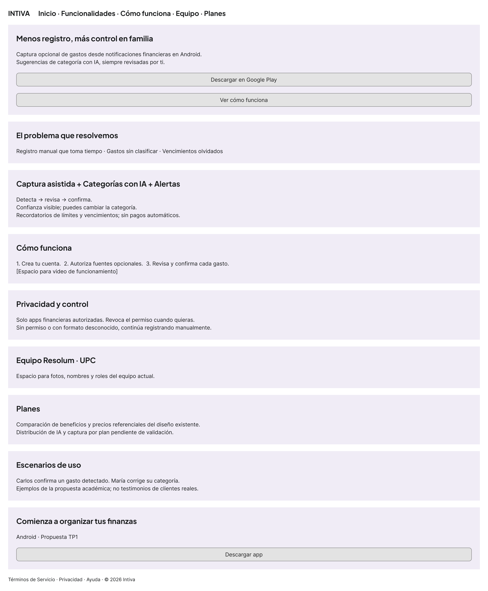
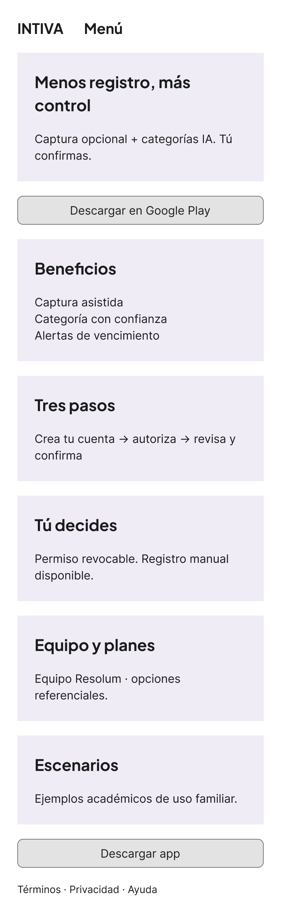
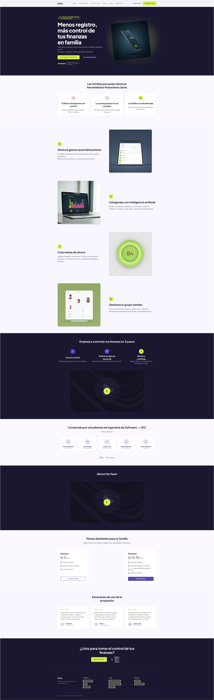
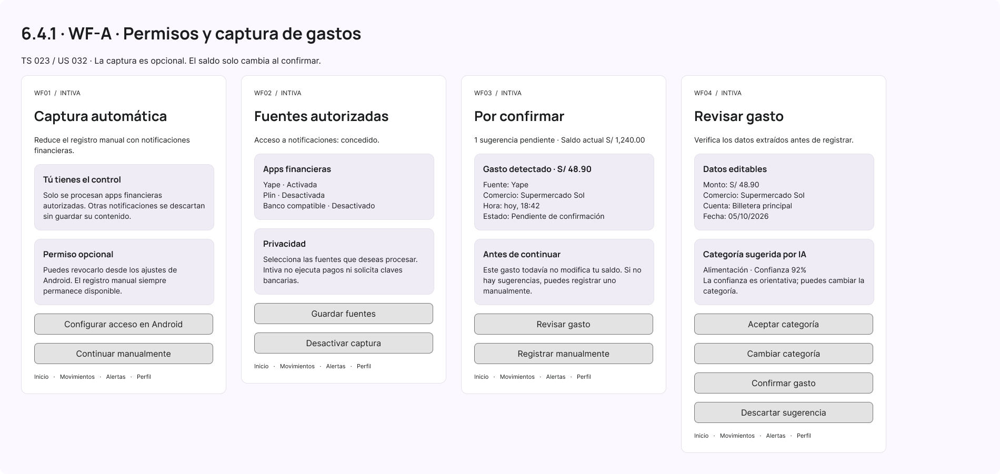
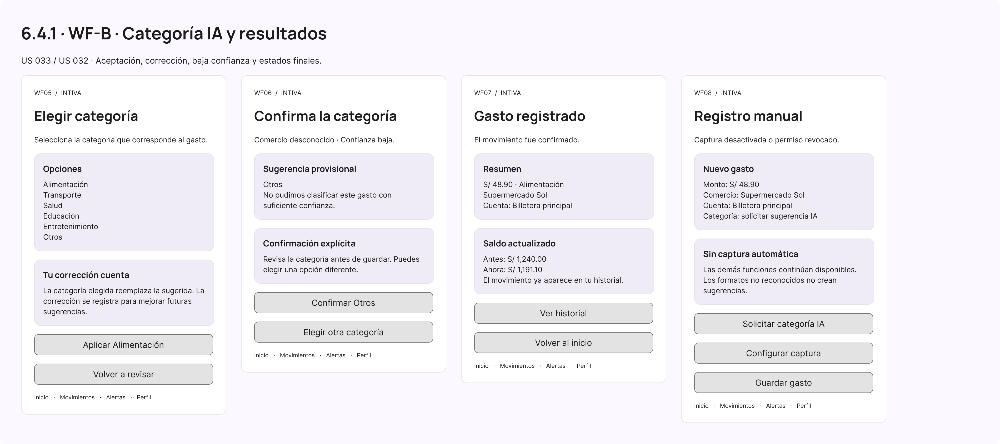
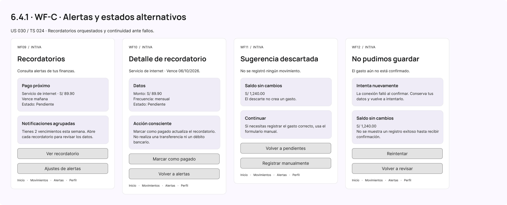

Universidad Peruana de Ciencias Aplicadas

Carrera de Ingeniería de Software

Ciclo 8

**1ASI0728**

**Arquitecturas de Software Emergentes**

Sección

**16363**

**Informe de Trabajo Final**

Docente

**Marino Humberto Jara Palacios**

Startup

**Resolum**

Producto

**Intiva**

**Integrantes**

| Código     | Apellidos y Nombres           |
|------------|--------------------------------|
| u202110385 | Loli Ramirez, Camila Cristina |
| \<código\>   | \<Apellidos y Nombres\>          |
| \<código\>   | \<Apellidos y Nombres\>          |
| \<código\>   | \<Apellidos y Nombres\>          |
| \<código\>   | \<Apellidos y Nombres\>          |

**Setiembre 2026**

## Registro de Versiones del Informe

| Versión | Fecha | Autor | Descripción de modificación |
| ------- | ----- | ----- | ---------------------------- |
| TB1 | 16/09/2026 | Loli Ramirez, Camila Cristina Meza Solórzano,Didier Sebastián Solis Solis, Leonardo José Rivera Ticllacuri, Omar Harold | Revisión de los capítulos I, II, III y finalización del capítulo IV |
| TP1 | 05/10/2026 | Meza Solórzano, Didier Sebastián | Desarrollo de las secciones 6.3, 6.3.1, 6.3.2, 6.4.1 y 6.4.2: actualización de la landing de Intiva para IA y automatización, wireframes para escritorio y móvil, doce wireframes de aplicación y tres wireflows. Incorporación de nueve imágenes de evidencia y enlaces a Figma; revisión de la trazabilidad con las historias de usuario y técnicas; corrección de los enlaces de entrevistas y registro del aporte individual en Student Outcome. |

## Project Report Collaboration Insights

URL del repositorio del Project Report en GitHub: [\<URL del repositorio\>](<URL del repositorio>)

## AV1:

\<Cómo el equipo dividió y coordinó las tareas de esta entrega.\>

## TB1:

\<Cómo el equipo dividió y coordinó las tareas de esta entrega.\>

## AV2:

\<Cómo el equipo dividió y coordinó las tareas de esta entrega.\>

## TB2:

\<Cómo el equipo dividió y coordinó las tareas de esta entrega.\>

## Contenido

- [Capítulo I: Introducción](#capítulo-i-introducción)
  - [1.1. Startup Profile](#11-startup-profile)
    - [1.1.1. Descripción de la Startup](#111-descripción-de-la-startup)
    - [1.1.2. Perfiles de integrantes del equipo](#112-perfiles-de-integrantes-del-equipo)
  - [1.2. Solution Profile](#12-solution-profile)
    - [1.2.1. Antecedentes y problemática](#121-antecedentes-y-problemática)
    - [1.2.2. Lean UX Process](#122-lean-ux-process)
      - [1.2.2.1. Lean UX Problem Statements](#1221-lean-ux-problem-statements)
      - [1.2.2.2. Lean UX Assumptions](#1222-lean-ux-assumptions)
      - [1.2.2.3. Lean UX Hypothesis Statements](#1223-lean-ux-hypothesis-statements)
      - [1.2.2.4. Lean UX Canvas](#1224-lean-ux-canvas)
  - [1.3. Segmentos objetivo](#13-segmentos-objetivo)
- [Capítulo II: Requirements Elicitation \& Analysis](#capítulo-ii-requirements-elicitation--analysis)
  - [2.1. Competidores](#21-competidores)
    - [2.1.1. Análisis competitivo](#211-análisis-competitivo)
    - [2.1.2. Estrategias y tácticas frente a competidores](#212-estrategias-y-tácticas-frente-a-competidores)
  - [2.2. Entrevistas](#22-entrevistas)
    - [2.2.1. Diseño de entrevistas](#221-diseño-de-entrevistas)
    - [2.2.2. Registro de entrevistas](#222-registro-de-entrevistas)
    - [2.2.3. Análisis de entrevistas](#223-análisis-de-entrevistas)
  - [2.3. Needfinding](#23-needfinding)
    - [2.3.1. User Personas](#231-user-personas)
    - [2.3.2. User Task Matrix](#232-user-task-matrix)
    - [2.3.3. Empathy Mapping](#233-empathy-mapping)
    - [2.3.4. As-is Scenario Mapping](#234-as-is-scenario-mapping)
  - [2.4. Ubiquitous Language](#24-ubiquitous-language)
- [Capítulo III: Requirements Specification](#capítulo-iii-requirements-specification)
  - [3.1. To-Be Scenario Mapping](#31-to-be-scenario-mapping)
  - [3.2. User Stories](#32-user-stories)
  - [3.3. Impact Mapping](#33-impact-mapping)
  - [3.4. Product Backlog](#34-product-backlog)
- [Capítulo IV: Strategic-Level Software Design](#capítulo-iv-strategic-level-software-design)
  - [4.1. Strategic-Level Attribute-Driven Design](#41-strategic-level-attribute-driven-design)
    - [4.1.1. Design Purpose](#411-design-purpose)
    - [4.1.2. Attribute-Driven Design Inputs](#412-attribute-driven-design-inputs)
      - [4.1.2.1. Primary Functionality (Primary User Stories)](#4121-primary-functionality-primary-user-stories)
      - [4.1.2.2. Quality Attribute Scenarios](#4122-quality-attribute-scenarios)
      - [4.1.2.3. Constraints](#4123-constraints)
    - [4.1.3. Architectural Drivers Backlog](#413-architectural-drivers-backlog)
    - [4.1.4. Architectural Design Decisions](#414-architectural-design-decisions)
    - [4.1.5. Quality Attribute Scenario Refinements](#415-quality-attribute-scenario-refinements)
  - [4.2. Strategic-Level Domain-Driven Design](#42-strategic-level-domain-driven-design)
    - [4.2.1. EventStorming](#421-eventstorming)
    - [4.2.2. Candidate Context Discovery](#422-candidate-context-discovery)
    - [4.2.3. Domain Message Flows Modeling](#423-domain-message-flows-modeling)
    - [4.2.4. Bounded Context Canvases](#424-bounded-context-canvases)
    - [4.2.5. Context Mapping](#425-context-mapping)
  - [4.3. Software Architecture](#43-software-architecture)
    - [4.3.1. Software Architecture System Landscape Diagram](#431-software-architecture-system-landscape-diagram)
    - [4.3.2. Software Architecture Context Level Diagrams](#432-software-architecture-context-level-diagrams)
    - [4.3.3. Software Architecture Container Level Diagrams](#433-software-architecture-container-level-diagrams)
    - [4.3.4. Software Architecture Deployment Diagrams](#434-software-architecture-deployment-diagrams)
- [Capítulo V: Tactical-Level Software Design](#capítulo-v-tactical-level-software-design)
  - [5.1. Bounded Context: \<Nombre del Bounded Context\>](#51-bounded-context-nombre-del-bounded-context)
    - [5.1.1. Domain Layer](#511-domain-layer)
    - [5.1.2. Interface Layer](#512-interface-layer)
    - [5.1.3. Application Layer](#513-application-layer)
    - [5.1.4. Infrastructure Layer](#514-infrastructure-layer)
    - [5.1.5. Bounded Context Software Architecture Component Level Diagrams](#515-bounded-context-software-architecture-component-level-diagrams)
    - [5.1.6. Bounded Context Software Architecture Code Level Diagrams](#516-bounded-context-software-architecture-code-level-diagrams)
      - [5.1.6.1. Bounded Context Domain Layer Class Diagrams](#5161-bounded-context-domain-layer-class-diagrams)
      - [5.1.6.2. Bounded Context Database Design Diagram](#5162-bounded-context-database-design-diagram)
- [Capítulo VI: Solution UX Design](#capítulo-vi-solution-ux-design)
  - [6.1. Style Guidelines](#61-style-guidelines)
    - [6.1.1. General Style Guidelines](#611-general-style-guidelines)
    - [6.1.2. Web, Mobile \& Devices Style Guidelines](#612-web-mobile--devices-style-guidelines)
  - [6.2. Information Architecture](#62-information-architecture)
    - [6.2.1. Organization Systems](#621-organization-systems)
    - [6.2.2. Labeling Systems](#622-labeling-systems)
    - [6.2.3. Searching Systems](#623-searching-systems)
    - [6.2.4. SEO Tags and Meta Tags](#624-seo-tags-and-meta-tags)
    - [6.2.5. Navigation Systems](#625-navigation-systems)
  - [6.3. Landing Page UI Design](#63-landing-page-ui-design)
    - [6.3.1. Landing Page Wireframe](#631-landing-page-wireframe)
    - [6.3.2. Landing Page Mock-up](#632-landing-page-mock-up)
  - [6.4. Applications UX/UI Design](#64-applications-uxui-design)
    - [6.4.1. Applications Wireframes](#641-applications-wireframes)
    - [6.4.2. Applications Wireflow Diagrams](#642-applications-wireflow-diagrams)
    - [6.4.3. Applications Mock-ups](#643-applications-mock-ups)
    - [6.4.4. Applications User Flow Diagrams](#644-applications-user-flow-diagrams)
  - [6.5. Applications Prototyping](#65-applications-prototyping)
- [Capítulo VII: Product Implementation, Validation \& Deployment](#capítulo-vii-product-implementation-validation--deployment)
  - [7.1. Software Configuration Management](#71-software-configuration-management)
    - [7.1.1. Software Development Environment Configuration](#711-software-development-environment-configuration)
    - [7.1.2. Source Code Management](#712-source-code-management)
    - [7.1.3. Source Code Style Guide \& Conventions](#713-source-code-style-guide--conventions)
    - [7.1.4. Software Deployment Configuration](#714-software-deployment-configuration)
  - [7.2. Solution Implementation](#72-solution-implementation)
    - [7.2.1. Sprint 1](#721-sprint-1)
      - [7.2.1.1. Sprint Planning 1](#7211-sprint-planning-1)
      - [7.2.1.2. Sprint Backlog 1](#7212-sprint-backlog-1)
      - [7.2.1.3. Development Evidence for Sprint Review](#7213-development-evidence-for-sprint-review)
      - [7.2.1.4. Testing Suite Evidence for Sprint Review](#7214-testing-suite-evidence-for-sprint-review)
      - [7.2.1.5. Execution Evidence for Sprint Review](#7215-execution-evidence-for-sprint-review)
      - [7.2.1.6. Services Documentation Evidence for Sprint Review](#7216-services-documentation-evidence-for-sprint-review)
      - [7.2.1.7. Software Deployment Evidence for Sprint Review](#7217-software-deployment-evidence-for-sprint-review)
      - [7.2.1.8. Team Collaboration Insights during Sprint](#7218-team-collaboration-insights-during-sprint)
  - [7.3. Validation Interviews](#73-validation-interviews)
    - [7.3.1. Diseño de Entrevistas](#731-diseño-de-entrevistas)
    - [7.3.2. Registro de Entrevistas](#732-registro-de-entrevistas)
    - [7.3.3. Evaluaciones según heurísticas](#733-evaluaciones-según-heurísticas)
  - [7.4. Video About-the-Product](#74-video-about-the-product)
- [Conclusiones](#conclusiones)
  - [Conclusiones y recomendaciones](#conclusiones-y-recomendaciones)
  - [Video About-the-Team](#video-about-the-team)
- [Bibliografía](#bibliografía)
- [Anexos](#anexos)
  - [Anexo A: Videos de Exposiciones](#anexo-a-videos-de-exposiciones)

## Student Outcome

| Criterio específico | Acciones Realizadas | Conclusiones |
| --- | --- | --- |
| Comunica oralmente sus ideas y/o resultados con objetividad a público de diferentes especialidades y niveles jerárquicos, en el marco del desarrollo de un proyecto en ingeniería. | **AV1: Meza Solórzano, Didier Sebastian:** Participé en la exposición de los hallazgos del análisis competitivo y las entrevistas del Capítulo 2, así como de las decisiones estratégicas de diseño (Attribute-Driven Design) del Capítulo 4, explicando los drivers arquitectónicos y las restricciones técnicas del proyecto a mis compañeros de equipo.  **AV1: Rivera Ticllacuri, Omar Harold:** Expuse el perfil del equipo (Capítulo 1) y el diseño estratégico DDD del Capítulo 4 (EventStorming, Domain Message Flows, Bounded Context Canvases y Context Mapping) a mis compañeros.  **AV1: Loli Ramirez, Camila Cristina:** Expuse al equipo las decisiones arquitectónicas del Capítulo 4 y el porqué de elegir el monolito modular y la caché cache-aside, además de los resultados del EventStorming y del descubrimiento de contextos candidatos en Miro.  **AV1: Solis Solis, Leonardo José:** Participé en la sustentación de los mapas de escenarios (As-Is y To-Be) del Capítulo 3, y en la exposición de los diagramas de arquitectura C4 (Contexto y Contenedores) del Capítulo 4, detallando de forma clara la interacción entre nuestros componentes internos y los servicios externos.   **TP1: Meza Solórzano, Didier Sebastián:** Preparé los wireframes y los tres wireflows de Intiva como apoyo visual para explicar la captura de gastos, la revisión de categorías y los recordatorios. Organicé los recorridos y sus alternativas para mostrar cuándo se actualiza el saldo, qué ocurre si se deniega el permiso y cómo se corrige una categoría sugerida. Estos materiales están disponibles en la [página TP1 de Figma](https://www.figma.com/design/wV6U6QQC4MEYfj8PQArde5/Intiva-Platform-Application-Emergentes?node-id=2005-721) para la sustentación. | **TB1:** La participación en las exposiciones permitió comunicar de manera clara y objetiva los resultados obtenidos, las decisiones de diseño y la arquitectura del proyecto, facilitando que el equipo comprenda los principales aspectos técnicos y estratégicos desarrollados.   **TP1 — aporte de Didier:** Los recorridos visuales permiten explicar las decisiones de interacción con ejemplos concretos y relacionarlas con los requisitos. La exposición oral de TP1 queda pendiente de sustentación. |
| Comunica en forma escrita ideas y/o resultados con objetividad a público de diferentes especialidades y niveles jerárquicos, en el marco del desarrollo de un proyecto en ingeniería. | **AV1: Meza Solórzano, Didier Sebastian:** Redacté el análisis competitivo, el registro y análisis de entrevistas, y el needfinding del Capítulo 2, además del Design Purpose, los Primary User Stories, los Quality Attribute Scenarios, los Constraints y el Architectural Drivers Backlog del Capítulo 4, documentando cada decisión con criterios de aceptación y justificación técnica.  **AV1: Rivera Ticllacuri, Omar Harold:** Redacté mi perfil en el Capítulo 1 y, en el Capítulo 4, toda la sección 4.2 (Domain Message Flows Modeling, Bounded Context Canvases de los 8 contextos y Context Mapping), incluyendo el hallazgo de que Analytics accede directamente a los repositorios de Finances y Savings sin ACL.  **AV1: Loli Ramirez, Camila Cristina:** Redacté las secciones 4.1.4 y 4.1.5 (iteraciones del Quality Attribute Workshop, decisiones AD-01 a AD-19, deudas de diseño y refinamiento de los escenarios de calidad) y las secciones 4.2.1 y 4.2.2 (EventStorming y descubrimiento de los ocho contextos candidatos). También realicé la revisión del Capítulo 1.  **AV1: Solis Solis, Leonardo Jose:** Estructuré y redacté las Historias de Usuario, Historias Técnicas y Spike Stories del Capítulo 3 con sus respectivos criterios de aceptación. Asimismo, documenté la explicación técnica de los diagramas de Landscape, Contexto y Contenedores en el Capítulo 4.   **TP1: Meza Solórzano, Didier Sebastián:** Desarrollé y documenté las secciones 6.3, 6.3.1, 6.3.2, 6.4.1 y 6.4.2 del [Capítulo VI](docs/06-cha06-solution-ux-design.md#63-landing-page-ui-design). Adapté la landing de Intiva, elaboré sus wireframes para escritorio y móvil, doce wireframes de aplicación y tres wireflows. Incorporé nueve imágenes de evidencia y vinculé las pantallas con US 032, US 033, US 030, TS 023 y TS 024. Revisé las descripciones frente a los criterios de aceptación, precisé los datos ilustrativos y corregí la presentación de los enlaces de las seis entrevistas. | **TB1:** La documentación realizada permitió organizar y comunicar de forma clara los requerimientos, hallazgos y decisiones técnicas del proyecto, dejando evidencia del análisis y sustento utilizado para definir la solución arquitectónica.   **TP1 — aporte de Didier:** La documentación permite revisar las pantallas junto con sus requisitos y distinguir las acciones principales, los estados alternativos y los contenidos pendientes de implementación. Las evidencias y los enlaces a Figma facilitan continuar con los mock-ups y el prototipado. |

# Capítulo I: Introducción

## 1.1. Startup Profile

### 1.1.1. Descripción de la Startup

### 1.1.2. Perfiles de integrantes del equipo

## 1.2. Solution Profile

### 1.2.1. Antecedentes y problemática

### 1.2.2. Lean UX Process

#### 1.2.2.1. Lean UX Problem Statements

#### 1.2.2.2. Lean UX Assumptions

#### 1.2.2.3. Lean UX Hypothesis Statements

#### 1.2.2.4. Lean UX Canvas

## 1.3. Segmentos objetivo

# Capítulo II: Requirements Elicitation & Analysis

## 2.1. Competidores

### 2.1.1. Análisis competitivo

### 2.1.2. Estrategias y tácticas frente a competidores

## 2.2. Entrevistas

### 2.2.1. Diseño de entrevistas

### 2.2.2. Registro de entrevistas

### 2.2.3. Análisis de entrevistas

## 2.3. Needfinding

### 2.3.1. User Personas

### 2.3.2. User Task Matrix

### 2.3.3. Empathy Mapping

### 2.3.4. As-is Scenario Mapping

## 2.4. Ubiquitous Language

# Capítulo III: Requirements Specification

## 3.1. To-Be Scenario Mapping

## 3.2. User Stories

## 3.3. Impact Mapping

## 3.4. Product Backlog

# Capítulo IV: Strategic-Level Software Design

## 4.1. Strategic-Level Attribute-Driven Design

### 4.1.1. Design Purpose

### 4.1.2. Attribute-Driven Design Inputs

#### 4.1.2.1. Primary Functionality (Primary User Stories)

#### 4.1.2.2. Quality Attribute Scenarios

#### 4.1.2.3. Constraints

### 4.1.3. Architectural Drivers Backlog

### 4.1.4. Architectural Design Decisions

### 4.1.5. Quality Attribute Scenario Refinements

## 4.2. Strategic-Level Domain-Driven Design

### 4.2.1. EventStorming

### 4.2.2. Candidate Context Discovery

### 4.2.3. Domain Message Flows Modeling

### 4.2.4. Bounded Context Canvases

### 4.2.5. Context Mapping

## 4.3. Software Architecture

### 4.3.1. Software Architecture System Landscape Diagram

### 4.3.2. Software Architecture Context Level Diagrams

### 4.3.3. Software Architecture Container Level Diagrams

### 4.3.4. Software Architecture Deployment Diagrams

# Capítulo V: Tactical-Level Software Design

<!-- Duplicar el bloque 5.X (con su numeración 5.2, 5.3...) por cada Bounded Context identificado en el Capítulo IV -->

## 5.1. Bounded Context: \<Nombre del Bounded Context\>

### 5.1.1. Domain Layer

### 5.1.2. Interface Layer

### 5.1.3. Application Layer

### 5.1.4. Infrastructure Layer

### 5.1.5. Bounded Context Software Architecture Component Level Diagrams

### 5.1.6. Bounded Context Software Architecture Code Level Diagrams

#### 5.1.6.1. Bounded Context Domain Layer Class Diagrams

#### 5.1.6.2. Bounded Context Database Design Diagram

# Capítulo VI: Solution UX Design

## 6.1. Style Guidelines

### 6.1.1. General Style Guidelines

### 6.1.2. Web, Mobile & Devices Style Guidelines

## 6.2. Information Architecture

### 6.2.1. Organization Systems

### 6.2.2. Labeling Systems

### 6.2.3. Searching Systems

### 6.2.4. SEO Tags and Meta Tags

### 6.2.5. Navigation Systems

## 6.3. Landing Page UI Design

Para TP1 actualizamos el diseño de Intiva con tres funciones: captura de gastos desde notificaciones financieras, sugerencia de categorías mediante inteligencia artificial y recordatorios automatizados. Estas funciones se integran al registro de movimientos y al control de las finanzas personales y familiares.

El diseño toma como fuente de requisitos el [capítulo III](docs/03-cha03-requirements-specification.md), especialmente US 001, US 002, US 032, US 033, TS 023 y TS 024. El [reporte del ciclo anterior](https://docs.google.com/document/d/1utbegMuuFidUGZj1odoYluc3qPa8piI2bcIJNg168pM/edit) se utiliza como antecedente, mientras que los nuevos criterios de aceptación se obtienen de la rama `develop` del informe actual.

Los diseños se encuentran en el [archivo Figma de Intiva](https://www.figma.com/design/wV6U6QQC4MEYfj8PQArde5/Intiva-Platform-Application-Emergentes?node-id=2005-721). La página **TP1 · IA y automatización** contiene los wireframes y wireflows nuevos; **Page 1** conserva la base del ciclo anterior y la landing actualizada. Las pantallas muestran el comportamiento previsto para la aplicación en esta etapa de diseño.

### 6.3.1. Landing Page Wireframe

El wireframe organiza la comunicación de valor desde el problema hasta la acción de descargar la aplicación. La propuesta central es **“Menos registro, más control en familia”**: la automatización reduce el esfuerzo de registro y la IA ayuda a clasificar, manteniendo la decisión final en el usuario. La captura mediante notificaciones se presenta como una función opcional de Android, coherente con TS 023.

| Bloque | Contenido y propósito | Trazabilidad |
| --- | --- | --- |
| Navegación | Acceso a inicio, funcionalidades, funcionamiento, equipo y planes. | US 001, US 002 |
| Hero y llamadas a la acción | Propuesta de valor, descarga en Google Play y acceso a la explicación de funcionamiento. | US 001, US 002 |
| Problema | Tiempo dedicado al registro, gastos sin clasificar y vencimientos olvidados. | US 002 |
| Funcionalidades | Captura asistida, categorías con confianza visible y recordatorios. | US 032, US 033, US 030 |
| Cómo funciona | Crear cuenta, autorizar fuentes y revisar/confirmar movimientos; espacio previsto para video explicativo. | US 002, TS 023, US 032 |
| Privacidad y control | Fuentes financieras autorizadas, revocación del permiso y alternativa manual. | TS 023 |
| Equipo y planes | Presentación del equipo actual y comparación de opciones de suscripción. | US 001, US 008 |
| Escenarios y cierre | Ejemplos académicos de uso familiar, segunda llamada a la acción y enlaces legales. | US 001, US 002 |

**Desktop.** La vista de 1440 px ordena las secciones en una lectura vertical, con acciones distinguibles y bloques independientes que facilitan la posterior implementación adaptable.

*Figura 6.3.1-A. Wireframe de la landing para escritorio. [Abrir frame editable](https://www.figma.com/design/wV6U6QQC4MEYfj8PQArde5/Intiva-Platform-Application-Emergentes?node-id=2007-675).*

**Mobile.** La vista de 390 px reorganiza los contenidos en una columna, reduce la navegación a un menú y mantiene visibles las acciones de descarga y la explicación del control sobre la automatización.

*Figura 6.3.1-B. Wireframe de la landing móvil. [Abrir frame editable](https://www.figma.com/design/wV6U6QQC4MEYfj8PQArde5/Intiva-Platform-Application-Emergentes?node-id=2007-725).*

El wireframe reserva espacios para presentar al equipo, explicar el uso de la aplicación mediante un video y comparar los planes. Los casos de uso ilustran situaciones de las finanzas familiares. La asignación de las nuevas funciones a cada plan se definirá con las condiciones de suscripción.

### 6.3.2. Landing Page Mock-up

El mock-up adapta el frame existente **Intiva Landing Page (Desktop)**. Se conserva su composición y lenguaje visual, con fondos claros, acentos violetas, títulos en Plus Jakarta Sans y textos de apoyo en Inter. Las modificaciones actualizan el hero, las funcionalidades, los pasos de uso y los escenarios para explicar la captura de notificaciones y la clasificación asistida.

La comunicación evita presentar la captura como sincronización bancaria directa: una notificación reconocida produce una sugerencia pendiente y el saldo cambia después de la confirmación. La IA propone una categoría que el usuario puede aceptar o corregir; ante baja confianza se solicita confirmación de “Otros”. Las alertas facilitan el seguimiento de vencimientos, sin efectuar pagos por cuenta del usuario.

*Figura 6.3.2-A. Mock-up de la landing adaptado para TP1. [Abrir frame editable](https://www.figma.com/design/wV6U6QQC4MEYfj8PQArde5/Intiva-Platform-Application-Emergentes?node-id=3-2).*

El mock-up conserva las referencias de precios y equipo de la versión anterior. Estos contenidos están pendientes de actualización para su publicación; la adaptación de TP1 se concentra en presentar las nuevas funcionalidades.

## 6.4. Applications UX/UI Design

### 6.4.1. Applications Wireframes

Los doce wireframes complementan las pantallas existentes de registro, movimientos, cuentas, metas, grupo familiar y notificaciones. La ampliación se concentra en los estados nuevos que exige EP 010 y en las alertas automatizadas. La distribución mantiene los encabezados, campos y acciones en el mismo orden para facilitar la revisión de cada movimiento. Se mantiene Manrope para encabezados de la aplicación e Inter para el contenido.

| ID | Pantalla | Decisión o estado representado | Requisito |
| --- | --- | --- | --- |
| WF01 | Captura automática | Explicar permiso opcional; configurar acceso en Android o continuar manualmente. | TS 023 |
| WF02 | Fuentes autorizadas | Seleccionar aplicaciones financieras y desactivar captura. Los nombres mostrados son ejemplos de fuentes por validar. | TS 023 |
| WF03 | Por confirmar | Listar una sugerencia con monto, comercio, fuente y estado pendiente; mantener el saldo actual. | US 032, escenario 1 |
| WF04 | Revisar gasto | Revisar y corregir datos; aceptar/cambiar categoría, confirmar o descartar. | US 032, escenarios 2–3; US 033 |
| WF05 | Elegir categoría | Sustituir la categoría sugerida y registrar la corrección para futuras sugerencias. | US 033, escenario 3 |
| WF06 | Confirma la categoría | Comercio desconocido o baja confianza: proponer Otros y pedir confirmación explícita. | US 033, escenario 4 |
| WF07 | Gasto registrado | Comunicar registro definitivo y saldo actualizado. | US 032, escenario 2 |
| WF08 | Registro manual | Continuar cuando se deniega/revoca el permiso o no se reconoce el formato; solicitar sugerencia de IA desde el registro manual. | TS 023; US 032, escenario 4; US 033 |
| WF09 | Recordatorios | Consultar avisos y acceder a su detalle; representar agrupación de alertas. | US 030, TS 024 |
| WF10 | Detalle de recordatorio | Revisar monto, vencimiento y estado; distinguir marcar como pagado de ejecutar un pago. | US 030 |
| WF11 | Sugerencia descartada | Confirmar que el descarte no registra movimiento ni modifica saldo. | US 032, escenario 3 |
| WF12 | No pudimos guardar | Mantener datos y ofrecer reintento/retorno sin mostrar un éxito no confirmado. | Estado adicional de recuperación |

**Permisos y captura.** La primera composición cubre el consentimiento, la selección de fuentes, la bandeja de pendientes y la revisión de un gasto detectado.

*Figura 6.4.1-A. WF01–WF04. [Abrir composición editable](https://www.figma.com/design/wV6U6QQC4MEYfj8PQArde5/Intiva-Platform-Application-Emergentes?node-id=2006-594).*

**IA y resultados.** La segunda composición incluye corrección, baja confianza, registro definitivo y continuidad mediante registro manual. El valor de confianza del 92% es un dato de ejemplo para el diseño. El umbral de baja confianza y la forma de obtener ese valor deberán definirse y comprobarse durante la implementación del clasificador.

*Figura 6.4.1-B. WF05–WF08. [Abrir composición editable](https://www.figma.com/design/wV6U6QQC4MEYfj8PQArde5/Intiva-Platform-Application-Emergentes?node-id=2006-704).*

**Alertas y alternativas.** La tercera composición representa los recordatorios, su detalle, el descarte y la recuperación ante un fallo al guardar.

*Figura 6.4.1-C. WF09–WF12. [Abrir composición editable](https://www.figma.com/design/wV6U6QQC4MEYfj8PQArde5/Intiva-Platform-Application-Emergentes?node-id=2006-806).*

Los montos, comercios, fuentes y fechas son datos de demostración. En el ejemplo de confirmación, S/ 1,240.00 − S/ 48.90 = S/ 1,191.10. El mismo saldo inicial permanece en los ejemplos de descarte y error. Los wireframes definen la estructura de los formularios y sus acciones principales. Las validaciones de campos, el teclado y los estados de carga se detallarán en el diseño y prototipado de la aplicación.

### 6.4.2. Applications Wireflow Diagrams

Los wireflows relacionan representaciones de pantallas con acciones y resultados. Las flechas indican la secuencia principal y las notas de cada composición especifican las ramas alternativas. Cada recorrido permite identificar la pantalla de origen, la acción del usuario y el estado resultante.

**F01. Activación y confirmación RPA.** El usuario configura el acceso, selecciona fuentes, abre la bandeja y revisa el gasto. Confirmar registra el movimiento y actualiza el saldo. Si deniega o revoca el permiso, utiliza WF08; las notificaciones ajenas a fuentes autorizadas se descartan sin guardar contenido y los formatos no reconocidos no crean sugerencias.

*Figura 6.4.2-A. F01. [Abrir wireflow editable](https://www.figma.com/design/wV6U6QQC4MEYfj8PQArde5/Intiva-Platform-Application-Emergentes?node-id=2007-758).*

**F02. Aceptación y corrección de categoría IA.** La sugerencia se solicita desde el registro manual o acompaña al gasto detectado. El usuario acepta la categoría o abre WF05 para reemplazarla. Ante baja confianza, WF06 solicita confirmar Otros o elegir otra categoría. Tras aplicar la elección se regresa a revisión y se confirma el gasto.

*Figura 6.4.2-B. F02. [Abrir wireflow editable](https://www.figma.com/design/wV6U6QQC4MEYfj8PQArde5/Intiva-Platform-Application-Emergentes?node-id=2007-847).*

**F03. Recordatorios y continuidad de alertas.** El usuario abre un recordatorio, consulta su detalle y vuelve a las alertas. La nota técnica relaciona esta experiencia con TS 024: Communications invoca n8n para formato, agrupación y canal; si el webhook falla, envía el aviso de respaldo directamente por Firebase Cloud Messaging, sin el formateo ni la agrupación del flujo. La decisión de respaldo ocurre internamente y no agrega una tarea de configuración al usuario.

*Figura 6.4.2-C. F03. [Abrir wireflow editable](https://www.figma.com/design/wV6U6QQC4MEYfj8PQArde5/Intiva-Platform-Application-Emergentes?node-id=2007-920).*

| Condición | Transición | Resultado esperado |
| --- | --- | --- |
| Permiso concedido | WF01 → ajustes Android → WF02 → WF03 | Captura habilitada para fuentes autorizadas. |
| Permiso denegado o revocado | WF01/WF02 → WF08 | Registro manual disponible. |
| Confirmación de gasto | WF03 → WF04 → WF07 | Registro definitivo y saldo actualizado. |
| Descarte | WF04 → WF11 → WF03 | Sin movimiento ni cambio de saldo. |
| Categoría aceptada | WF04 → confirmar → WF07 | Se guarda la categoría sugerida. |
| Categoría corregida | WF04 → WF05 → WF04 → WF07 | Se guarda la elección y se registra la corrección. |
| Baja confianza | WF08/WF04 → WF06 → WF04 → WF07 | Otros requiere aceptación explícita; se permite reemplazarlo vía WF05. |
| Error al guardar | WF04 → WF12 → reintentar o WF04 | Sin éxito anticipado; datos disponibles para recuperación. |
| Recordatorio | Notificación → WF09 → WF10 → WF09 | Detalle accesible tanto con envío normal como con respaldo. |

Los recorridos y sus estados sirven de base para desarrollar los mock-ups de aplicación de la sección 6.4.3 y el prototipo de la sección 6.5.

### 6.4.3. Applications Mock-ups

### 6.4.4. Applications User Flow Diagrams

## 6.5. Applications Prototyping

# Capítulo VII: Product Implementation, Validation & Deployment

## 7.1. Software Configuration Management

### 7.1.1. Software Development Environment Configuration

### 7.1.2. Source Code Management

### 7.1.3. Source Code Style Guide & Conventions

### 7.1.4. Software Deployment Configuration

## 7.2. Solution Implementation

<!-- Duplicar el bloque 7.2.X (con su numeración 7.2.2, 7.2.3...) por cada Sprint -->

### 7.2.1. Sprint 1

#### 7.2.1.1. Sprint Planning 1

#### 7.2.1.2. Sprint Backlog 1

#### 7.2.1.3. Development Evidence for Sprint Review

#### 7.2.1.4. Testing Suite Evidence for Sprint Review

#### 7.2.1.5. Execution Evidence for Sprint Review

#### 7.2.1.6. Services Documentation Evidence for Sprint Review

#### 7.2.1.7. Software Deployment Evidence for Sprint Review

#### 7.2.1.8. Team Collaboration Insights during Sprint

## 7.3. Validation Interviews

### 7.3.1. Diseño de Entrevistas

### 7.3.2. Registro de Entrevistas

### 7.3.3. Evaluaciones según heurísticas

## 7.4. Video About-the-Product

# Conclusiones

## Conclusiones y recomendaciones

## Video About-the-Team

# Bibliografía

# Anexos

## Anexo A: Videos de Exposiciones
