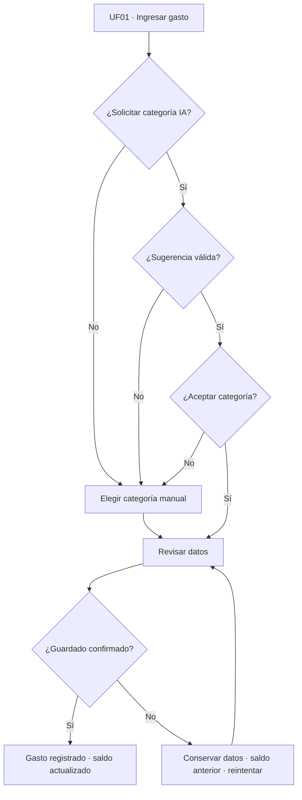
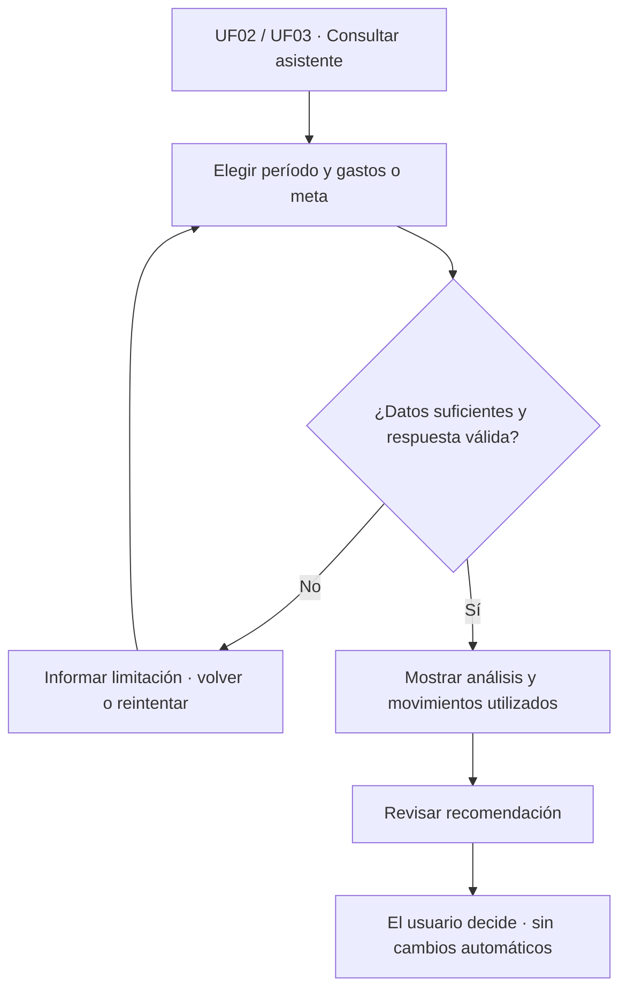
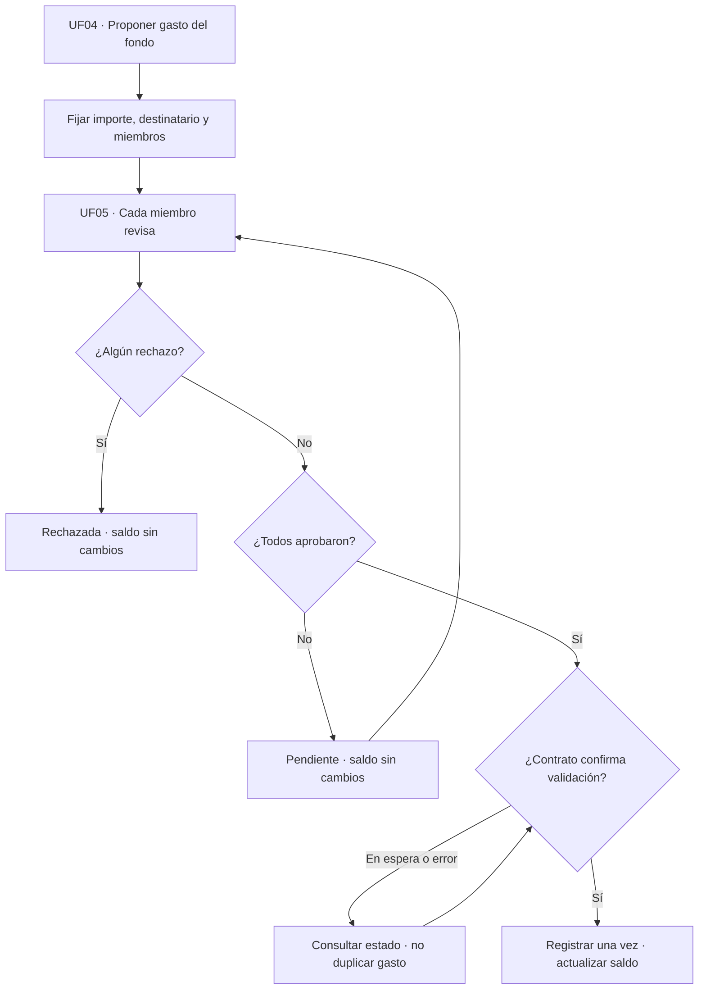

<div align="center">


Universidad Peruana de Ciencias Aplicadas

Carrera de Ingeniería de Software

Ciclo 8

**1ASI0728**

**Arquitecturas de Software Emergentes**

Sección

**16363**

**Informe de Trabajo Final**

Docente

**Marino Humberto Jara Palacios**

Startup

**Balanza**

Producto

**Intiva**

**Integrantes**

| Código     | Apellidos y Nombres           |
|------------|--------------------------------|
| u202110385   | Loli Ramirez, Camila Cristina |
| u202319950   | Meza Solórzano,Didier Sebastián          |
| u20211g163   | Solis Solis, Leonardo José          |
| u202214214   | Rivera Ticllacuri, Omar Harold          |

**Setiembre 2026**

</div>

<div style="page-break-after: always;"></div>

## Registro de Versiones del Informe

| Versión | Fecha | Autor | Descripción de modificación |
| ------- | ----- | ----- | ---------------------------- |
| TB1 | 16/09/2026 | Loli Ramirez, Camila Cristina<br>Meza Solórzano,Didier Sebastián<br>Solis Solis, Leonardo José<br>Rivera Ticllacuri, Omar Harold | Revisión de los capítulos I, II, III y finalización del capítulo IV |
| TP1 | 05/10/2026 | Meza Solórzano, Didier Sebastián | Desarrollo de las secciones 6.3, 6.3.1, 6.3.2, 6.4.1 y 6.4.2: actualización de la landing de Intiva para IA y smart contracts, wireframes para escritorio y móvil, doce wireframes de aplicación y tres wireflows. Incorporación de nueve imágenes de evidencia y enlaces a Figma; revisión de la trazabilidad con las historias de usuario y técnicas; corrección de los enlaces de entrevistas y registro del aporte individual en Student Outcome. |
| TP1 — revisión | 05/10/2026 | Meza Solórzano, Didier Sebastián | Revisión transversal de los capítulos disponibles: corrección de fuentes y cifras, alcance de las entrevistas, coherencia de requisitos, redacción del diseño UX, actualización de conclusiones y bibliografía, y unificación de los enlaces de entrevistas en anexos. Se distinguen las propuestas de diseño de el diseño propuesto y de la validación pendiente. |
| TP1 — corrección | 05/10/2026 | Meza Solórzano, Didier Sebastián | Corrección del nombre de la startup a Balanza, restauración del capítulo IV a su versión previa a la revisión transversal y retiro de enlaces y conclusiones asociados al backend y al informe usados como ejemplos de otro proyecto. |
| TP1 — 6.4.3 y 6.4.4 | 06/10/2026 | Rivera Ticllacuri, Omar Harold | Desarrollo de las secciones 6.4.3 y 6.4.4: mock-ups de la aplicación Android y del sitio web, y User Flows UF01 a UF06 de la página Mockup - User flow - Prototyping de Figma, con su trazabilidad a los wireflows F01 a F03 y su vinculación con la sección TP1. |
| TP1 — alcance tecnológico | 06/10/2026 | Meza Solórzano, Didier Sebastián | Alineación transversal a IA y smart contracts: revisión de US 032, incorporación de US 034 y EP 011, corrección de TS 023 y TS 024, decisiones estratégicas, landing, wireframes, wireflows y mock-ups afectados; actualización de evidencias, conclusiones, bibliografía y Student Outcome. |

<div style="page-break-after: always;"></div>

## Project Report Collaboration Insights

URL del repositorio del Project Report en GitHub: [TF_1ASI0728_202620_TF — develop](https://github.com/G3-Arquitectura-de-Software-Emergentes/TF_1ASI0728_202620_TF/tree/develop)

## TB1:

El equipo realizó la redacción y revisión de los capítulos I, II, III y finalizó el capítulo IV. La coordinación de esta entrega se realizó distribuyendo las actividades de análisis, redacción, diseño y revisión entre los integrantes, consolidando los avances para la entrega del TB1.

## TP1

<div style="page-break-after: always;"></div>

## Contenido

- [Capítulo I: Introducción](#capítulo-i-introducción)
  - [1.1. Startup Profile](#11-startup-profile)
    - [1.1.1. Descripción de la Startup](#111-descripción-de-la-startup)
    - [1.1.2. Perfiles de integrantes del equipo](#112-perfiles-de-integrantes-del-equipo)
  - [1.2. Solution Profile](#12-solution-profile)
    - [1.2.1. Antecedentes y problemática](#121-antecedentes-y-problemática)
    - [1.2.2. Lean UX Process](#122-lean-ux-process)
      - [1.2.2.1. Lean UX Problem Statements](#1221-lean-ux-problem-statements)
      - [1.2.2.2. Lean UX Assumptions](#1222-lean-ux-assumptions)
      - [1.2.2.3. Lean UX Hypothesis Statements](#1223-lean-ux-hypothesis-statements)
      - [1.2.2.4. Lean UX Canvas](#1224-lean-ux-canvas)
  - [1.3. Segmentos objetivo](#13-segmentos-objetivo)
- [Capítulo II: Requirements Elicitation \& Analysis](#capítulo-ii-requirements-elicitation--analysis)
  - [2.1. Competidores](#21-competidores)
    - [2.1.1. Análisis competitivo](#211-análisis-competitivo)
    - [2.1.2. Estrategias y tácticas frente a competidores](#212-estrategias-y-tácticas-frente-a-competidores)
  - [2.2. Entrevistas](#22-entrevistas)
    - [2.2.1. Diseño de entrevistas](#221-diseño-de-entrevistas)
    - [2.2.2. Registro de entrevistas](#222-registro-de-entrevistas)
    - [2.2.3. Análisis de entrevistas](#223-análisis-de-entrevistas)
  - [2.3. Needfinding](#23-needfinding)
    - [2.3.1. User Personas](#231-user-personas)
    - [2.3.2. User Task Matrix](#232-user-task-matrix)
    - [2.3.3. Empathy Mapping](#233-empathy-mapping)
    - [2.3.4. As-is Scenario Mapping](#234-as-is-scenario-mapping)
  - [2.4. Ubiquitous Language](#24-ubiquitous-language)
- [Capítulo III: Requirements Specification](#capítulo-iii-requirements-specification)
  - [3.1. To-Be Scenario Mapping](#31-to-be-scenario-mapping)
  - [3.2. User Stories](#32-user-stories)
  - [3.3. Impact Mapping](#33-impact-mapping)
  - [3.4. Product Backlog](#34-product-backlog)
- [Capítulo IV: Strategic-Level Software Design](#capítulo-iv-strategic-level-software-design)
  - [4.1. Strategic-Level Attribute-Driven Design](#41-strategic-level-attribute-driven-design)
    - [4.1.1. Design Purpose](#411-design-purpose)
    - [4.1.2. Attribute-Driven Design Inputs](#412-attribute-driven-design-inputs)
      - [4.1.2.1. Primary Functionality (Primary User Stories)](#4121-primary-functionality-primary-user-stories)
      - [4.1.2.2. Quality Attribute Scenarios](#4122-quality-attribute-scenarios)
      - [4.1.2.3. Constraints](#4123-constraints)
    - [4.1.3. Architectural Drivers Backlog](#413-architectural-drivers-backlog)
    - [4.1.4. Architectural Design Decisions](#414-architectural-design-decisions)
    - [4.1.5. Quality Attribute Scenario Refinements](#415-quality-attribute-scenario-refinements)
  - [4.2. Strategic-Level Domain-Driven Design](#42-strategic-level-domain-driven-design)
    - [4.2.1. EventStorming](#421-eventstorming)
    - [4.2.2. Candidate Context Discovery](#422-candidate-context-discovery)
    - [4.2.3. Domain Message Flows Modeling](#423-domain-message-flows-modeling)
    - [4.2.4. Bounded Context Canvases](#424-bounded-context-canvases)
    - [4.2.5. Context Mapping](#425-context-mapping)
  - [4.3. Software Architecture](#43-software-architecture)
    - [4.3.1. Software Architecture System Landscape Diagram](#431-software-architecture-system-landscape-diagram)
    - [4.3.2. Software Architecture Context Level Diagrams](#432-software-architecture-context-level-diagrams)
    - [4.3.3. Software Architecture Container Level Diagrams](#433-software-architecture-container-level-diagrams)
    - [4.3.4. Software Architecture Deployment Diagrams](#434-software-architecture-deployment-diagrams)
- [Capítulo V: Tactical-Level Software Design](#capítulo-v-tactical-level-software-design)
  - [5.1. Bounded Context: por desarrollar](#51-bounded-context-por-desarrollar)
    - [5.1.1. Domain Layer](#511-domain-layer)
    - [5.1.2. Interface Layer](#512-interface-layer)
    - [5.1.3. Application Layer](#513-application-layer)
    - [5.1.4. Infrastructure Layer](#514-infrastructure-layer)
    - [5.1.5. Bounded Context Software Architecture Component Level Diagrams](#515-bounded-context-software-architecture-component-level-diagrams)
    - [5.1.6. Bounded Context Software Architecture Code Level Diagrams](#516-bounded-context-software-architecture-code-level-diagrams)
      - [5.1.6.1. Bounded Context Domain Layer Class Diagrams](#5161-bounded-context-domain-layer-class-diagrams)
      - [5.1.6.2. Bounded Context Database Design Diagram](#5162-bounded-context-database-design-diagram)
- [Capítulo VI: Solution UX Design](#capítulo-vi-solution-ux-design)
  - [6.1. Style Guidelines](#61-style-guidelines)
    - [6.1.1. General Style Guidelines](#611-general-style-guidelines)
    - [6.1.2. Web, Mobile \& Devices Style Guidelines](#612-web-mobile--devices-style-guidelines)
  - [6.2. Information Architecture](#62-information-architecture)
    - [6.2.1. Organization Systems](#621-organization-systems)
    - [6.2.2. Labeling Systems](#622-labeling-systems)
    - [6.2.3. Searching Systems](#623-searching-systems)
    - [6.2.4. SEO Tags and Meta Tags](#624-seo-tags-and-meta-tags)
    - [6.2.5. Navigation Systems](#625-navigation-systems)
  - [6.3. Landing Page UI Design](#63-landing-page-ui-design)
    - [6.3.1. Landing Page Wireframe](#631-landing-page-wireframe)
    - [6.3.2. Landing Page Mock-up](#632-landing-page-mock-up)
  - [6.4. Applications UX/UI Design](#64-applications-uxui-design)
    - [6.4.1. Applications Wireframes](#641-applications-wireframes)
    - [6.4.2. Applications Wireflow Diagrams](#642-applications-wireflow-diagrams)
    - [6.4.3. Applications Mock-ups](#643-applications-mock-ups)
    - [6.4.4. Applications User Flow Diagrams](#644-applications-user-flow-diagrams)
  - [6.5. Applications Prototyping](#65-applications-prototyping)
- [Capítulo VII: Product Implementation, Validation \& Deployment](#capítulo-vii-product-implementation-validation--deployment)
  - [7.1. Software Configuration Management](#71-software-configuration-management)
    - [7.1.1. Software Development Environment Configuration](#711-software-development-environment-configuration)
    - [7.1.2. Source Code Management](#712-source-code-management)
    - [7.1.3. Source Code Style Guide \& Conventions](#713-source-code-style-guide--conventions)
    - [7.1.4. Software Deployment Configuration](#714-software-deployment-configuration)
  - [7.2. Solution Implementation](#72-solution-implementation)
    - [7.2.1. Sprint 1](#721-sprint-1)
      - [7.2.1.1. Sprint Planning 1](#7211-sprint-planning-1)
      - [7.2.1.2. Sprint Backlog 1](#7212-sprint-backlog-1)
      - [7.2.1.3. Development Evidence for Sprint Review](#7213-development-evidence-for-sprint-review)
      - [7.2.1.4. Testing Suite Evidence for Sprint Review](#7214-testing-suite-evidence-for-sprint-review)
      - [7.2.1.5. Execution Evidence for Sprint Review](#7215-execution-evidence-for-sprint-review)
      - [7.2.1.6. Services Documentation Evidence for Sprint Review](#7216-services-documentation-evidence-for-sprint-review)
      - [7.2.1.7. Software Deployment Evidence for Sprint Review](#7217-software-deployment-evidence-for-sprint-review)
      - [7.2.1.8. Team Collaboration Insights during Sprint](#7218-team-collaboration-insights-during-sprint)
  - [7.3. Validation Interviews](#73-validation-interviews)
    - [7.3.1. Diseño de Entrevistas](#731-diseño-de-entrevistas)
    - [7.3.2. Registro de Entrevistas](#732-registro-de-entrevistas)
    - [7.3.3. Evaluaciones según heurísticas](#733-evaluaciones-según-heurísticas)
  - [7.4. Video About-the-Product](#74-video-about-the-product)
- [Conclusiones](#conclusiones)
  - [Conclusiones y recomendaciones](#conclusiones-y-recomendaciones)
  - [Video About-the-Team](#video-about-the-team)
- [Bibliografía](#bibliografía)
- [Anexos](#anexos)
  - [Anexo A: Videos de Exposiciones](#anexo-a-videos-de-exposiciones)

<div style="page-break-after: always;"></div>

## Student Outcome

| Criterio específico | Acciones Realizadas | Conclusiones |
| --- | --- | --- |
| Comunica oralmente sus ideas y/o resultados con objetividad a público de diferentes especialidades y niveles jerárquicos, en el marco del desarrollo de un proyecto en ingeniería. | **AV1: Meza Solórzano, Didier Sebastian:** Participé en la exposición de los hallazgos del análisis competitivo y las entrevistas del Capítulo 2, así como de las decisiones estratégicas de diseño (Attribute-Driven Design) del Capítulo 4, explicando los drivers arquitectónicos y las restricciones técnicas del proyecto a mis compañeros de equipo.<br><br>**AV1: Rivera Ticllacuri, Omar Harold:** Expuse el perfil del equipo (Capítulo 1) y el diseño estratégico DDD del Capítulo 4 (EventStorming, Domain Message Flows, Bounded Context Canvases y Context Mapping) a mis compañeros.<br><br>**AV1: Loli Ramirez, Camila Cristina:** Expuse al equipo las decisiones arquitectónicas del Capítulo 4 y el porqué de elegir el monolito modular y la caché cache-aside, además de los resultados del EventStorming y del descubrimiento de contextos candidatos en Miro.<br><br>**AV1: Solis Solis, Leonardo José:** Participé en la sustentación de los mapas de escenarios (As-Is y To-Be) del Capítulo 3, y en la exposición de los diagramas de arquitectura C4 (Contexto y Contenedores) del Capítulo 4, detallando de forma clara la interacción entre nuestros componentes internos y los servicios externos. <br><br>**TP1: Meza Solórzano, Didier Sebastián:** Preparé los wireframes y los tres wireflows de Intiva como apoyo visual para explicar la revisión de categorías, la asistencia IA y la aprobación del fondo familiar. Organicé los recorridos y sus alternativas para mostrar cuándo se actualiza el saldo, qué ocurre si falta una aprobación y cómo se corrige una categoría sugerida. Estos materiales están disponibles en la [página TP1 de Figma](https://www.figma.com/design/wV6U6QQC4MEYfj8PQArde5/Intiva-Platform-Application-Emergentes?node-id=2045-2348) para la sustentación.<br><br>**TB1: Loli Ramirez, Camila Cristina:** Expuse al equipo la guía de estilo de Intiva (paleta de colores, tipografías y lineamientos para la landing page, la aplicación móvil y la aplicación web) y la arquitectura de información de la sección 6.2, explicando por qué escogimos cada color y fuente según lo que vimos en las entrevistas y cómo se organizan la navegación y las etiquetas de la aprobación de gastos del fondo familiar y de las categorías sugeridas con IA. | **TB1:** La participación en las exposiciones permitió comunicar de manera clara y objetiva los resultados obtenidos, las decisiones de diseño y la arquitectura del proyecto, facilitando que el equipo comprenda los principales aspectos técnicos y estratégicos desarrollados. <br><br>|
| Comunica en forma escrita ideas y/o resultados con objetividad a público de diferentes especialidades y niveles jerárquicos, en el marco del desarrollo de un proyecto en ingeniería. | **AV1: Meza Solórzano, Didier Sebastian:** Redacté el análisis competitivo, el registro y análisis de entrevistas, y el needfinding del Capítulo 2, además del Design Purpose, los Primary User Stories, los Quality Attribute Scenarios, los Constraints y el Architectural Drivers Backlog del Capítulo 4, documentando cada decisión con criterios de aceptación y justificación técnica.<br><br>**AV1: Rivera Ticllacuri, Omar Harold:** Redacté mi perfil en el Capítulo 1 y, en el Capítulo 4, toda la sección 4.2 (Domain Message Flows Modeling, Bounded Context Canvases de los 8 contextos y Context Mapping), incluyendo el hallazgo de que Analytics accede directamente a los repositorios de Finances y Savings sin ACL.<br><br>**AV1: Loli Ramirez, Camila Cristina:** Redacté las secciones 4.1.4 y 4.1.5 (iteraciones del Quality Attribute Workshop, decisiones AD-01 a AD-19, deudas de diseño y refinamiento de los escenarios de calidad) y las secciones 4.2.1 y 4.2.2 (EventStorming y descubrimiento de los ocho contextos candidatos). También realicé la revisión del Capítulo 1.<br><br>**AV1: Solis Solis, Leonardo Jose:** Estructuré y redacté las Historias de Usuario, Historias Técnicas y Spike Stories del Capítulo 3 con sus respectivos criterios de aceptación. Asimismo, documenté la explicación técnica de los diagramas de Landscape, Contexto y Contenedores en el Capítulo 4. <br><br>**TP1: Meza Solórzano, Didier Sebastián:** Desarrollé y documenté las secciones 6.3, 6.3.1, 6.3.2, 6.4.1 y 6.4.2 del [Capítulo VI](docs/06-cha06-solution-ux-design.md#63-landing-page-ui-design). Adapté la landing de Intiva, elaboré sus wireframes para escritorio y móvil, doce wireframes de aplicación y tres wireflows. Incorporé las imágenes de evidencia y actualicé doce composiciones para IA y smart contracts y vinculé las pantallas con US 032, US 033, US 034, TS 023 y TS 024. Revisé las descripciones frente a los criterios de aceptación, precisé los datos ilustrativos y corregí la presentación de los enlaces de las seis entrevistas.<br><br>**TB1: Loli Ramirez, Camila Cristina:** Redacté las secciones 6.1 y 6.2 del Capítulo 6. En Style Guidelines documenté el branding de Intiva (descripción de la marca, nombre y logo), la tipografía (Manrope, Plus Jakarta Sans, Inter y Space Grotesk), la paleta de colores construida con Material Design 3, el espaciado, las formas y el tono de comunicación, además de los lineamientos para la landing page, la aplicación Android y la aplicación web. En Information Architecture redacté los sistemas de organización, etiquetado, búsqueda y navegación, los meta tags para SEO de la landing page y de la aplicación web, y el App Store Optimization de la aplicación móvil, incluyendo la asistencia y categorización con IA (EP 010) y la aprobación del fondo familiar (EP 011). | **TB1:** La documentación realizada permitió organizar y comunicar de forma clara los requerimientos, hallazgos y decisiones técnicas del proyecto, dejando evidencia del análisis y sustento utilizado para definir la solución arquitectónica. <br><br>|

<div style="page-break-after: always;"></div>

# Capítulo I: Introducción

[Consultar el contenido del documento](docs/01-cha01-introduction.md).

## 1.1. Startup Profile

### 1.1.1. Descripción de la Startup

### 1.1.2. Perfiles de integrantes del equipo

## 1.2. Solution Profile

### 1.2.1. Antecedentes y problemática

### 1.2.2. Lean UX Process

#### 1.2.2.1. Lean UX Problem Statements

#### 1.2.2.2. Lean UX Assumptions

#### 1.2.2.3. Lean UX Hypothesis Statements

#### 1.2.2.4. Lean UX Canvas

## 1.3. Segmentos objetivo

<div style="page-break-after: always;"></div>

# Capítulo II: Requirements Elicitation & Analysis

[Consultar el contenido del documento](docs/02-cha02-requirements-elicitation-and-analysis.md).

## 2.1. Competidores

### 2.1.1. Análisis competitivo

### 2.1.2. Estrategias y tácticas frente a competidores

## 2.2. Entrevistas

### 2.2.1. Diseño de entrevistas

### 2.2.2. Registro de entrevistas

### 2.2.3. Análisis de entrevistas

## 2.3. Needfinding

### 2.3.1. User Personas

### 2.3.2. User Task Matrix

### 2.3.3. Empathy Mapping

### 2.3.4. As-is Scenario Mapping

## 2.4. Ubiquitous Language

<div style="page-break-after: always;"></div>

# Capítulo III: Requirements Specification

[Consultar el contenido del documento](docs/03-cha03-requirements-specification.md).

## 3.1. To-Be Scenario Mapping

## 3.2. User Stories

## 3.3. Impact Mapping

## 3.4. Product Backlog

<div style="page-break-after: always;"></div>

# Capítulo IV: Strategic-Level Software Design

[Consultar el contenido del documento](docs/04-cha04-strategic-level-software-design.md).

## 4.1. Strategic-Level Attribute-Driven Design

### 4.1.1. Design Purpose

### 4.1.2. Attribute-Driven Design Inputs

#### 4.1.2.1. Primary Functionality (Primary User Stories)

#### 4.1.2.2. Quality Attribute Scenarios

#### 4.1.2.3. Constraints

### 4.1.3. Architectural Drivers Backlog

### 4.1.4. Architectural Design Decisions

### 4.1.5. Quality Attribute Scenario Refinements

## 4.2. Strategic-Level Domain-Driven Design

### 4.2.1. EventStorming

### 4.2.2. Candidate Context Discovery

### 4.2.3. Domain Message Flows Modeling

### 4.2.4. Bounded Context Canvases

### 4.2.5. Context Mapping

## 4.3. Software Architecture

### 4.3.1. Software Architecture System Landscape Diagram

### 4.3.2. Software Architecture Context Level Diagrams

### 4.3.3. Software Architecture Container Level Diagrams

### 4.3.4. Software Architecture Deployment Diagrams

<div style="page-break-after: always;"></div>

# Capítulo V: Tactical-Level Software Design

El contenido de diseño táctico está pendiente de incorporación por su responsable de TP1.

<!-- Duplicar el bloque 5.X (con su numeración 5.2, 5.3...) por cada Bounded Context identificado en el Capítulo IV -->

## 5.1. Bounded Context: por desarrollar

### 5.1.1. Domain Layer

### 5.1.2. Interface Layer

### 5.1.3. Application Layer

### 5.1.4. Infrastructure Layer

### 5.1.5. Bounded Context Software Architecture Component Level Diagrams

### 5.1.6. Bounded Context Software Architecture Code Level Diagrams

#### 5.1.6.1. Bounded Context Domain Layer Class Diagrams

#### 5.1.6.2. Bounded Context Database Design Diagram

<div style="page-break-after: always;"></div>

# Capítulo VI: Solution UX Design

[Consultar el contenido del documento](docs/06-cha06-solution-ux-design.md).

## 6.1. Style Guidelines

En esta sección se explican las guías de estilo para la landing page, la aplicación móvil y la aplicación web. Con ellas buscamos que los tres productos se vean coherentes entre sí y que los usuarios reconozcan el estilo de Intiva.

### 6.1.1. General Style Guidelines

**Branding**

*Brand Overview*

Intiva es una plataforma digital que ayudará a las personas y a las familias a registrar sus ingresos y gastos, controlar su presupuesto mediante límites de gasto y planificar metas de ahorro de forma individual o compartida. Nace de una problemática identificada en las entrevistas: la mayoría de usuarios lleva sus finanzas en hojas de Excel, notas del celular o revisando manualmente sus billeteras digitales (Yape, Plin, apps bancarias), lo que vuelve el registro tedioso y deja la información fragmentada entre los integrantes del hogar. Intiva busca centralizar esa información, presentarla de forma visual y acompañar al usuario con alertas y recordatorios para que tome mejores decisiones financieras. Para reducir el registro manual, la aplicación podrá detectar gastos a partir de las notificaciones de las apps financieras y sugerir su categoría con inteligencia artificial, pero siempre será el usuario quien revise y confirme cada movimiento. Su eslogan, "Controla tus finanzas, transforma tu vida", resume esa promesa, y en la landing page se comunica con el mensaje "Menos registro, más control en familia".

*Brand Name*

El nombre "Intiva" se relaciona con la idea de manejar las finanzas de forma intuitiva, ya que buscamos que ahorrar y organizar las finanzas sea algo sencillo e intuitivo para cualquier persona, sin necesidad de conocimientos financieros previos. Por eso, el nombre representa una herramienta cercana que ayuda a controlar los gastos y alcanzar metas de ahorro. Además, es un nombre corto, moderno y fácil de recordar y de pronunciar tanto en español como en inglés, lo que permitirá usarlo sin cambios en las dos versiones de idioma de la landing page y como nombre de la aplicación en Google Play.

*Logo*

A continuación, se muestra el logo diseñado para Intiva:


*Logo de Intiva. Fuente: elaboración propia.*

El logo de Intiva está compuesto por un isotipo y un logotipo. El isotipo es un rombo blanco de esquinas redondeadas que contiene un cuadrado índigo con un rayo, símbolo que representa la energía y la rapidez con la que la aplicación permitirá tomar el control del dinero: el registro y la consulta del presupuesto son tareas principales del producto. El tiempo de ejecución se evaluará mediante las pruebas de usabilidad definidas en QAS-01. El logotipo "Intiva" se escribe en una tipografía sans-serif de trazo grueso, que transmite solidez y confianza. Se presenta sobre el color índigo principal de la marca y se acompaña del eslogan. En espacios reducidos, como el favicon, la barra de navegación de la landing page o la barra lateral de la aplicación web, se usará una versión simplificada: un cuadrado índigo con la inicial de la marca.

**Typography**

Para la tipografía escogimos fuentes de Google Fonts, cada una para un tipo de texto distinto. Así es más fácil distinguir qué es más importante en cada pantalla.

Para los títulos y encabezados de la aplicación móvil y de la aplicación web usaremos Manrope (Headline). Es una fuente moderna y algo compacta, por lo que los títulos se ven bien sin ocupar mucho espacio en pantallas pequeñas.

En la landing page, los títulos usarán Plus Jakarta Sans. Tiene trazos más gruesos en sus pesos altos, por lo que funciona bien en titulares grandes, que son lo primero que ve un visitante.

Para los textos de cuerpo, descripciones, formularios y botones usaremos Inter (Body) en los tres productos. Esta fuente fue creada para pantallas y se lee bien incluso en tamaños pequeños, lo que ayuda en las listas de movimientos y en los mensajes de alerta.

Para las etiquetas y los montos de dinero usaremos Space Grotesk (Label). Escogimos una fuente aparte para los números porque los montos son el dato más importante en una aplicación de finanzas y queremos que el usuario los encuentre rápido.

| Estilo | Fuente | Uso | Tamaño (web / app) | Peso |
| --- | --- | --- | --- | --- |
| Display | Plus Jakarta Sans (landing) / Manrope (app y web) | Titular principal de la landing y saldo total | 64 px / 32 sp | ExtraBold / Bold |
| Headline | Plus Jakarta Sans (landing) / Manrope (app y web) | Títulos de sección y de pantalla | 36 a 48 px / 24 sp | Bold |
| Title | Manrope | Títulos de tarjetas y subsecciones | 20 a 24 px / 18 sp | Bold |
| Body | Inter | Textos descriptivos y contenido de formularios | 16 a 18 px / 16 sp | Regular |
| Body small | Inter | Textos secundarios, fechas y ayudas | 14 px / 12 a 13 sp | Regular |
| Button | Inter | Botones y llamadas a la acción | 16 px / 14 sp | SemiBold |
| Label | Space Grotesk | Etiquetas, chips y navegación | 12 a 14 px / 10 a 12 sp | Medium |
| Amount | Space Grotesk | Montos de dinero | 16 a 28 px / 16 a 28 sp | Medium / Bold |

**Colors**

Para escoger los colores pensamos en cómo queremos que se sientan los usuarios, ya que en las entrevistas muchos dijeron que manejar su dinero les genera estrés. Armamos la paleta con el sistema de color de Material Design 3, a partir de cuatro colores base.

El color primario es un índigo (`#534AB7`). Transmite confianza y seriedad, algo necesario en una aplicación que maneja el dinero de las familias, pero se ve más moderno y cercano que el azul que suelen usar los bancos. Lo usaremos en los botones principales, en la opción activa de la navegación y en la tarjeta de saldo.

El color secundario es un verde lima (`#CDEB45`), que se asocia con energía y crecimiento. Como contrasta mucho con el índigo, llama la atención, así que lo usaremos en las llamadas a la acción, en los botones de registro y en el progreso de las metas de ahorro. Sus tonos más oscuros (como `#556500`) servirán para mostrar los ingresos.

El color terciario es un tono cobrizo (`#8A4900`). Lo usaremos como acento en acciones de edición y en algunas categorías, para diferenciar elementos sin quitarle protagonismo a los colores principales.

El color neutro es un gris con un ligero tono violeta (`#78767E`). Con su escala de tonos lo usaremos en fondos, bordes y textos secundarios, y combina bien con el índigo.

Además, usaremos un rojo (`#BA1A1A`) para los gastos, los límites superados y la acción de eliminar. Cada color tiene una escala de tonos, de oscuro a claro, que nos permite crear fondos suaves, estados de botones y un modo oscuro. El contraste debe comprobarse para cada combinación de texto, fondo y estado; la existencia de una escala de tonos no garantiza por sí sola su legibilidad.

A continuación se presenta la guía de estilo de Intiva, que reúne la paleta de colores, las tipografías y algunos componentes base (botones, buscador, barras de progreso, barra de navegación y botones de íconos):


*Guía de estilo de Intiva: paleta de colores, tipografías y componentes base. Fuente: elaboración propia en Figma.*

También usaremos colores para indicar el estado de las finanzas, de modo que el usuario lo entienda sin leer el detalle: verde cuando un límite de gasto va bien, ámbar cuando está cerca de alcanzarse y rojo cuando se supera. Los gastos detectados automáticamente que todavía no se confirman se mostrarán en tonos neutros, para diferenciarlos de los movimientos ya registrados. Para no depender solo del color, cada estado irá acompañado de un texto, y los montos se mostrarán con signo ("+" para ingresos y "−" para gastos).

**Spacing**

El espaciado se basará en múltiplos de 4 y 8 para que la información se vea ordenada. Los valores cambian según el producto:

Para Landing Page y aplicación web:
- Button padding:
    - Vertical: 16px
    - Horizontal: 32px
- Input fields:
    - Altura: 48px
    - Espacio entre campos: 16px
- Ancho máximo del contenido: 1280px
- Margen lateral: 24px (móvil) a 32px (escritorio)
- Margin entre secciones de la landing: 96px (móvil) a 128px (escritorio)
- Espacio entre título y subtítulo de sección: 24px
- Espacio entre tarjetas del panel web: 24px

Para Android:
- Button padding:
    - Vertical: 12dp
    - Horizontal: 16dp
- Botón principal de pantalla completa: 56dp de altura
- Input fields:
    - Altura: 56dp
    - Espacio entre campos: 16dp
- Margin lateral de pantalla: 20dp
- Margin entre secciones:
    - Principales: 24dp
    - Internas: 16dp
- Spacing entre textos:
    - Título y subtítulo: 4dp
    - Párrafos: 12dp
- Área táctil mínima: 48dp

**Shapes**

Usaremos esquinas redondeadas para que la interfaz se vea amigable: 8 para inputs y botones pequeños, 12 para tarjetas y chips, 16 para tarjetas destacadas y paneles inferiores, y forma de píldora o círculo para botones de la landing page, avatares, filtros y el botón flotante.

**Tone of voice**

Usaremos un tono cercano y sencillo. En las entrevistas vimos que los términos financieros técnicos confunden a los usuarios, por lo que evitaremos la jerga y trataremos al usuario de "tú" (por ejemplo, "Aquí está el resumen de tus finanzas hoy"). Cuando el usuario logre algo, se lo haremos saber ("¡Cumpliste tu meta de ahorro!"), y las alertas solo informarán lo que pasó, sin regañar ("Has superado tu presupuesto en Entretenimiento"), junto con una opción para resolverlo. Al hablar de la aprobación del fondo y de la IA seremos claros sobre lo que hacen y lo que no: por ejemplo, "Este gasto todavía no modifica tu saldo" o "La categoría es una sugerencia; puedes cambiarla". Queremos que el usuario sienta que Intiva lo ayuda con sus gastos, que no lo juzga y que él mantiene el control de su información.

### 6.1.2. Web, Mobile & Devices Style Guidelines

Intiva contempla una landing informativa, una aplicación móvil Android para el registro diario y una aplicación web para consultar gráficos y reportes. Las entrevistas mencionan el uso de celulares y computadoras. La elección de Android también responde a TS 007 y al acceso a notificaciones requerido por TS 023; no se fundamenta en porcentajes de dispositivos cuya base de cálculo aún no está documentada.

**Landing Page**

- Diseño responsive con enfoque *mobile first*, para permitir el acceso desde el celular, por ejemplo al compartir el enlace por WhatsApp.
- Puntos de quiebre: móvil (< 768 px), tablet (768 a 1023 px) y escritorio (≥ 1024 px). En móvil, el contenido pasará a una sola columna y el menú superior se convertirá en un menú hamburguesa.
- Usará fondos claros con acentos índigo, y el botón principal será de color Secondary (lima) para que destaque; el botón secundario será transparente con borde.
- Estará disponible en español e inglés, con un selector de idioma en la barra de navegación.
- Todos los elementos interactivos tendrán un contorno visible al recibir foco con el teclado, y las imágenes tendrán texto alternativo.

**Aplicación móvil (Android)**

- Seguirá los lineamientos de Material Design 3, para que la aplicación se sienta natural para los usuarios de Android, utilizando sus componentes: barra superior, barra de navegación inferior, botón flotante, chips, paneles inferiores (*bottom sheets*) y diálogos.
- Las dimensiones se definirán en `dp` y los textos en `sp`, para respetar el tamaño de letra configurado por el usuario en su teléfono.
- Se diseñará sobre un ancho de referencia de 360 a 390 dp, como referencia de diseño adaptable; la distribución se verificará en distintos tamaños de pantalla.
- Los botones de acción principal ocuparán todo el ancho de la pantalla y estarán en la parte inferior, para alcanzarlos fácilmente con el pulgar.
- Para registrar montos se usará un teclado numérico propio con dígitos grandes, evitando abrir el teclado del sistema.
- El permiso para leer notificaciones se pedirá con una pantalla propia que explique para qué sirve, antes de llevar al usuario a los ajustes de Android, y siempre habrá una opción para continuar con el registro manual.
- Se usarán los íconos de Material Symbols, con un ícono propio por cada categoría de gasto (por ejemplo, un carrito para supermercado o cubiertos para alimentación).

**Aplicación web**

- Estará pensada para laptops y computadoras de escritorio, con una barra lateral fija de navegación y un área de contenido organizada en tarjetas y gráficos.
- En pantallas menores a 768 px, la barra lateral se reemplazará por una barra de navegación inferior con íconos.
- Usará las mismas fuentes y colores de la aplicación móvil, para que el usuario reconozca la información al pasar de un dispositivo a otro. Los gráficos usarán el índigo y el lima como colores principales de sus series.
- Contará con modo claro y modo oscuro, y permitirá cambiar el idioma entre español e inglés.
- Se usarán los íconos de PrimeIcons, que acompañan a la librería de componentes PrimeVue.

## 6.2. Information Architecture

En esta parte del informe se presenta la arquitectura de información planeada para los productos de Intiva (landing page, aplicación móvil y aplicación web): la organización de la información, las etiquetas, el sistema de búsqueda, los meta tags y la forma de navegación. Con esto buscamos que la interfaz sea fácil de entender para nuestros segmentos objetivo.

### 6.2.1. Organization Systems

**Organización visual (jerárquica)**

Se utilizará una jerarquía visual para que el usuario siga el contenido en orden de importancia. Para ello, se usarán distintos tamaños y pesos de texto, de modo que los títulos y los montos sean lo primero que se lea, y las descripciones y fechas queden en un segundo plano. Por ejemplo, en la pantalla de inicio de la aplicación móvil se mostrará primero el saldo total, luego el estado del presupuesto y, finalmente, los movimientos recientes. En el panel de la aplicación web, los indicadores principales (balance total, ingresos, gastos y ahorro del mes) aparecerán arriba y los gráficos de detalle debajo. En la landing page, la propuesta de valor y el botón de descarga aparecerán antes que cualquier otra información.

**Organización secuencial**

Se aplicará en los procesos que tienen pasos definidos, para que el usuario sepa en todo momento en qué paso se encuentra:

- Registro e inicio: presentación de la aplicación (onboarding) → registro o inicio de sesión → configuración inicial.
- Registro manual de un movimiento: tipo (gasto o ingreso) → monto → categoría → cuenta → fecha → guardar. Este proceso se diseñará para completarse en cinco pasos o menos, tal como se definió en el escenario de usabilidad del Capítulo IV.
- Categorización IA: ingresar gasto → pedir sugerencia → aceptar o corregir → revisar y guardar.
- Fondo familiar: proponer gasto → revisar aprobadores → aprobar o rechazar → consultar el resultado confirmado.
- Creación de una meta de ahorro: nombre → monto objetivo → fecha límite → individual o familiar → confirmar.
- Recuperación de contraseña: ingresar correo → verificar código → nueva contraseña.
- Generación de un reporte en la aplicación web: tipo de reporte → período → integrantes incluidos → descargar.

En la landing page, las secciones también seguirán un orden pensado para convencer al visitante: propuesta de valor → problema que resolvemos → funcionalidades → cómo funciona → privacidad y control → equipo → planes → escenarios de uso → llamada a la acción final.

**Esquemas de categorización**

- Por tópico: las funcionalidades de la aplicación móvil se agruparán según el tema que atienden: Transacciones, Asistente IA, Fondo familiar, Control de presupuesto (límites de gasto), Metas de ahorro, Grupo familiar, Notificaciones y Perfil. La aplicación web se dividirá en Panel y Reportes. Los movimientos también se categorizarán por tópico (Alimentación, Transporte, Vivienda, Salud, Educación, Entretenimiento, Otros para gastos; Salario, Freelance, Negocio, Inversión, Otros para ingresos).
- Cronológico: el historial de movimientos, las notificaciones y los aportes a metas se mostrarán del más reciente al más antiguo, agrupados por día ("Hoy", "Ayer"). Los recordatorios de pago se ordenarán por la fecha de vencimiento más próxima.
- Por audiencia: se diferenciará la información según el tipo de usuario. El responsable de la economía familiar (administrador del grupo) podrá invitar integrantes, asignar roles y crear metas o límites familiares, mientras que un integrante solo verá y registrará movimientos del grupo. Además, la aplicación web estará orientada sobre todo al responsable de la economía familiar, que es quien revisa los reportes del hogar.
- Por estado: los gastos detectados automáticamente se mantendrán separados en una lista de pendientes ("Por confirmar") hasta que el usuario los revise, y no se mezclarán con el historial de movimientos ya registrados.
- Alfabético: se usará en listas de selección largas, como la lista de categorías (después de las más usadas) y la lista de integrantes del grupo familiar.

### 6.2.2. Labeling Systems

Para el sistema de etiquetas se usarán palabras cortas, en español y sin tecnicismos financieros, acompañadas de íconos que faciliten entender cada función a simple vista. Para la aplicación móvil se usarán los íconos de Material Symbols (https://fonts.google.com/icons), que siguen la guía de estilo de Android, y para la aplicación web, los de PrimeIcons.

En la landing page se usarán las siguientes etiquetas:
* "Inicio"
* "Funcionalidades"
* "Cómo funciona"
* "Equipo"
* "Planes"
* "Descargar en Google Play"
* "Ver cómo funciona"
* "Descargar app"
* "Términos de Servicio", "Privacidad" y "Ayuda" (pie de página)

En la aplicación móvil, la navegación principal tendrá las siguientes etiquetas:
* "Inicio"
* "Transacciones"
* "Metas"
* "Familia"
* "Perfil"

Asimismo, se usarán etiquetas de acción como:
* "Gasto" / "Ingreso"
* "Guardar"
* "Cancelar"
* "Aportar"
* "Invitar miembro"
* "Aplicar filtros"
* "Ajustar límite"
* "Cerrar sesión"

Para la aprobación del fondo familiar y la categorización con IA se usarán etiquetas que dejen claro que el usuario decide:
* "Fondo familiar"
* "Proponer gasto" / "Ver propuestas"
* "Pendiente de aprobación"
* "Revisar gasto"
* "Guardar gasto" (personal) / "Aprobar y firmar" / "Rechazar propuesta" (fondo)
* "Aceptar categoría" / "Cambiar categoría"
* "Continuar manualmente"

En la aplicación web se usarán las etiquetas "Panel", "Reportes", "Descargar reporte", "Notificaciones" y "Cerrar sesión".

Por último, se usarán etiquetas de estado para que el usuario identifique rápidamente la situación de sus finanzas: "A buen ritmo", "¡Cerca del límite!" y "Límite alcanzado" (límites de gasto), "En progreso" y "Meta alcanzada" (metas de ahorro), "Pendiente de aprobación", "Esperando confirmación", "Validado" y "Rechazado" (fondo familiar), y "Categoría sugerida por IA" (registro de gasto), y "Admin" y "Miembro" (roles del grupo familiar).

### 6.2.3. Searching Systems

En el caso de la landing page, no se contará con una barra de búsqueda, ya que su contenido es acotado. Solo tendrá disponibles secciones claras accesibles desde el menú superior y botones de llamada a la acción para llevar al usuario a la aplicación.

En el caso de la aplicación móvil, la búsqueda se usará principalmente en el historial de transacciones, que es donde la información crece con el uso:

* Búsqueda por texto: el usuario podrá escribir el nombre o una palabra clave del movimiento (por ejemplo, "supermercado" o "luz") y se mostrará la lista de coincidencias.
* Filtros rápidos: debajo del buscador habrá opciones para mostrar "Todos", solo "Ingresos" o solo "Gastos".
* Filtros avanzados: se podrá filtrar por rango de fechas ("Este mes", "Mes pasado", "Últimos 3 meses" o un rango personalizado), tipo de movimiento y una o varias categorías.

En otras secciones, como las metas de ahorro o las notificaciones, la información se filtrará mediante pestañas (por ejemplo, metas "Personales" y "Familiares"). Si una búsqueda no tiene resultados, se mostrará un mensaje claro con la opción de limpiar los filtros.

En la aplicación web no habrá búsqueda por texto, ya que muestra información resumida. En su lugar, el usuario podrá filtrar los gráficos por período (1 mes, 6 meses o 1 año) y configurar los reportes por tipo (general, ingresos, gastos o ahorros), período e integrantes del grupo familiar.

### 6.2.4. SEO Tags and Meta Tags

Los metadatos propuestos describen el contenido de la landing y configuran su presentación en buscadores y redes sociales. Su aplicación deberá verificarse en el sitio desplegado; no garantiza una posición determinada en los resultados de búsqueda.

**Landing Page:**

```html
<meta charset="UTF-8">
<meta name="viewport" content="width=device-width, initial-scale=1.0">
<title>Intiva - Menos registro, más control en familia</title>
<meta name="description" content="Registra tus gastos con ayuda de las notificaciones de tus apps financieras, recibe sugerencias de categoría con IA y organiza las finanzas de tu familia con Intiva.">
<meta name="author" content="Balanza">
<meta name="robots" content="index, follow">

<!-- URLs de diseño: sustituir por las rutas definitivas verificadas al desplegar -->
<!-- Versiones de idioma -->
<link rel="alternate" hreflang="es" href="https://intiva.vercel.app/es/">
<link rel="alternate" hreflang="en" href="https://intiva.vercel.app/en/">

<!-- Vista previa al compartir el enlace (WhatsApp, Facebook, LinkedIn) -->
<meta property="og:title" content="Intiva - Menos registro, más control en familia">
<meta property="og:description" content="Categorías y asistencia financiera con IA, y fondos familiares con aprobación unánime mediante smart contracts.">
<meta property="og:image" content="https://intiva.vercel.app/logo.png">
<meta property="og:url" content="https://intiva.vercel.app/">
<meta property="og:type" content="website">
```

El título y la descripción permiten comunicar el contenido de la página; Google puede utilizar la descripción en el fragmento de búsqueda. La etiqueta `keywords` no se incluye porque Google no la utiliza para indexación ni ranking. `hreflang` identifica las versiones de idioma y Open Graph define la vista previa al compartir. Las URL y la imagen del ejemplo deberán corresponder a recursos publicados antes de su uso. [Referencia: Google Search Central](https://developers.google.com/search/docs/crawling-indexing/special-tags).

**Aplicación web:**

La aplicación web contiene información financiera privada, por lo que no buscará aparecer en los buscadores. Solo la pantalla de inicio de sesión tendrá un título y una descripción, y las páginas a las que se entra con sesión iniciada usarán `<meta name="robots" content="noindex, nofollow">` como instrucción de indexación. La privacidad depende de la autenticación y autorización del backend; `noindex` no es un control de acceso. [Referencia: Google Search Central](https://developers.google.com/search/docs/fundamentals/get-started-developers).

**Aplicación Móvil (App Store Optimization):**

* App Title: Intiva - Finanzas en Familia
* Mensaje breve propuesto para la ficha de Google Play: Registra gastos más rápido, define límites y ahorra en familia
* Términos para redactar la ficha de Google Play: control de gastos, registro automático de gastos, categorías con IA, presupuesto, ahorro, finanzas familiares, metas de ahorro
* App Category: Finanzas
* App Description: "Intiva te ayuda a tomar el control de tu dinero. Detecta tus gastos a partir de las notificaciones de tus apps financieras y te sugiere su categoría, para que solo tengas que revisarlos y confirmarlos. Define límites de gasto y recibe alertas antes de superarlos. Crea metas de ahorro solo o con tu familia y revisa a dónde va tu dinero desde un solo lugar."

### 6.2.5. Navigation Systems

Para la landing page se usará una navegación jerárquica de una sola página, con un menú superior fijo cuyos enlaces ("Inicio", "Funcionalidades", "Cómo funciona", "Equipo" y "Planes") llevarán a cada sección. "Descargar en Google Play" será la principal llamada a la acción y se repetirá al final de la página para que el visitante pueda actuar desde cualquier punto. En pantallas pequeñas, el menú se agrupará en un menú hamburguesa.

Para la aplicación móvil se escogieron distintos patrones conocidos de Mobile UI. A continuación se explica cómo funcionará cada uno:

* "Sticky" Fixed Navigation: se usará una barra de navegación inferior fija con los botones "Inicio", "Transacciones", "Metas", "Familia" y "Perfil", siempre al alcance del pulgar.
* Content-based Navigation: al tocar un elemento del contenido se accederá a su detalle. Por ejemplo, al tocar un movimiento se verá su información completa; al tocar una meta, su progreso y aportes; al tocar un gasto detectado, la pantalla para revisarlo; y al tocar una notificación, la pantalla relacionada con ella (por ejemplo, el límite de gasto superado o el detalle de un recordatorio).
* Floating Action Button: se usará un botón flotante "+" para la acción más frecuente de cada sección, como crear una nueva meta o un nuevo límite de gasto.
* Vertical Navigation: se usará para que los usuarios recorran listas como el historial de movimientos, los gastos por confirmar, las metas, los integrantes del grupo y las notificaciones.
* Tabs: se usarán pestañas para separar información relacionada dentro de una misma sección, como metas "Personales" y "Familiares".
* Swipe Navigation: en las pantallas de bienvenida (onboarding), el usuario avanzará deslizando hacia la izquierda.
* Bottom Sheets: se usarán paneles inferiores para acciones rápidas sin salir de la pantalla actual, como aplicar filtros al historial o elegir otra categoría para un gasto.
* Popovers: se usarán ventanas emergentes en distintos casos:
    * Confirmar la eliminación de un movimiento, una meta o una categoría.
    * Avisar que se superó un límite de gasto, con la opción de ajustarlo.
    * Pedir confirmación cuando la IA no esté segura de la categoría y proponga "Otros".
    * Confirmar que se descarta un gasto detectado, sin registrar ningún movimiento.
    * Aceptar o rechazar una invitación a un grupo familiar.
    * Confirmar la salida de un grupo familiar o la eliminación de un integrante.

Para la aplicación web se usará una barra lateral fija con las secciones "Panel" y "Reportes" y la opción "Cerrar sesión". En la barra superior estarán el título de la página, el acceso a las notificaciones, el cambio de idioma y el cambio entre modo claro y oscuro.

## 6.3. Landing Page UI Design

La entrega TP1 de Balanza presenta dos tecnologías emergentes para Intiva: **inteligencia artificial** para categorización y asistencia financiera personal, y **blockchain mediante smart contracts** para aprobar gastos del fondo familiar. La IA ayuda a identificar gastos hormiga y orientar metas; el contrato exige que todos los miembros aprueben una misma propuesta antes de validar el gasto.

La trazabilidad corresponde a US 032 (fondo familiar), US 033 (categoría IA), US 034 (asistente), TS 023 (smart contracts) y TS 024 (adaptador IA) del [capítulo III](docs/03-cha03-requirements-specification.md). Los diseños vigentes se encuentran en la página **TP1 · IA y smart contracts** del [archivo Figma de Intiva](https://www.figma.com/design/wV6U6QQC4MEYfj8PQArde5/Intiva-Platform-Application-Emergentes?node-id=2045-2348). Las pantallas representan diseño académico; no acreditan un modelo validado ni un contrato desplegado.

### 6.3.1. Landing Page Wireframe

La propuesta **“Tus finanzas, con IA y acuerdos en familia”** organiza la landing en navegación, hero, llamada a la acción, categorización, asistencia para el ahorro, aprobación del fondo y explicación del control del usuario. El escritorio de 1440 px presenta una lectura vertical y la versión móvil de 390 px conserva el orden de los bloques en una columna.

| Bloque | Mensaje y propósito | Requisito |
| --- | --- | --- |
| Hero y navegación | Presentar Intiva y llevar al visitante a la explicación de beneficios. | US 001, US 002 |
| IA para gastos | Ingresar datos y aceptar o corregir la categoría antes de guardar. | US 033 |
| Asistente para el ahorro | Consultar gastos hormiga y ajustes orientativos para una meta. | US 034 |
| Fondo familiar | Proponer un gasto y exigir la aprobación de todos los miembros. | US 032 |
| Control y privacidad | Datos autorizados para IA; propuestas sin unanimidad no alteran el saldo. | TS 023, TS 024 |
| Equipo y planes | Identificar Balanza y reservar las condiciones de publicación y suscripción. | US 001, US 008 |


*Figura 6.3.1-A · Wireframe desktop. [Abrir diseño en Figma](https://www.figma.com/design/wV6U6QQC4MEYfj8PQArde5/Intiva-Platform-Application-Emergentes?node-id=2051-3866).*


*Figura 6.3.1-B · Wireframe móvil. [Abrir diseño en Figma](https://www.figma.com/design/wV6U6QQC4MEYfj8PQArde5/Intiva-Platform-Application-Emergentes?node-id=2051-3893).*

### 6.3.2. Landing Page Mock-up

El mock-up aplica la paleta índigo y lima, fondos claros y jerarquía tipográfica de Intiva. Comunica las dos tecnologías mediante beneficios y pasos comprensibles: registrar y revisar, analizar y decidir, proponer y aprobar en familia. Los textos no presentan recomendaciones como resultados garantizados ni una aprobación enviada como gasto validado.


*Figura 6.3.2-A · Mock-up de landing. [Abrir diseño en Figma](https://www.figma.com/design/wV6U6QQC4MEYfj8PQArde5/Intiva-Platform-Application-Emergentes?node-id=2051-3928).*

La publicación de la aplicación, las condiciones de planes y la implementación del contrato siguen pendientes de validación. Los ejemplos no representan pagos reales.

## 6.4. Applications UX/UI Design

### 6.4.1. Applications Wireframes

Los doce wireframes cubren tres recorridos: categorización asistida, consulta financiera y aprobación del fondo familiar. El registro comienza con datos ingresados por el usuario. Las sugerencias no modifican el saldo; la operación personal requiere guardado confirmado y la del fondo exige unanimidad y confirmación del contrato.

| ID | Pantalla | Acción o estado | Requisito |
| --- | --- | --- | --- |
| WF01 | Registrar gasto | Introducir monto, descripción y cuenta; pedir categoría IA o elegir manualmente. | US 033 |
| WF02 | Categoría sugerida | Aceptar o corregir la propuesta de IA sin guardar todavía. | US 033 |
| WF03 | Elegir categoría | Aplicar la elección del usuario. | US 033 |
| WF04 | Revisar y guardar | Verificar datos y actualizar el saldo tras guardar correctamente. | US 033 |
| WF05 | Asistente financiero | Elegir período y consultar movimientos autorizados. | US 034 |
| WF06 | Gastos hormiga | Revisar gastos pequeños recurrentes y abrir los movimientos del análisis. | US 034 |
| WF07 | Plan para mi meta | Consultar ajustes orientativos sin modificar automáticamente la meta. | US 034 |
| WF08 | Ayuda no disponible | Conservar datos; continuar manualmente o reintentar. | TS 024 |
| WF09 | Fondo familiar | Consultar miembros, saldo y regla de aprobación unánime. | US 032 |
| WF10 | Proponer gasto | Fijar importe, concepto, destinatario y aprobadores. | US 032 |
| WF11 | Revisar aprobaciones | Consultar votos; aprobar con firma o rechazar. | US 032, TS 023 |
| WF12 | Resultado del contrato | Distinguir espera de confirmación, validado, rechazado y error. | TS 023 |


*Figura 6.4.1-A · WF01 a WF04 · Categorización IA. [Abrir diseño en Figma](https://www.figma.com/design/wV6U6QQC4MEYfj8PQArde5/Intiva-Platform-Application-Emergentes?node-id=2051-3384).*


*Figura 6.4.1-B · WF05 a WF08 · Asistente IA. [Abrir diseño en Figma](https://www.figma.com/design/wV6U6QQC4MEYfj8PQArde5/Intiva-Platform-Application-Emergentes?node-id=2051-3445).*


*Figura 6.4.1-C · WF09 a WF12 · Smart contracts. [Abrir diseño en Figma](https://www.figma.com/design/wV6U6QQC4MEYfj8PQArde5/Intiva-Platform-Application-Emergentes?node-id=2051-3506).*

Los datos son ilustrativos: 8 compras de S/ 10.00 suman S/ 80.00; una meta de S/ 500.00 con S/ 300.00 ahorrados deja S/ 200.00 pendientes. Un gasto validado de S/ 48.90 sobre S/ 1,240.00 produce S/ 1,191.10. Pendiente, rechazo o fallo conserva S/ 1,240.00. Los estados de WF12 son variantes de la pantalla, no sucesos simultáneos.

### 6.4.2. Applications Wireflow Diagrams

**F01 · Categorización y registro.** WF01 → WF02 → WF04 → confirmación de guardado. Cambiar categoría abre WF03 y vuelve a revisión. Ante sugerencia inválida o fallo de IA se ofrece WF08 y elección manual. Un error al guardar mantiene el formulario y el saldo previo.


*Figura 6.4.2-A · F01 · Categorización IA. [Abrir diseño en Figma](https://www.figma.com/design/wV6U6QQC4MEYfj8PQArde5/Intiva-Platform-Application-Emergentes?node-id=2051-4574).*

**F02 · Asistente y ahorro.** WF05 → WF06 → consulta de movimientos o WF07 → regreso al asistente. El período y la información utilizada acompañan el análisis. Sin datos suficientes o respuesta válida se muestra WF08. Revisar una recomendación no cambia el presupuesto ni ejecuta una transacción.


*Figura 6.4.2-B · F02 · Asistente financiero. [Abrir diseño en Figma](https://www.figma.com/design/wV6U6QQC4MEYfj8PQArde5/Intiva-Platform-Application-Emergentes?node-id=2051-4614).*

**F03 · Aprobación unánime.** WF09 → WF10 → WF11 → WF12. Crear una propuesta fija sus aprobadores sin débito. Con dos votos de tres sigue pendiente; el tercero habilita la verificación del contrato. Solo tras confirmar la validación se refleja el gasto una vez. El rechazo cierra la propuesta sin débito. Un fallo de red exige consultar el estado antes de reenviar; cambiar las condiciones exige una propuesta nueva.


*Figura 6.4.2-C · F03 · Fondo familiar. [Abrir diseño en Figma](https://www.figma.com/design/wV6U6QQC4MEYfj8PQArde5/Intiva-Platform-Application-Emergentes?node-id=2051-4652).*

| Condición | Resultado |
| --- | --- |
| Categoría aceptada o corregida | Se conserva la decisión y se vuelve a revisión antes de guardar. |
| IA indisponible o análisis sin base suficiente | Mensaje claro y continuidad manual. |
| Falta alguna aprobación | Propuesta pendiente, sin cambio de saldo. |
| Un miembro rechaza | Propuesta rechazada, sin cambio de saldo. |
| Todos aprueban | Esperar el resultado confirmado del contrato. |
| Contrato confirma la validación | Registrar el gasto una sola vez. |
| Red sin respuesta | Consultar estado y evitar duplicar la operación. |

### 6.4.3. Applications Mock-ups

Esta sección presenta los mock-ups de la aplicación móvil (Android) y de la aplicación web. En cada pantalla se aplican los principios de diseño, los elementos visuales, el diseño inclusivo y la arquitectura de información definidos en los apartados [6.1](#61-style-guidelines) y [6.2](#62-information-architecture), así como el Design System de Intiva. Los mock-ups se elaboran en Figma, en el mismo archivo de los wireframes y wireflows. Las pantallas base de la aplicación se toman de Page 1, y las pantallas nuevas (WF01 a WF12) de la página TP1 · IA y smart contracts.

**Aplicación de la paleta por función.** Cada color cumple un rol fijo en todas las pantallas:

| Rol | Color | Uso en los mock-ups |
| --- | --- | --- |
| Primario | Índigo `#534AB7` | Botones principales, pestaña activa de la navegación inferior y tarjeta de saldo total. |
| Secundario | Lima `#CDEB45` | Llamadas a la acción de registro (Guardar, Confirmar gasto) y progreso de metas de ahorro. Sobre el lima se usa texto oscuro para mantener el contraste. |
| Terciario | Cobre `#8A4900` | Acciones de edición y algunas categorías. |
| Neutro | Gris violeta `#78767E` | Fondos, bordes, divisores y textos secundarios. |
| Error | Rojo `#BA1A1A` | Gastos, límites superados y acción de eliminar. |
| Estados de límite | Verde (a buen ritmo) y ámbar (cerca del límite) | Siempre acompañados de un texto. Los gastos por confirmar se muestran en tonos neutros. |

**Tipografía e iconografía.** Manrope en títulos, Inter en textos y botones, y Space Grotesk en montos, que se muestran con signo ("+" para ingresos y "−" para gastos). Los íconos son Material Symbols en la aplicación móvil y PrimeIcons en la aplicación web.

**Principios de diseño inclusivo aplicados.**
- Contraste verificado para cada combinación de texto, fondo y estado.
- Ningún estado depende solo del color: cada uno incluye un texto.
- Áreas táctiles de al menos 48 dp en Android, y botones principales a todo el ancho en la parte inferior de la pantalla.
- Dimensiones en dp y textos en sp, para respetar el tamaño de letra configurado en el teléfono.
- Contorno de foco visible en la aplicación web, para la navegación con teclado.

**Mock-ups de la aplicación móvil**

**Inicio.** Muestra primero el saldo total, después el estado del presupuesto y al final los movimientos recientes, según la jerarquía visual de [6.2.1](#621-organization-systems).


*Figura 6.4.3-A. Mock-up de la pantalla Inicio. [Abrir Mockup editable](https://www.figma.com/design/wV6U6QQC4MEYfj8PQArde5/Intiva-Platform-Application-Emergentes?node-id=0-1).*.*

**Registro manual de un movimiento.** Muestra los cinco pasos del registro (tipo, monto, categoría, cuenta y fecha) con teclado numérico propio y botón de guardado en la parte inferior. Corresponde al formulario base de WF01.


*Figura 6.4.3-B. Mock-up del registro manual de un movimiento.[Abrir Mockup editable](https://www.figma.com/design/wV6U6QQC4MEYfj8PQArde5/Intiva-Platform-Application-Emergentes?node-id=2045-2348).*

**Ampliación TP1: IA y smart contracts.** Las composiciones revisadas sustituyen las pantallas de permiso y fuentes por el formulario con categorización IA, el asistente financiero y las propuestas del fondo familiar. Mantienen índigo para jerarquía y lima para acciones principales. WF12 distingue las variantes de espera, validación, rechazo y error.


*Figura 6.4.3-C · Mock-ups de categorización IA. [Abrir diseño en Figma](https://www.figma.com/design/wV6U6QQC4MEYfj8PQArde5/Intiva-Platform-Application-Emergentes?node-id=2051-3568).*


*Figura 6.4.3-D · Mock-ups del asistente IA. [Abrir diseño en Figma](https://www.figma.com/design/wV6U6QQC4MEYfj8PQArde5/Intiva-Platform-Application-Emergentes?node-id=2051-3629).*


*Figura 6.4.3-E · Mock-ups de smart contracts. [Abrir diseño en Figma](https://www.figma.com/design/wV6U6QQC4MEYfj8PQArde5/Intiva-Platform-Application-Emergentes?node-id=2051-3690).*

**Mock-ups de la aplicación web**

**Panel.** Ubica los indicadores principales (balance total, ingresos, gastos y ahorro del mes) en la parte superior y los gráficos de detalle debajo, con la barra lateral fija y el filtro de período (1 mes, 6 meses o 1 año). Los gráficos usan índigo y lima como colores de sus series.


*Figura 6.4.3-G. Mock-up del Panel de la aplicación web. [Abrir Mockup editable](https://www.figma.com/design/wV6U6QQC4MEYfj8PQArde5/Intiva-Platform-Application-Emergentes?node-id=0-1).*

**Reportes.** Muestra la configuración del reporte por tipo (general, ingresos, gastos o ahorros), período e integrantes, y la acción de descarga.


*Figura 6.4.3-G. Mock-up del Panel de la aplicación web. [Abrir Mockup editable](https://www.figma.com/design/wV6U6QQC4MEYfj8PQArde5/Intiva-Platform-Application-Emergentes?node-id=0-1).*

### 6.4.4. Applications User Flow Diagrams

Esta sección presenta los User Flows de las aplicaciones de la solución. Están en la sección **Applications User Flow Diagrams** de la página [Mockup - User flow - Prototyping](https://www.figma.com/design/wV6U6QQC4MEYfj8PQArde5/Intiva-Platform-Application-Emergentes?node-id=2045-2348). Hay un User Flow por cada user goal, identificado con el código UF y el código G del objetivo. Cada flujo se deriva de un wireflow de [6.4.2](#642-applications-wireflow-diagrams) (F01, F02 o F03), o es una subruta de uno de ellos cuando el flujo es secundario.

Los actores corresponden a las audiencias de [6.2.1](#621-organization-systems): el **usuario de Intiva** (individual o integrante del grupo), y el **visitante web**. Para los flujos principales se describe además un escenario académico con dos personas de ejemplo: Carlos y María.

Cada diagrama incluye la ruta esperada (**happy path**, línea continua en el diagrama) y las rutas alternativas (**unhappy paths**, línea discontinua). Las condiciones se marcan con un rombo. Las pantallas se citan con su código de wireframe.

**Aplicación Android**

**UF01 · Registrar un gasto con categoría IA (F01).** El usuario ingresa los datos (WF01), solicita una sugerencia (WF02), acepta o elige otra categoría (WF03), revisa y guarda (WF04). Si la IA falla, WF08 mantiene la alternativa manual. Un fallo al guardar conserva datos y saldo anterior.

**UF02 · Consultar gastos hormiga (F02).** El usuario abre WF05, elige período y obtiene WF06 con movimientos verificables. Sin datos suficientes, WF08 informa que el análisis no puede fundamentarse. Consultar no registra gastos.

**UF03 · Consultar una meta de ahorro (F02).** Desde WF05 o WF06 se abre WF07. El usuario revisa la recomendación y decide si ajusta su planificación en las funciones habituales. La respuesta del asistente no cambia la meta por sí sola.

**UF04 · Proponer un gasto familiar (F03).** Desde WF09, un miembro abre WF10 y envía una propuesta con importe y destinatario fijados. WF11 muestra quién debe aprobar. Crear la propuesta no modifica el saldo.

**UF05 · Aprobar o rechazar el gasto familiar (F03).** Cada miembro consulta WF11 y aprueba con su firma o rechaza. Un voto pendiente mantiene la propuesta; un rechazo la cierra. Con unanimidad, WF12 espera la confirmación y muestra el gasto validado solo después de verificarla. Error de red: consultar estado antes de reintentar. Los votos no se reutilizan si cambian las condiciones.

Los diagramas F01, F02 y F03 de la sección 6.4.2 muestran las pantallas de estos recorridos. Los recorridos vigentes se basan en categorización IA, asistencia financiera y aprobación unánime.


**Diagramas de decisión de los recorridos vigentes**







**Sitio web**

**UF06. Evaluar Intiva desde la landing**

- **User goal:** "Quiero comprender la propuesta de Intiva y decidir si me interesa usarla."
- **Actor y escenario:** visitante web que busca entender la utilidad de la categorización y asistencia con IA, la aprobación unánime y las condiciones de privacidad.
- **Happy path:** landing → beneficios, control y privacidad → decisión de evaluar → CTA "Descargar app" (ilustrativo).
- **Unhappy path:** la información del equipo y los planes aún no está confirmada → la landing lo indica como pendiente y el visitante sigue consultando otras secciones.
- **Límite:** el CTA es ilustrativo. No se dibuja una descarga completada ni una creación de cuenta, y la publicación en Google Play sigue pendiente.

UF06 es una meta web y no deriva de F01, F02 ni F03.


*Figura 6.4.4-F. User Flow UF06. [Abrir diagrama editable](https://www.figma.com/design/wV6U6QQC4MEYfj8PQArde5/Intiva-Platform-Application-Emergentes?node-id=2045-2348).*
Las composiciones TP1 se importaron como elementos vectoriales y textos editables. Las imágenes del informe son exportaciones PNG de los mismos frames. La interacción del prototipo y las pruebas con usuarios se validarán en la siguiente etapa; los diagramas no acreditan conexiones de prototipo implementadas.

# Capítulo VII: Product Implementation, Validation & Deployment

[Consultar el contenido del documento](docs/07-cha07-product-implementation-validation-and-deployment.md).

## 7.1. Software Configuration Management

### 7.1.1. Software Development Environment Configuration

### 7.1.2. Source Code Management

### 7.1.3. Source Code Style Guide & Conventions

### 7.1.4. Software Deployment Configuration

## 7.2. Solution Implementation

<!-- Duplicar el bloque 7.2.X (con su numeración 7.2.2, 7.2.3...) por cada Sprint -->

### 7.2.1. Sprint 1

#### 7.2.1.1. Sprint Planning 1

#### 7.2.1.2. Sprint Backlog 1

#### 7.2.1.3. Development Evidence for Sprint Review

#### 7.2.1.4. Testing Suite Evidence for Sprint Review

#### 7.2.1.5. Execution Evidence for Sprint Review

#### 7.2.1.6. Services Documentation Evidence for Sprint Review

#### 7.2.1.7. Software Deployment Evidence for Sprint Review

#### 7.2.1.8. Team Collaboration Insights during Sprint

## 7.3. Validation Interviews

### 7.3.1. Diseño de Entrevistas

### 7.3.2. Registro de Entrevistas

### 7.3.3. Evaluaciones según heurísticas

## 7.4. Video About-the-Product

<div style="page-break-after: always;"></div>

# Conclusiones

[Consultar el contenido del documento](docs/08-conclusion.md).

## Conclusiones y recomendaciones

## Video About-the-Team

<div style="page-break-after: always;"></div>

# Bibliografía

[Consultar el contenido del documento](docs/09-bibliography.md).

<div style="page-break-after: always;"></div>

# Anexos

[Consultar el contenido del documento](docs/10-annexes.md).

## Anexo A: Videos de Exposiciones
