<div align="center">


Universidad Peruana de Ciencias Aplicadas

Carrera de Ingeniería de Software

Ciclo 8

**1ASI0728**

**Arquitecturas de Software Emergentes**

Sección

**16363**

**Informe de Trabajo Final**

Docente

**Marino Humberto Jara Palacios**

Startup

**Balanza**

Producto

**Intiva**

**Integrantes**

| Código     | Apellidos y Nombres           |
|------------|--------------------------------|
| u202110385   | Loli Ramirez, Camila Cristina |
| u202319950   | Meza Solórzano,Didier Sebastián          |
| u20211g163   | Solis Solis, Leonardo José          |
| u202214214   | Rivera Ticllacuri, Omar Harold          |

**Setiembre 2026**

</div>

<div style="page-break-after: always;"></div>

## Registro de Versiones del Informe

| Versión | Fecha | Autor | Descripción de modificación |
| ------- | ----- | ----- | ---------------------------- |
| TB1 | 16/09/2026 | Loli Ramirez, Camila Cristina<br>Meza Solórzano,Didier Sebastián<br>Solis Solis, Leonardo José<br>Rivera Ticllacuri, Omar Harold | Revisión de los capítulos I, II, III y finalización del capítulo IV |
| TP1 | 05/10/2026 | Meza Solórzano, Didier Sebastián | Desarrollo de las secciones 6.3, 6.3.1, 6.3.2, 6.4.1 y 6.4.2: actualización de la landing de Intiva para IA y smart contracts, wireframes para escritorio y móvil, doce wireframes de aplicación y tres wireflows. Incorporación de nueve imágenes de evidencia y enlaces a Figma; revisión de la trazabilidad con las historias de usuario y técnicas; corrección de los enlaces de entrevistas y registro del aporte individual en Student Outcome. |
| TP1 — corrección | 05/10/2026 | Meza Solórzano, Didier Sebastián | Corrección del nombre de la startup a Balanza, restauración del capítulo IV a su versión previa a la revisión transversal y retiro de enlaces y conclusiones asociados al backend y al informe usados como ejemplos de otro proyecto. |
| TP1 — 6.4.3 y 6.4.4 | 06/10/2026 | Rivera Ticllacuri, Omar Harold | Desarrollo de las secciones 6.4.3 y 6.4.4: mock-ups de la aplicación Android y del sitio web, y User Flows UF01 a UF06 de la página Mockup - User flow - Prototyping de Figma, con su trazabilidad a los wireflows F01 a F03 y su vinculación con la sección TP1. |
| TP1 — alcance tecnológico | 06/10/2026 | Meza Solórzano, Didier Sebastián | Alineación transversal a IA y smart contracts: revisión de US 032, incorporación de US 034 y EP 011, corrección de TS 023 y TS 024, decisiones estratégicas y diseño táctico del capítulo V, landing, wireframes, wireflows y mock-ups afectados; actualización de evidencias, conclusiones, bibliografía y Student Outcome. |
| TP1 — Capítulo V | 06/10/2026 | Solis Solis, Leonardo José | Desarrollo del diseño táctico de IAM, Profiles, Categories, Finances, Savings, Household, Communications y Analytics: capas de dominio, interfaz, aplicación e infraestructura; diagramas de componentes, clases de dominio y diseño de base de datos. |
| TP1 — 6.1 y 6.2 | 06/10/2026 | Loli Ramirez, Camila Cristina | Desarrollo de las guías de estilo generales y por plataforma: marca, tipografías, colores, espaciado y tono. Documentación de los sistemas de organización, etiquetado, búsqueda y navegación, y de los SEO tags y meta tags de Intiva. |
| TP1 — 6.3, 6.4.1 y 6.4.2 | 06/10/2026 | Meza Solórzano, Didier Sebastián | Consolidación del diseño de landing, wireframes de escritorio y móvil, landing mock-up, doce wireframes de aplicación y tres wireflows para categorización IA, asistencia financiera y aprobación unánime del fondo. Incorporación de imágenes y enlaces a los frames de Figma. |
| TP1 — consolidación UX de aplicación | 06/10/2026 | Rivera Ticllacuri, Omar Harold | Consolidación de mock-ups y user flows de aplicación, con acciones principales, rutas alternativas y relación con los wireflows del entregable. Se documentan las pantallas de IA y del fondo familiar, manteniendo el prototipado interactivo pendiente de validación. |

<div style="page-break-after: always;"></div>

## Project Report Collaboration Insights

URL del repositorio del Project Report en GitHub: [TF_1ASI0728_202620_TF — develop](https://github.com/G3-Arquitectura-de-Software-Emergentes/TF_1ASI0728_202620_TF/tree/develop)

## TB1:

El equipo realizó la redacción y revisión de los capítulos I, II, III y finalizó el capítulo IV. La coordinación de esta entrega se realizó distribuyendo las actividades de análisis, redacción, diseño y revisión entre los integrantes, consolidando los avances para la entrega del TB1.

## TP1

El equipo desarrolló el diseño táctico y la experiencia de usuario de Intiva para el TP1. Leonardo elaboró el Capítulo V; Camila, las guías de estilo y la arquitectura de información; Didier, la landing, los wireframes y wireflows; y Omar, los mock-ups y user flows. Los aportes se integraron en el reporte y Figma, considerando IA para la asistencia financiera y smart contracts para la aprobación unánime de gastos familiares.

<div style="page-break-after: always;"></div>

## Contenido

- [Capítulo I: Introducción](#capítulo-i-introducción)
  - [1.1. Startup Profile](#11-startup-profile)
    - [1.1.1. Descripción de la Startup](#111-descripción-de-la-startup)
    - [1.1.2. Perfiles de integrantes del equipo](#112-perfiles-de-integrantes-del-equipo)
  - [1.2. Solution Profile](#12-solution-profile)
    - [1.2.1. Antecedentes y problemática](#121-antecedentes-y-problemática)
    - [1.2.2. Lean UX Process](#122-lean-ux-process)
      - [1.2.2.1. Lean UX Problem Statements](#1221-lean-ux-problem-statements)
      - [1.2.2.2. Lean UX Assumptions](#1222-lean-ux-assumptions)
      - [1.2.2.3. Lean UX Hypothesis Statements](#1223-lean-ux-hypothesis-statements)
      - [1.2.2.4. Lean UX Canvas](#1224-lean-ux-canvas)
  - [1.3. Segmentos objetivo](#13-segmentos-objetivo)
- [Capítulo II: Requirements Elicitation \& Analysis](#capítulo-ii-requirements-elicitation--analysis)
  - [2.1. Competidores](#21-competidores)
    - [2.1.1. Análisis competitivo](#211-análisis-competitivo)
    - [2.1.2. Estrategias y tácticas frente a competidores](#212-estrategias-y-tácticas-frente-a-competidores)
  - [2.2. Entrevistas](#22-entrevistas)
    - [2.2.1. Diseño de entrevistas](#221-diseño-de-entrevistas)
    - [2.2.2. Registro de entrevistas](#222-registro-de-entrevistas)
    - [2.2.3. Análisis de entrevistas](#223-análisis-de-entrevistas)
  - [2.3. Needfinding](#23-needfinding)
    - [2.3.1. User Personas](#231-user-personas)
    - [2.3.2. User Task Matrix](#232-user-task-matrix)
    - [2.3.3. Empathy Mapping](#233-empathy-mapping)
    - [2.3.4. As-is Scenario Mapping](#234-as-is-scenario-mapping)
  - [2.4. Ubiquitous Language](#24-ubiquitous-language)
- [Capítulo III: Requirements Specification](#capítulo-iii-requirements-specification)
  - [3.1. To-Be Scenario Mapping](#31-to-be-scenario-mapping)
  - [3.2. User Stories](#32-user-stories)
  - [3.3. Impact Mapping](#33-impact-mapping)
  - [3.4. Product Backlog](#34-product-backlog)
- [Capítulo IV: Strategic-Level Software Design](#capítulo-iv-strategic-level-software-design)
  - [4.1. Strategic-Level Attribute-Driven Design](#41-strategic-level-attribute-driven-design)
    - [4.1.1. Design Purpose](#411-design-purpose)
    - [4.1.2. Attribute-Driven Design Inputs](#412-attribute-driven-design-inputs)
      - [4.1.2.1. Primary Functionality (Primary User Stories)](#4121-primary-functionality-primary-user-stories)
      - [4.1.2.2. Quality Attribute Scenarios](#4122-quality-attribute-scenarios)
      - [4.1.2.3. Constraints](#4123-constraints)
    - [4.1.3. Architectural Drivers Backlog](#413-architectural-drivers-backlog)
    - [4.1.4. Architectural Design Decisions](#414-architectural-design-decisions)
    - [4.1.5. Quality Attribute Scenario Refinements](#415-quality-attribute-scenario-refinements)
  - [4.2. Strategic-Level Domain-Driven Design](#42-strategic-level-domain-driven-design)
    - [4.2.1. EventStorming](#421-eventstorming)
    - [4.2.2. Candidate Context Discovery](#422-candidate-context-discovery)
    - [4.2.3. Domain Message Flows Modeling](#423-domain-message-flows-modeling)
    - [4.2.4. Bounded Context Canvases](#424-bounded-context-canvases)
    - [4.2.5. Context Mapping](#425-context-mapping)
  - [4.3. Software Architecture](#43-software-architecture)
    - [4.3.1. Software Architecture System Landscape Diagram](#431-software-architecture-system-landscape-diagram)
    - [4.3.2. Software Architecture Context Level Diagrams](#432-software-architecture-context-level-diagrams)
    - [4.3.3. Software Architecture Container Level Diagrams](#433-software-architecture-container-level-diagrams)
    - [4.3.4. Software Architecture Deployment Diagrams](#434-software-architecture-deployment-diagrams)
- [Capítulo V: Tactical-Level Software Design](docs/05-cha05-tactical-level-software-design.md)
  - [5.1. Bounded Context: Identity and Access Management (IAM)](docs/05-cha05-tactical-level-software-design.md#51-bounded-context-identity-and-access-management-iam)
  - [5.2. Bounded Context: Profiles](docs/05-cha05-tactical-level-software-design.md#52-bounded-context-profiles)
  - [5.3. Bounded Context: Categories & Financial Accounts](docs/05-cha05-tactical-level-software-design.md#53-bounded-context-categories--financial-accounts)
  - [5.4. Bounded Context: Finances](docs/05-cha05-tactical-level-software-design.md#54-bounded-context-finances)
  - [5.5. Bounded Context: Financial Goals (Savings)](docs/05-cha05-tactical-level-software-design.md#55-bounded-context-financial-goals-savings)
  - [5.6. Bounded Context: Household](docs/05-cha05-tactical-level-software-design.md#56-bounded-context-household)
  - [5.7. Bounded Context: Communications](docs/05-cha05-tactical-level-software-design.md#57-bounded-context-communications)
  - [5.8. Bounded Context: Analytics](docs/05-cha05-tactical-level-software-design.md#58-bounded-context-analytics)
- [Capítulo VI: Solution UX Design](#capítulo-vi-solution-ux-design)
  - [6.1. Style Guidelines](#61-style-guidelines)
    - [6.1.1. General Style Guidelines](#611-general-style-guidelines)
    - [6.1.2. Web, Mobile \& Devices Style Guidelines](#612-web-mobile--devices-style-guidelines)
  - [6.2. Information Architecture](#62-information-architecture)
    - [6.2.1. Organization Systems](#621-organization-systems)
    - [6.2.2. Labeling Systems](#622-labeling-systems)
    - [6.2.3. Searching Systems](#623-searching-systems)
    - [6.2.4. SEO Tags and Meta Tags](#624-seo-tags-and-meta-tags)
    - [6.2.5. Navigation Systems](#625-navigation-systems)
  - [6.3. Landing Page UI Design](#63-landing-page-ui-design)
    - [6.3.1. Landing Page Wireframe](#631-landing-page-wireframe)
    - [6.3.2. Landing Page Mock-up](#632-landing-page-mock-up)
  - [6.4. Applications UX/UI Design](#64-applications-uxui-design)
    - [6.4.1. Applications Wireframes](#641-applications-wireframes)
    - [6.4.2. Applications Wireflow Diagrams](#642-applications-wireflow-diagrams)
    - [6.4.3. Applications Mock-ups](#643-applications-mock-ups)
    - [6.4.4. Applications User Flow Diagrams](#644-applications-user-flow-diagrams)
  - [6.5. Applications Prototyping](#65-applications-prototyping)
- [Capítulo VII: Product Implementation, Validation \& Deployment](#capítulo-vii-product-implementation-validation--deployment)
  - [7.1. Software Configuration Management](#71-software-configuration-management)
    - [7.1.1. Software Development Environment Configuration](#711-software-development-environment-configuration)
    - [7.1.2. Source Code Management](#712-source-code-management)
    - [7.1.3. Source Code Style Guide \& Conventions](#713-source-code-style-guide--conventions)
    - [7.1.4. Software Deployment Configuration](#714-software-deployment-configuration)
  - [7.2. Solution Implementation](#72-solution-implementation)
    - [7.2.1. Sprint 1](#721-sprint-1)
      - [7.2.1.1. Sprint Planning 1](#7211-sprint-planning-1)
      - [7.2.1.2. Sprint Backlog 1](#7212-sprint-backlog-1)
      - [7.2.1.3. Development Evidence for Sprint Review](#7213-development-evidence-for-sprint-review)
      - [7.2.1.4. Testing Suite Evidence for Sprint Review](#7214-testing-suite-evidence-for-sprint-review)
      - [7.2.1.5. Execution Evidence for Sprint Review](#7215-execution-evidence-for-sprint-review)
      - [7.2.1.6. Services Documentation Evidence for Sprint Review](#7216-services-documentation-evidence-for-sprint-review)
      - [7.2.1.7. Software Deployment Evidence for Sprint Review](#7217-software-deployment-evidence-for-sprint-review)
      - [7.2.1.8. Team Collaboration Insights during Sprint](#7218-team-collaboration-insights-during-sprint)
  - [7.3. Validation Interviews](#73-validation-interviews)
    - [7.3.1. Diseño de Entrevistas](#731-diseño-de-entrevistas)
    - [7.3.2. Registro de Entrevistas](#732-registro-de-entrevistas)
    - [7.3.3. Evaluaciones según heurísticas](#733-evaluaciones-según-heurísticas)
  - [7.4. Video About-the-Product](#74-video-about-the-product)
- [Conclusiones](#conclusiones)
  - [Conclusiones y recomendaciones](#conclusiones-y-recomendaciones)
  - [Video About-the-Team](#video-about-the-team)
- [Bibliografía](#bibliografía)
- [Anexos](#anexos)
  - [Anexo A: Vídeos de entrevistas realizadas](docs/10-annexes.md#anexo-a-vídeos-de-entrevistas-realizadas)
  - [Anexo B: Diseños de Intiva en Figma — TP1](docs/10-annexes.md#anexo-b-diseños-de-intiva-en-figma--tp1)

<div style="page-break-after: always;"></div>

## Student Outcome

| Criterio específico | Acciones Realizadas | Conclusiones |
| --- | --- | --- |
| Comunica oralmente sus ideas y/o resultados con objetividad a público de diferentes especialidades y niveles jerárquicos, en el marco del desarrollo de un proyecto en ingeniería. | **AV1: Meza Solórzano, Didier Sebastian:** Participé en la exposición de los hallazgos del análisis competitivo y las entrevistas del Capítulo 2, así como de las decisiones estratégicas de diseño (Attribute-Driven Design) del Capítulo 4, explicando los drivers arquitectónicos y las restricciones técnicas del proyecto a mis compañeros de equipo.<br><br>**AV1: Rivera Ticllacuri, Omar Harold:** Expuse el perfil del equipo (Capítulo 1) y el diseño estratégico DDD del Capítulo 4 (EventStorming, Domain Message Flows, Bounded Context Canvases y Context Mapping) a mis compañeros.<br><br>**AV1: Loli Ramirez, Camila Cristina:** Expuse al equipo las decisiones arquitectónicas del Capítulo 4 y el porqué de elegir el monolito modular y la caché cache-aside, además de los resultados del EventStorming y del descubrimiento de contextos candidatos en Miro.<br><br>**AV1: Solis Solis, Leonardo José:** Participé en la sustentación de los mapas de escenarios (As-Is y To-Be) del Capítulo 3, y en la exposición de los diagramas de arquitectura C4 (Contexto y Contenedores) del Capítulo 4, detallando de forma clara la interacción entre nuestros componentes internos y los servicios externos.<br><br>**TP1: Solis Solis, Leonardo José:** Preparé los diagramas del Capítulo V como apoyo visual para explicar las responsabilidades de las cuatro capas de cada bounded context y la relación entre sus componentes, clases y tablas. Organicé el material del diseño táctico para su sustentación.<br><br>**TP1: Loli Ramirez, Camila Cristina:** Organicé las guías de estilo y los sistemas de información de 6.1 y 6.2 como material para explicar la identidad visual, las etiquetas, las búsquedas y la navegación de Intiva en web y móvil.<br><br>**TP1: Meza Solórzano, Didier Sebastián:** Preparé la landing, los wireframes y los tres wireflows como apoyo para explicar la categorización IA, la asistencia financiera y la aprobación unánime del fondo. Representé las alternativas de corrección, rechazo, espera y error.<br><br>**TP1: Rivera Ticllacuri, Omar Harold:** Organicé los mock-ups y los user flows de 6.4.3 y 6.4.4 como apoyo visual para explicar los objetivos del usuario, las acciones de cada pantalla y las rutas principales y alternativas. | **TB1:** La participación en las exposiciones permitió comunicar de manera clara y objetiva los resultados obtenidos, las decisiones de diseño y la arquitectura del proyecto, facilitando que el equipo comprenda los principales aspectos técnicos y estratégicos desarrollados.<br><br>**TP1:** La organización de los diagramas y diseños como apoyo visual permitió preparar una explicación común del diseño táctico, las guías de estilo y los recorridos de Intiva, incluyendo la revisión de sugerencias de IA y la aprobación unánime del fondo familiar. |
| Comunica en forma escrita ideas y/o resultados con objetividad a público de diferentes especialidades y niveles jerárquicos, en el marco del desarrollo de un proyecto en ingeniería. | **AV1: Meza Solórzano, Didier Sebastian:** Redacté el análisis competitivo, el registro y análisis de entrevistas, y el needfinding del Capítulo 2, además del Design Purpose, los Primary User Stories, los Quality Attribute Scenarios, los Constraints y el Architectural Drivers Backlog del Capítulo 4, documentando cada decisión con criterios de aceptación y justificación técnica.<br><br>**AV1: Rivera Ticllacuri, Omar Harold:** Redacté mi perfil en el Capítulo 1 y, en el Capítulo 4, toda la sección 4.2 (Domain Message Flows Modeling, Bounded Context Canvases de los 8 contextos y Context Mapping), incluyendo el hallazgo de que Analytics accede directamente a los repositorios de Finances y Savings sin ACL.<br><br>**AV1: Loli Ramirez, Camila Cristina:** Redacté las secciones 4.1.4 y 4.1.5 (iteraciones del Quality Attribute Workshop, decisiones AD-01 a AD-19, deudas de diseño y refinamiento de los escenarios de calidad) y las secciones 4.2.1 y 4.2.2 (EventStorming y descubrimiento de los ocho contextos candidatos). También realicé la revisión del Capítulo 1.<br><br>**AV1: Solis Solis, Leonardo Jose:** Estructuré y redacté las Historias de Usuario, Historias Técnicas y Spike Stories del Capítulo 3 con sus respectivos criterios de aceptación. Asimismo, documenté la explicación técnica de los diagramas de Landscape, Contexto y Contenedores en el Capítulo 4.<br><br>**TP1: Solis Solis, Leonardo José:** Documenté el Capítulo V: Domain Layer, Interface Layer, Application Layer e Infrastructure Layer de los ocho bounded contexts, con diccionarios de clases y diagramas de componentes, clases de dominio y base de datos.<br><br>**TP1: Loli Ramirez, Camila Cristina:** Redacté las secciones 6.1 y 6.2: marca, tipografías, paleta, espaciado, tono y lineamientos por plataforma; sistemas de organización, etiquetado, búsqueda y navegación; SEO tags y meta tags.<br><br>**TP1: Meza Solórzano, Didier Sebastián:** Documenté 6.3, 6.3.1, 6.3.2, 6.4.1 y 6.4.2: landing, wireframes de escritorio y móvil, mock-up, doce wireframes de aplicación y tres wireflows. Incorporé imágenes y enlaces a Figma y relacioné el diseño con US 032, US 033, US 034, TS 023 y TS 024. Consolidé la revisión del alcance de IA y smart contracts y las evidencias del informe.<br><br>**TP1: Rivera Ticllacuri, Omar Harold:** Documenté los mock-ups de aplicación de 6.4.3 y los user flows de 6.4.4, relacionando objetivos, pantallas, acciones y alternativas con los wireflows y las evidencias de Figma. | **TB1:** La documentación realizada permitió organizar y comunicar de forma clara los requerimientos, hallazgos y decisiones técnicas del proyecto, dejando evidencia del análisis y sustento utilizado para definir la solución arquitectónica.<br><br>**TP1:** La documentación de los capítulos V y VI integra las responsabilidades del software, los lineamientos visuales y los recorridos del usuario. La relación entre requisitos, diagramas, pantallas y evidencias permite revisar el alcance de IA y smart contracts y orientar la implementación. |

<div style="page-break-after: always;"></div>

# Capítulo I: Introducción

[Consultar el contenido del documento](docs/01-cha01-introduction.md).

## 1.1. Startup Profile

### 1.1.1. Descripción de la Startup

### 1.1.2. Perfiles de integrantes del equipo

## 1.2. Solution Profile

### 1.2.1. Antecedentes y problemática

### 1.2.2. Lean UX Process

#### 1.2.2.1. Lean UX Problem Statements

#### 1.2.2.2. Lean UX Assumptions

#### 1.2.2.3. Lean UX Hypothesis Statements

#### 1.2.2.4. Lean UX Canvas

## 1.3. Segmentos objetivo

<div style="page-break-after: always;"></div>

# Capítulo II: Requirements Elicitation & Analysis

[Consultar el contenido del documento](docs/02-cha02-requirements-elicitation-and-analysis.md).

## 2.1. Competidores

### 2.1.1. Análisis competitivo

### 2.1.2. Estrategias y tácticas frente a competidores

## 2.2. Entrevistas

### 2.2.1. Diseño de entrevistas

### 2.2.2. Registro de entrevistas

### 2.2.3. Análisis de entrevistas

## 2.3. Needfinding

### 2.3.1. User Personas

### 2.3.2. User Task Matrix

### 2.3.3. Empathy Mapping

### 2.3.4. As-is Scenario Mapping

## 2.4. Ubiquitous Language

<div style="page-break-after: always;"></div>

# Capítulo III: Requirements Specification

[Consultar el contenido del documento](docs/03-cha03-requirements-specification.md).

## 3.1. To-Be Scenario Mapping

## 3.2. User Stories

## 3.3. Impact Mapping

## 3.4. Product Backlog

<div style="page-break-after: always;"></div>

# Capítulo IV: Strategic-Level Software Design

[Consultar el contenido del documento](docs/04-cha04-strategic-level-software-design.md).

## 4.1. Strategic-Level Attribute-Driven Design

### 4.1.1. Design Purpose

### 4.1.2. Attribute-Driven Design Inputs

#### 4.1.2.1. Primary Functionality (Primary User Stories)

#### 4.1.2.2. Quality Attribute Scenarios

#### 4.1.2.3. Constraints

### 4.1.3. Architectural Drivers Backlog

### 4.1.4. Architectural Design Decisions

### 4.1.5. Quality Attribute Scenario Refinements

## 4.2. Strategic-Level Domain-Driven Design

### 4.2.1. EventStorming

### 4.2.2. Candidate Context Discovery

### 4.2.3. Domain Message Flows Modeling

### 4.2.4. Bounded Context Canvases

### 4.2.5. Context Mapping

## 4.3. Software Architecture

### 4.3.1. Software Architecture System Landscape Diagram

### 4.3.2. Software Architecture Context Level Diagrams

### 4.3.3. Software Architecture Container Level Diagrams

### 4.3.4. Software Architecture Deployment Diagrams

<div style="page-break-after: always;"></div>

# Capítulo V: Tactical-Level Software Design

En este capítulo se presenta y explica la propuesta para la perspectiva táctica del diseño de la solución de software Intiva, desglosando cada uno de los ocho *Bounded Contexts* identificados en el diseño estratégico. Para cada contexto se documentan a manera de diccionario las clases que conforman sus cuatro capas arquitectónicas (*Domain*, *Interface*, *Application* e *Infrastructure*), junto con sus respectivos diagramas de arquitectura a nivel de componentes (C4 Model) y la estructura para los diagramas a nivel de código.

---

## 5.1. Bounded Context: Identity and Access Management (IAM)

Este contexto gestiona el ciclo de vida de la identidad digital de las personas usuarias en la plataforma: registro, autenticación (mediante credenciales locales o federada con Google OAuth2), asignación de roles y emisión de credenciales de sesión mediante JSON Web Tokens (JWT). Asimismo, actúa como *Upstream Publisher* disparando el aprovisionamiento inicial (*bootstrap*) de datos por defecto cuando un nuevo usuario se registra.

### 5.1.1. Domain Layer

En esta capa se representa el núcleo de identidad y las reglas de negocio asociadas a la validez de credenciales y unicidad de usuarios, haciendo uso de *Aggregates*, *Entities*, *Value Objects*, *Commands*, *Queries*, *Domain Events* e interfaces de servicio.

| Clase / Interfaz | Categoría Táctica | Propósito | Atributos | Métodos | Relaciones |
| :--- | :--- | :--- | :--- | :--- | :--- |
| **`User`** | Aggregate Root | Representa la cuenta de identidad digital de una persona usuaria en la plataforma y gobierna las invariantes de acceso. | `- id: Long`<br>`- email: Email`<br>`- passwordHash: PasswordHash`<br>`- googleId: String`<br>`- roles: Set<Role>`<br>`- active: boolean` | `+ User(SignUpCommand, String hashedPwd)`<br>`+ verifyPassword(String): boolean`<br>`+ assignRole(Role): void`<br>`+ linkGoogleAccount(String): void` | Extiende de `AuditableAbstractAggregate`; contiene `Email`, `PasswordHash` y una colección de `Role` (`1..*`). |
| **`Role`** | Entity | Representa el rol de autorización asignado a un usuario dentro de la plataforma. | `- id: Long`<br>`- name: Roles` | `+ getStringName(): String`<br>`+ getDefaultRole(): Role` | Asociado a `User` en relación muchos a muchos (`*..*`). |
| **`Roles`** | Enumeration | Define el catálogo cerrado de roles de acceso permitidos en el sistema. | `ROLE_USER`<br>`ROLE_PREMIUM_USER`<br>`ROLE_FAMILY_ADMIN` | `+ valueOf(String): Roles` | Utilizado por la entidad `Role` (`1`). |
| **`Email`** | Value Object | Encapsula y valida el formato del correo electrónico del usuario. | `- address: String` | `+ Email(String address)`<br>`+ validate(): boolean` | Composición dentro de `User` (`1`). |
| **`PasswordHash`** | Value Object | Encapsula el hash criptográfico de la contraseña, impidiendo que se manipule en texto plano. | `- value: String` | `+ PasswordHash(String value)`<br>`+ isPasswordValid(String raw): boolean` | Composición dentro de `User` (`1`). |
| **`SignUpCommand`** | Command | Transporta la intención de registrar un nuevo usuario en el sistema. | `- fullName: String`<br>`- email: String`<br>`- password: String` | `+ email(): String`<br>`+ password(): String` | Consumido por `UserCommandService`. |
| **`SignInCommand`** | Command | Transporta la intención de autenticar a un usuario existente. | `- email: String`<br>`- password: String`<br>`- idTokenGoogle: String` | `+ email(): String`<br>`+ password(): String` | Consumido por `UserCommandService`. |
| **`SeedRolesCommand`** | Command | Ordena la inicialización de los roles base del sistema al arrancar la aplicación. | *(Sin atributos)* | *(Constructor por defecto)* | Consumido por `RoleCommandService`. |
| **`GetUserByIdQuery`** | Query | Solicita la búsqueda de un usuario por su identificador único. | `- userId: Long` | `+ userId(): Long` | Consumido por `UserQueryService`. |
| **`GetUserByEmailQuery`** | Query | Solicita la búsqueda de un usuario a partir de su dirección de correo. | `- email: String` | `+ email(): String` | Consumido por `UserQueryService`. |
| **`UserRegisteredEvent`** | Domain Event | Notifica al ecosistema que un nuevo usuario ha completado su registro exitosamente. | `- userId: Long`<br>`- email: String`<br>`- occurredOn: Instant` | `+ getUserId(): Long`<br>`+ getEmail(): String` | Publicado por `User`; escuchado en la capa de aplicación. |
| **`UserCommandService`** | Domain Service (Interface) | Define el contrato para los casos de uso de escritura sobre el agregado `User`. | *(Interface)* | `+ handle(SignUpCommand): Optional<User>`<br>`+ handle(SignInCommand): Optional<Pair<User, String>>` | Implementado en la capa de aplicación por `UserCommandServiceImpl`. |
| **`UserQueryService`** | Domain Service (Interface) | Define el contrato para las consultas sobre el agregado `User`. | *(Interface)* | `+ handle(GetUserByIdQuery): Optional<User>`<br>`+ handle(GetUserByEmailQuery): Optional<User>` | Implementado en la capa de aplicación por `UserQueryServiceImpl`. |

### 5.1.2. Interface Layer

En esta capa se ubican los controladores REST que exponen los endpoints de autenticación hacia los clientes web y móvil, así como los recursos (DTOs) y ensambladores encargados de transformar los datos de entrada y salida.

| Clase | Categoría Táctica | Propósito | Atributos | Métodos | Relaciones |
| :--- | :--- | :--- | :--- | :--- | :--- |
| **`AuthenticationController`** | REST Controller | Expone los endpoints públicos `/api/v1/auth/sign-up`, `/api/v1/auth/sign-in` y `/api/v1/auth/google` para el registro e inicio de sesión. | `- userCommandService: UserCommandService` | `+ signUp(SignUpResource): ResponseEntity<UserResource>`<br>`+ signIn(SignInResource): ResponseEntity<AuthenticatedUserResource>`<br>`+ googleAuth(GoogleTokenResource): ResponseEntity<AuthenticatedUserResource>` | Invoca a `UserCommandService` y utiliza los *Assemblers* de la capa de interfaz. |
| **`UsersController`** | REST Controller | Expone endpoints protegidos bajo `/api/v1/users` para consultar información de identidad de cuentas registradas. | `- userQueryService: UserQueryService` | `+ getUserById(Long userId): ResponseEntity<UserResource>` | Invoca a `UserQueryService`. |
| **`SignUpCommandFromResourceAssembler`** | Assembler | Transforma el DTO de entrada `SignUpResource` en un objeto de dominio `SignUpCommand`. | *(Clase utilitaria estática)* | `+ toCommandFromResource(SignUpResource): SignUpCommand` | Utilizado por `AuthenticationController`. |
| **`AuthenticatedUserResourceFromEntityAssembler`** | Assembler | Ensambla la respuesta con el ID del usuario, su correo y el token JWT generado tras autenticarse. | *(Clase utilitaria estática)* | `+ toResourceFromEntity(User, String token): AuthenticatedUserResource` | Utilizado por `AuthenticationController`. |

### 5.1.3. Application Layer

En esta capa se manejan los flujos de procesos de negocio del contexto, implementando los manejadores de comandos, consultas y eventos de dominio.

| Clase | Categoría Táctica | Propósito | Atributos | Métodos | Relaciones |
| :--- | :--- | :--- | :--- | :--- | :--- |
| **`UserCommandServiceImpl`** | Command Handler | Orquesta el registro y autenticación de usuarios, validando unicidad de correo, encriptando contraseñas y emitiendo el evento `UserRegisteredEvent`. | `- userRepository: UserRepository`<br>`- hashingService: HashingService`<br>`- tokenService: TokenService`<br>`- oauth2Service: OAuth2IntegrationService`<br>`- eventPublisher: ApplicationEventPublisher` | `+ handle(SignUpCommand): Optional<User>`<br>`+ handle(SignInCommand): Optional<Pair<User, String>>` | Implementa `UserCommandService`; consume repositorios y adaptadores de infraestructura. |
| **`UserQueryServiceImpl`** | Query Handler | Ejecuta las consultas de lectura sobre usuarios registrados en la base de datos. | `- userRepository: UserRepository` | `+ handle(GetUserByIdQuery): Optional<User>`<br>`+ handle(GetUserByEmailQuery): Optional<User>` | Implementa `UserQueryService` y consume `UserRepository`. |
| **`RoleCommandServiceImpl`** | Command Handler | Ejecuta la inicialización de los roles por defecto del sistema al iniciar la aplicación. | `- roleRepository: RoleRepository` | `+ handle(SeedRolesCommand): void` | Implementa `RoleCommandService` y consume `RoleRepository`. |
| **`UserRegisteredEventHandler`** | Event Handler | Escucha el evento `UserRegisteredEvent` y coordina el aprovisionamiento inicial (*bootstrap*) de datos por defecto para el nuevo usuario. | `- externalCategoriesService: IamExternalCategoriesService`<br>`- externalAccountsService: IamExternalFinancialAccountsService`<br>`- externalProfilesService: IamProfilesExternalService` | `+ on(UserRegisteredEvent): void` | Escucha `UserRegisteredEvent` y dispara las operaciones de inicialización. |

### 5.1.4. Infrastructure Layer

En esta capa se ubican las implementaciones concretas de persistencia en PostgreSQL, el almacenamiento de tokens temporales en Redis, los servicios criptográficos (BCrypt y JWT) y la integración con Google OAuth2.

| Clase / Interfaz | Categoría Táctica | Propósito | Atributos | Métodos | Relaciones |
| :--- | :--- | :--- | :--- | :--- | :--- |
| **`UserRepository`** | Repository (JPA) | Interfaz de persistencia que gestiona el acceso a la tabla `users` en PostgreSQL mediante Spring Data JPA. | *(Interface JPA)* | `+ findByEmail(Email): Optional<User>`<br>`+ existsByEmail(Email): boolean` | Extiende `JpaRepository<User, Long>`; inyectado en los servicios de aplicación. |
| **`RoleRepository`** | Repository (JPA) | Gestiona la persistencia de los roles del sistema en PostgreSQL. | *(Interface JPA)* | `+ findByName(Roles): Optional<Role>` | Extiende `JpaRepository<Role, Long>`. |
| **`BCryptHashingServiceImpl`** | Security Adapter | Implementa la encriptación irreversible de contraseñas utilizando el algoritmo BCrypt. | `- passwordEncoder: BCryptPasswordEncoder` | `+ encode(CharSequence): String`<br>`+ matches(CharSequence, String): boolean` | Inyectado en `UserCommandServiceImpl`. |
| **`BearerTokenServiceImpl`** | Security Adapter | Genera y valida la firma y expiración de los tokens JWT utilizando una cadena de responsabilidad (*Chain of Responsibility*). | `- secret: String`<br>`- expirationDays: int` | `+ generateToken(String username): String`<br>`+ validateToken(String token): boolean`<br>`+ getUsernameFromToken(String): String` | Utilizado por `UserCommandServiceImpl` y el filtro de seguridad HTTP. |
| **`IamRedisTokenAdapter`** | Cache Adapter | Almacena y valida en Redis Cloud los códigos temporales de 6 dígitos para recuperación de contraseña con tiempo de expiración (TTL). | `- redisTemplate: StringRedisTemplate` | `+ saveRecoveryCode(String email, String code, Duration ttl): void`<br>`+ validateAndConsumeCode(String email, String code): boolean` | Se conecta al contenedor `Intiva Redis Database`. |
| **`GoogleOAuth2Adapter`** | External Service Adapter | Valida los *ID Tokens* emitidos por Google contra los certificados públicos de OAuth 2.0 sin almacenar contraseñas externas. | `- verifier: GoogleIdTokenVerifier` | `+ verifyGoogleToken(String idToken): Optional<GoogleUserPayload>` | Se comunica con el sistema externo `Google OAuth2`. |

### 5.1.5. Bounded Context Software Architecture Component Level Diagrams

En esta sección se presenta el diagrama de componentes del contenedor **IAM Context**, mostrando sus bloques estructurales internos y sus interacciones con la infraestructura y servicios externos.

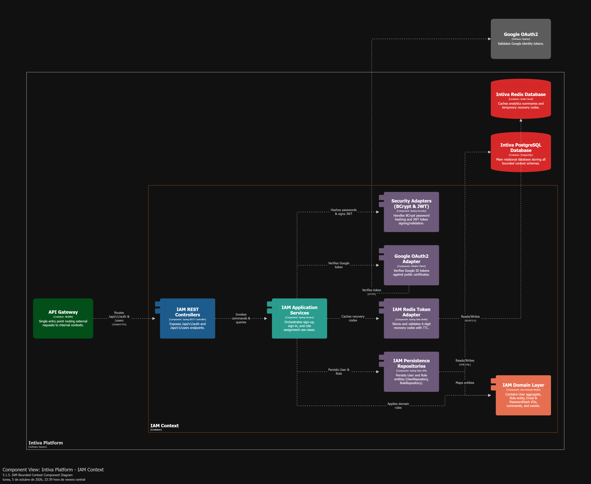

**Explicación del diagrama:**
El componente **`IAM REST Controllers`** recibe las solicitudes HTTP de autenticación y consulta de usuarios enrutadas desde el API Gateway y las delega a **`IAM Application Services`**. Esta capa coordina los casos de uso apoyándose en las reglas e invariantes de **`IAM Domain Layer`**. Para las operaciones técnicas, el servicio de aplicación invoca a **`Security Adapters (BCrypt & JWT)`** para el hashing de contraseñas y firma de tokens, a **`Google OAuth2 Adapter`** para validar inicios de sesión federados, a **`IAM Redis Token Adapter`** para almacenar códigos de recuperación en Redis, y a **`IAM Persistence Repositories`** para persistir las entidades en PostgreSQL.

### 5.1.6. Bounded Context Software Architecture Code Level Diagrams

#### 5.1.6.1. Bounded Context Domain Layer Class Diagrams

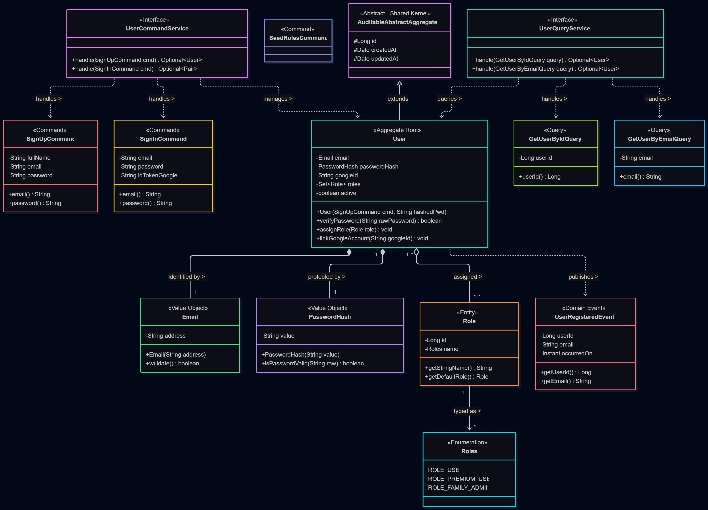

#### 5.1.6.2. Bounded Context Database Design Diagram

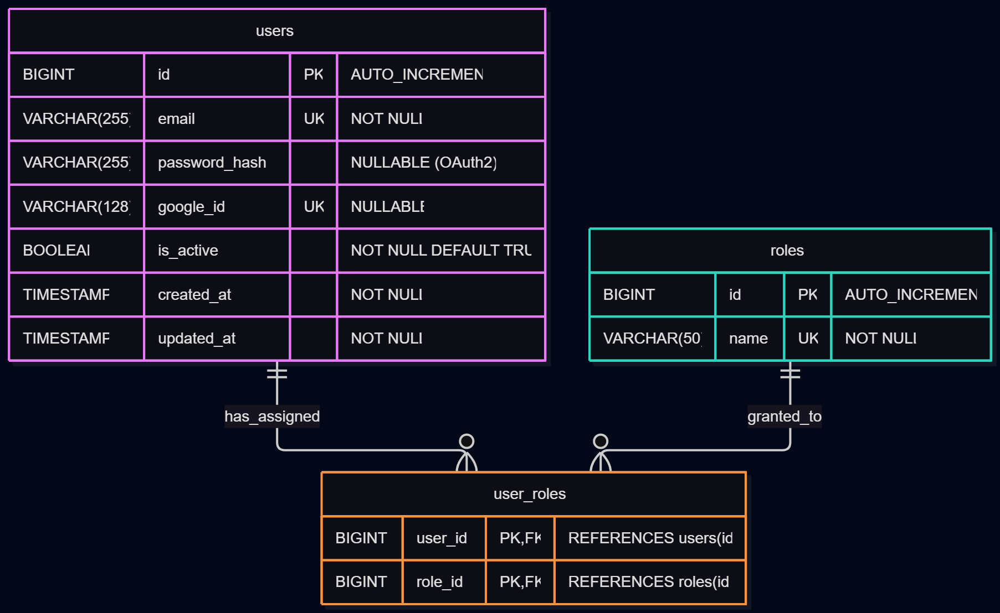

---

## 5.2. Bounded Context: Profiles

Este contexto administra la información personal, las preferencias de cuenta, el almacenamiento de imágenes de perfil (avatares) y el proceso de *onboarding* (tutorial guiado de primeros pasos) de cada persona usuaria dentro de la plataforma.

### 5.2.1. Domain Layer

En esta capa se modelan los agregados `Profile` y `Onboarding`, junto con las reglas de derivación de nombres por defecto y progresión reversible del tutorial inicial.

| Clase / Interfaz | Categoría Táctica | Propósito | Atributos | Métodos | Relaciones |
| :--- | :--- | :--- | :--- | :--- | :--- |
| **`Profile`** | Aggregate Root | Representa el perfil personal de un usuario registrado, incluyendo su nombre visible, correo de contacto y avatar. | `- id: Long`<br>`- userId: UserId`<br>`- fullName: String`<br>`- email: String`<br>`- avatar: Avatar` | `+ Profile(CreateProfileCommand)`<br>`+ updatePersonalData(String fullName): void`<br>`+ updateAvatar(Avatar newAvatar): void` | Extiende de `AuditableAbstractAggregate`; contiene `UserId` (Shared Kernel) y `Avatar` (`1`). |
| **`Onboarding`** | Aggregate Root | Controla el estado y avance del tutorial guiado de primeros pasos para usuarios nuevos. | `- id: Long`<br>`- userId: UserId`<br>`- currentStep: TutorialStep`<br>`- completed: boolean`<br>`- skipped: boolean` | `+ advanceStep(): void`<br>`+ skipOnboarding(): void`<br>`+ rollbackOnboarding(): void` | Extiende de `AuditableAbstractAggregate`; utiliza el objeto de valor `TutorialStep` (`1`). |
| **`Avatar`** | Value Object | Encapsula la URL pública y metadatos de validación de la imagen de perfil almacenada en la nube. | `- imageUrl: String`<br>`- format: String`<br>`- sizeInBytes: Long` | `+ Avatar(String url, String format, Long size)`<br>`+ isValidFormatAndSize(): boolean` | Composición dentro de `Profile` (`1`). |
| **`TutorialStep`** | Value Object | Representa el paso actual dentro de la secuencia del tutorial de bienvenida. | `- stepNumber: int`<br>`- stepCode: String` | `+ next(): TutorialStep`<br>`+ reset(): TutorialStep` | Composición dentro de `Onboarding` (`1`). |
| **`CreateProfileCommand`** | Command | Solicita la creación del perfil personal derivando el nombre inicial del correo electrónico. | `- userId: Long`<br>`- email: String`<br>`- fullName: String` | `+ userId(): Long`<br>`+ email(): String` | Consumido por `ProfileCommandService`. |
| **`UpdateProfileCommand`** | Command | Solicita la actualización del nombre o imagen de avatar del usuario. | `- userId: Long`<br>`- fullName: String`<br>`- imageFileBytes: byte[]` | `+ userId(): Long`<br>`+ fullName(): String` | Consumido por `ProfileCommandService`. |
| **`CreateUserOnboardingCommand`** | Command | Ordena inicializar el registro de seguimiento del tutorial para un usuario recién creado. | `- userId: Long` | `+ userId(): Long` | Consumido por `OnboardingCommandService`. |
| **`AdvanceTutorialStepCommand`** | Command | Ordena avanzar al siguiente paso del tutorial de primeros pasos. | `- userId: Long` | `+ userId(): Long` | Consumido por `OnboardingCommandService`. |
| **`SkipOnboardingCommand`** | Command | Permite al usuario omitir el tutorial guiado sin afectar sus datos financieros. | `- userId: Long` | `+ userId(): Long` | Consumido por `OnboardingCommandService`. |
| **`RollbackOnboardingCommand`** | Command | Permite revertir o reiniciar el estado del tutorial guiado. | `- userId: Long` | `+ userId(): Long` | Consumido por `OnboardingCommandService`. |
| **`GetProfileByUserIdQuery`** | Query | Consulta los datos del perfil asociados al identificador de un usuario. | `- userId: Long` | `+ userId(): Long` | Consumido por `ProfileQueryService`. |
| **`GetOnboardingStatusQuery`** | Query | Consulta el estado actual del tutorial guiado de un usuario. | `- userId: Long` | `+ userId(): Long` | Consumido por `OnboardingQueryService`. |
| **`ProfileCommandService`** | Domain Service (Interface) | Define el contrato de escritura para la creación y actualización de perfiles. | *(Interface)* | `+ handle(CreateProfileCommand): Optional<Profile>`<br>`+ handle(UpdateProfileCommand): Optional<Profile>` | Implementado por `ProfileCommandServiceImpl`. |
| **`OnboardingCommandService`** | Domain Service (Interface) | Define el contrato de escritura para gestionar el flujo de *onboarding*. | *(Interface)* | `+ handle(CreateUserOnboardingCommand): Optional<Onboarding>`<br>`+ handle(AdvanceTutorialStepCommand): Optional<Onboarding>`<br>`+ handle(SkipOnboardingCommand): void` | Implementado por `OnboardingCommandServiceImpl`. |

### 5.2.2. Interface Layer

Expone los endpoints REST para la gestión del perfil y del tutorial de bienvenida, además de la fachada pública consumida durante el registro inicial.

| Clase | Categoría Táctica | Propósito | Atributos | Métodos | Relaciones |
| :--- | :--- | :--- | :--- | :--- | :--- |
| **`ProfilesController`** | REST Controller | Expone los endpoints bajo `/api/v1/profiles` para consultar y actualizar la información personal y la foto de perfil. | `- profileCommandService: ProfileCommandService`<br>`- profileQueryService: ProfileQueryService` | `+ getProfileByUserId(Long userId): ResponseEntity<ProfileResource>`<br>`+ updateProfile(Long userId, UpdateProfileResource): ResponseEntity<ProfileResource>` | Invoca a `ProfileCommandService` y `ProfileQueryService`. |
| **`OnboardingController`** | REST Controller | Expone los endpoints bajo `/api/v1/onboarding` para consultar, avanzar, omitir o reiniciar el tutorial guiado. | `- onboardingCommandService: OnboardingCommandService`<br>`- onboardingQueryService: OnboardingQueryService` | `+ getStatus(Long userId): ResponseEntity<OnboardingResource>`<br>`+ advanceStep(Long userId): ResponseEntity<OnboardingResource>`<br>`+ skip(Long userId): ResponseEntity<Void>` | Invoca a `OnboardingCommandService` y `OnboardingQueryService`. |
| **`ProfilesContextFacade`** | Inbound ACL / OHS | Fachada pública (*Open Host Service*) que permite inicializar el flujo de *onboarding* para un usuario nuevo. | `- onboardingCommandService: OnboardingCommandService` | `+ createUserOnboarding(Long userId): void` | Invoca a `OnboardingCommandService`. |
| **`ProfileResourceFromEntityAssembler`** | Assembler | Transforma la entidad `Profile` en un DTO `ProfileResource` para su serialización JSON. | *(Clase utilitaria estática)* | `+ toResourceFromEntity(Profile): ProfileResource` | Utilizado por `ProfilesController`. |

### 5.2.3. Application Layer

Implementa los casos de uso de actualización de datos personales, manejo de errores ante fallos del servicio de imágenes externo y gestión de pasos del tutorial.

| Clase | Categoría Táctica | Propósito | Atributos | Métodos | Relaciones |
| :--- | :--- | :--- | :--- | :--- | :--- |
| **`ProfileCommandServiceImpl`** | Command Handler | Gestiona la creación y actualización del perfil; coordina la subida de imágenes con el adaptador de Cloudinary y conserva el avatar anterior si el servicio externo falla. | `- profileRepository: ProfileRepository`<br>`- cloudinaryPort: ImageStoragePort` | `+ handle(CreateProfileCommand): Optional<Profile>`<br>`+ handle(UpdateProfileCommand): Optional<Profile>` | Implementa `ProfileCommandService`; consume `ProfileRepository` y `CloudinaryStorageAdapter`. |
| **`ProfileQueryServiceImpl`** | Query Handler | Recupera la información del perfil de usuario desde la base de datos. | `- profileRepository: ProfileRepository` | `+ handle(GetProfileByUserIdQuery): Optional<Profile>` | Implementa `ProfileQueryService` y consume `ProfileRepository`. |
| **`OnboardingCommandServiceImpl`** | Command Handler | Ejecuta las transiciones de estado del tutorial guiado (avanzar, omitir o revertir). | `- onboardingRepository: OnboardingRepository` | `+ handle(CreateUserOnboardingCommand): Optional<Onboarding>`<br>`+ handle(AdvanceTutorialStepCommand): Optional<Onboarding>`<br>`+ handle(SkipOnboardingCommand): void`<br>`+ handle(RollbackOnboardingCommand): void` | Implementa `OnboardingCommandService` y consume `OnboardingRepository`. |
| **`ProfileCreationEventHandler`** | Event Handler | Escucha el evento de registro de usuario y dispara la creación automática del perfil por defecto tomando el prefijo del correo electrónico. | `- profileCommandService: ProfileCommandService` | `+ onUserRegistered(UserRegisteredEvent): void` | Invoca a `ProfileCommandService`. |

### 5.2.4. Infrastructure Layer

Contiene los repositorios JPA para la persistencia de perfiles y estados de *onboarding*, así como el adaptador de integración con **Cloudinary**.

| Clase / Interfaz | Categoría Táctica | Propósito | Atributos | Métodos | Relaciones |
| :--- | :--- | :--- | :--- | :--- | :--- |
| **`ProfileRepository`** | Repository (JPA) | Gestiona la persistencia de la entidad `Profile` en la tabla `profiles` de PostgreSQL. | *(Interface JPA)* | `+ findByUserId(UserId): Optional<Profile>`<br>`+ existsByUserId(UserId): boolean` | Extiende `JpaRepository<Profile, Long>`. |
| **`OnboardingRepository`** | Repository (JPA) | Gestiona la persistencia del estado del tutorial en la tabla `onboardings` de PostgreSQL. | *(Interface JPA)* | `+ findByUserId(UserId): Optional<Onboarding>` | Extiende `JpaRepository<Onboarding, Long>`. |
| **`CloudinaryStorageAdapter`** | External Service Adapter | Sube las imágenes de perfil (JPG, PNG, WEBP hasta 5 MB) a la API de Cloudinary y retorna la URL segura; captura caídas del proveedor sin interrumpir el flujo principal. | `- cloudinaryClient: Cloudinary`<br>`- maxFileSizeBytes: Long` | `+ uploadAvatar(byte[] fileBytes, String fileName): Optional<String>` | Se comunica con el sistema externo `Cloudinary Service`. |

### 5.2.5. Bounded Context Software Architecture Component Level Diagrams

En esta sección se presenta el diagrama de componentes del contenedor **Profiles Context**, reflejando la descomposición interna y su integración con el almacenamiento en la nube y base de datos.

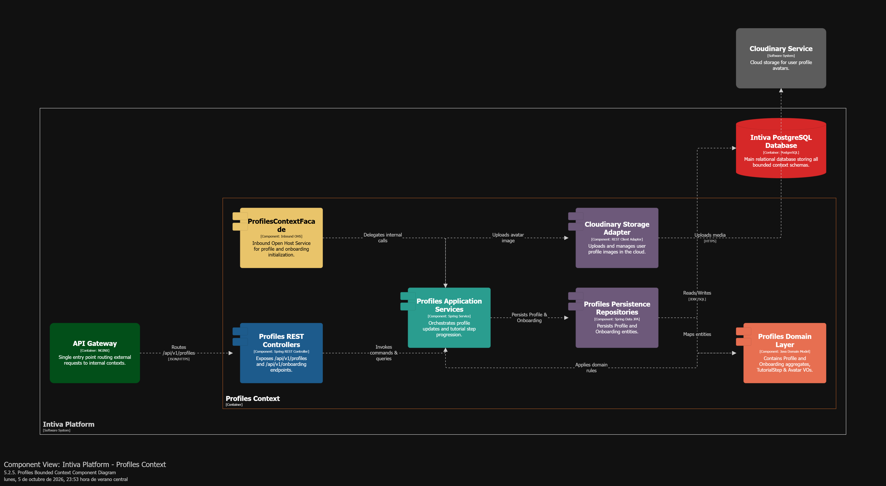

**Explicación del diagrama:**
Las peticiones de gestión de perfil y tutorial ingresan desde el API Gateway hacia **`Profiles REST Controllers`**, mientras que las solicitudes internas de inicialización ingresan por **`ProfilesContextFacade`**. Ambos delegan el procesamiento a **`Profiles Application Services`**, el cual aplica las reglas de negocio definidas en **`Profiles Domain Layer`**. Para el almacenamiento de fotos de perfil, el servicio de aplicación utiliza **`Cloudinary Storage Adapter`** para comunicarse vía HTTPS con el servicio externo Cloudinary, mientras que los datos estructurados de `Profile` y `Onboarding` son almacenados en PostgreSQL a través de **`Profiles Persistence Repositories`**.

### 5.2.6. Bounded Context Software Architecture Code Level Diagrams

#### 5.2.6.1. Bounded Context Domain Layer Class Diagrams

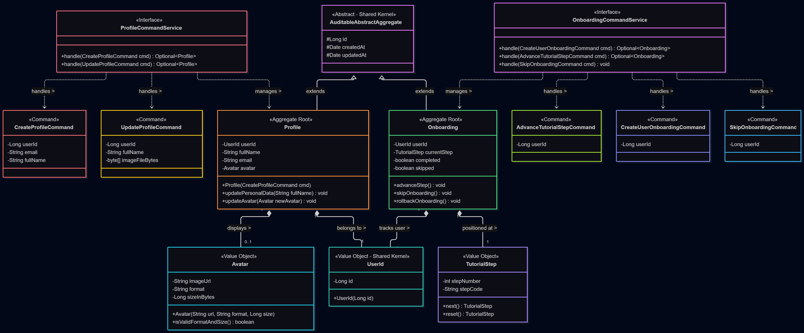

#### 5.2.6.2. Bounded Context Database Design Diagram

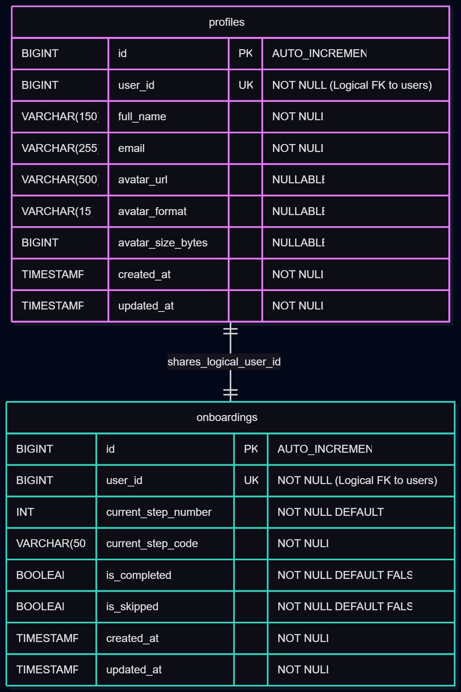

---

## 5.3. Bounded Context: Categories & Financial Accounts

Este contexto administra el catálogo de categorías de gasto e ingreso y los medios de pago (efectivo, tarjetas de débito/crédito y billeteras digitales) utilizados por personas y familias. Como parte de la incorporación de tecnologías emergentes (**AD-21** y **AD-22**), integra un adaptador de Inteligencia Artificial conectado a un **LLM externo** para sugerir automáticamente la categoría de un gasto a partir de su descripción o comercio.

### 5.3.1. Domain Layer

En esta capa se definen los agregados `Category` y `FinancialAccount`, junto con las reglas de consistencia de saldos, control de versión para sincronización *offline* y el puerto de dominio para la clasificación inteligente con IA.

| Clase / Interfaz | Categoría Táctica | Propósito | Atributos | Métodos | Relaciones |
| :--- | :--- | :--- | :--- | :--- | :--- |
| **`Category`** | Aggregate Root | Representa una categoría de clasificación para transacciones financieras, asociada a un titular individual o familiar. | `- id: Long`<br>`- name: String`<br>`- type: CategoryType`<br>`- color: String`<br>`- icon: String`<br>`- ownerType: OwnerTypes`<br>`- ownerId: Long` | `+ Category(CreateCategoryCommand)`<br>`+ updateDetails(String name, String color, String icon): void` | Extiende de `AuditableAbstractAggregate`; utiliza `CategoryType` y `OwnerTypes` (Shared Kernel). |
| **`FinancialAccount`** | Aggregate Root | Representa un medio de pago o cuenta financiera (efectivo, tarjeta o billetera), controlando su saldo disponible, estado de activación y versión de sincronización. | `- id: Long`<br>`- name: AccountName`<br>`- type: FinancialAccountType`<br>`- balance: Money`<br>`- creditLimit: Money`<br>`- institution: Institution`<br>`- active: boolean`<br>`- syncVersion: Long`<br>`- ownerType: OwnerTypes`<br>`- ownerId: Long` | `+ applyTransaction(Money amount, String opType): void`<br>`+ hasSufficientBalance(Money amount): boolean`<br>`+ deactivate(): void`<br>`+ validateSyncVersion(Long clientVersion): void` | Extiende de `AuditableAbstractAggregate`; compuesta por `AccountName`, `Institution` y `Money`. |
| **`CategorySuggestion`** | Value Object | Encapsula el resultado de la sugerencia automática generada por el LLM, incluyendo la categoría propuesta y su nivel de confianza. | `- suggestedCategoryName: String`<br>`- categoryId: Long`<br>`- confidenceScore: double`<br>`- requiresExplicitConfirmation: boolean` | `+ isLowConfidence(): boolean`<br>`+ fallbackToOther(Long otherCategoryId): CategorySuggestion` | Retornado por `CategoryClassifierPort`. |
| **`AccountName`** | Value Object | Encapsula y valida el nombre asignado por el usuario a su cuenta financiera. | `- value: String` | `+ AccountName(String value)` | Composición dentro de `FinancialAccount` (`1`). |
| **`Institution`** | Value Object | Representa la entidad bancaria o emisora de la billetera digital asociada a la cuenta. | `- name: String` | `+ Institution(String name)` | Composición dentro de `FinancialAccount` (`0..1`). |
| **`CreateCategoryCommand`** | Command | Solicita la creación de una nueva categoría verificando que no exista duplicidad de nombre para el titular. | `- name: String`<br>`- type: String`<br>`- color: String`<br>`- icon: String`<br>`- ownerType: String`<br>`- ownerId: Long` | `+ name(): String`<br>`+ ownerId(): Long` | Consumido por `CategoryCommandService`. |
| **`CreateDefaultCategoryCommand`** | Command | Ordena la creación del catálogo de categorías por defecto al registrarse un usuario. | `- ownerId: Long`<br>`- ownerType: String` | `+ ownerId(): Long` | Consumido por `CategoryCommandService`. |
| **`CreateFinancialAccountCommand`** | Command | Solicita el registro de una nueva cuenta financiera con su saldo inicial. | `- name: String`<br>`- type: String`<br>`- initialBalance: BigDecimal`<br>`- institution: String`<br>`- ownerType: String`<br>`- ownerId: Long` | `+ name(): String`<br>`- initialBalance(): BigDecimal` | Consumido por `FinancialAccountCommandService`. |
| **`CreateFinancialAccountTransaction`** | Command | Ordena aplicar un cargo o abono sobre el saldo o línea de crédito de una cuenta activa. | `- accountId: Long`<br>`- amount: BigDecimal`<br>`- operationType: String`<br>`- expectedVersion: Long` | `+ accountId(): Long`<br>`+ amount(): BigDecimal` | Consumido por `FinancialAccountCommandService`. |
| **`SuggestCategoryByMerchantQuery`** | Query | Solicita al clasificador de IA una sugerencia de categoría a partir del comercio o descripción del gasto (US 033). | `- merchantDescription: String`<br>`- ownerType: String`<br>`- ownerId: Long` | `+ merchantDescription(): String`<br>`+ ownerId(): Long` | Consumido por `CategoryQueryService`. |
| **`CategoryClassifierPort`** | Domain Port (Interface) | Define el contrato en el dominio para invocar al clasificador inteligente de gastos sin acoplar el dominio al proveedor de IA. | *(Interface)* | `+ classifyExpense(String description, List<String> userCategories): CategorySuggestion` | Implementado en infraestructura por `LlmClassifierServiceAdapter`. |

### 5.3.2. Interface Layer

Expone los controladores REST para la administración de categorías, cuentas financieras y sugerencias por IA, además del *Open Host Service* publicado para el resto del sistema.

| Clase | Categoría Táctica | Propósito | Atributos | Métodos | Relaciones |
| :--- | :--- | :--- | :--- | :--- | :--- |
| **`CategoriesController`** | REST Controller | Gestiona las peticiones HTTP bajo `/api/v1/categories` para crear, listar categorías y solicitar sugerencias automáticas con IA. | `- categoryCommandService: CategoryCommandService`<br>`- categoryQueryService: CategoryQueryService` | `+ createCategory(CreateCategoryResource): ResponseEntity<CategoryResource>`<br>`+ getCategoriesByOwner(...): ResponseEntity<List<CategoryResource>>`<br>`+ suggestCategory(SuggestCategoryResource): ResponseEntity<CategorySuggestionResource>` | Consume `CategoryCommandService` y `CategoryQueryService`. |
| **`FinancialAccountsController`** | REST Controller | Expone los endpoints bajo `/api/v1/financial-accounts` para registrar cuentas, consultarlas e inhabilitarlas. | `- accountCommandService: FinancialAccountCommandService`<br>`- accountQueryService: FinancialAccountQueryService` | `+ createAccount(CreateFinancialAccountResource): ResponseEntity<FinancialAccountResource>`<br>`+ getAccountsByOwner(Long ownerId): ResponseEntity<List<FinancialAccountResource>>`<br>`+ disableAccount(Long id, DisableAccountResource): ResponseEntity<Void>` | Consume `FinancialAccountCommandService` y `FinancialAccountQueryService`. |
| **`CategoriesContextFacade`** | Inbound ACL / OHS | Fachada pública que expone operaciones de creación por defecto y consulta de metadatos (nombre, color, ícono). | `- categoryCommandService: CategoryCommandService`<br>`- categoryQueryService: CategoryQueryService` | `+ createDefaultCategory(Long userId): Long`<br>`+ getCategoryNameById(Long categoryId): String`<br>`+ getCategoryColorAndIconById(Long categoryId): Pair<String, String>` | Delega a los servicios de aplicación de categorías. |
| **`FinancialAccountContextFacade`** | Inbound ACL / OHS | Fachada pública que expone la validación de saldo suficiente y el registro de movimientos en cuentas. | `- accountCommandService: FinancialAccountCommandService`<br>`- accountQueryService: FinancialAccountQueryService` | `+ createDefaultFinancialAccount(Long userId): Long`<br>`+ hasSufficientBalance(Long accountId, BigDecimal amount): boolean`<br>`+ createFinancialAccountTransaction(...): void` | Delega a los servicios de aplicación de cuentas financieras. |

### 5.3.3. Application Layer

Coordina los casos de uso de actualización de saldos, validación de fondos, control de conflictos de sincronización *offline* y degradación elegante para las sugerencias de IA.

| Clase | Categoría Táctica | Propósito | Atributos | Métodos | Relaciones |
| :--- | :--- | :--- | :--- | :--- | :--- |
| **`CategoryCommandServiceImpl`** | Command Handler | Ejecuta la creación de categorías personalizadas y por defecto, validando que no existan nombres duplicados para el mismo titular. | `- categoryRepository: CategoryRepository` | `+ handle(CreateCategoryCommand): Optional<Category>`<br>`+ handle(CreateDefaultCategoryCommand): Optional<Category>` | Implementa `CategoryCommandService`; utiliza `CategoryRepository`. |
| **`CategoryQueryServiceImpl`** | Query Handler | Recupera las categorías del usuario y orquesta el flujo de sugerencia por IA (**AD-21** y **AD-22**): consulta al puerto del clasificador y, si la confianza es baja o el proveedor falla, ofrece elección manual o `"Otros"`, sin guardar el gasto y exigiendo confirmación explícita. | `- categoryRepository: CategoryRepository`<br>`- classifierPort: CategoryClassifierPort` | `+ handle(GetCategoryByIdQuery): Optional<Category>`<br>`+ handle(GetAllCategoriesByOwnerTypeAndOwnerIdAndTypeQuery): List<Category>`<br>`+ handle(SuggestCategoryByMerchantQuery): CategorySuggestion` | Implementa `CategoryQueryService`; consume `CategoryRepository` y `CategoryClassifierPort`. |
| **`FinancialAccountCommandServiceImpl`** | Command Handler | Gestiona el ciclo de vida de las cuentas financieras y la aplicación de cargos/abonos, verificando fondos suficientes (`InsufficientFundsException`) y versión de sincronización (`FinancialAccountSyncConflictException`). | `- accountRepository: FinancialAccountRepository` | `+ handle(CreateFinancialAccountCommand): Optional<FinancialAccount>`<br>`+ handle(CreateFinancialAccountTransaction): Optional<FinancialAccount>`<br>`+ handle(UpdateFinancialAccountCommand): Optional<FinancialAccount>` | Implementa `FinancialAccountCommandService`; utiliza `FinancialAccountRepository`. |
| **`FinancialAccountQueryServiceImpl`** | Query Handler | Ejecuta las consultas de cuentas financieras activas y verificación de saldos por titular. | `- accountRepository: FinancialAccountRepository` | `+ handle(GetFinancialAccountByIdQuery): Optional<FinancialAccount>`<br>`+ handle(GetAllFinancialAccountsByOwnerId): List<FinancialAccount>` | Implementa `FinancialAccountQueryService`; utiliza `FinancialAccountRepository`. |

### 5.3.4. Infrastructure Layer

Contiene los repositorios JPA hacia PostgreSQL y el adaptador **`LlmClassifierServiceAdapter` (`ClassifierService`)** que conecta el contexto con el modelo de lenguaje externo.

| Clase / Interfaz | Categoría Táctica | Propósito | Atributos | Métodos | Relaciones |
| :--- | :--- | :--- | :--- | :--- | :--- |
| **`CategoryRepository`** | Repository (JPA) | Persiste y consulta las entidades `Category` en la tabla `categories` de PostgreSQL. | *(Interface JPA)* | `+ findByOwnerTypeAndOwnerId(OwnerTypes, Long): List<Category>`<br>`+ existsByNameAndOwnerId(String, Long): boolean` | Extiende `JpaRepository<Category, Long>`. |
| **`FinancialAccountRepository`** | Repository (JPA) | Persiste y consulta las cuentas financieras en la tabla `financial_accounts` de PostgreSQL. | *(Interface JPA)* | `+ findByOwnerTypeAndOwnerIdAndActiveTrue(OwnerTypes, Long): List<FinancialAccount>` | Extiende `JpaRepository<FinancialAccount, Long>`. |
| **`LlmClassifierServiceAdapter`** (`ClassifierService`) | Emerging Tech AI Adapter | Implementa la decisión **AD-21**: arma un *prompt* con la descripción del gasto y las categorías del usuario, lo envía a la API del LLM externo e interpreta la respuesta con su nivel de confianza; valida que la respuesta pertenezca al catálogo autorizado; ante caídas habilita selección manual (**AD-22**, TS 024). | `- restClient: RestClient`<br>`- llmApiUrl: String`<br>`- llmApiKey: String`<br>`- confidenceThreshold: double` | `+ classifyExpense(String description, List<String> userCategories): CategorySuggestion`<br>`- buildPrompt(String, List<String>): String` | Implementa `CategoryClassifierPort`; consume el sistema externo `External LLM API (AI)`. |

### 5.3.5. Bounded Context Software Architecture Component Level Diagrams

En esta sección se presenta el diagrama de componentes del contenedor **Categories & Financial Accounts Context**, destacando la integración del adaptador de Inteligencia Artificial.

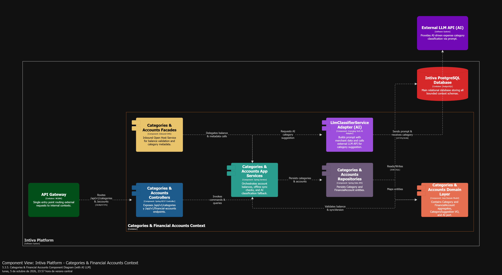

**Explicación del diagrama:**
Las solicitudes externas llegan a **`Categories & Accounts Controllers`** a través del API Gateway, mientras que las consultas internas de otros módulos ingresan mediante **`Categories & Accounts Facades`**. Ambos componentes delegan la orquestación a **`Categories & Accounts App Services`**, el cual valida reglas de saldo, activación y sincronización en **`Categories & Accounts Domain Layer`**. Para la sugerencia inteligente de categorías (US 033), la capa de aplicación invoca a **`LlmClassifierServiceAdapter (AI)`**, que envía el *prompt* mediante HTTPS/JSON al sistema externo **`External LLM API (AI)`**. Finalmente, **`Categories & Accounts Repositories`** persiste las cuentas y categorías en PostgreSQL.

### 5.3.6. Bounded Context Software Architecture Code Level Diagrams

#### 5.3.6.1. Bounded Context Domain Layer Class Diagrams

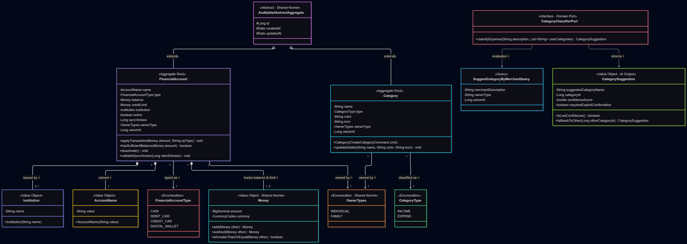

#### 5.3.6.2. Bounded Context Database Design Diagram

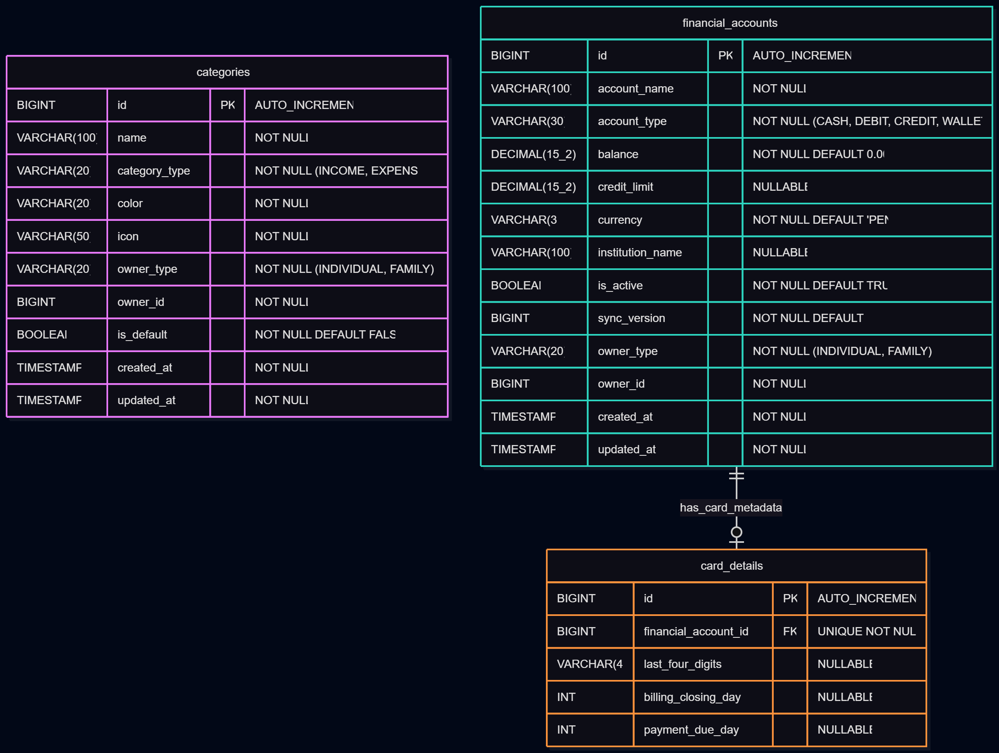

---

## 5.4. Bounded Context: Finances

Este contexto gestiona ingresos, gastos, límites y pagos recurrentes. Para US 032 y TS 023 incorpora propuestas de gasto del fondo familiar, separadas de los movimientos confirmados: todos los miembros deben aprobar la misma propuesta y el smart contract debe confirmar su validación antes de registrar el gasto (AD-23 a AD-25). Para US 033, el gasto personal se guarda después de revisar la categoría sugerida por IA.

### 5.4.1. Domain Layer

En esta capa se modelan Transaction, SpendingLimit, RecurringTransaction y SharedFundProposal, separando movimientos confirmados de acuerdos pendientes.

| Clase / Interfaz | Categoría Táctica | Propósito | Atributos | Métodos | Relaciones |
| :--- | :--- | :--- | :--- | :--- | :--- |
| **`Transaction`** | Aggregate Root | Movimiento confirmado, personal o familiar. La propuesta familiar se modela por separado. | `id`, `financialAccountId`, `categoryId`, `amount: Money`, `type`, `status`, `description`, `transactionDate`, `ownerType`, `ownerId`, `proposalId: UUID?` | `register()`, `isFamilyTransaction()` | Publica FamilyTransactionCreatedEvent tras conciliación; proposalId único si proviene del fondo. |
| **`SpendingLimit`** | Aggregate Root | Representa un tope presupuestario configurado por periodo sobre una categoría o cuenta financiera. | `- id: Long`<br>`- targetType: SpendingLimitTargetType`<br>`- targetId: Long`<br>`- limitAmount: Money`<br>`- currentSpentAmount: Money`<br>`- warningThresholdPercent: int`<br>`- period: PeriodTypes`<br>`- status: SpendingLimitStatus`<br>`- ownerType: OwnerTypes`<br>`- ownerId: Long` | `+ evaluateExpense(Money expenseAmount): SpendingLimitStatus`<br>`+ isWarningReached(): boolean`<br>`+ isExceeded(): boolean`<br>`+ activate(): void` | Extiende de `AuditableAbstractAggregate`; emite `SpendingLimitWarningReachedEvent` y `SpendingLimitExceededEvent`. |
| **`RecurringTransaction`** | Aggregate Root | Representa un gasto o ingreso fijo programado con fecha de vencimiento y frecuencia periódica. | `- id: Long`<br>`- financialAccountId: Long`<br>`- categoryId: Long`<br>`- amount: Money`<br>`- frequency: PeriodTypes`<br>`- nextDueDate: LocalDate`<br>`- active: boolean`<br>`- ownerType: OwnerTypes`<br>`- ownerId: Long` | `+ isDueSoon(LocalDate today): boolean`<br>`+ isExpired(LocalDate today): boolean`<br>`+ advanceNextDueDate(): void`<br>`+ activate(): void` | Extiende de `AuditableAbstractAggregate`; emite `PaymentDueSoonEvent` y `PaymentExpiredEvent`. |
| **`TransactionStatus`** | Enumeration | Resultado del registro de un movimiento; no equivale al estado de una propuesta. | `CONFIRMED`, `FAILED_INSUFFICIENT_FUNDS` | `valueOf(String)` | Utilizado por Transaction. |
| **`SpendingLimitTargetType`** | Enumeration | Define sobre qué elemento se aplica el límite de gasto. | `CATEGORY`<br>`FINANCIAL_ACCOUNT`<br>`PERIOD` | `+ valueOf(String): SpendingLimitTargetType` | Utilizado por `SpendingLimit` (`1`). |
| **`RegisterTransactionCommand`** | Command | Registra un movimiento personal revisado; el cliente no puede usar este comando para eludir el contrato del fondo. | `accountId`, `categoryId`, `amount`, `type`, `description`, `ownerId` | `amount()` | Consumido por TransactionCommandService. |

| **`CreateSpendingLimitCommand`** | Command | Solicita configurar un nuevo límite de gasto por categoría, cuenta o periodo. | `- targetType: String`<br>`- targetId: Long`<br>`- limitAmount: BigDecimal`<br>`- period: String`<br>`- ownerType: String`<br>`- ownerId: Long` | `+ limitAmount(): BigDecimal` | Consumido por `SpendingLimitCommandService`. |
| **`CreateRecurringTransactionCommand`** | Command | Solicita programar un ingreso o gasto recurrente con fecha de pago. | `- accountId: Long`<br>`- categoryId: Long`<br>`- amount: BigDecimal`<br>`- frequency: String`<br>`- nextDueDate: LocalDate`<br>`- ownerId: Long` | `+ nextDueDate(): LocalDate` | Consumido por `RecurringTransactionCommandService`. |
| **`FamilyTransactionCreatedEvent`** | Domain Event | Notifica que un integrante ha registrado una transacción dentro del grupo familiar. | `- transactionId: Long`<br>`- familyId: Long`<br>`- authorUserId: Long`<br>`- amount: BigDecimal` | `+ getFamilyId(): Long` | Publicado por `Transaction`. |
| **`SpendingLimitWarningReachedEvent`** | Domain Event | Notifica que el gasto acumulado se encuentra próximo a alcanzar el límite configurado (US 027). | `- spendingLimitId: Long`<br>`- ownerId: Long`<br>`- currentPercentage: double` | `+ getSpendingLimitId(): Long` | Publicado por `SpendingLimit`. |
| **`SpendingLimitExceededEvent`** | Domain Event | Notifica que un gasto registrado ha superado el límite de presupuesto establecido (US 026). | `- spendingLimitId: Long`<br>`- ownerId: Long`<br>`- exceededAmount: BigDecimal` | `+ getExceededAmount(): BigDecimal` | Publicado por `SpendingLimit`. |
| **`PaymentDueSoonEvent`** | Domain Event | Notifica que un pago recurrente programado está próximo a su fecha de vencimiento (US 030). | `- recurringTransactionId: Long`<br>`- ownerId: Long`<br>`- dueDate: LocalDate` | `+ getDueDate(): LocalDate` | Publicado por `RecurringTransaction`. |

| **`SharedFundProposal`** | Aggregate Root | Gasto propuesto, separado del movimiento; US 032 y TS 023. | `id: UUID`, `familyId`, `amount: Money`, `recipient`, `termsHash`, `requiredMemberIds: Set<UserId>`, `status: ProposalStatus` | `approve(member, signature)`, `reject(member)`, `isUnanimous()` | Composición de ProposalApproval; instantánea de miembros y condiciones inmutables. |
| **`ProposalApproval`** | Entity | Un voto por miembro sobre el hash de la misma propuesta. | `proposalId`, `memberId`, `decision`, `signature`, `signedAt` | `matchesTermsHash(hash)` | UNIQUE(proposalId, memberId); una firma no sustituye otras aprobaciones. |
| **`ProposalStatus`** | Enumeration | Distingue acuerdo, envío y confirmación del contrato. | `PENDING_APPROVAL`, `READY_FOR_SUBMISSION`, `PENDING_CHAIN`, `CONFIRMED`, `REJECTED`, `ERROR` | `valueOf(String)` | El saldo no cambia antes de CONFIRMED. |
| **`SmartContractGatewayPort`** | Domain Port | Envía aprobaciones firmadas y consulta resultado sin custodiar claves privadas. | Interfaz | `submitApprovedProposal(proposal, signatures)`, `getResult(reference)` | Implementado por SmartContractGatewayAdapter. |

### 5.4.2. Interface Layer

Expone endpoints para movimientos confirmados, propuestas del fondo familiar, aprobaciones firmadas, límites y pagos recurrentes.

| Clase | Categoría Táctica | Propósito | Atributos | Métodos | Relaciones |
| :--- | :--- | :--- | :--- | :--- | :--- |
| **`TransactionsController`** | REST Controller | Registra movimientos personales revisados y consulta historial. | `transactionCommandService`, `transactionQueryService` | `registerTransaction(resource)`, `getTransactionsByOwner(...)` | No expone un parámetro para confirmar arbitrariamente gastos del fondo. |
| **`SpendingLimitsController`** | REST Controller | Expone `/api/v1/spending-limits` para crear, activar y consultar límites de gasto y su monto utilizado/disponible. | `- limitCommandService: SpendingLimitCommandService`<br>`- limitQueryService: SpendingLimitQueryService` | `+ createSpendingLimit(CreateSpendingLimitResource): ResponseEntity<SpendingLimitResource>`<br>`+ getLimitsByOwner(Long ownerId): ResponseEntity<List<SpendingLimitResource>>` | Invoca a `SpendingLimitCommandService` y `SpendingLimitQueryService`. |
| **`RecurringTransactionsController`** | REST Controller | Expone `/api/v1/recurring-transactions` para configurar y listar pagos e ingresos programados. | `- recurringCommandService: RecurringTransactionCommandService`<br>`- recurringQueryService: RecurringTransactionQueryService` | `+ createRecurring(CreateRecurringResource): ResponseEntity<RecurringTransactionResource>`<br>`+ getRecurringByOwner(Long ownerId): ResponseEntity<List<RecurringTransactionResource>>` | Invoca a `RecurringTransactionCommandService` y `RecurringTransactionQueryService`. |

| **`SharedFundProposalsController`** | REST Controller | Crear propuesta, aprobar/firmar, rechazar y consultar estado. | `proposalService` | `propose(resource)`, `approve(id, signedVote)`, `reject(id)`, `getStatus(id)` | Autoriza al miembro autenticado; no hay excepción administrativa. |

### 5.4.3. Application Layer

Valida saldos, coordina propuestas y aprobaciones unánimes, verifica el resultado del contrato y concilia cada gasto una sola vez. Los procesos programados de vencimiento se conservan (AD-13).

| Clase | Categoría Táctica | Propósito | Atributos | Métodos | Relaciones |
| :--- | :--- | :--- | :--- | :--- | :--- |
| **`TransactionCommandServiceImpl`** | Command Handler | Valida permisos y saldo del movimiento personal. Para el fondo solo admite conciliación interna de un resultado confirmado del contrato. | `transactionRepository`, `limitRepository`, `externalAccountService`, `eventPublisher` | `handle(RegisterTransactionCommand)`, `applyConfirmedProposal(result)` | Actualiza saldo y publica eventos en una unidad transaccional; evita duplicación por proposalId. |
| **`TransactionQueryServiceImpl`** | Query Handler | Ejecuta consultas de historial de transacciones (`GetTransactionsByOwnerIdQuery`, `GetLastTransactionsByOwnerIdQuery`) respetando la marca de privacidad `OwnerTypes` (**AD-03**). | `- transactionRepository: TransactionRepository` | `+ handle(GetTransactionsByOwnerIdQuery): List<Transaction>`<br>`+ handle(GetLastTransactionsByOwnerIdQuery): List<Transaction>` | Implementa `TransactionQueryService` y consume `TransactionRepository`. |
| **`SpendingLimitCommandServiceImpl`** | Command Handler | Gestiona la creación y activación de límites de presupuesto por categoría, cuenta o periodo. | `- limitRepository: SpendingLimitRepository` | `+ handle(CreateSpendingLimitCommand): Optional<SpendingLimit>`<br>`+ handle(ActivateSpendingLimitCommand): Optional<SpendingLimit>` | Implementa `SpendingLimitCommandService`; consume `SpendingLimitRepository`. |
| **`PaymentReminderScheduler`** | Application Scheduler | Proceso programado (**AD-13**) que inspecciona diariamente las `RecurringTransaction` activas y publica `PaymentDueSoonEvent` o `PaymentExpiredEvent`. | `- recurringRepository: RecurringTransactionRepository`<br>`- eventPublisher: ApplicationEventPublisher` | `+ checkUpcomingAndExpiredPayments(): void` | Consulta `RecurringTransactionRepository` y publica eventos de vencimiento. |
| **`FinancesExternalFinancialAccountService`** | Outbound ACL Service | Adaptador ACL que consulta disponibilidad de saldo y solicita aplicar cargos/abonos al contexto de cuentas financieras. | `- accountFacade: FinancialAccountContextFacade` | `+ hasSufficientBalance(Long accountId, BigDecimal amount): boolean`<br>`+ registerAccountMovement(...): void` | Consume `FinancialAccountContextFacade`. |
| **`FinancesExternalNotificationsService`** | Outbound ACL Service | Adaptador ACL que solicita el envío de alertas cuando un límite de gasto alcanza su umbral o se excede. | `- commsFacade: CommunicationsContextFacade` | `+ notifySpendingLimitAlert(Long ownerId, String alertType): void` | Consume `CommunicationsContextFacade`. |

| **`SharedFundProposalService`** | Application Service | Valida miembros, hash y firmas; exige unanimidad y concilia una sola vez después de confirmación. | `proposalRepository`, `householdFacade`, `contractGateway`, `transactionService` | `propose(...)`, `approve(...)`, `reject(...)`, `reconcile(...)` | Cambiar condiciones o miembros exige nueva propuesta; fallo requiere consultar estado antes de reenviar. |

### 5.4.4. Infrastructure Layer

Implementa los repositorios de persistencia relacional en PostgreSQL para transacciones, límites de gasto y pagos programados.

| Clase / Interfaz | Categoría Táctica | Propósito | Atributos | Métodos | Relaciones |
| :--- | :--- | :--- | :--- | :--- | :--- |
| **`TransactionRepository`** | Repository (JPA) | Persiste movimientos confirmados y evita duplicar el gasto conciliado del fondo. | Interfaz JPA | `findByOwnerTypeAndOwnerId(...)`, `existsByProposalId(UUID)` | Restricción UNIQUE sobre proposal_id cuando existe. |
| **`SpendingLimitRepository`** | Repository (JPA) | Persiste y consulta los límites de gasto activos asociados a un titular, categoría o cuenta. | *(Interface JPA)* | `+ findByOwnerTypeAndOwnerIdAndStatus(OwnerTypes, Long, SpendingLimitStatus): List<SpendingLimit>` | Extiende `JpaRepository<SpendingLimit, Long>`. |
| **`RecurringTransactionRepository`** | Repository (JPA) | Persiste transacciones recurrentes y permite a los *schedulers* consultar pagos próximos a vencer. | *(Interface JPA)* | `+ findByActiveTrueAndNextDueDateLessThanEqual(LocalDate): List<RecurringTransaction>` | Extiende `JpaRepository<RecurringTransaction, Long>`. |

| **`SharedFundProposalRepository`** | Repository (JPA) | Persiste propuestas, votos y referencia de red fuera de blockchain. | Interfaz JPA | `findById(UUID)`, `save(proposal)` | Concurrencia con versión; índice único por propuesta y miembro. |
| **`SmartContractGatewayAdapter`** | External Service Adapter | Verifica el contrato configurado, envía firmas y consulta confirmaciones (AD-24/25). | `rpcClient`, `contractAddress`, `networkId` | `submitApprovedProposal(...)`, `getResult(...)` | Implementa SmartContractGatewayPort; proveedor, red y confirmaciones se validarán en pruebas. |

### 5.4.5. Bounded Context Software Architecture Component Level Diagrams

El diagrama muestra el registro personal, la validación unánime del fondo mediante smart contracts y los recordatorios existentes.

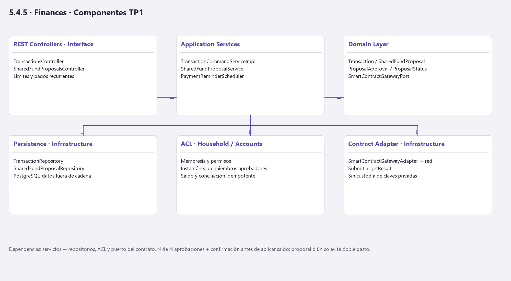

**Explicación del diagrama:**
Los controladores reciben movimientos personales revisados y propuestas del fondo. Los servicios de aplicación verifican membresía mediante Household, recopilan firmas sobre la misma propuesta y consultan el contrato a través de SmartContractGatewayAdapter. Solo un resultado confirmado permite conciliar el gasto de forma idempotente; rechazo, error o aprobaciones incompletas no modifican el saldo. Los repositorios guardan los datos fuera de blockchain y los schedulers conservan los recordatorios de vencimiento.

### 5.4.6. Bounded Context Software Architecture Code Level Diagrams

#### 5.4.6.1. Bounded Context Domain Layer Class Diagrams

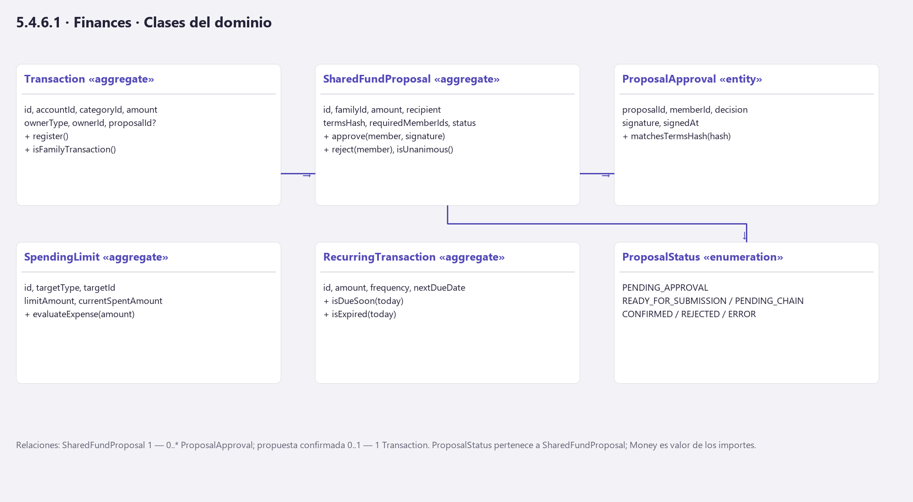

#### 5.4.6.2. Bounded Context Database Design Diagram

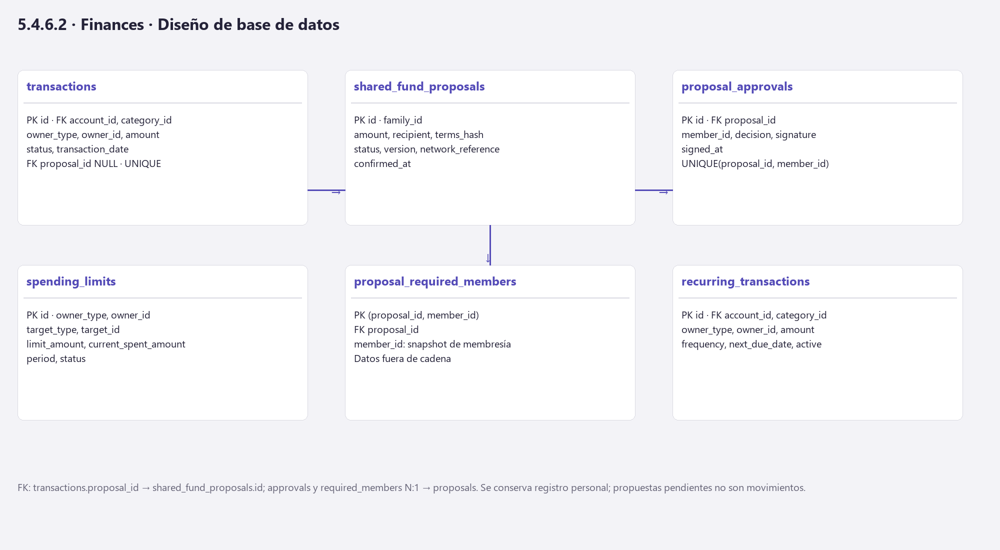

## 5.5. Bounded Context: Financial Goals (Savings)

Este contexto constituye uno de los subdominios núcleo (*Core Subdomain*) de la plataforma: permite definir metas de ahorro individuales o familiares y registrar los aportes progresivos hasta alcanzarlas. Como parte de las tecnologías emergentes incorporadas al diseño, este contexto integra un adaptador hacia una red de **Smart Contracts (Blockchain)** que permite registrar condiciones inmutables de ahorro y verificar automáticamente el cumplimiento de los hitos financieros antes de habilitar o marcar como completado un objetivo.

### 5.5.1. Domain Layer

En esta capa se modela el ciclo de vida de las metas de ahorro (`SavingGoal`), sus contribuciones individuales o grupales (`GoalContribution`), las reglas de reversibilidad de estado y el puerto de dominio para la verificación en cadena (*on-chain*) mediante contratos inteligentes.

| Clase / Interfaz | Categoría Táctica | Propósito | Atributos | Métodos | Relaciones |
| :--- | :--- | :--- | :--- | :--- | :--- |
| **`SavingGoal`** | Aggregate Root | Representa un objetivo de ahorro personal o compartido en familia, controlando el monto acumulado, fechas límite de modificación y estado de cumplimiento. | `- id: Long`<br>`- name: String`<br>`- targetAmount: Money`<br>`- currentSavedAmount: Money`<br>`- deadlineDate: LocalDate`<br>`- modificationLimitDate: LocalDate`<br>`- status: SavingGoalStatus`<br>`- smartContractAddress: String`<br>`- ownerType: OwnerTypes`<br>`- ownerId: Long`<br>`- contributions: List<GoalContribution>` | `+ SavingGoal(CreateSavingGoalCommand)`<br>`+ addContribution(GoalContribution): void`<br>`+ canBeModified(LocalDate today): boolean`<br>`+ completeGoal(): void`<br>`+ uncompleteGoal(): void` | Extiende de `AuditableAbstractAggregate`; contiene una colección de `GoalContribution` (`0..*`) y utiliza `Money` y `OwnerTypes` (Shared Kernel). |
| **`GoalContribution`** | Entity | Representa un aporte monetario específico realizado por un usuario hacia una meta de ahorro activa. | `- id: Long`<br>`- contributorUserId: UserId`<br>`- amount: Money`<br>`- contributionDate: LocalDateTime`<br>`- txHash: String` | `+ GoalContribution(UserId, Money, String txHash)`<br>`+ isValidAmount(): boolean` | Pertenece al agregado `SavingGoal` (`1`). |
| **`SavingGoalStatus`** | Enumeration | Define los estados posibles de una meta de ahorro a lo largo de su ciclo de vida. | `IN_PROGRESS`<br>`COMPLETED`<br>`INCOMPLETE_EXPIRED` | `+ valueOf(String): SavingGoalStatus` | Utilizado por `SavingGoal` (`1`). |
| **`CreateSavingGoalCommand`** | Command | Solicita la creación de una nueva meta de ahorro personal o familiar con fecha límite y ventana de edición. | `- name: String`<br>`- targetAmount: BigDecimal`<br>`- deadlineDate: LocalDate`<br>`- modificationLimitDate: LocalDate`<br>`- ownerType: String`<br>`- ownerId: Long` | `+ targetAmount(): BigDecimal`<br>`+ deadlineDate(): LocalDate` | Consumido por `SavingGoalCommandService`. |
| **`ContributeToSavingGoalCommand`** | Command | Ordena registrar un aporte monetario positivo sobre una meta de ahorro existente. | `- savingGoalId: Long`<br>`- contributorUserId: Long`<br>`- amount: BigDecimal` | `+ savingGoalId(): Long`<br>`+ amount(): BigDecimal` | Consumido por `SavingGoalCommandService`. |
| **`UpdateSavingGoalCommand`** | Command | Solicita actualizar el nombre, monto objetivo o fecha límite mientras el periodo de modificación siga vigente (US 020). | `- savingGoalId: Long`<br>`- name: String`<br>`- targetAmount: BigDecimal`<br>`- deadlineDate: LocalDate` | `+ savingGoalId(): Long` | Consumido por `SavingGoalCommandService`. |
| **`CompleteSavingGoalCommand`** | Command | Ordena marcar explícitamente una meta de ahorro como completada. | `- savingGoalId: Long` | `+ savingGoalId(): Long` | Consumido por `SavingGoalCommandService`. |
| **`UncompleteSavingGoalCommand`** | Command | Revierte de forma simétrica el estado de una meta completada a en progreso. | `- savingGoalId: Long` | `+ savingGoalId(): Long` | Consumido por `SavingGoalCommandService`. |
| **`DeleteSavingGoalCommand`** | Command | Solicita eliminar una meta de ahorro dentro del tiempo límite permitido. | `- savingGoalId: Long` | `+ savingGoalId(): Long` | Consumido por `SavingGoalCommandService`. |
| **`GetSavingGoalByIdQuery`** | Query | Consulta el detalle y aportes de una meta específica por su identificador. | `- savingGoalId: Long` | `+ savingGoalId(): Long` | Consumido por `SavingGoalQueryService`. |
| **`GetAllSavingGoalsByUserIdQuery`** | Query | Consulta todas las metas de ahorro individuales asociadas a un usuario. | `- userId: Long` | `+ userId(): Long` | Consumido por `SavingGoalQueryService`. |
| **`GetAllSavingGoalsByGroupIdQuery`** | Query | Consulta todas las metas de ahorro compartidas pertenecientes a un grupo familiar. | `- groupId: Long` | `+ groupId(): Long` | Consumido por `SavingGoalQueryService`. |
| **`SmartContractEscrowPort`** | Domain Port (Interface) | Define la abstracción para desplegar y verificar reglas inmutables de cumplimiento de metas de ahorro en Blockchain. | *(Interface)* | `+ deploySavingRule(Long goalId, BigDecimal target, LocalDate deadline): String`<br>`+ recordOnChainContribution(String contractAddr, BigDecimal amount): String`<br>`+ verifyMilestoneCompletion(String contractAddr): boolean` | Implementado en infraestructura por `SmartContractEscrowAdapter`. |

### 5.5.2. Interface Layer

Expone los endpoints REST para gestionar metas de ahorro personales y familiares, así como el registro de aportes.

| Clase | Categoría Táctica | Propósito | Atributos | Métodos | Relaciones |
| :--- | :--- | :--- | :--- | :--- | :--- |
| **`SavingGoalsController`** | REST Controller | Expone los endpoints bajo `/api/v1/saving-goals` para crear, modificar, eliminar, consultar metas y registrar contribuciones. | `- goalCommandService: SavingGoalCommandService`<br>`- goalQueryService: SavingGoalQueryService` | `+ createGoal(CreateSavingGoalResource): ResponseEntity<SavingGoalResource>`<br>`+ addContribution(Long id, ContributeResource): ResponseEntity<SavingGoalResource>`<br>`+ updateGoal(Long id, UpdateSavingGoalResource): ResponseEntity<SavingGoalResource>`<br>`+ getGoalsByUser(Long userId): ResponseEntity<List<SavingGoalResource>>`<br>`+ getGoalsByGroup(Long groupId): ResponseEntity<List<SavingGoalResource>>` | Invoca a `SavingGoalCommandService` y `SavingGoalQueryService`. |
| **`SavingGoalResourceFromEntityAssembler`** | Assembler | Transforma el agregado `SavingGoal` y su progreso en un DTO `SavingGoalResource`. | *(Clase utilitaria estática)* | `+ toResourceFromEntity(SavingGoal): SavingGoalResource` | Utilizado por `SavingGoalsController`. |

### 5.5.3. Application Layer

Coordina la creación y actualización de metas, validando ventanas de modificación, sumatoria de aportes y sincronización de estados con el contrato inteligente.

| Clase | Categoría Táctica | Propósito | Atributos | Métodos | Relaciones |
| :--- | :--- | :--- | :--- | :--- | :--- |
| **`SavingGoalCommandServiceImpl`** | Command Handler | Ejecuta la creación y modificación de metas (verificando que la fecha límite de edición no haya expirado), registra los aportes, invoca la validación del Smart Contract y marca la meta como `COMPLETED` al alcanzar el monto objetivo. | `- savingGoalRepository: SavingGoalRepository`<br>`- smartContractPort: SmartContractEscrowPort` | `+ handle(CreateSavingGoalCommand): Optional<SavingGoal>`<br>`+ handle(ContributeToSavingGoalCommand): Optional<SavingGoal>`<br>`+ handle(UpdateSavingGoalCommand): Optional<SavingGoal>`<br>`+ handle(CompleteSavingGoalCommand): Optional<SavingGoal>`<br>`+ handle(UncompleteSavingGoalCommand): Optional<SavingGoal>`<br>`+ handle(DeleteSavingGoalCommand): void` | Implementa `SavingGoalCommandService`; consume `SavingGoalRepository` y `SmartContractEscrowPort`. |
| **`SavingGoalQueryServiceImpl`** | Query Handler | Ejecuta las consultas de metas de ahorro por ID, por usuario individual, por grupo familiar y metas completadas. | `- savingGoalRepository: SavingGoalRepository` | `+ handle(GetSavingGoalByIdQuery): Optional<SavingGoal>`<br>`+ handle(GetAllSavingGoalsByUserIdQuery): List<SavingGoal>`<br>`+ handle(GetAllSavingGoalsByGroupIdQuery): List<SavingGoal>`<br>`+ handle(GetAllCompletedSavingGoalsByUserIdQuery): List<SavingGoal>` | Implementa `SavingGoalQueryService` y consume `SavingGoalRepository`. |

### 5.5.4. Infrastructure Layer

Contiene la implementación de persistencia JPA en PostgreSQL y el adaptador Web3 que interactúa con la red Blockchain para las reglas de ahorro.

| Clase / Interfaz | Categoría Táctica | Propósito | Atributos | Métodos | Relaciones |
| :--- | :--- | :--- | :--- | :--- | :--- |
| **`SavingGoalRepository`** | Repository (JPA) | Gestiona la persistencia del agregado `SavingGoal` y sus entidades `GoalContribution` en PostgreSQL. | *(Interface JPA)* | `+ findByOwnerTypeAndOwnerId(OwnerTypes, Long): List<SavingGoal>`<br>`+ findByOwnerTypeAndOwnerIdAndStatus(OwnerTypes, Long, SavingGoalStatus): List<SavingGoal>` | Extiende `JpaRepository<SavingGoal, Long>`. |
| **`SmartContractEscrowAdapter`** | Emerging Tech Blockchain Adapter | Conecta el backend mediante JSON-RPC (Web3j) con la red Blockchain para desplegar contratos de metas compartidas/personales y verificar de forma transparente e inmutable que la suma de aportes cumplió la condición pactada. | `- web3jClient: Web3j`<br>`- credentials: Credentials`<br>`- rpcEndpointUrl: String` | `+ deploySavingRule(Long goalId, BigDecimal target, LocalDate deadline): String`<br>`+ recordOnChainContribution(String contractAddr, BigDecimal amount): String`<br>`+ verifyMilestoneCompletion(String contractAddr): boolean` | Implementa `SmartContractEscrowPort`; se comunica con `Blockchain Smart Contracts`. |

### 5.5.5. Bounded Context Software Architecture Component Level Diagrams

En esta sección se presenta el diagrama de componentes del contenedor **Financial Goals (Savings) Context**, mostrando sus componentes internos y su integración con la base de datos y la red de contratos inteligentes.

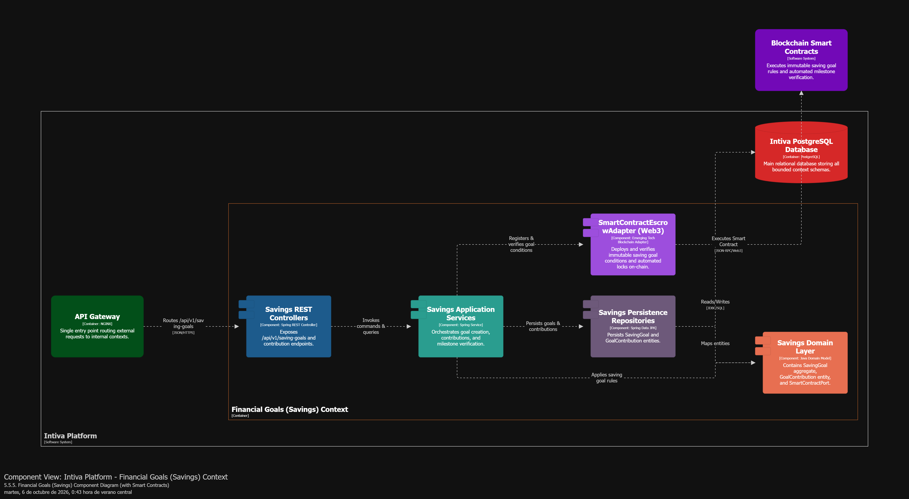

**Explicación del diagrama:**
El componente **`Savings REST Controllers`** recibe las solicitudes HTTP desde el API Gateway y las delega a **`Savings Application Services`**. Esta capa aplica las reglas de negocio sobre los agregados `SavingGoal` y `GoalContribution` definidos en **`Savings Domain Layer`**. Cuando se crea una meta o se registra un nuevo aporte, la capa de aplicación se apoya en **`SmartContractEscrowAdapter (Web3)`** para registrar y verificar de manera inmutable las condiciones del objetivo en **`Blockchain Smart Contracts`**, mientras que **`Savings Persistence Repositories`** almacena el estado relacional en PostgreSQL.

### 5.5.6. Bounded Context Software Architecture Code Level Diagrams

#### 5.5.6.1. Bounded Context Domain Layer Class Diagrams

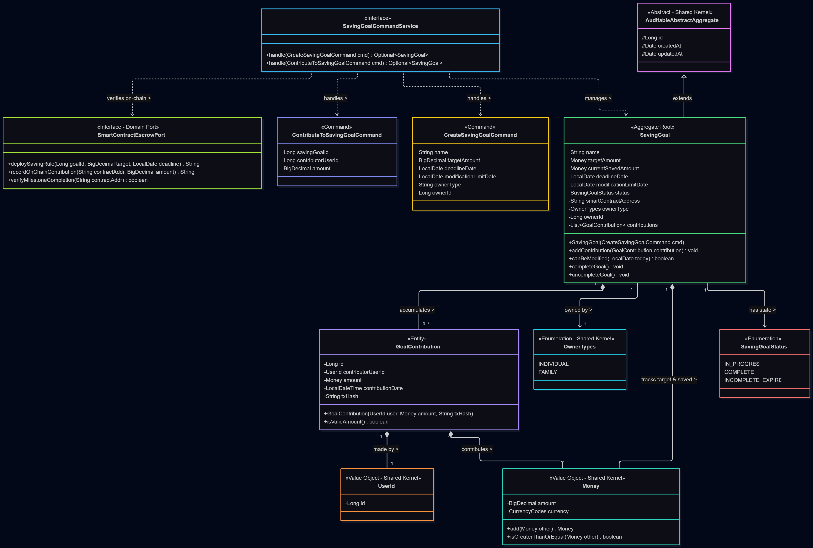

#### 5.5.6.2. Bounded Context Database Design Diagram

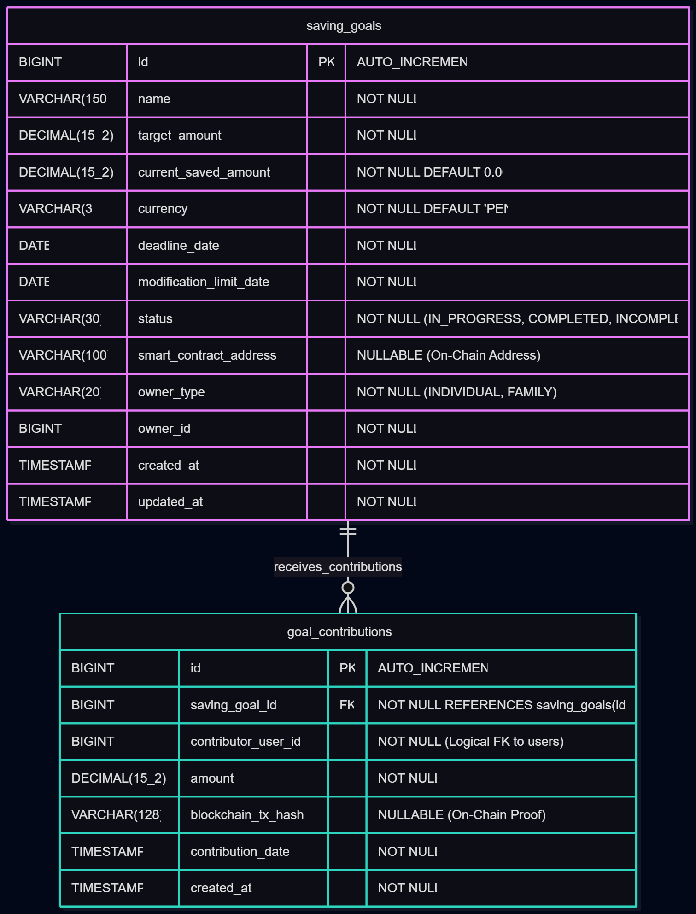

---

## 5.6. Bounded Context: Household

Este contexto modela la colaboración financiera familiar (*Core Subdomain*): gestiona la creación de grupos familiares, la administración de membresías y roles de acceso, y el ciclo de vida de invitaciones mediante enlaces diferidos (*Deferred Deep Links*) y códigos QR. Además, concentra la verificación de pertenencia y rol como servicio consultable según la decisión arquitectónica **AD-04**.

Para el fondo de US 032, Household proporciona la instantánea de miembros activos a Finances. El rol de administrador no permite validar una propuesta sin las aprobaciones de todos. Las firmas de cada miembro se verifican sobre las mismas condiciones (AD-23).

### 5.6.1. Domain Layer

En esta capa se definen los agregados `Family`, `FamilyMember` e `Invitation`, junto con las reglas que garantizan que solo el responsable económico administre el grupo y que las invitaciones no se dupliquen ni se reutilicen una vez expiradas.

| Clase / Interfaz | Categoría Táctica | Propósito | Atributos | Métodos | Relaciones |
| :--- | :--- | :--- | :--- | :--- | :--- |
| **`Family`** | Aggregate Root | Representa un grupo familiar creado para la gestión compartida de ingresos, gastos y metas de ahorro. | `- id: Long`<br>`- name: String`<br>`- adminUserId: UserId`<br>`- active: boolean`<br>`- members: List<FamilyMember>` | `+ Family(CreateFamilyCommand)`<br>`+ addMember(UserId, FamilyRole): FamilyMember`<br>`+ assignMemberRole(UserId, FamilyRole): void`<br>`+ isUserActiveMember(UserId): boolean` | Extiende de `AuditableAbstractAggregate`; contiene una colección de `FamilyMember` (`1..*`) y emite `FamilyCreatedEvent`. |
| **`FamilyMember`** | Entity / Aggregate | Representa la membresía activa de un usuario dentro de un grupo familiar con su rol y permisos asignados. | `- id: Long`<br>`- familyId: Long`<br>`- userId: UserId`<br>`- role: FamilyRole`<br>`- joinedAt: LocalDateTime`<br>`- active: boolean` | `+ updateRole(FamilyRole newRole): void`<br>`+ deactivateMembership(): void`<br>`+ isResponsibleAdmin(): boolean` | Asociado a `Family` (`1`) y tipado con `FamilyRole` (`1`). |
| **`Invitation`** | Aggregate Root | Gestiona el ciclo de vida de una invitación enviada a un familiar, soportando tokens QR y enlaces diferidos. | `- id: Long`<br>`- familyId: Long`<br>`- inviterUserId: UserId`<br>`- inviteeEmail: String`<br>`- token: String`<br>`- deepLink: DeferredDeepLink`<br>`- status: InvitationStatus`<br>`- expiresAt: LocalDateTime` | `+ accept(UserIdaccepterId): void`<br>`+ reject(): void`<br>`+ invalidatePreviousLink(): void`<br>`+ isExpired(LocalDateTime now): boolean` | Extiende de `AuditableAbstractAggregate`; utiliza `DeferredDeepLink`, `InvitationStatus` y emite `FamilyInvitationSentEvent`, `InvitationAcceptedEvent` e `InvitationRejectedEvent`. |
| **`FamilyRole`** | Enumeration | Define los niveles de autoridad dentro de un grupo familiar. | `FAMILY_ECONOMY_RESPONSIBLE`<br>`FAMILY_MEMBER` | `+ valueOf(String): FamilyRole` | Utilizado por `FamilyMember` (`1`). |
| **`InvitationStatus`** | Enumeration | Define los estados válidos de una invitación familiar. | `PENDING`<br>`ACCEPTED`<br>`REJECTED`<br>`EXPIRED`<br>`INVALIDATED` | `+ valueOf(String): InvitationStatus` | Utilizado por `Invitation` (`1`). |
| **`DeferredDeepLink`** | Value Object | Encapsula el enlace diferido y payload QR para invitar a familiares que aún no tienen la aplicación instalada. | `- deepLinkUrl: String`<br>`- qrCodePayload: String` | `+ DeferredDeepLink(String token)` | Composición dentro de `Invitation` (`1`). |
| **`CreateFamilyCommand`** | Command | Solicita crear un grupo familiar asignando al creador como administrador responsable. | `- name: String`<br>`- creatorUserId: Long` | `+ name(): String`<br>`+ creatorUserId(): Long` | Consumido por `FamilyCommandService`. |
| **`SendInvitationCommand`** | Command | Ordena generar y enviar una invitación a un integrante familiar. | `- familyId: Long`<br>`- inviterUserId: Long`<br>`- inviteeEmail: String` | `+ familyId(): Long`<br>`- inviteeEmail(): String` | Consumido por `InvitationCommandService`. |
| **`AcceptInvitationCommand`** | Command | Ordena aceptar una invitación pendiente y vigente para unirse al grupo (US 024). | `- invitationToken: String`<br>`- userId: Long` | `+ invitationToken(): String`<br>`- userId: Long` | Consumido por `InvitationCommandService`. |
| **`ClaimDeferredInviteCommand`** | Command | Permite reclamar una invitación diferida tras instalar la aplicación y registrarse. | `- deepLinkToken: String`<br>`- newUserId: Long` | `+ deepLinkToken(): String` | Consumido por `InvitationCommandService`. |
| **`AssignRoleCommand`** | Command | Ordena cambiar el rol y permisos de un integrante dentro del grupo familiar (US 025). | `- familyId: Long`<br>`- adminUserId: Long`<br>`- targetMemberUserId: Long`<br>`- newRole: String` | `+ targetMemberUserId(): Long`<br>`- newRole(): String` | Consumido por `FamilyCommandService`. |

### 5.6.2. Interface Layer

Expone los controladores REST para administrar familias e invitaciones, así como la fachada pública (`HouseholdContextFacade`) establecida en **AD-04**.

| Clase | Categoría Táctica | Propósito | Atributos | Métodos | Relaciones |
| :--- | :--- | :--- | :--- | :--- | :--- |
| **`FamiliesController`** | REST Controller | Expone `/api/v1/families` para crear grupos familiares, listar integrantes y asignar roles. | `- familyCommandService: FamilyCommandService`<br>`- familyQueryService: FamilyQueryService` | `+ createFamily(CreateFamilyResource): ResponseEntity<FamilyResource>`<br>`+ getMembersByFamily(Long familyId): ResponseEntity<List<FamilyMemberResource>>`<br>`+ assignRole(Long familyId, AssignRoleResource): ResponseEntity<FamilyMemberResource>` | Invoca a `FamilyCommandService` y `FamilyQueryService`. |
| **`InvitationsController`** | REST Controller | Expone `/api/v1/invitations` para generar enlaces/QR de invitación, aceptar, rechazar o reclamar invitaciones diferidas. | `- invitationCommandService: InvitationCommandService`<br>`- invitationQueryService: InvitationQueryService` | `+ sendInvitation(SendInvitationResource): ResponseEntity<InvitationResource>`<br>`+ acceptInvitation(String token): ResponseEntity<Void>`<br>`+ rejectInvitation(String token): ResponseEntity<Void>`<br>`+ claimDeferredInvite(ClaimInviteResource): ResponseEntity<Void>` | Invoca a `InvitationCommandService` y `InvitationQueryService`. |
| **`HouseholdContextFacade`** | Inbound ACL / OHS | Fachada pública (**AD-04**) que expone la consulta de miembros activos de una familia y la validación de pertenencia/rol para otros contextos. | `- familyQueryService: FamilyQueryService` | `+ getActiveFamilyMemberUserIds(Long familyId): List<Long>`<br>`+ isUserMemberOfFamily(Long userId, Long familyId): boolean` | Delega a `FamilyQueryService`. |

### 5.6.3. Application Layer

Orquesta las reglas de membresía familiar, generación e invalidación de enlaces de invitación anteriores y notificación de eventos grupales.

| Clase | Categoría Táctica | Propósito | Atributos | Métodos | Relaciones |
| :--- | :--- | :--- | :--- | :--- | :--- |
| **`FamilyCommandServiceImpl`** | Command Handler | Gestiona la creación de la familia, alta de miembros verificando que no pertenezcan dos veces al mismo grupo (`UserAlreadyMemberException`), y asignación de roles. | `- familyRepository: FamilyRepository`<br>`- memberRepository: FamilyMemberRepository` | `+ handle(CreateFamilyCommand): Optional<Family>`<br>`+ handle(AddFamilyMemberCommand): Optional<FamilyMember>`<br>`+ handle(AssignRoleCommand): Optional<FamilyMember>` | Implementa `FamilyCommandService`; consume `FamilyRepository` y `FamilyMemberRepository`. |
| **`InvitationCommandServiceImpl`** | Command Handler | Crea invitaciones invalidando enlaces previos si se solicita uno nuevo, valida que no existan duplicados pendientes (`InvitationAlreadyPendingException`) ni tokens vencidos (`InvitationExpiredException`), y solicita notificar al invitado y al administrador. | `- invitationRepository: InvitationRepository`<br>`- familyRepository: FamilyRepository`<br>`- externalCommsService: HouseholdExternalCommunicationsService` | `+ handle(SendInvitationCommand): Optional<Invitation>`<br>`+ handle(SendInvitationLinkCommand): Optional<Invitation>`<br>`+ handle(AcceptInvitationCommand): Optional<Invitation>`<br>`+ handle(RejectInvitationCommand): void`<br>`+ handle(ClaimDeferredInviteCommand): Optional<Invitation>` | Implementa `InvitationCommandService`; consume `InvitationRepository` y el servicio ACL saliente. |
| **`FamilyQueryServiceImpl`** | Query Handler | Resuelve las consultas de grupos familiares y listado de integrantes activos (`GetFamilyByIdQuery`, `GetMembersByFamilyIdQuery`). | `- familyRepository: FamilyRepository`<br>`- memberRepository: FamilyMemberRepository` | `+ handle(GetFamilyByIdQuery): Optional<Family>`<br>`+ handle(GetMembersByFamilyIdQuery): List<FamilyMember>` | Implementa `FamilyQueryService`. |

### 5.6.4. Infrastructure Layer

Implementa los repositorios JPA para persistir grupos familiares, integrantes e invitaciones en PostgreSQL.

| Clase / Interfaz | Categoría Táctica | Propósito | Atributos | Métodos | Relaciones |
| :--- | :--- | :--- | :--- | :--- | :--- |
| **`FamilyRepository`** | Repository (JPA) | Persiste y consulta entidades `Family` en la tabla `families` de PostgreSQL. | *(Interface JPA)* | `+ findByAdminUserId(UserId): List<Family>` | Extiende `JpaRepository<Family, Long>`. |
| **`FamilyMemberRepository`** | Repository (JPA) | Persiste y consulta las membresías en la tabla `family_members` de PostgreSQL. | *(Interface JPA)* | `+ findByFamilyIdAndActiveTrue(Long): List<FamilyMember>`<br>`+ existsByFamilyIdAndUserId(Long, UserId): boolean` | Extiende `JpaRepository<FamilyMember, Long>`. |
| **`InvitationRepository`** | Repository (JPA) | Persiste y consulta invitaciones por token o usuario en la tabla `invitations` de PostgreSQL. | *(Interface JPA)* | `+ findByToken(String): Optional<Invitation>`<br>`+ findByInviteeEmailAndStatus(String, InvitationStatus): List<Invitation>` | Extiende `JpaRepository<Invitation, Long>`. |

### 5.6.5. Bounded Context Software Architecture Component Level Diagrams

En esta sección se presenta el diagrama de componentes del contenedor **Household Context**, detallando sus capas internas y su persistencia de datos.

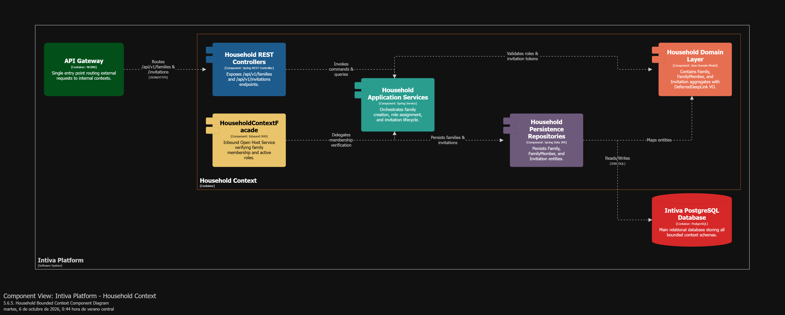

**Explicación del diagrama:**
El componente **`Household REST Controllers`** recibe las solicitudes de gestión familiar e invitaciones desde el API Gateway, mientras que **`HouseholdContextFacade`** atiende las verificaciones internas de membresía y roles (**AD-04**). Ambos delegan la ejecución a **`Household Application Services`**, el cual hace cumplir las invariantes de rol, unicidad de miembro y vigencia de tokens definidas en **`Household Domain Layer`**. La persistencia de familias, integrantes e invitaciones se realiza en PostgreSQL mediante **`Household Persistence Repositories`**.

### 5.6.6. Bounded Context Software Architecture Code Level Diagrams

#### 5.6.6.1. Bounded Context Domain Layer Class Diagrams

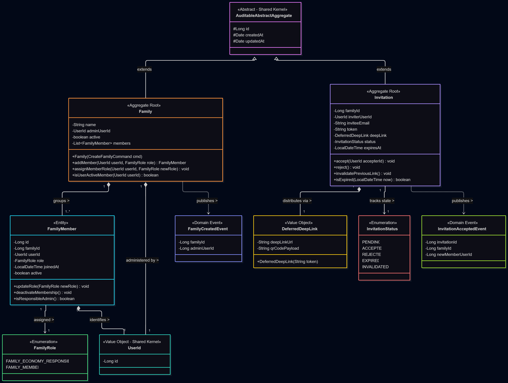

#### 5.6.6.2. Bounded Context Database Design Diagram

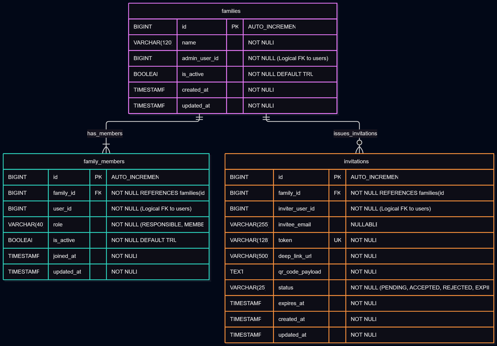

---

## 5.7. Bounded Context: Communications

Communications centraliza las notificaciones in-app y las alertas push de los eventos de negocio. Persiste la alerta y la envía directamente mediante Firebase Cloud Messaging (TS 017). Si el canal push falla, la notificación permanece consultable en la aplicación.

### 5.7.1. Domain Layer

En esta capa se modelan los agregados `Notification` y `NotificationDevice`, los tipos y orígenes de alerta, y los puertos de salida hacia el orquestador de flujos y el proveedor de mensajería móvil.

| Clase / Interfaz | Categoría Táctica | Propósito | Atributos | Métodos | Relaciones |
| :--- | :--- | :--- | :--- | :--- | :--- |
| **`Notification`** | Aggregate Root | Representa una alerta o recordatorio dirigido a un usuario, almacenando su estado de lectura, origen y canal de entrega. | `- id: Long`<br>`- recipientUserId: UserId`<br>`- title: String`<br>`- message: String`<br>`- type: NotificationType`<br>`- source: NotificationSource`<br>`- status: NotificationStatus`<br>`- pushDelivered: boolean` | `+ Notification(CreateInAppNotificationCommand)`<br>`+ markAsRead(): void`<br>`+ markPushDelivered(): void` | Extiende de `AuditableAbstractAggregate`; utiliza `NotificationType`, `NotificationSource` y `NotificationStatus`. |
| **`NotificationDevice`** | Aggregate Root | Representa el dispositivo móvil registrado por un usuario junto con su token FCM para recibir notificaciones *push* (TS 017). | `- id: Long`<br>`- userId: UserId`<br>`- fcmToken: String`<br>`- devicePlatform: String`<br>`- active: boolean` | `+ NotificationDevice(RegisterNotificationDeviceCommand)`<br>`+ deactivateDevice(): void`<br>`+ refreshToken(String newToken): void` | Extiende de `AuditableAbstractAggregate`; contiene `UserId` (Shared Kernel). |
| **`NotificationType`** | Enumeration | Clasifica el propósito de negocio de la alerta generada. | `SPENDING_LIMIT_WARNING`<br>`SPENDING_LIMIT_EXCEEDED`<br>`PAYMENT_DUE_SOON`<br>`PAYMENT_EXPIRED`<br>`FAMILY_TRANSACTION_CREATED`<br>`FAMILY_INVITATION`<br>`SAVING_GOAL_COMPLETED`<br>`SAVING_GOAL_NOT_COMPLETED` | `+ valueOf(String): NotificationType` | Utilizado por `Notification` (`1`). |
| **`NotificationStatus`** | Enumeration | Indica si la notificación in-app ha sido leída por el destinatario. | `UNREAD`<br>`READ` | `+ valueOf(String): NotificationStatus` | Utilizado por `Notification` (`1`). |
| **`CreateInAppNotificationCommand`** | Command | Solicita persistir una nueva notificación dentro de la bandeja del usuario. | `- recipientUserId: Long`<br>`- title: String`<br>`- message: String`<br>`- type: String`<br>`- source: String` | `+ recipientUserId(): Long`<br>`+ type(): String` | Consumido por `NotificationCommandService`. |
| **`SendPushNotificationCommand`** | Command | Ordena despachar una alerta *push* hacia los dispositivos activos del destinatario. | `- recipientUserId: Long`<br>`- title: String`<br>`- rawBody: String`<br>`- type: String` | `+ recipientUserId(): Long` | Consumido por `NotificationCommandService`. |
| **`RegisterNotificationDeviceCommand`** | Command | Solicita asociar un token FCM de dispositivo móvil a la cuenta del usuario. | `- userId: Long`<br>`- fcmToken: String`<br>`- platform: String` | `+ fcmToken(): String` | Consumido por `NotificationDeviceCommandService`. |
| **`DeactivateNotificationDeviceCommand`** | Command | Ordena inhabilitar un token FCM cuando el usuario cierra sesión o cuando Firebase reporta token inválido. | `- fcmToken: String` | `+ fcmToken(): String` | Consumido por `NotificationDeviceCommandService`. |
| **`MarkNotificationAsReadCommand`** | Command | Marca una notificación específica como leída por el usuario. | `- notificationId: Long` | `+ notificationId(): Long` | Consumido por `NotificationCommandService`. |
| **`FirebaseMessagingGatewayPort`** | Domain Port | Contrato del envío push directo a los dispositivos activos. | Interfaz | `sendDirectPush(tokens, title, body)` | Implementado por FirebaseMessagingGatewayAdapter. |

### 5.7.2. Interface Layer

Expone los endpoints REST para consultar la bandeja de notificaciones y registrar tokens de dispositivos, además de la fachada pública consumida por otros contextos.

| Clase | Categoría Táctica | Propósito | Atributos | Métodos | Relaciones |
| :--- | :--- | :--- | :--- | :--- | :--- |
| **`NotificationsController`** | REST Controller | Expone `/api/v1/notifications` para consultar notificaciones totales, no leídas y marcarlas como leídas. | `- notificationCommandService: NotificationCommandService`<br>`- notificationQueryService: NotificationQueryService` | `+ getByRecipient(Long userId): ResponseEntity<List<NotificationResource>>`<br>`+ getUnreadByRecipient(Long userId): ResponseEntity<List<NotificationResource>>`<br>`+ markAsRead(Long id): ResponseEntity<Void>` | Invoca a `NotificationCommandService` y `NotificationQueryService`. |
| **`NotificationDevicesController`** | REST Controller | Expone `/api/v1/devices` para registrar y desactivar tokens FCM desde la aplicación móvil Android. | `- deviceCommandService: NotificationDeviceCommandService`<br>`- deviceQueryService: NotificationDeviceQueryService` | `+ registerDevice(RegisterDeviceResource): ResponseEntity<DeviceResource>`<br>`+ deactivateDevice(String token): ResponseEntity<Void>` | Invoca a `NotificationDeviceCommandService` y `NotificationDeviceQueryService`. |
| **`CommunicationsContextFacade`** | Inbound ACL / OHS | Fachada pública que permite a otros contextos solicitar de forma explícita la emisión de alertas de negocio. | `- notificationCommandService: NotificationCommandService` | `+ sendAlertNotification(Long userId, String title, String message, String type): void` | Delega a `NotificationCommandService`. |

### 5.7.3. Application Layer

Persiste la alerta, comprueba los dispositivos activos y solicita el envío directo mediante FCM. Una falla del proveedor no elimina la notificación de la bandeja.

| Clase | Categoría Táctica | Propósito | Atributos | Métodos | Relaciones |
| :--- | :--- | :--- | :--- | :--- | :--- |
| **`NotificationCommandServiceImpl`** | Command Handler | Persiste la alerta, obtiene tokens activos y utiliza FCM directamente (TS 017). | `notificationRepository`, `deviceRepository`, `fcmGatewayPort` | `handle(CreateInAppNotificationCommand)`, `handle(SendPushNotificationCommand)`, `handle(MarkNotificationAsReadCommand)` | El fallo push conserva la bandeja y no propaga excepciones del proveedor. |
| **`NotificationDeviceCommandServiceImpl`** | Command Handler | Registra los tokens FCM de los dispositivos móviles e invalida automáticamente aquellos tokens que Firebase reporta como expirados o no registrados (TS 017). | `- deviceRepository: NotificationDeviceRepository` | `+ handle(RegisterNotificationDeviceCommand): Optional<NotificationDevice>`<br>`+ handle(DeactivateNotificationDeviceCommand): void` | Implementa `NotificationDeviceCommandService`. |
| **`DomainEventsNotificationListener`** | Event Handler | Escucha eventos de dominio (transacciones familiares, pagos próximos a vencer/vencidos e invitaciones) y dispara la creación y envío de las notificaciones correspondientes. | `- notificationCommandService: NotificationCommandService`<br>`- externalHouseholdService: CommunicationsExternalHouseholdService` | `+ onFamilyTransaction(FamilyTransactionCreatedEvent): void`<br>`+ onPaymentDueSoon(PaymentDueSoonEvent): void`<br>`+ onPaymentExpired(PaymentExpiredEvent): void` | Invoca a `NotificationCommandService` y consulta miembros activos de la familia. |

### 5.7.4. Infrastructure Layer

Contiene repositorios JPA y el adaptador Firebase Cloud Messaging, con su stub para desarrollo.

| Clase / Interfaz | Categoría Táctica | Propósito | Atributos | Métodos | Relaciones |
| :--- | :--- | :--- | :--- | :--- | :--- |
| **`NotificationRepository`** | Repository (JPA) | Persiste las notificaciones en la tabla `notifications` de PostgreSQL. | *(Interface JPA)* | `+ findByRecipientUserIdOrderByCreatedAtDesc(UserId): List<Notification>`<br>`+ findByRecipientUserIdAndStatus(UserId, NotificationStatus): List<Notification>` | Extiende `JpaRepository<Notification, Long>`. |
| **`NotificationDeviceRepository`** | Repository (JPA) | Persiste los dispositivos y tokens FCM en la tabla `notification_devices` de PostgreSQL. | *(Interface JPA)* | `+ findByUserIdAndActiveTrue(UserId): List<NotificationDevice>`<br>`+ findByFcmToken(String): Optional<NotificationDevice>` | Extiende `JpaRepository<NotificationDevice, Long>`. |

| **`FirebaseMessagingGatewayAdapter`** | External Service Adapter | Envía alertas por el SDK de FCM y devuelve tokens inválidos para desactivarlos. | `firebaseMessaging` | `sendDirectPush(tokens, title, body)` | Implementa FirebaseMessagingGatewayPort; incluye DevFirebaseMessagingGatewayStub. |

### 5.7.5. Bounded Context Software Architecture Component Level Diagrams

El diagrama muestra la persistencia in-app y el canal push directo Firebase Cloud Messaging.

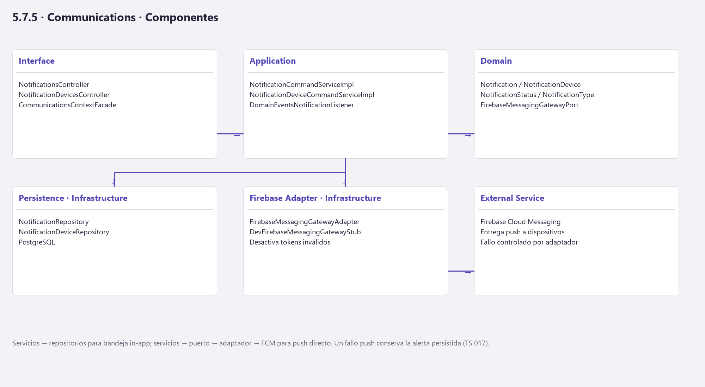

**Explicación del diagrama:**
Los controladores y la fachada interna delegan en Communications Application Services. El servicio construye y persiste Notification mediante los repositorios JPA, obtiene los tokens activos y utiliza FirebaseMessagingGatewayAdapter para enviar la alerta directamente a FCM. Si el envío falla, conserva la alerta in-app y registra el resultado controlado; los tokens inválidos se desactivan.

### 5.7.6. Bounded Context Software Architecture Code Level Diagrams

#### 5.7.6.1. Bounded Context Domain Layer Class Diagrams

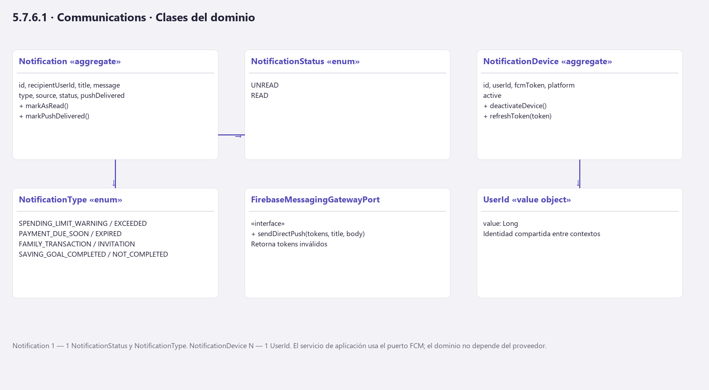

#### 5.7.6.2. Bounded Context Database Design Diagram

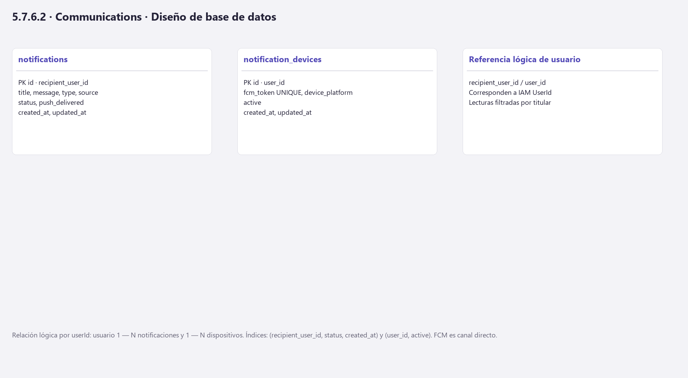

---

## 5.8. Bounded Context: Analytics

Este contexto actúa como el motor de lectura y reportes (*Supporting Subdomain*) de la plataforma: transforma los datos de transacciones, límites de gasto y metas de ahorro en métricas agregadas, rankings de categorías, tendencias y reportes descargables para el *dashboard* de la aplicación web. Implementa una estrategia de caché *cache-aside* sobre **Redis** con tiempo de vida acotado (TTL) según la decisión arquitectónica **AD-11**.

### 5.8.1. Domain Layer

En esta capa se modelan los objetos de resumen analítico (`AnalyticsSummary`, `SpendingLimitAnalytics`, `SavingGoalAnalytics`, `CategoryExpenseSummary`), los filtros de periodo/formato y el puerto de caché en memoria.

| Clase / Interfaz | Categoría Táctica | Propósito | Atributos | Métodos | Relaciones |
| :--- | :--- | :--- | :--- | :--- | :--- |
| **`AnalyticsSummary`** | Aggregate Root (Read Model) | Consolida las métricas de ingresos totales, gastos totales, ahorro neto, distribución por categorías y evolución temporal para un titular y periodo determinados. | `- id: String`<br>`- ownerType: OwnerTypes`<br>`- ownerId: Long`<br>`- period: AnalyticsPeriod`<br>`- totalIncome: Money`<br>`- totalExpense: Money`<br>`- netSavings: Money`<br>`- categoryRankings: List<CategoryExpenseSummary>`<br>`- limitAnalytics: List<SpendingLimitAnalytics>`<br>`- goalAnalytics: List<SavingGoalAnalytics>`<br>`- calculatedAt: Instant` | `+ calculateNetBalance(): Money`<br>`+ getTopExpenseCategories(int limit): List<CategoryExpenseSummary>` | Compuesto por `AnalyticsPeriod`, `CategoryExpenseSummary`, `SpendingLimitAnalytics` y `SavingGoalAnalytics`. |
| **`CategoryExpenseSummary`** | Value Object | Representa el monto total y porcentaje de gasto acumulado en una categoría específica junto con su nombre, color e ícono para los gráficos. | `- categoryId: Long`<br>`- categoryName: String`<br>`- color: String`<br>`- icon: String`<br>`- totalAmount: Money`<br>`- percentageOfTotal: double` | `+ CategoryExpenseSummary(...)` | Composición dentro de `AnalyticsSummary` (`0..*`). |
| **`SpendingLimitAnalytics`** | Value Object | Resume el nivel de consumo porcentual y saldo disponible de cada límite de presupuesto en el periodo analizado. | `- limitId: Long`<br>`- limitAmount: Money`<br>`- usedAmount: Money`<br>`- consumptionPercentage: double` | `+ isOverBudget(): boolean` | Composición dentro de `AnalyticsSummary` (`0..*`). |
| **`SavingGoalAnalytics`** | Value Object | Resume el porcentaje de avance y monto restante de las metas de ahorro para el *dashboard*. | `- goalId: Long`<br>`- goalName: String`<br>`- targetAmount: Money`<br>`- savedAmount: Money`<br>`- progressPercentage: double` | `+ remainingAmount(): Money` | Composición dentro de `AnalyticsSummary` (`0..*`). |
| **`AnalyticsPeriod`** | Enumeration / Value Object | Define la ventana temporal de agregación de los datos financieros. | `DAILY`<br>`WEEKLY`<br>`MONTHLY`<br>`ANNUAL` | `+ getDateRange(LocalDate ref): Pair<LocalDate, LocalDate>` | Utilizado por `AnalyticsSummary` y consultas de analítica. |
| **`GenerateReportCommand`** | Command | Solicita generar y exportar un reporte estadístico respetando el formato (`ReportFormat`) y filtro (`ReportFilter`) elegidos por el usuario (US 031). | `- ownerType: String`<br>`- ownerId: Long`<br>`- period: String`<br>`- reportFormat: String` | `+ reportFormat(): String` | Consumido por `AnalyticsCommandService`. |
| **`GetAnalyticsSummaryByOwnerQuery`** | Query | Solicita el resumen financiero integral para poblar el *dashboard* web de un individuo o grupo familiar. | `- ownerType: String`<br>`- ownerId: Long`<br>`- period: String` | `+ buildCacheKey(): String` | Consumido por `AnalyticsQueryService`. |
| **`GetCategoryExpenseRankingQuery`** | Query | Solicita el ranking ordenado de categorías con mayor gasto en el periodo. | `- ownerType: String`<br>`- ownerId: Long`<br>`- period: String` | `+ ownerId(): Long` | Consumido por `AnalyticsQueryService`. |
| **`GetIncomeVsExpenseTrendQuery`** | Query | Solicita la serie comparativa de ingresos versus egresos entre periodos. | `- ownerType: String`<br>`- ownerId: Long`<br>`- period: String` | `+ period(): String` | Consumido por `AnalyticsQueryService`. |
| **`AnalyticsCachePort`** | Domain Port (Interface) | Define el contrato de acceso a la caché para recuperar o almacenar resúmenes precalculados con TTL (**AD-11**). | *(Interface)* | `+ getSummary(String key): Optional<AnalyticsSummary>`<br>`+ putSummary(String key, AnalyticsSummary summary, Duration ttl): void` | Implementado en infraestructura por `AnalyticsRedisCacheAdapter`. |

| **`FinancialAdvice`** | Value Object | Orientación IA sobre gastos hormiga y metas, sin ejecutar cambios (US 034). | `period`, `observations`, `referencedMovementIds`, `limitations`, `status` | `hasSufficientData()` | No modifica Transaction ni SavingGoal. |
| **`FinancialAssistantPort`** | Domain Port | Solicita orientación a partir de datos mínimos autorizados. | Interfaz | `analyze(authorizedSummary): FinancialAdvice` | Implementado por AiFinancialAssistantAdapter. |

### 5.8.2. Interface Layer

Expone los endpoints REST consumidos exclusivamente por la aplicación web en Vue.js para renderizar los gráficos estadísticos y descargar reportes.

| Clase | Categoría Táctica | Propósito | Atributos | Métodos | Relaciones |
| :--- | :--- | :--- | :--- | :--- | :--- |
| **`AnalyticsController`** | REST Controller | Expone los endpoints bajo `/api/v1/analytics` para consultar el resumen general del *dashboard*, métricas de límites, progreso de metas, ranking por categorías y exportación de reportes. | `- analyticsQueryService: AnalyticsQueryService`<br>`- analyticsCommandService: AnalyticsCommandService` | `+ getSummaryByOwner(String ownerType, Long ownerId, String period): ResponseEntity<AnalyticsSummaryResource>`<br>`+ getCategoryRanking(...): ResponseEntity<List<CategoryExpenseResource>>`<br>`+ exportReport(GenerateReportResource): ResponseEntity<byte[]>` | Invoca a `AnalyticsQueryService` y `AnalyticsCommandService`. |
| **`AnalyticsSummaryResourceFromEntityAssembler`** | Assembler | Transforma el modelo `AnalyticsSummary` en un DTO estructurado para las librerías de gráficos del frontend web. | *(Clase utilitaria estática)* | `+ toResourceFromEntity(AnalyticsSummary): AnalyticsSummaryResource` | Utilizado por `AnalyticsController`. |

| **`FinancialAssistantController`** | REST Controller | Consulta orientación para el titular autenticado y período elegido. | `assistantService` | `analyze(period)` | Devuelve datos insuficientes o fallo sin inventar recomendaciones. |

### 5.8.3. Application Layer

Implementa la estrategia **cache-aside** sobre Redis (**AD-11**, **QAS-05**): verifica primero si existe un resumen vigente en memoria y, solo en caso de *cache miss*, reúne la información transaccional, calcula las agregaciones y almacena el resultado con TTL.

| Clase | Categoría Táctica | Propósito | Atributos | Métodos | Relaciones |
| :--- | :--- | :--- | :--- | :--- | :--- |
| **`AnalyticsQueryServiceImpl`** | Query Handler | Resuelve `GetAnalyticsSummaryByOwnerQuery`, `GetSpendingLimitAnalyticsByOwnerQuery`, `GetSavingGoalAnalyticsByOwnerQuery`, `GetCategoryExpenseRankingQuery` y `GetIncomeVsExpenseTrendQuery` consultando primero `AnalyticsCachePort` (Redis) y recalculando bajo demanda si la entrada expiró. | `- cachePort: AnalyticsCachePort`<br>`- externalDataService: AnalyticsExternalTransactionService`<br>`- externalCategoriesService: AnalyticsExternalCategoriesService` | `+ handle(GetAnalyticsSummaryByOwnerQuery): Optional<AnalyticsSummary>`<br>`+ handle(GetCategoryExpenseRankingQuery): List<CategoryExpenseSummary>`<br>`+ handle(GetIncomeVsExpenseTrendQuery): TrendData` | Implementa `AnalyticsQueryService`; coordina `AnalyticsCachePort` y los servicios de lectura de datos. |
| **`AnalyticsCommandServiceImpl`** | Command Handler | Genera los archivos de reporte exportables según el formato y filtros solicitados por el usuario. | `- analyticsQueryService: AnalyticsQueryService` | `+ handle(GenerateReportCommand): byte[]` | Implementa `AnalyticsCommandService`. |
| **`AnalyticsExternalTransactionService`** | Data Aggregation Service | Recupera los registros de transacciones, límites de gasto y metas de ahorro del titular para el cálculo del periodo (documentado en **DT-01** como lectura directa a repositorios dentro del monolito modular). | `- transactionRepository: TransactionRepository`<br>`- spendingLimitRepository: SpendingLimitRepository`<br>`- savingGoalRepository: SavingGoalRepository` | `+ fetchTransactionsForPeriod(...): List<Transaction>`<br>`+ fetchLimitsForOwner(...): List<SpendingLimit>`<br>`+ fetchGoalsForOwner(...): List<SavingGoal>` | Lee los repositorios de persistencia en PostgreSQL. |

| **`FinancialAssistantService`** | Application Service | Autoriza el acceso, construye resumen mínimo y valida referencias y respuesta IA. | `analyticsService`, `savingsFacade`, `assistantPort` | `analyze(ownerId, period)` | Entrega orientación revisable; nunca ejecuta gastos ni modifica metas. |

### 5.8.4. Infrastructure Layer

Contiene el adaptador de caché conectado a **Redis Cloud** mediante TLS y el acceso de lectura a la base de datos PostgreSQL.

| Clase / Interfaz | Categoría Táctica | Propósito | Atributos | Métodos | Relaciones |
| :--- | :--- | :--- | :--- | :--- | :--- |
| **`AnalyticsRedisCacheAdapter`** | Cache Adapter | Implementa `AnalyticsCachePort` serializando en JSON los objetos `AnalyticsSummary` dentro de Redis Cloud con un TTL definido para garantizar tiempos de respuesta menores a 2 segundos (TS 010, TS 014). | `- redisTemplate: RedisTemplate<String, String>`<br>`- objectMapper: ObjectMapper`<br>`- defaultTtlMinutes: long` | `+ getSummary(String key): Optional<AnalyticsSummary>`<br>`+ putSummary(String key, AnalyticsSummary summary, Duration ttl): void` | Implementa `AnalyticsCachePort`; se conecta a `Intiva Redis Database`. |
| **`AnalyticsReadRepositories`** | Read Repository (JPA) | Provee las consultas de solo lectura sobre las tablas relacionales de transacciones, límites y metas en PostgreSQL. | *(Interfaces JPA de lectura)* | `+ findTransactionsByOwnerAndDateBetween(...): List<Transaction>` | Se conecta a `Intiva PostgreSQL Database`. |

| **`AiFinancialAssistantAdapter`** | External Service Adapter | Integración con proveedor IA aislado; errores y timeout controlados (AD-21, TS 024). | `providerClient`, `timeout`, `responseValidator` | `analyze(authorizedSummary)` | Implementa FinancialAssistantPort; proveedor pendiente de comparación. |

### 5.8.5. Bounded Context Software Architecture Component Level Diagrams

En esta sección se presenta el diagrama de componentes del contenedor **Analytics Context**, reflejando el flujo *cache-aside* con Redis y las lecturas de agregación en PostgreSQL.

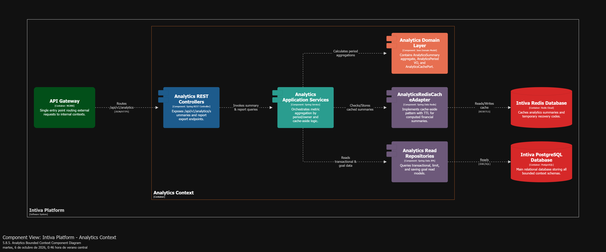

**Explicación del diagrama:**
Cuando el usuario abre el *dashboard* en la aplicación web, el API Gateway enruta la petición hacia **`Analytics REST Controllers`**, el cual invoca a **`Analytics Application Services`**. Siguiendo el patrón *cache-aside* (**AD-11**), el servicio consulta primero a **`AnalyticsRedisCacheAdapter`** para verificar si existe un resumen vigente en **`Intiva Redis Database`**. Si no está disponible o ha expirado, extrae los registros necesarios a través de **`Analytics Read Repositories`** desde **`Intiva PostgreSQL Database`**, calcula las métricas apoyándose en **`Analytics Domain Layer`**, guarda el nuevo resumen con TTL en Redis y devuelve la respuesta para renderizar los gráficos.

**Extensión IA del asistente financiero (US 034)**

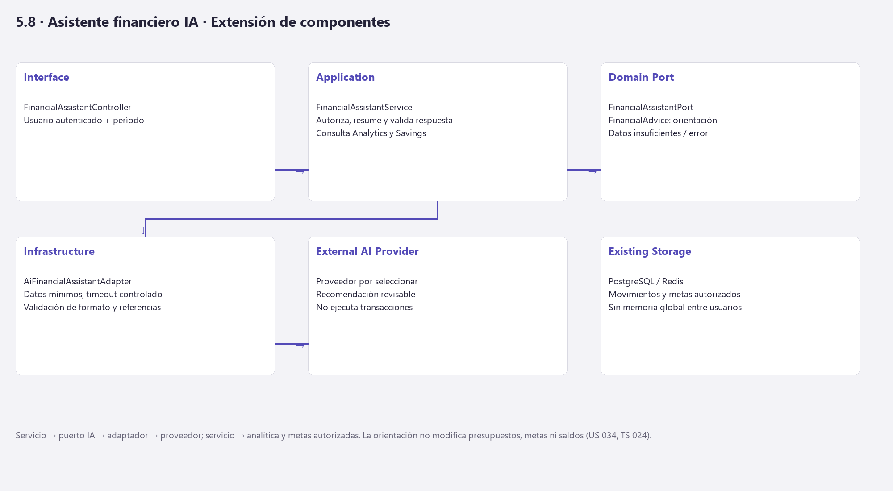

El diseño base de analítica se complementa con FinancialAssistantController, FinancialAssistantService y AiFinancialAssistantAdapter. La respuesta conserva período, movimientos de referencia y limitaciones, y no ejecuta cambios en las metas. FinancialAdvice es un objeto de respuesta, por lo que no requiere una tabla nueva para conservar conversaciones.

### 5.8.6. Bounded Context Software Architecture Code Level Diagrams

#### 5.8.6.1. Bounded Context Domain Layer Class Diagrams

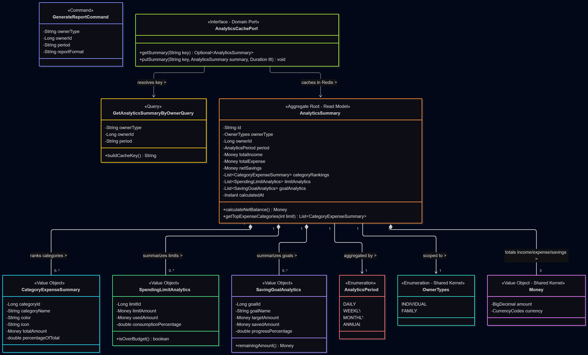

#### 5.8.6.2. Bounded Context Database Design Diagram

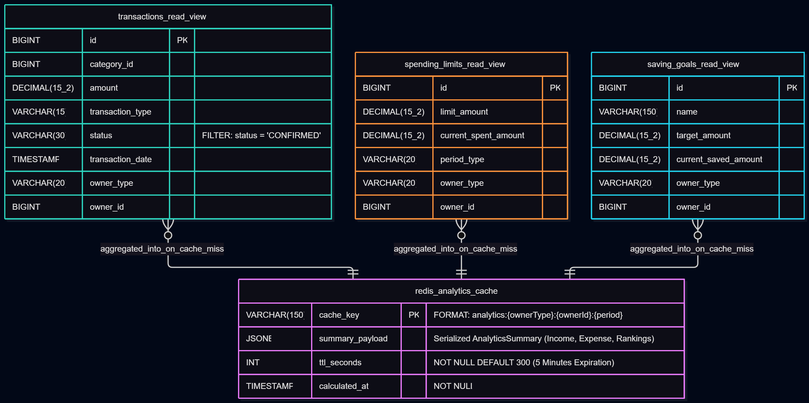


# Capítulo VI: Solution UX Design

En este capítulo se desarrolla el diseño de la solución planteada para Intiva, la propuesta de Balanza para la gestión de ingresos, gastos y ahorros personales y familiares. Para ello, se definen las guías de estilo y la arquitectura de información que se seguirán en la landing page, la aplicación móvil y la aplicación web, para que el diseño sea coherente y fácil de usar para nuestros segmentos objetivo.

## 6.1. Style Guidelines

En esta sección se explican las guías de estilo para la landing page, la aplicación móvil y la aplicación web. Con ellas buscamos que los tres productos se vean coherentes entre sí y que los usuarios reconozcan el estilo de Intiva.

### 6.1.1. General Style Guidelines

**Branding**

*Brand Overview*

Intiva es una plataforma digital que ayudará a las personas y a las familias a registrar sus ingresos y gastos, controlar su presupuesto mediante límites de gasto y planificar metas de ahorro de forma individual o compartida. Nace de una problemática identificada en las entrevistas: la mayoría de usuarios lleva sus finanzas en hojas de Excel, notas del celular o revisando manualmente sus billeteras digitales (Yape, Plin, apps bancarias), lo que vuelve el registro tedioso y deja la información fragmentada entre los integrantes del hogar. Intiva busca centralizar esa información, presentarla de forma visual y acompañar al usuario con alertas y recordatorios para que tome mejores decisiones financieras. La IA sugerirá categorías a partir de la descripción ingresada y ofrecerá orientación sobre gastos hormiga y metas. El usuario revisará cada sugerencia antes de guardar o tomar una decisión. Los fondos familiares requerirán aprobación de todos sus miembros mediante smart contracts. Su eslogan, "Controla tus finanzas, transforma tu vida", resume esa promesa, y en la landing page se comunica con el mensaje "Menos registro, más control en familia".

*Brand Name*

El nombre "Intiva" se relaciona con la idea de manejar las finanzas de forma intuitiva, ya que buscamos que ahorrar y organizar las finanzas sea algo sencillo e intuitivo para cualquier persona, sin necesidad de conocimientos financieros previos. Por eso, el nombre representa una herramienta cercana que ayuda a controlar los gastos y alcanzar metas de ahorro. Además, es un nombre corto, moderno y fácil de recordar y de pronunciar tanto en español como en inglés, lo que permitirá usarlo sin cambios en las dos versiones de idioma de la landing page y como nombre de la aplicación en Google Play.

*Logo*

A continuación, se muestra el logo diseñado para Intiva:

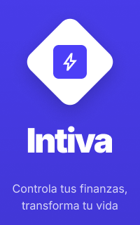

*Logo de Intiva. Fuente: elaboración propia.*

El logo de Intiva está compuesto por un isotipo y un logotipo. El isotipo es un rombo blanco de esquinas redondeadas que contiene un cuadrado índigo con un rayo, símbolo que representa la energía y la rapidez con la que la aplicación permitirá tomar el control del dinero: el registro y la consulta del presupuesto son tareas principales del producto. El tiempo de ejecución se evaluará mediante las pruebas de usabilidad definidas en QAS-01. El logotipo "Intiva" se escribe en una tipografía sans-serif de trazo grueso, que transmite solidez y confianza. Se presenta sobre el color índigo principal de la marca y se acompaña del eslogan. En espacios reducidos, como el favicon, la barra de navegación de la landing page o la barra lateral de la aplicación web, se usará una versión simplificada: un cuadrado índigo con la inicial de la marca.

**Typography**

Para la tipografía escogimos fuentes de Google Fonts, cada una para un tipo de texto distinto. Así es más fácil distinguir qué es más importante en cada pantalla.

Para los títulos y encabezados de la aplicación móvil y de la aplicación web usaremos Manrope (Headline). Es una fuente moderna y algo compacta, por lo que los títulos se ven bien sin ocupar mucho espacio en pantallas pequeñas.

En la landing page, los títulos usarán Plus Jakarta Sans. Tiene trazos más gruesos en sus pesos altos, por lo que funciona bien en titulares grandes, que son lo primero que ve un visitante.

Para los textos de cuerpo, descripciones, formularios y botones usaremos Inter (Body) en los tres productos. Esta fuente fue creada para pantallas y se lee bien incluso en tamaños pequeños, lo que ayuda en las listas de movimientos y en los mensajes de alerta.

Para las etiquetas y los montos de dinero usaremos Space Grotesk (Label). Escogimos una fuente aparte para los números porque los montos son el dato más importante en una aplicación de finanzas y queremos que el usuario los encuentre rápido.

| Estilo | Fuente | Uso | Tamaño (web / app) | Peso |
| --- | --- | --- | --- | --- |
| Display | Plus Jakarta Sans (landing) / Manrope (app y web) | Titular principal de la landing y saldo total | 64 px / 32 sp | ExtraBold / Bold |
| Headline | Plus Jakarta Sans (landing) / Manrope (app y web) | Títulos de sección y de pantalla | 36 a 48 px / 24 sp | Bold |
| Title | Manrope | Títulos de tarjetas y subsecciones | 20 a 24 px / 18 sp | Bold |
| Body | Inter | Textos descriptivos y contenido de formularios | 16 a 18 px / 16 sp | Regular |
| Body small | Inter | Textos secundarios, fechas y ayudas | 14 px / 12 a 13 sp | Regular |
| Button | Inter | Botones y llamadas a la acción | 16 px / 14 sp | SemiBold |
| Label | Space Grotesk | Etiquetas, chips y navegación | 12 a 14 px / 10 a 12 sp | Medium |
| Amount | Space Grotesk | Montos de dinero | 16 a 28 px / 16 a 28 sp | Medium / Bold |

**Colors**

Para escoger los colores pensamos en cómo queremos que se sientan los usuarios, ya que en las entrevistas muchos dijeron que manejar su dinero les genera estrés. Armamos la paleta con el sistema de color de Material Design 3, a partir de cuatro colores base.

El color primario es un índigo (`#534AB7`). Transmite confianza y seriedad, algo necesario en una aplicación que maneja el dinero de las familias, pero se ve más moderno y cercano que el azul que suelen usar los bancos. Lo usaremos en los botones principales, en la opción activa de la navegación y en la tarjeta de saldo.

El color secundario es un verde lima (`#CDEB45`), que se asocia con energía y crecimiento. Como contrasta mucho con el índigo, llama la atención, así que lo usaremos en las llamadas a la acción, en los botones de registro y en el progreso de las metas de ahorro. Sus tonos más oscuros (como `#556500`) servirán para mostrar los ingresos.

El color terciario es un tono cobrizo (`#8A4900`). Lo usaremos como acento en acciones de edición y en algunas categorías, para diferenciar elementos sin quitarle protagonismo a los colores principales.

El color neutro es un gris con un ligero tono violeta (`#78767E`). Con su escala de tonos lo usaremos en fondos, bordes y textos secundarios, y combina bien con el índigo.

Además, usaremos un rojo (`#BA1A1A`) para los gastos, los límites superados y la acción de eliminar. Cada color tiene una escala de tonos, de oscuro a claro, que nos permite crear fondos suaves, estados de botones y un modo oscuro. El contraste debe comprobarse para cada combinación de texto, fondo y estado; la existencia de una escala de tonos no garantiza por sí sola su legibilidad.

A continuación se presenta la guía de estilo de Intiva, que reúne la paleta de colores, las tipografías y algunos componentes base (botones, buscador, barras de progreso, barra de navegación y botones de íconos):

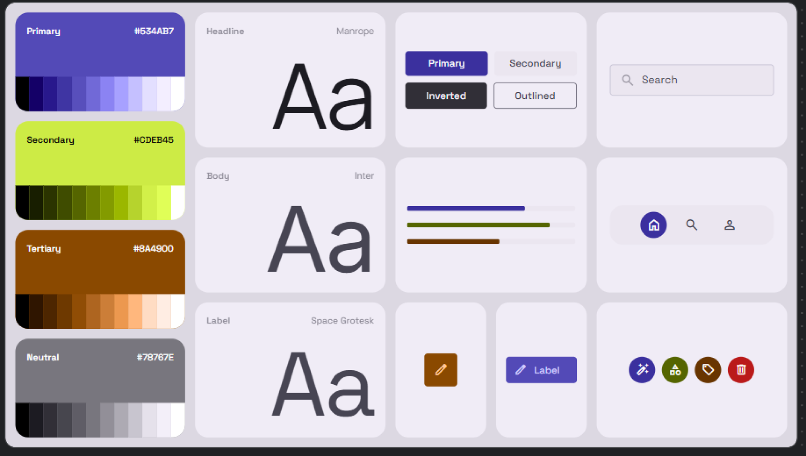

*Guía de estilo de Intiva: paleta de colores, tipografías y componentes base. Fuente: elaboración propia en Figma.*

También usaremos colores para indicar el estado de las finanzas, de modo que el usuario lo entienda sin leer el detalle: verde cuando un límite de gasto va bien, ámbar cuando está cerca de alcanzarse y rojo cuando se supera. Las propuestas del fondo pendientes de aprobación se mostrarán en tonos neutros para diferenciarlas de los gastos validados. Para no depender solo del color, cada estado irá acompañado de un texto, y los montos se mostrarán con signo ("+" para ingresos y "−" para gastos).

**Spacing**

El espaciado se basará en múltiplos de 4 y 8 para que la información se vea ordenada. Los valores cambian según el producto:

Para Landing Page y aplicación web:
- Button padding:
    - Vertical: 16px
    - Horizontal: 32px
- Input fields:
    - Altura: 48px
    - Espacio entre campos: 16px
- Ancho máximo del contenido: 1280px
- Margen lateral: 24px (móvil) a 32px (escritorio)
- Margin entre secciones de la landing: 96px (móvil) a 128px (escritorio)
- Espacio entre título y subtítulo de sección: 24px
- Espacio entre tarjetas del panel web: 24px

Para Android:
- Button padding:
    - Vertical: 12dp
    - Horizontal: 16dp
- Botón principal de pantalla completa: 56dp de altura
- Input fields:
    - Altura: 56dp
    - Espacio entre campos: 16dp
- Margin lateral de pantalla: 20dp
- Margin entre secciones:
    - Principales: 24dp
    - Internas: 16dp
- Spacing entre textos:
    - Título y subtítulo: 4dp
    - Párrafos: 12dp
- Área táctil mínima: 48dp

**Shapes**

Usaremos esquinas redondeadas para que la interfaz se vea amigable: 8 para inputs y botones pequeños, 12 para tarjetas y chips, 16 para tarjetas destacadas y paneles inferiores, y forma de píldora o círculo para botones de la landing page, avatares, filtros y el botón flotante.

**Tone of voice**

Usaremos un tono cercano y sencillo. En las entrevistas vimos que los términos financieros técnicos confunden a los usuarios, por lo que evitaremos la jerga y trataremos al usuario de "tú" (por ejemplo, "Aquí está el resumen de tus finanzas hoy"). Cuando el usuario logre algo, se lo haremos saber ("¡Cumpliste tu meta de ahorro!"), y las alertas solo informarán lo que pasó, sin regañar ("Has superado tu presupuesto en Entretenimiento"), junto con una opción para resolverlo. Al hablar de la aprobación del fondo y de la IA seremos claros sobre lo que hacen y lo que no: por ejemplo, "Este gasto todavía no modifica tu saldo" o "La categoría es una sugerencia; puedes cambiarla". Queremos que el usuario sienta que Intiva lo ayuda con sus gastos, que no lo juzga y que él mantiene el control de su información.

### 6.1.2. Web, Mobile & Devices Style Guidelines

Intiva contempla una landing informativa, una aplicación móvil Android para el registro diario y una aplicación web para consultar gráficos y reportes. Las entrevistas mencionan el uso de celulares y computadoras. La elección de Android también responde a TS 007 y al acceso a notificaciones requerido por TS 023; no se fundamenta en porcentajes de dispositivos cuya base de cálculo aún no está documentada.

**Landing Page**

- Diseño responsive con enfoque *mobile first*, para permitir el acceso desde el celular, por ejemplo al compartir el enlace por WhatsApp.
- Puntos de quiebre: móvil (< 768 px), tablet (768 a 1023 px) y escritorio (≥ 1024 px). En móvil, el contenido pasará a una sola columna y el menú superior se convertirá en un menú hamburguesa.
- Usará fondos claros con acentos índigo, y el botón principal será de color Secondary (lima) para que destaque; el botón secundario será transparente con borde.
- Estará disponible en español e inglés, con un selector de idioma en la barra de navegación.
- Todos los elementos interactivos tendrán un contorno visible al recibir foco con el teclado, y las imágenes tendrán texto alternativo.

**Aplicación móvil (Android)**

- Seguirá los lineamientos de Material Design 3, para que la aplicación se sienta natural para los usuarios de Android, utilizando sus componentes: barra superior, barra de navegación inferior, botón flotante, chips, paneles inferiores (*bottom sheets*) y diálogos.
- Las dimensiones se definirán en `dp` y los textos en `sp`, para respetar el tamaño de letra configurado por el usuario en su teléfono.
- Se diseñará sobre un ancho de referencia de 360 a 390 dp, como referencia de diseño adaptable; la distribución se verificará en distintos tamaños de pantalla.
- Los botones de acción principal ocuparán todo el ancho de la pantalla y estarán en la parte inferior, para alcanzarlos fácilmente con el pulgar.
- Para registrar montos se usará un teclado numérico propio con dígitos grandes, evitando abrir el teclado del sistema.
- La solicitud de categorización con IA explicará qué datos del formulario se usarán y ofrecerá selección manual. La aprobación del fondo mostrará las condiciones antes de que cada miembro firme.
- Se usarán los íconos de Material Symbols, con un ícono propio por cada categoría de gasto (por ejemplo, un carrito para supermercado o cubiertos para alimentación).

**Aplicación web**

- Estará pensada para laptops y computadoras de escritorio, con una barra lateral fija de navegación y un área de contenido organizada en tarjetas y gráficos.
- En pantallas menores a 768 px, la barra lateral se reemplazará por una barra de navegación inferior con íconos.
- Usará las mismas fuentes y colores de la aplicación móvil, para que el usuario reconozca la información al pasar de un dispositivo a otro. Los gráficos usarán el índigo y el lima como colores principales de sus series.
- Contará con modo claro y modo oscuro, y permitirá cambiar el idioma entre español e inglés.
- Se usarán los íconos de PrimeIcons, que acompañan a la librería de componentes PrimeVue.

## 6.2. Information Architecture

En esta parte del informe se presenta la arquitectura de información planeada para los productos de Intiva (landing page, aplicación móvil y aplicación web): la organización de la información, las etiquetas, el sistema de búsqueda, los meta tags y la forma de navegación. Con esto buscamos que la interfaz sea fácil de entender para nuestros segmentos objetivo.

### 6.2.1. Organization Systems

**Organización visual (jerárquica)**

Se utilizará una jerarquía visual para que el usuario siga el contenido en orden de importancia. Para ello, se usarán distintos tamaños y pesos de texto, de modo que los títulos y los montos sean lo primero que se lea, y las descripciones y fechas queden en un segundo plano. Por ejemplo, en la pantalla de inicio de la aplicación móvil se mostrará primero el saldo total, luego el estado del presupuesto y, finalmente, los movimientos recientes. En el panel de la aplicación web, los indicadores principales (balance total, ingresos, gastos y ahorro del mes) aparecerán arriba y los gráficos de detalle debajo. En la landing page, la propuesta de valor y el botón de descarga aparecerán antes que cualquier otra información.

**Organización secuencial**

Se aplicará en los procesos que tienen pasos definidos, para que el usuario sepa en todo momento en qué paso se encuentra:

- Registro e inicio: presentación de la aplicación (onboarding) → registro o inicio de sesión → configuración inicial.
- Registro manual de un movimiento: tipo (gasto o ingreso) → monto → categoría → cuenta → fecha → guardar. Este proceso se diseñará para completarse en cinco pasos o menos, tal como se definió en el escenario de usabilidad del Capítulo IV.
- Categorización IA: ingresar gasto → pedir sugerencia → aceptar o corregir → revisar y guardar.
- Fondo familiar: proponer gasto → revisar aprobadores → aprobar o rechazar → consultar el resultado confirmado.
- Creación de una meta de ahorro: nombre → monto objetivo → fecha límite → individual o familiar → confirmar.
- Recuperación de contraseña: ingresar correo → verificar código → nueva contraseña.
- Generación de un reporte en la aplicación web: tipo de reporte → período → integrantes incluidos → descargar.

En la landing page, las secciones también seguirán un orden pensado para convencer al visitante: propuesta de valor → problema que resolvemos → funcionalidades → cómo funciona → privacidad y control → equipo → planes → escenarios de uso → llamada a la acción final.

**Esquemas de categorización**

- Por tópico: las funcionalidades de la aplicación móvil se agruparán según el tema que atienden: Transacciones, Asistente IA, Fondo familiar, Control de presupuesto (límites de gasto), Metas de ahorro, Grupo familiar, Notificaciones y Perfil. La aplicación web se dividirá en Panel y Reportes. Los movimientos también se categorizarán por tópico (Alimentación, Transporte, Vivienda, Salud, Educación, Entretenimiento, Otros para gastos; Salario, Freelance, Negocio, Inversión, Otros para ingresos).
- Cronológico: el historial de movimientos, las notificaciones y los aportes a metas se mostrarán del más reciente al más antiguo, agrupados por día ("Hoy", "Ayer"). Los recordatorios de pago se ordenarán por la fecha de vencimiento más próxima.
- Por audiencia: se diferenciará la información según el tipo de usuario. El responsable de la economía familiar (administrador del grupo) podrá invitar integrantes, asignar roles y crear metas o límites familiares, mientras que un integrante solo verá y registrará movimientos del grupo. Además, la aplicación web estará orientada sobre todo al responsable de la economía familiar, que es quien revisa los reportes del hogar.
- Por estado: las propuestas del fondo se separarán en pendientes de aprobación, pendientes de red, validadas, rechazadas y con error. Solo las validadas aparecerán como gastos conciliados.
- Alfabético: se usará en listas de selección largas, como la lista de categorías (después de las más usadas) y la lista de integrantes del grupo familiar.

### 6.2.2. Labeling Systems

Para el sistema de etiquetas se usarán palabras cortas, en español y sin tecnicismos financieros, acompañadas de íconos que faciliten entender cada función a simple vista. Para la aplicación móvil se usarán los íconos de Material Symbols (https://fonts.google.com/icons), que siguen la guía de estilo de Android, y para la aplicación web, los de PrimeIcons.

En la landing page se usarán las siguientes etiquetas:
* "Inicio"
* "Funcionalidades"
* "Cómo funciona"
* "Equipo"
* "Planes"
* "Descargar en Google Play"
* "Ver cómo funciona"
* "Descargar app"
* "Términos de Servicio", "Privacidad" y "Ayuda" (pie de página)

En la aplicación móvil, la navegación principal tendrá las siguientes etiquetas:
* "Inicio"
* "Transacciones"
* "Metas"
* "Familia"
* "Perfil"

Asimismo, se usarán etiquetas de acción como:
* "Gasto" / "Ingreso"
* "Guardar"
* "Cancelar"
* "Aportar"
* "Invitar miembro"
* "Aplicar filtros"
* "Ajustar límite"
* "Cerrar sesión"

Para la aprobación del fondo familiar y la categorización con IA se usarán etiquetas que dejen claro que el usuario decide:
* "Fondo familiar"
* "Proponer gasto" / "Ver propuestas"
* "Pendiente de aprobación"
* "Revisar gasto"
* "Guardar gasto" (personal) / "Aprobar y firmar" / "Rechazar propuesta" (fondo)
* "Aceptar categoría" / "Cambiar categoría"
* "Continuar manualmente"

En la aplicación web se usarán las etiquetas "Panel", "Reportes", "Descargar reporte", "Notificaciones" y "Cerrar sesión".

Por último, se usarán etiquetas de estado para que el usuario identifique rápidamente la situación de sus finanzas: "A buen ritmo", "¡Cerca del límite!" y "Límite alcanzado" (límites de gasto), "En progreso" y "Meta alcanzada" (metas de ahorro), "Pendiente de aprobación", "Esperando confirmación", "Validado" y "Rechazado" (fondo familiar), y "Categoría sugerida por IA" (registro de gasto), y "Admin" y "Miembro" (roles del grupo familiar).

### 6.2.3. Searching Systems

En el caso de la landing page, no se contará con una barra de búsqueda, ya que su contenido es acotado. Solo tendrá disponibles secciones claras accesibles desde el menú superior y botones de llamada a la acción para llevar al usuario a la aplicación.

En el caso de la aplicación móvil, la búsqueda se usará principalmente en el historial de transacciones, que es donde la información crece con el uso:

* Búsqueda por texto: el usuario podrá escribir el nombre o una palabra clave del movimiento (por ejemplo, "supermercado" o "luz") y se mostrará la lista de coincidencias.
* Filtros rápidos: debajo del buscador habrá opciones para mostrar "Todos", solo "Ingresos" o solo "Gastos".
* Filtros avanzados: se podrá filtrar por rango de fechas ("Este mes", "Mes pasado", "Últimos 3 meses" o un rango personalizado), tipo de movimiento y una o varias categorías.

En otras secciones, como las metas de ahorro o las notificaciones, la información se filtrará mediante pestañas (por ejemplo, metas "Personales" y "Familiares"). Si una búsqueda no tiene resultados, se mostrará un mensaje claro con la opción de limpiar los filtros.

En la aplicación web no habrá búsqueda por texto, ya que muestra información resumida. En su lugar, el usuario podrá filtrar los gráficos por período (1 mes, 6 meses o 1 año) y configurar los reportes por tipo (general, ingresos, gastos o ahorros), período e integrantes del grupo familiar.

### 6.2.4. SEO Tags and Meta Tags

Los metadatos propuestos describen el contenido de la landing y configuran su presentación en buscadores y redes sociales. Su aplicación deberá verificarse en el sitio desplegado; no garantiza una posición determinada en los resultados de búsqueda.

**Landing Page:**

```html
<meta charset="UTF-8">
<meta name="viewport" content="width=device-width, initial-scale=1.0">
<title>Intiva - Menos registro, más control en familia</title>
<meta name="description" content="Registra tus gastos con ayuda de las notificaciones de tus apps financieras, recibe sugerencias de categoría con IA y organiza las finanzas de tu familia con Intiva.">
<meta name="author" content="Balanza">
<meta name="robots" content="index, follow">

<!-- URLs de diseño: sustituir por las rutas definitivas verificadas al desplegar -->
<!-- Versiones de idioma -->
<link rel="alternate" hreflang="es" href="https://intiva.vercel.app/es/">
<link rel="alternate" hreflang="en" href="https://intiva.vercel.app/en/">

<!-- Vista previa al compartir el enlace (WhatsApp, Facebook, LinkedIn) -->
<meta property="og:title" content="Intiva - Menos registro, más control en familia">
<meta property="og:description" content="Categorías y asistencia financiera con IA, y fondos familiares con aprobación unánime mediante smart contracts.">
<meta property="og:image" content="https://intiva.vercel.app/logo.png">
<meta property="og:url" content="https://intiva.vercel.app/">
<meta property="og:type" content="website">
```

El título y la descripción permiten comunicar el contenido de la página; Google puede utilizar la descripción en el fragmento de búsqueda. La etiqueta `keywords` no se incluye porque Google no la utiliza para indexación ni ranking. `hreflang` identifica las versiones de idioma y Open Graph define la vista previa al compartir. Las URL y la imagen del ejemplo deberán corresponder a recursos publicados antes de su uso. [Referencia: Google Search Central](https://developers.google.com/search/docs/crawling-indexing/special-tags).

**Aplicación web:**

La aplicación web contiene información financiera privada, por lo que no buscará aparecer en los buscadores. Solo la pantalla de inicio de sesión tendrá un título y una descripción, y las páginas a las que se entra con sesión iniciada usarán `<meta name="robots" content="noindex, nofollow">` como instrucción de indexación. La privacidad depende de la autenticación y autorización del backend; `noindex` no es un control de acceso. [Referencia: Google Search Central](https://developers.google.com/search/docs/fundamentals/get-started-developers).

**Aplicación Móvil (App Store Optimization):**

* App Title: Intiva - Finanzas en Familia
* Mensaje breve propuesto para la ficha de Google Play: Registra gastos más rápido, define límites y ahorra en familia
* Términos para redactar la ficha de Google Play: control de gastos, categorización de gastos con IA, categorías con IA, presupuesto, ahorro, finanzas familiares, metas de ahorro
* App Category: Finanzas
* App Description: "Intiva te ayuda a tomar el control de tu dinero. Detecta tus gastos a partir de las notificaciones de tus apps financieras y te sugiere su categoría, para que solo tengas que revisarlos y confirmarlos. Define límites de gasto y recibe alertas antes de superarlos. Crea metas de ahorro solo o con tu familia y revisa a dónde va tu dinero desde un solo lugar."

### 6.2.5. Navigation Systems

Para la landing page se usará una navegación jerárquica de una sola página, con un menú superior fijo cuyos enlaces ("Inicio", "Funcionalidades", "Cómo funciona", "Equipo" y "Planes") llevarán a cada sección. "Descargar en Google Play" será la principal llamada a la acción y se repetirá al final de la página para que el visitante pueda actuar desde cualquier punto. En pantallas pequeñas, el menú se agrupará en un menú hamburguesa.

Para la aplicación móvil se escogieron distintos patrones conocidos de Mobile UI. A continuación se explica cómo funcionará cada uno:

* "Sticky" Fixed Navigation: se usará una barra de navegación inferior fija con los botones "Inicio", "Transacciones", "Metas", "Familia" y "Perfil", siempre al alcance del pulgar.
* Content-based Navigation: al tocar un elemento del contenido se accederá a su detalle. Por ejemplo, al tocar un movimiento se verá su información completa; al tocar una meta, su progreso y aportes; al tocar una propuesta del fondo, sus condiciones y aprobaciones; y al tocar una notificación, la pantalla relacionada con ella (por ejemplo, el límite de gasto superado o el detalle de un recordatorio).
* Floating Action Button: se usará un botón flotante "+" para la acción más frecuente de cada sección, como crear una nueva meta o un nuevo límite de gasto.
* Vertical Navigation: se usará para que los usuarios recorran listas como el historial de movimientos, las propuestas pendientes de aprobación, las metas, los integrantes del grupo y las notificaciones.
* Tabs: se usarán pestañas para separar información relacionada dentro de una misma sección, como metas "Personales" y "Familiares".
* Swipe Navigation: en las pantallas de bienvenida (onboarding), el usuario avanzará deslizando hacia la izquierda.
* Bottom Sheets: se usarán paneles inferiores para acciones rápidas sin salir de la pantalla actual, como aplicar filtros al historial o elegir otra categoría para un gasto.
* Popovers: se usarán ventanas emergentes en distintos casos:
    * Confirmar la eliminación de un movimiento, una meta o una categoría.
    * Avisar que se superó un límite de gasto, con la opción de ajustarlo.
    * Pedir confirmación cuando la IA no esté segura de la categoría y proponga "Otros".
    * Confirmar el rechazo de una propuesta del fondo, sin registrar ningún gasto ni modificar el saldo.
    * Aceptar o rechazar una invitación a un grupo familiar.
    * Confirmar la salida de un grupo familiar o la eliminación de un integrante.

Para la aplicación web se usará una barra lateral fija con las secciones "Panel" y "Reportes" y la opción "Cerrar sesión". En la barra superior estarán el título de la página, el acceso a las notificaciones, el cambio de idioma y el cambio entre modo claro y oscuro.

## 6.3. Landing Page UI Design

La entrega TP1 de Balanza presenta dos tecnologías emergentes para Intiva: **inteligencia artificial** para categorización y asistencia financiera personal, y **blockchain mediante smart contracts** para aprobar gastos del fondo familiar. La IA ayuda a identificar gastos hormiga y orientar metas; el contrato exige que todos los miembros aprueben una misma propuesta antes de validar el gasto.

La trazabilidad corresponde a US 032 (fondo familiar), US 033 (categoría IA), US 034 (asistente), TS 023 (smart contracts) y TS 024 (adaptador IA) del [capítulo III](03-cha03-requirements-specification.md). Los diseños vigentes se encuentran en la página **TP1 · IA y smart contracts** del [archivo Figma de Intiva](https://www.figma.com/design/wV6U6QQC4MEYfj8PQArde5/Intiva-Platform-Application-Emergentes?node-id=2045-2348). Las pantallas representan diseño académico; no acreditan un modelo validado ni un contrato desplegado.

### 6.3.1. Landing Page Wireframe

La propuesta **“Tus finanzas, con IA y acuerdos en familia”** organiza la landing en navegación, hero, llamada a la acción, categorización, asistencia para el ahorro, aprobación del fondo y explicación del control del usuario. El escritorio de 1440 px presenta una lectura vertical y la versión móvil de 390 px conserva el orden de los bloques en una columna.

| Bloque | Mensaje y propósito | Requisito |
| --- | --- | --- |
| Hero y navegación | Presentar Intiva y llevar al visitante a la explicación de beneficios. | US 001, US 002 |
| IA para gastos | Ingresar datos y aceptar o corregir la categoría antes de guardar. | US 033 |
| Asistente para el ahorro | Consultar gastos hormiga y ajustes orientativos para una meta. | US 034 |
| Fondo familiar | Proponer un gasto y exigir la aprobación de todos los miembros. | US 032 |
| Control y privacidad | Datos autorizados para IA; propuestas sin unanimidad no alteran el saldo. | TS 023, TS 024 |
| Equipo y planes | Identificar Balanza y reservar las condiciones de publicación y suscripción. | US 001, US 008 |

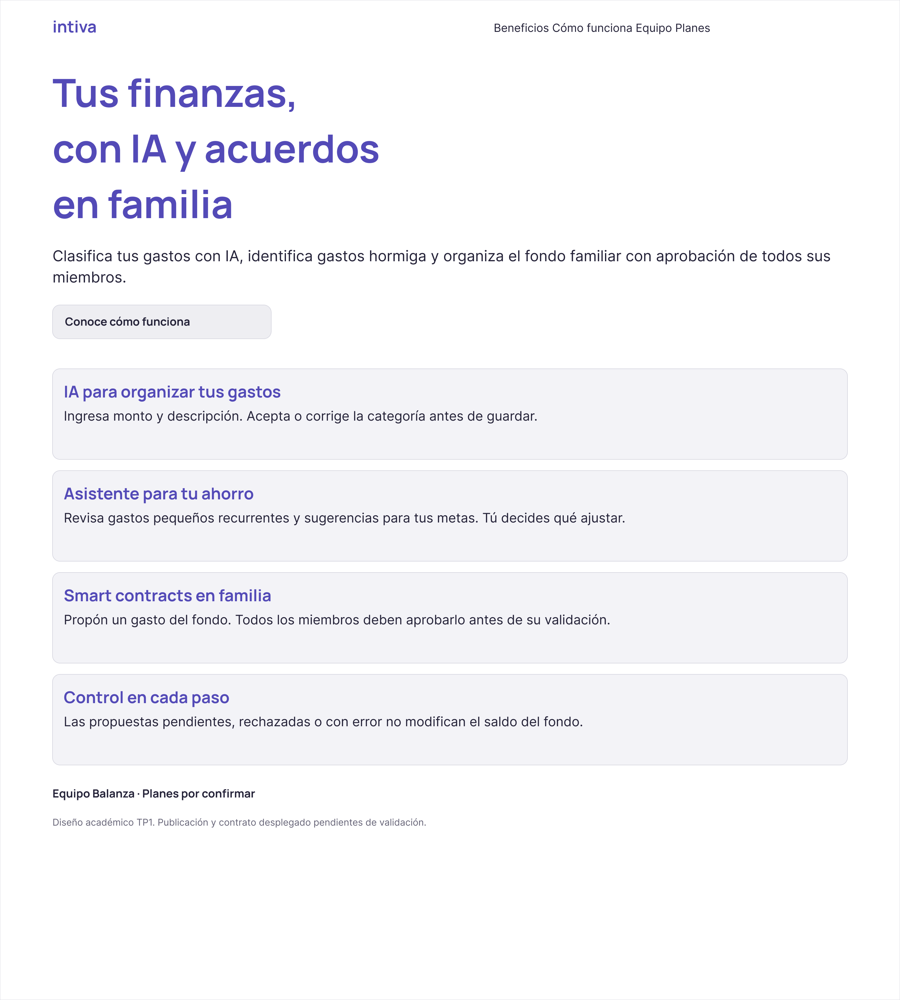

*Figura 6.3.1-A · Wireframe desktop. [Abrir diseño en Figma](https://www.figma.com/design/wV6U6QQC4MEYfj8PQArde5/Intiva-Platform-Application-Emergentes?node-id=2051-3866).*


*Figura 6.3.1-B · Wireframe móvil. [Abrir diseño en Figma](https://www.figma.com/design/wV6U6QQC4MEYfj8PQArde5/Intiva-Platform-Application-Emergentes?node-id=2051-3893).*

### 6.3.2. Landing Page Mock-up

El mock-up aplica la paleta índigo y lima, fondos claros y jerarquía tipográfica de Intiva. Comunica las dos tecnologías mediante beneficios y pasos comprensibles: registrar y revisar, analizar y decidir, proponer y aprobar en familia. Los textos no presentan recomendaciones como resultados garantizados ni una aprobación enviada como gasto validado.

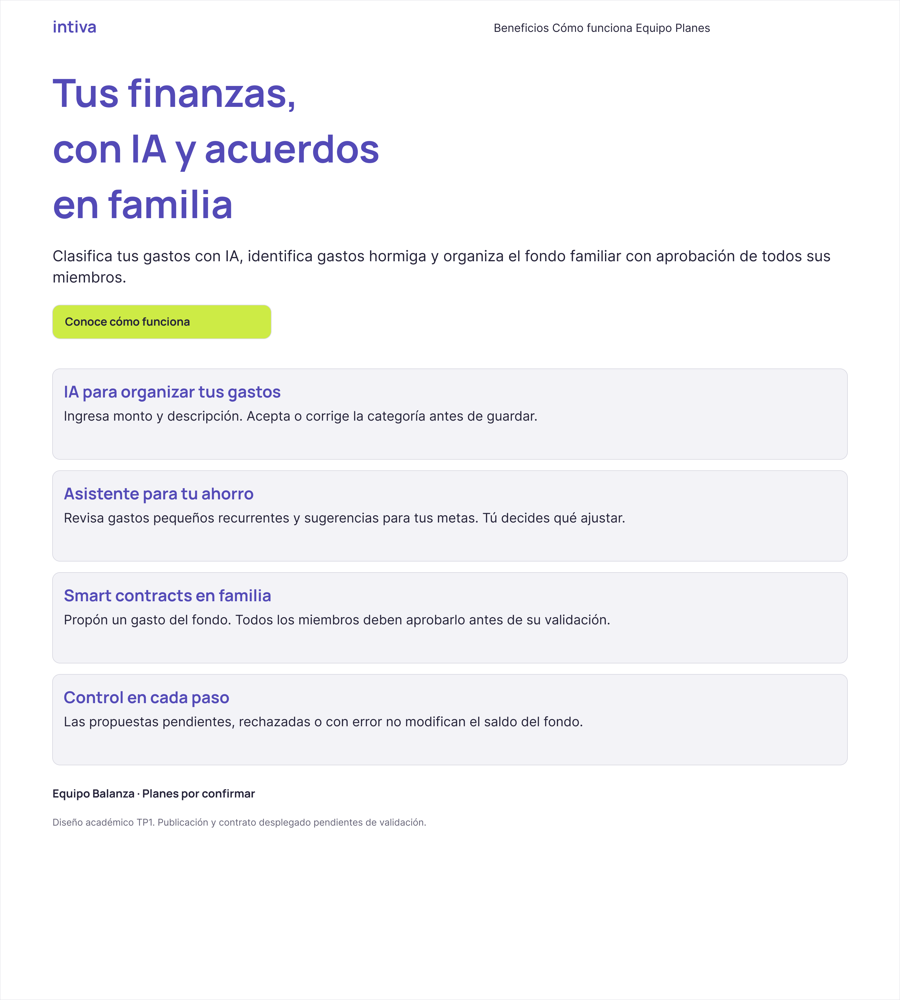

*Figura 6.3.2-A · Mock-up de landing. [Abrir diseño en Figma](https://www.figma.com/design/wV6U6QQC4MEYfj8PQArde5/Intiva-Platform-Application-Emergentes?node-id=2051-3928).*

La publicación de la aplicación, las condiciones de planes y la implementación del contrato siguen pendientes de validación. Los ejemplos no representan pagos reales.

## 6.4. Applications UX/UI Design

### 6.4.1. Applications Wireframes

Los doce wireframes cubren tres recorridos: categorización asistida, consulta financiera y aprobación del fondo familiar. El registro comienza con datos ingresados por el usuario. Las sugerencias no modifican el saldo; la operación personal requiere guardado confirmado y la del fondo exige unanimidad y confirmación del contrato.

| ID | Pantalla | Acción o estado | Requisito |
| --- | --- | --- | --- |
| WF01 | Registrar gasto | Introducir monto, descripción y cuenta; pedir categoría IA o elegir manualmente. | US 033 |
| WF02 | Categoría sugerida | Aceptar o corregir la propuesta de IA sin guardar todavía. | US 033 |
| WF03 | Elegir categoría | Aplicar la elección del usuario. | US 033 |
| WF04 | Revisar y guardar | Verificar datos y actualizar el saldo tras guardar correctamente. | US 033 |
| WF05 | Asistente financiero | Elegir período y consultar movimientos autorizados. | US 034 |
| WF06 | Gastos hormiga | Revisar gastos pequeños recurrentes y abrir los movimientos del análisis. | US 034 |
| WF07 | Plan para mi meta | Consultar ajustes orientativos sin modificar automáticamente la meta. | US 034 |
| WF08 | Ayuda no disponible | Conservar datos; continuar manualmente o reintentar. | TS 024 |
| WF09 | Fondo familiar | Consultar miembros, saldo y regla de aprobación unánime. | US 032 |
| WF10 | Proponer gasto | Fijar importe, concepto, destinatario y aprobadores. | US 032 |
| WF11 | Revisar aprobaciones | Consultar votos; aprobar con firma o rechazar. | US 032, TS 023 |
| WF12 | Resultado del contrato | Distinguir espera de confirmación, validado, rechazado y error. | TS 023 |

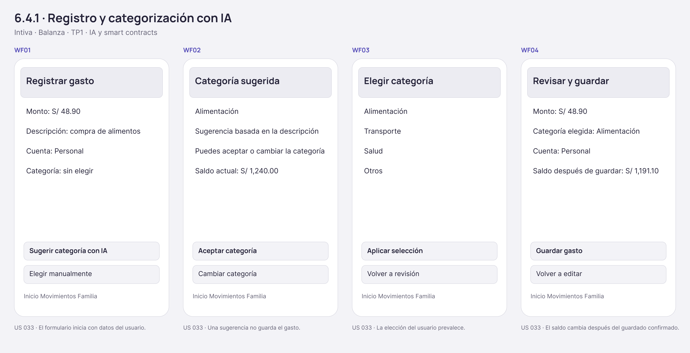

*Figura 6.4.1-A · WF01 a WF04 · Categorización IA. [Abrir diseño en Figma](https://www.figma.com/design/wV6U6QQC4MEYfj8PQArde5/Intiva-Platform-Application-Emergentes?node-id=2051-3384).*
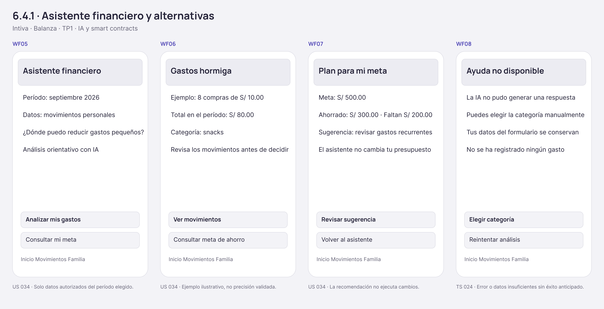

*Figura 6.4.1-B · WF05 a WF08 · Asistente IA. [Abrir diseño en Figma](https://www.figma.com/design/wV6U6QQC4MEYfj8PQArde5/Intiva-Platform-Application-Emergentes?node-id=2051-3445).*
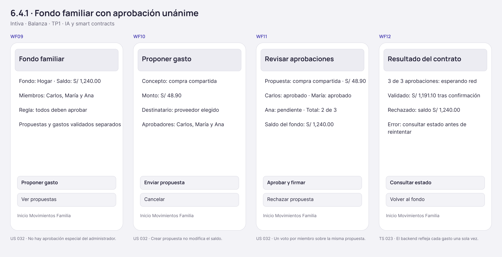

*Figura 6.4.1-C · WF09 a WF12 · Smart contracts. [Abrir diseño en Figma](https://www.figma.com/design/wV6U6QQC4MEYfj8PQArde5/Intiva-Platform-Application-Emergentes?node-id=2051-3506).*

Los datos son ilustrativos: 8 compras de S/ 10.00 suman S/ 80.00; una meta de S/ 500.00 con S/ 300.00 ahorrados deja S/ 200.00 pendientes. Un gasto validado de S/ 48.90 sobre S/ 1,240.00 produce S/ 1,191.10. Pendiente, rechazo o fallo conserva S/ 1,240.00. Los estados de WF12 son variantes de la pantalla, no sucesos simultáneos.

### 6.4.2. Applications Wireflow Diagrams

**F01 · Categorización y registro.** WF01 → WF02 → WF04 → confirmación de guardado. Cambiar categoría abre WF03 y vuelve a revisión. Ante sugerencia inválida o fallo de IA se ofrece WF08 y elección manual. Un error al guardar mantiene el formulario y el saldo previo.

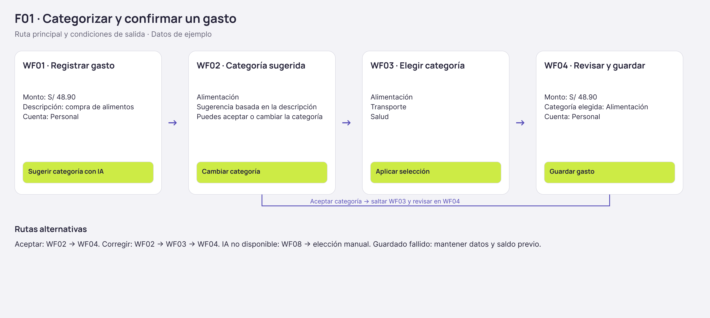

*Figura 6.4.2-A · F01 · Categorización IA. [Abrir diseño en Figma](https://www.figma.com/design/wV6U6QQC4MEYfj8PQArde5/Intiva-Platform-Application-Emergentes?node-id=2051-4574).*

**F02 · Asistente y ahorro.** WF05 → WF06 → consulta de movimientos o WF07 → regreso al asistente. El período y la información utilizada acompañan el análisis. Sin datos suficientes o respuesta válida se muestra WF08. Revisar una recomendación no cambia el presupuesto ni ejecuta una transacción.

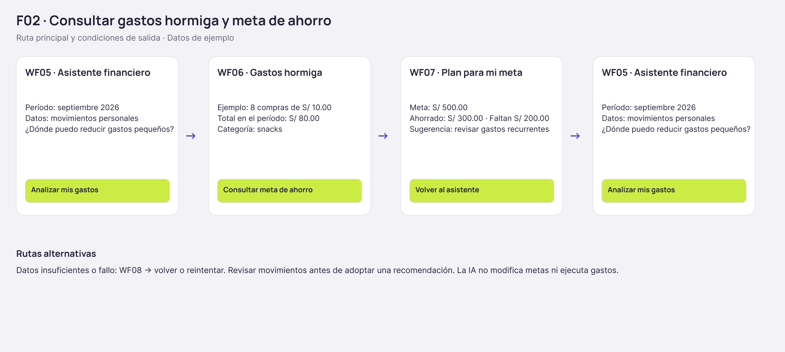

*Figura 6.4.2-B · F02 · Asistente financiero. [Abrir diseño en Figma](https://www.figma.com/design/wV6U6QQC4MEYfj8PQArde5/Intiva-Platform-Application-Emergentes?node-id=2051-4614).*

**F03 · Aprobación unánime.** WF09 → WF10 → WF11 → WF12. Crear una propuesta fija sus aprobadores sin débito. Con dos votos de tres sigue pendiente; el tercero habilita la verificación del contrato. Solo tras confirmar la validación se refleja el gasto una vez. El rechazo cierra la propuesta sin débito. Un fallo de red exige consultar el estado antes de reenviar; cambiar las condiciones exige una propuesta nueva.

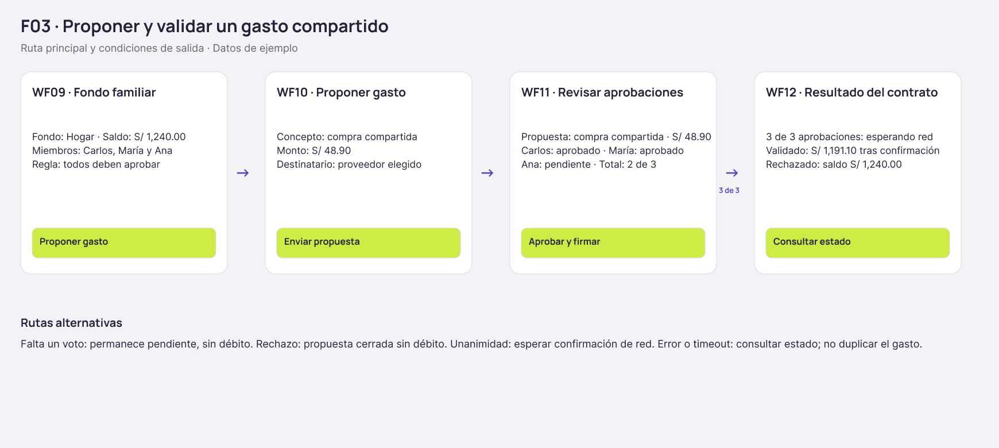

*Figura 6.4.2-C · F03 · Fondo familiar. [Abrir diseño en Figma](https://www.figma.com/design/wV6U6QQC4MEYfj8PQArde5/Intiva-Platform-Application-Emergentes?node-id=2051-4652).*

| Condición | Resultado |
| --- | --- |
| Categoría aceptada o corregida | Se conserva la decisión y se vuelve a revisión antes de guardar. |
| IA indisponible o análisis sin base suficiente | Mensaje claro y continuidad manual. |
| Falta alguna aprobación | Propuesta pendiente, sin cambio de saldo. |
| Un miembro rechaza | Propuesta rechazada, sin cambio de saldo. |
| Todos aprueban | Esperar el resultado confirmado del contrato. |
| Contrato confirma la validación | Registrar el gasto una sola vez. |
| Red sin respuesta | Consultar estado y evitar duplicar la operación. |

### 6.4.3. Applications Mock-ups

Esta sección presenta los mock-ups de la aplicación móvil (Android) y de la aplicación web. En cada pantalla se aplican los principios de diseño, los elementos visuales, el diseño inclusivo y la arquitectura de información definidos en los apartados [6.1](#61-style-guidelines) y [6.2](#62-information-architecture), así como el Design System de Intiva. Los mock-ups se elaboran en Figma, en el mismo archivo de los wireframes y wireflows. Las pantallas base de la aplicación se toman de Page 1, y las pantallas nuevas (WF01 a WF12) de la página TP1 · IA y smart contracts.

**Aplicación de la paleta por función.** Cada color cumple un rol fijo en todas las pantallas:

| Rol | Color | Uso en los mock-ups |
| --- | --- | --- |
| Primario | Índigo `#534AB7` | Botones principales, pestaña activa de la navegación inferior y tarjeta de saldo total. |
| Secundario | Lima `#CDEB45` | Llamadas a la acción de registro (Guardar, Confirmar gasto) y progreso de metas de ahorro. Sobre el lima se usa texto oscuro para mantener el contraste. |
| Terciario | Cobre `#8A4900` | Acciones de edición y algunas categorías. |
| Neutro | Gris violeta `#78767E` | Fondos, bordes, divisores y textos secundarios. |
| Error | Rojo `#BA1A1A` | Gastos, límites superados y acción de eliminar. |
| Estados de límite | Verde (a buen ritmo) y ámbar (cerca del límite) | Siempre acompañados de un texto. Las propuestas pendientes de aprobación se muestran en tonos neutros. |

**Tipografía e iconografía.** Manrope en títulos, Inter en textos y botones, y Space Grotesk en montos, que se muestran con signo ("+" para ingresos y "−" para gastos). Los íconos son Material Symbols en la aplicación móvil y PrimeIcons en la aplicación web.

**Principios de diseño inclusivo aplicados.**
- Contraste verificado para cada combinación de texto, fondo y estado.
- Ningún estado depende solo del color: cada uno incluye un texto.
- Áreas táctiles de al menos 48 dp en Android, y botones principales a todo el ancho en la parte inferior de la pantalla.
- Dimensiones en dp y textos en sp, para respetar el tamaño de letra configurado en el teléfono.
- Contorno de foco visible en la aplicación web, para la navegación con teclado.

**Mock-ups de la aplicación móvil**

**Inicio.** Muestra primero el saldo total, después el estado del presupuesto y al final los movimientos recientes, según la jerarquía visual de [6.2.1](#621-organization-systems).

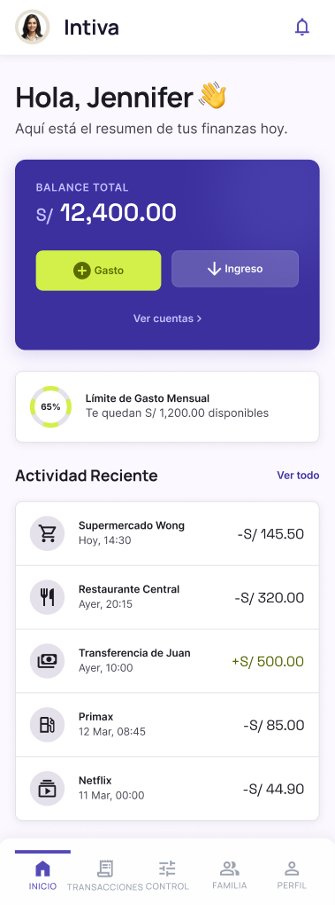

*Figura 6.4.3-A. Mock-up de la pantalla Inicio. [Abrir Mockup editable](https://www.figma.com/design/wV6U6QQC4MEYfj8PQArde5/Intiva-Platform-Application-Emergentes?node-id=0-1).*.*

**Registro manual de un movimiento.** Muestra los cinco pasos del registro (tipo, monto, categoría, cuenta y fecha) con teclado numérico propio y botón de guardado en la parte inferior. Corresponde al formulario base de WF01.

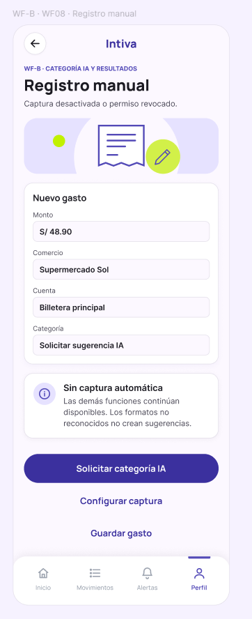

*Figura 6.4.3-B. Mock-up del registro manual de un movimiento.[Abrir Mockup editable](https://www.figma.com/design/wV6U6QQC4MEYfj8PQArde5/Intiva-Platform-Application-Emergentes?node-id=2045-2348).*

**Ampliación TP1: IA y smart contracts.** Las composiciones revisadas sustituyen las pantallas de permiso y fuentes por el formulario con categorización IA, el asistente financiero y las propuestas del fondo familiar. Mantienen índigo para jerarquía y lima para acciones principales. WF12 distingue las variantes de espera, validación, rechazo y error.

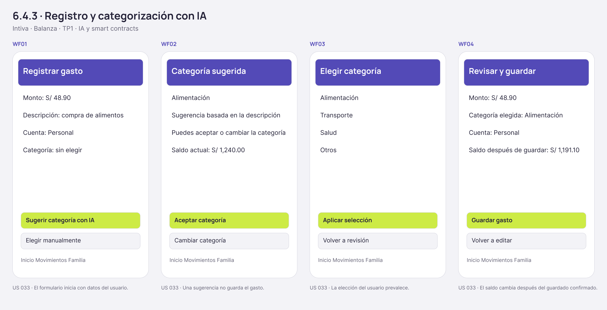

*Figura 6.4.3-C · Mock-ups de categorización IA. [Abrir diseño en Figma](https://www.figma.com/design/wV6U6QQC4MEYfj8PQArde5/Intiva-Platform-Application-Emergentes?node-id=2051-3568).*
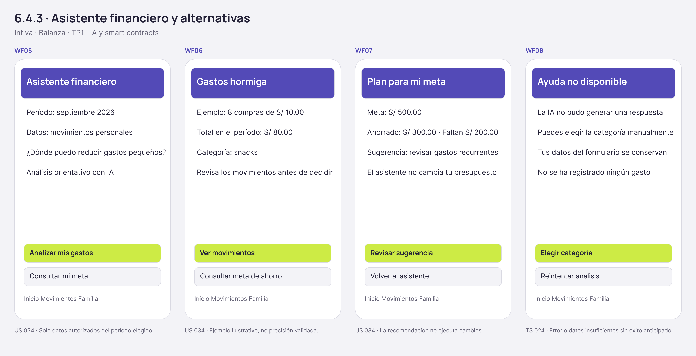

*Figura 6.4.3-D · Mock-ups del asistente IA. [Abrir diseño en Figma](https://www.figma.com/design/wV6U6QQC4MEYfj8PQArde5/Intiva-Platform-Application-Emergentes?node-id=2051-3629).*
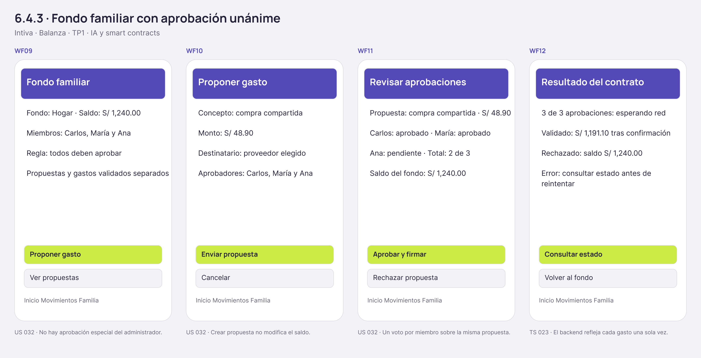

*Figura 6.4.3-E · Mock-ups de smart contracts. [Abrir diseño en Figma](https://www.figma.com/design/wV6U6QQC4MEYfj8PQArde5/Intiva-Platform-Application-Emergentes?node-id=2051-3690).*

**Mock-ups de la aplicación web**

**Panel.** Ubica los indicadores principales (balance total, ingresos, gastos y ahorro del mes) en la parte superior y los gráficos de detalle debajo, con la barra lateral fija y el filtro de período (1 mes, 6 meses o 1 año). Los gráficos usan índigo y lima como colores de sus series.

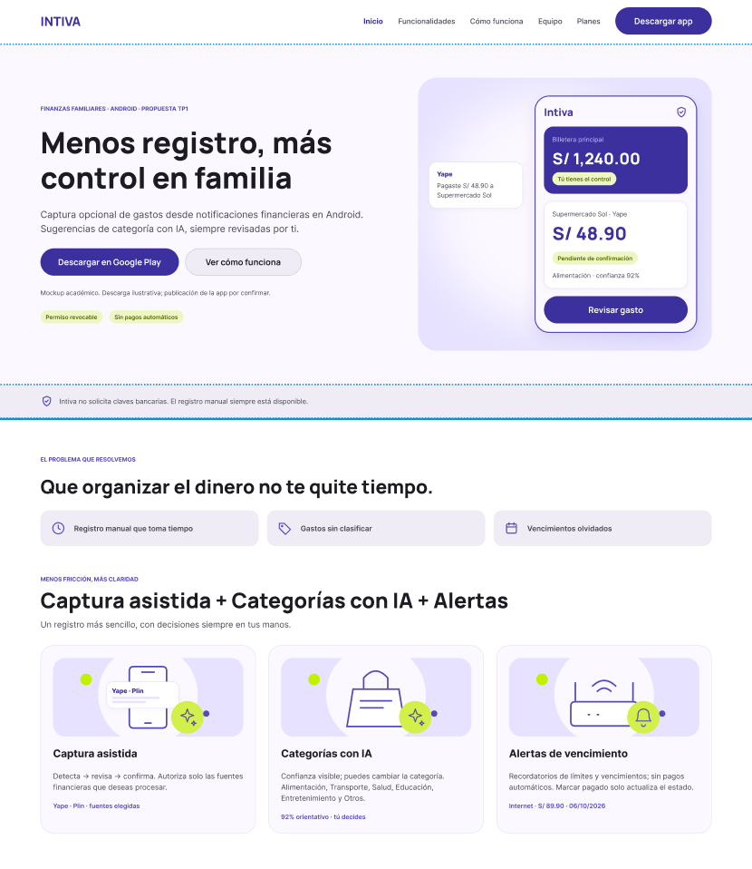

*Figura 6.4.3-G. Mock-up del Panel de la aplicación web. [Abrir Mockup editable](https://www.figma.com/design/wV6U6QQC4MEYfj8PQArde5/Intiva-Platform-Application-Emergentes?node-id=0-1).*

**Reportes.** Muestra la configuración del reporte por tipo (general, ingresos, gastos o ahorros), período e integrantes, y la acción de descarga.

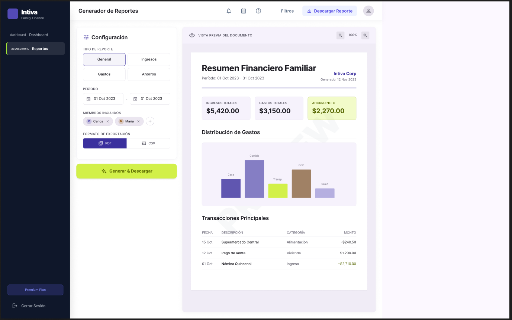

*Figura 6.4.3-G. Mock-up del Panel de la aplicación web. [Abrir Mockup editable](https://www.figma.com/design/wV6U6QQC4MEYfj8PQArde5/Intiva-Platform-Application-Emergentes?node-id=0-1).*

### 6.4.4. Applications User Flow Diagrams

Esta sección presenta los User Flows de las aplicaciones de la solución. Están en la sección **Applications User Flow Diagrams** de la página [Mockup - User flow - Prototyping](https://www.figma.com/design/wV6U6QQC4MEYfj8PQArde5/Intiva-Platform-Application-Emergentes?node-id=2045-2348). Hay un User Flow por cada user goal, identificado con el código UF y el código G del objetivo. Cada flujo se deriva de un wireflow de [6.4.2](#642-applications-wireflow-diagrams) (F01, F02 o F03), o es una subruta de uno de ellos cuando el flujo es secundario.

Los actores corresponden a las audiencias de [6.2.1](#621-organization-systems): el **usuario de Intiva** (individual o integrante del grupo), y el **visitante web**. Para los flujos principales se describe además un escenario académico con dos personas de ejemplo: Carlos y María.

Cada diagrama incluye la ruta esperada (**happy path**, línea continua en el diagrama) y las rutas alternativas (**unhappy paths**, línea discontinua). Las condiciones se marcan con un rombo. Las pantallas se citan con su código de wireframe.

**Aplicación Android**

**UF01 · Registrar un gasto con categoría IA (F01).** El usuario ingresa los datos (WF01), solicita una sugerencia (WF02), acepta o elige otra categoría (WF03), revisa y guarda (WF04). Si la IA falla, WF08 mantiene la alternativa manual. Un fallo al guardar conserva datos y saldo anterior.

**UF02 · Consultar gastos hormiga (F02).** El usuario abre WF05, elige período y obtiene WF06 con movimientos verificables. Sin datos suficientes, WF08 informa que el análisis no puede fundamentarse. Consultar no registra gastos.

**UF03 · Consultar una meta de ahorro (F02).** Desde WF05 o WF06 se abre WF07. El usuario revisa la recomendación y decide si ajusta su planificación en las funciones habituales. La respuesta del asistente no cambia la meta por sí sola.

**UF04 · Proponer un gasto familiar (F03).** Desde WF09, un miembro abre WF10 y envía una propuesta con importe y destinatario fijados. WF11 muestra quién debe aprobar. Crear la propuesta no modifica el saldo.

**UF05 · Aprobar o rechazar el gasto familiar (F03).** Cada miembro consulta WF11 y aprueba con su firma o rechaza. Un voto pendiente mantiene la propuesta; un rechazo la cierra. Con unanimidad, WF12 espera la confirmación y muestra el gasto validado solo después de verificarla. Error de red: consultar estado antes de reintentar. Los votos no se reutilizan si cambian las condiciones.

Los diagramas F01, F02 y F03 de la sección 6.4.2 muestran las pantallas de estos recorridos. Los recorridos vigentes se basan en categorización IA, asistencia financiera y aprobación unánime.


**Diagramas de decisión de los recorridos vigentes**

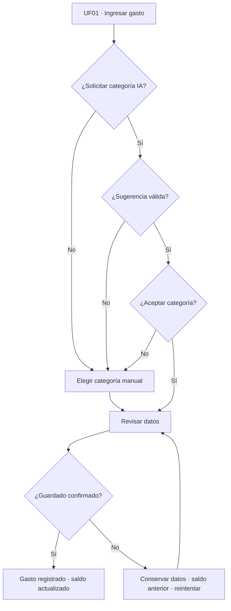
```mermaid
flowchart TD
  A["UF01 · Ingresar gasto"] --> B{"¿Solicitar categoría IA?"}
  B -- "No" --> C["Elegir categoría manual"]
  B -- "Sí" --> D{"¿Sugerencia válida?"}
  D -- "No" --> C
  D -- "Sí" --> E{"¿Aceptar categoría?"}
  E -- "No" --> C
  E -- "Sí" --> F["Revisar datos"]
  C --> F
  F --> G{"¿Guardado confirmado?"}
  G -- "Sí" --> H["Gasto registrado · saldo actualizado"]
  G -- "No" --> I["Conservar datos · saldo anterior · reintentar"]
  I --> F
```

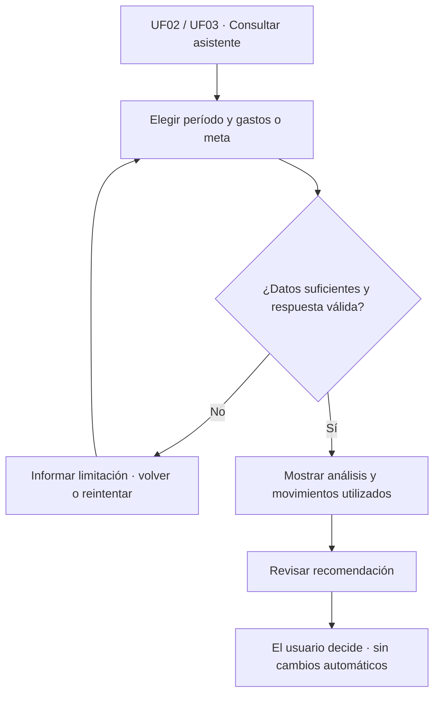
```mermaid
flowchart TD
  A["UF02 / UF03 · Consultar asistente"] --> B["Elegir período y gastos o meta"]
  B --> C{"¿Datos suficientes y respuesta válida?"}
  C -- "No" --> D["Informar limitación · volver o reintentar"]
  C -- "Sí" --> E["Mostrar análisis y movimientos utilizados"]
  E --> F["Revisar recomendación"]
  F --> G["El usuario decide · sin cambios automáticos"]
  D --> B
```

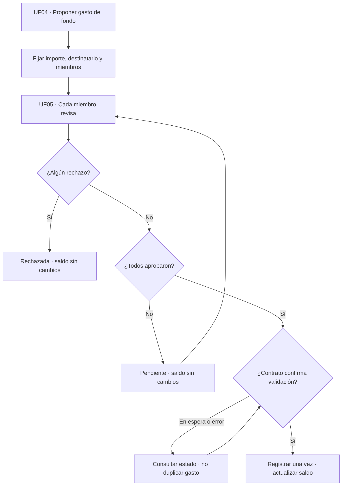
```mermaid
flowchart TD
  A["UF04 · Proponer gasto del fondo"] --> B["Fijar importe, destinatario y miembros"]
  B --> C["UF05 · Cada miembro revisa"]
  C --> D{"¿Algún rechazo?"}
  D -- "Sí" --> E["Rechazada · saldo sin cambios"]
  D -- "No" --> F{"¿Todos aprobaron?"}
  F -- "No" --> G["Pendiente · saldo sin cambios"]
  G --> C
  F -- "Sí" --> H{"¿Contrato confirma validación?"}
  H -- "En espera o error" --> I["Consultar estado · no duplicar gasto"]
  I --> H
  H -- "Sí" --> J["Registrar una vez · actualizar saldo"]
```

**Sitio web**

**UF06. Evaluar Intiva desde la landing**

- **User goal:** "Quiero comprender la propuesta de Intiva y decidir si me interesa usarla."
- **Actor y escenario:** visitante web que busca entender la utilidad de la categorización y asistencia con IA, la aprobación unánime y las condiciones de privacidad.
- **Happy path:** landing → beneficios, control y privacidad → decisión de evaluar → CTA "Descargar app" (ilustrativo).
- **Unhappy path:** la información del equipo y los planes aún no está confirmada → la landing lo indica como pendiente y el visitante sigue consultando otras secciones.
- **Límite:** el CTA es ilustrativo. No se dibuja una descarga completada ni una creación de cuenta, y la publicación en Google Play sigue pendiente.

UF06 es una meta web y no deriva de F01, F02 ni F03.


*Figura 6.4.4-F. User Flow UF06. [Abrir diagrama editable](https://www.figma.com/design/wV6U6QQC4MEYfj8PQArde5/Intiva-Platform-Application-Emergentes?node-id=2045-2348).*
Las composiciones TP1 se importaron como elementos vectoriales y textos editables. Las imágenes del informe son exportaciones PNG de los mismos frames. La interacción del prototipo y las pruebas con usuarios se validarán en la siguiente etapa; los diagramas no acreditan conexiones de prototipo implementadas.


# Capítulo VII: Product Implementation, Validation & Deployment

[Consultar el contenido del documento](docs/07-cha07-product-implementation-validation-and-deployment.md).

## 7.1. Software Configuration Management

### 7.1.1. Software Development Environment Configuration

### 7.1.2. Source Code Management

### 7.1.3. Source Code Style Guide & Conventions

### 7.1.4. Software Deployment Configuration

## 7.2. Solution Implementation

<!-- Duplicar el bloque 7.2.X (con su numeración 7.2.2, 7.2.3...) por cada Sprint -->

### 7.2.1. Sprint 1

#### 7.2.1.1. Sprint Planning 1

#### 7.2.1.2. Sprint Backlog 1

#### 7.2.1.3. Development Evidence for Sprint Review

#### 7.2.1.4. Testing Suite Evidence for Sprint Review

#### 7.2.1.5. Execution Evidence for Sprint Review

#### 7.2.1.6. Services Documentation Evidence for Sprint Review

#### 7.2.1.7. Software Deployment Evidence for Sprint Review

#### 7.2.1.8. Team Collaboration Insights during Sprint

## 7.3. Validation Interviews

### 7.3.1. Diseño de Entrevistas

### 7.3.2. Registro de Entrevistas

### 7.3.3. Evaluaciones según heurísticas

## 7.4. Video About-the-Product

<div style="page-break-after: always;"></div>

# Conclusiones

## Conclusiones y recomendaciones

La entrega reúne el análisis del problema, los requisitos y el diseño estratégico de Intiva, junto con el avance de UX documentado para TP1. Las conclusiones distinguen lo diseñado de los resultados que todavía requieren implementación y validación.

### Sobre el Capítulo I: Introducción

- Las 5W y 2H y el diagrama de Ishikawa organizan posibles causas de las dificultades de gestión financiera. Las fuentes consultadas permiten contextualizar el problema, pero no prueban que la solución propuesta produzca mejoras en los usuarios.
- Lean UX define hipótesis y metas de negocio. Los incrementos de retención y margen, los 500 grupos activos y el CSAT del 75% son objetivos propuestos; necesitan una línea base e instrumentos de medición.
- Los segmentos se distinguen por su responsabilidad en las finanzas personales y del hogar. Los datos por edad del INEI contextualizan el acceso a cuentas, sin demostrar por sí solos el rol financiero de una persona.

### Sobre el Capítulo II: Requirements Elicitation & Analysis

- Las seis entrevistas registran necesidades de facilidad de uso, seguimiento de gastos, privacidad y recordatorios. Se emplean para orientar el diseño, sin generalizar sus hallazgos a toda la población.
- Los porcentajes de los gráficos heredados no tienen una matriz de respuestas que permita verificar su base de cálculo. El análisis mantiene una lectura cualitativa hasta conciliar esos datos.
- La comparación de Fintonic, Monefy y Plum orienta el posicionamiento de Intiva hacia la gestión personal y familiar. No demuestra exclusividad ni valida una ventaja competitiva en el mercado.

### Sobre el Capítulo III: Requirements Specification

- El alcance incorpora US 001 a US 034 y once épicas. US 032 exige aprobación unánime del fondo familiar, US 033 permite aceptar o corregir categorías IA y US 034 define asistencia para gastos hormiga y metas.
- TS 023 define autorización, unanimidad y conciliación del smart contract; TS 024 restringe datos y valida respuestas del adaptador de IA. Las notificaciones habituales conservan FCM (TS 017).
- Los criterios de aceptación permiten preparar pruebas funcionales. Describir un escenario esperado no acredita que ya haya sido implementado ni que la prueba haya pasado.

### Sobre el Capítulo IV: Strategic-Level Software Design

- El capítulo IV propone un monolito modular y describe los contextos que organizan el dominio. Subscriptions se registra como contexto previsto en el diseño estratégico.
- La clasificación, la asistencia IA y la aprobación por contrato son propuestas de TP1. La calidad de las respuestas, la red, las firmas y la confirmación deben validarse en la implementación.

### Sobre el Capítulo V: Tactical-Level Software Design

- El diseño táctico documenta las cuatro capas de ocho bounded contexts, junto con diagramas de componentes, clases y base de datos. La propuesta del fondo separa acuerdos pendientes de movimientos confirmados y prevé conciliación idempotente.
- La categorización y el asistente IA se integran mediante puertos y adaptadores; las recomendaciones no ejecutan gastos ni modifican metas. Communications conserva el envío directo de notificaciones por FCM.

### Sobre el Capítulo VI: Solution UX Design

- El capítulo contiene guías de estilo y arquitectura de información, así como la landing adaptada, sus wireframes para escritorio y móvil, doce wireframes de aplicación y tres wireflows elaborados para TP1.
- Las pantallas representan categorización, asistencia financiera, propuestas, aprobación unánime y estados de confirmación, rechazo y error. Se relacionan con US 032, US 033, US 034, TS 023 y TS 024.
- Las imágenes y composiciones vectoriales de Figma documentan el diseño corregido. Sus montos son ilustrativos; no representan precisión de IA ni contratos desplegados.

### TP1: Conclusiones del equipo

El equipo consolidó el diseño táctico y la experiencia de usuario de Intiva, relacionando los requisitos del proyecto con las capas del software, la organización de la información y las pantallas de la solución. Los aportes de los cuatro integrantes permiten revisar el comportamiento esperado de IA y smart contracts antes de su implementación.

**Leonardo Solis — Capítulo V.** El diseño de las capas de dominio, interfaz, aplicación e infraestructura permite identificar dónde se aplican las reglas de negocio y dónde se resuelven las integraciones externas. Los diagramas de componentes, clases y base de datos ofrecen una referencia para implementar cada bounded context. En el fondo familiar, separar la propuesta del movimiento confirmado permite exigir unanimidad y evitar que una aprobación incompleta o un reintento registre el gasto más de una vez.

**Camila Loli — Secciones 6.1 y 6.2.** Las guías de estilo y la arquitectura de información establecen criterios comunes para la presentación de Intiva en web y móvil. Las etiquetas y la navegación deben ayudar a distinguir una sugerencia de IA, una propuesta pendiente y un gasto validado. La consistencia del diseño deberá contrastarse con pruebas de comprensión y uso en ambos segmentos de usuarios.

**Didier Meza — Secciones 6.3, 6.4.1 y 6.4.2.** La landing, los wireframes y los wireflows convierten los requisitos en recorridos que pueden revisarse antes de desarrollar la aplicación. El diseño muestra que el usuario acepta o corrige la categoría antes de guardar, que la asistencia IA es orientativa y que el fondo solo registra un gasto después de la aprobación de todos y la confirmación del contrato. Los estados de espera, rechazo y error explican qué ocurre cuando el recorrido principal no se completa.

**Omar Rivera — Secciones 6.4.3 y 6.4.4.** Los mock-ups y los user flows permiten revisar la presentación de las pantallas y su relación con los objetivos del usuario. La correspondencia con los wireflows ayuda a mantener las mismas acciones y condiciones en el diseño visual. Estos materiales sirven como base para conectar el prototipo y evaluar las tareas de registro, consulta y aprobación familiar.

**Conclusión conjunta.** El TP1 establece una base de diseño compartida para la implementación de Intiva. La siguiente etapa requiere comprobar la calidad de las respuestas de IA, la autorización y unanimidad del contrato, la conciliación sin duplicados y la facilidad de uso de los recorridos. Las evidencias actuales respaldan las decisiones de diseño; los beneficios esperados de ahorro, menor esfuerzo y coordinación familiar deberán medirse con la solución implementada.

### Recomendaciones

- Implementar y verificar el diseño táctico del Capítulo V y completar la interacción del prototipo a partir de los mock-ups y flujos del Capítulo VI. El Capítulo VII aún no contiene evidencias de implementación, pruebas, validación o despliegue de la entrega actual.
- Conciliar la matriz de respuestas de las entrevistas, los precios y datos del equipo de la landing y las versiones del stack con sus fuentes correspondientes.
- Mantener alineados los diagramas estratégicos y tácticos con los adaptadores de IA y blockchain, distinguiendo módulos del backend y servicios externos.
- Probar unanimidad, rechazo, votos duplicados o no autorizados, cambios de propuesta y fallos de red, sin débitos anticipados ni duplicados.
- Evaluar la categorización y las recomendaciones con casos del dominio, sin presentar confianza como precisión medida. Verificar continuidad manual e información mínima autorizada.
- Validar la facilidad de uso con personas de ambos segmentos antes de concluir que el producto reduce el esfuerzo de registro o mejora la coordinación familiar.

## Video About-the-Team

[Enlace al video de presentación del equipo](https://upcedupe-my.sharepoint.com/:v:/g/personal/u202319950_upc_edu_pe/IQB_Q8u14DyQT4TXefm7wQfSAakkU-BGVGYdRbP-bV8M77M?nav=eyJyZWZlcnJhbEluZm8iOnsicmVmZXJyYWxBcHAiOiJTdHJlYW1XZWJBcHAiLCJyZWZlcnJhbFZpZXciOiJTaGFyZURpYWxvZy1MaW5rIiwicmVmZXJyYWxBcHBQbGF0Zm9ybSI6IldlYiIsInJlZmVycmFsTW9kZSI6InZpZXcifX0%3D&e=P0yw1r)

# Bibliografía

[Consultar el contenido del documento](docs/09-bibliography.md).

<div style="page-break-after: always;"></div>

# Anexos

[Consultar el contenido del documento](docs/10-annexes.md).

## Anexo A: Vídeos de entrevistas realizadas

[Consultar los vídeos de entrevistas](docs/10-annexes.md#anexo-a-vídeos-de-entrevistas-realizadas).

## Anexo B: Diseños de Intiva en Figma — TP1

El archivo reúne la landing page, los wireframes, los mock-ups y los flujos de usuario de Intiva. La página TP1 presenta los diseños de categorización y asistencia financiera con IA y de aprobación unánime del fondo familiar mediante smart contracts, documentados en el Capítulo VI.

[Abrir los diseños TP1 de Intiva en Figma](https://www.figma.com/design/wV6U6QQC4MEYfj8PQArde5/Intiva-Platform-Application-Emergentes?node-id=2045-2348).

