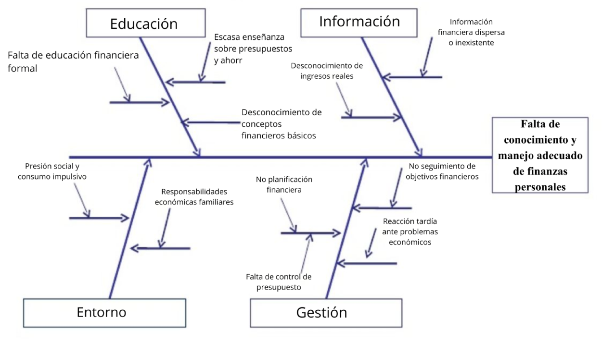
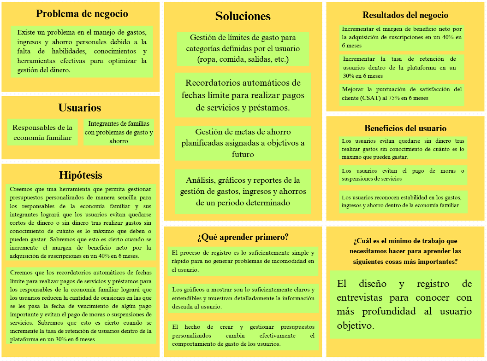

# Capítulo I: Introducción

Este capítulo tiene como objetivo proporcionar una visión general de la startup que desarrolla el software en cuestión. Por ello, se describen aspectos clave como la misión, visión y valores, así como una breve introducción a los miembros del equipo. Además, se desarrolla la problemática a resolver dando un contexto claro sobre la necesidad del software en el mercado actual para sentar las bases fundamentales del proyecto.

## 1.1. Startup Profile

A continuación, se presenta una descripción detallada de la startup al incluir su misión, visión y valores fundamentales así como una descripción breve de los integrantes que la conforman.

### 1.1.1. Descripción de la Startup

Balanza es una startup tecnológica que se centra en el desarrollo de soluciones innovadoras, accesibles y didácticas para la gestión de finanzas personales con un enfoque en el manejo de ingresos, gastos y ahorros. De este modo, busca empoderar a los usuarios para que puedan tomar el control de sus finanzas y mejorar su bienestar económico a través de herramientas digitales intuitivas y efectivas.

| Misión                                                                       | Visión                                                                                                                                                                                                                    | Valores                                                                                             |
| ---------------------------------------------------------------------------- | ------------------------------------------------------------------------------------------------------------------------------------------------------------------------------------------------------------------------- | --------------------------------------------------------------------------------------------------- |
| Ser la solución que permita a los usuarios manejar óptimamente sus finanzas. | Cambiar la mentalidad sobre el manejo de gastos e ingresos y la planificación de ahorro para objetivos a futuro y volverlas una labor sencilla en el país con soluciones tecnológicas de uso intuitivo para los usuarios. | - Transparencia y confianza. - Innovación constante. - Responsabilidad con nuestros usuarios. |

### 1.1.2. Perfiles de integrantes del equipo

<table>
  <tr>
    <th>Foto</th>
    <th>Integrante</th>
    <th>Código</th>
    <th>Carrera</th>
    <th>Habilidades y conocimientos técnicos</th>
  </tr>
  <tr>
    <td> 
    </td>
    <td>Loli Ramirez, Camila Cristina</td>
    <td>U202110385</td>
    <td>Ingeniería de Software</td>
    <td>Soy estudiante de la carrera Ingeniería de Software. Mi carrera se basa en los conocimientos y técnicas científicas para crear un programa informático. Tengo experiencia con el trabajo en equipo, creación de proyectos y creación de programas básicos. Aportaré al equipo mi creatividad, compromiso de trabajo en equipo, puntualidad y responsabilidad. Me comprometo a trabajar constantemente para mejorar nuestro proyecto y a generar un entorno de trabajo sano con mi grupo.</td>
  </tr>
  <tr>
    <td>      
    </td>
    <td>Meza Solórzano, Didier Sebastian</td>
    <td>U202319950</td>
    <td>Ingeniería de Software</td>
    <td>Soy estudiante de Ingeniería de Software con interés en el desarrollo de aplicaciones móviles y soluciones tecnológicas orientadas a resolver problemas reales. Me considero una persona responsable, comprometida y con disposición para trabajar en equipo. Asimismo, busco aplicar buenas prácticas de desarrollo y mejorar continuamente mis conocimientos técnicos durante el desarrollo de proyectos.</td>
  </tr>
<tr>
    <td>             
    </td>
    <td>Rivera Ticllacuri, Omar Harold</td>
    <td>U202214214</td>
    <td>Ingeniería de Software</td>
    <td>Soy estudiante del 7mo ciclo de Ingeniería de Software. Me considero una persona responsable, puntual y colaborativa, comprometida con apoyar a mis compañeros para lograr un proyecto de calidad. Mis conocimientos técnicos principales se enfocan en C# junto a frameworks como ASP.NET y Node.js. Además, tengo experiencia trabajando con bases de datos SQL y NoSQL (PostgreSQL, MySQL, MongoDB), Python, Figma y diseño gráfico. Mis pasatiempos incluyen el desarrollo de videojuegos y la música.</td>
  </tr>
  <tr>
    <td></td>
    <td></td>
    <td></td>
    <td></td>
    <td></td>
  </tr>
</table>

## 1.2. Solution Profile

En esta sección se describe el perfil de la solución propuesta, incluyendo los antecedentes y la problemática que aborda. Además, se usó la técnica de las 5W y 2H para comprender mejor el contexto y las necesidades del usuario. Finalmente, se desarrolló el proceso Lean UX para definir las posibles características y funcionalidades de la solución.

La aplicación lleva por nombre “Intiva”. El propósito de la aplicación se centra
en administrar correctamente los gastos, ingresos y ahorros de una persona o familia de manera intuitiva.

### 1.2.1. Antecedentes y problemática

Aquí se presentan los antecedentes y la problemática que la solución propuesta busca abordar, utilizando la técnica de las 5W y 2H para un análisis detallado y el diagrama de Ishikawa para identificar las causas raíz del problema.

**Antecedentes**

Para definir el perfil de la solución, es fundamental comprender los antecedentes y la problemática que se desea abordar. En este caso, el problema está relacionado con la falta de conocimiento adecuado respecto al manejo y seguimiento de gastos, ingresos y ahorros, la elaboración de presupusetos, el establecimiento de metas financieras entre otros.

Según Calderón y Pinto (2025), un bajo nivel de conocimiento, habilidades y
manejo financiero en los jóvenes peruanos genera hábitos deficientes de consumo y una mayor vulnerabilidad a riesgos en la gestión de finanzas personales, incluyendo ingresos y gastos. Además, según Duarte y Noguera (como se citó en Calderón y Pinto, 2025), un mal manejo de las finanzas personales puede llevar a problemas que afectan la calidad de vida de la persona en un corto plazo.

***Técnica de las 5W’s y 2H’s***

**What?**

**¿Cuál es el problema?**

El problema es la falta de conocimiento adecuado respecto del seguimiento de
gastos e ingresos, la elaboración de presupuestos y el establecimiento de metas
financieras para ahorrar que pertenecen al mundo de las finanzas personales.

**¿Cuál es la relación con la persona en cuestión?**

Las personas que cuentan con responsabilidades económicas sufren este problema
directamente, ya que impacta en su capacidad para gestionar su dinero de manera efectiva y tomar decisiones informadas para utilizarlo correctamente.

**When?**

**¿Cuándo sucede el problema?**

El problema puede surgir en cualquier momento en que una persona necesite
tomar decisiones financieras importantes, como al planificar un presupuesto mensual,
ahorrar para metas a largo plazo o enfrentar gastos imprevistos o recurrentes.

**¿Cuándo utiliza el cliente el producto?**

El cliente utiliza el producto cuando busca mejorar sus habilidades en el manejo y planificación de ingresos, gastos y ahorros y reforzar su educación financiera, ya sea de manera proactiva para seguir sus gastos e ingresos o de manera reactiva al enfrentar dificultades financieras.

**Where?**

**¿Dónde está el cliente cuando usa el producto?**

El cliente puede estar en cualquier lugar donde tenga acceso a su dispositivo móvil, ya sea en su hogar, lugar de trabajo o mientras se desplaza cuente o no con señal o conexión a Internet.

**¿Dónde surge el problema?**

El problema surge en el entorno individual, familiar y financiero del individuo, donde la falta de conocimiento y habilidades para gestionar el dinero que ingresa y sale de la economía familiar puede llevar a decisiones económicas inadecuadas.

**Who?**

**¿Quiénes están involucrados?**

Están involucradas las personas que sufren complicaciones al momento de administrar el dinero familiar y que buscan mejorar su habilidad en el manejo de ingresos, gastos y planificación estratégica de ahorros, así como sus familias o dependientes que pueden verse afectados por sus decisiones económicas.

**Why?**

**¿Cuáles son las causas del problema?**

Las causas del problema incluyen la falta de educación financiera, la ausencia de herramientas adecuadas para el seguimiento de gastos e ingresos, y la dificultad para establecer y cumplir metas financieras personales.

**How?**

**¿Cómo prefieren los clientes acceder al producto?**

Los clientes prefieren acceder al producto a través de plataformas digitales, como aplicaciones móviles o navegadores web, que les permitan tener acceso rápido y fácil a la información y herramientas necesarias para gestionar el ingreso, gasto y ahorro familiar.

**¿Qué llevó al cliente a esta situación?**

El hecho de no saber cómo y para qué se está gastando el dinero, cuánto dinero está ingresando a la economía familiar, no contar con un presupuesto claro o no tener metas financieras definidas puede llevar al cliente a esta situación de falta de control sobre sus finanzas.

**How much?**

**¿Cuál es la magnitud del problema?**

La magnitud del problema puede variar según la situación financiera de cada familia, pero en general, la falta de conocimiento y habilidades para gestionar el ingreso, el gasto y el ahorro personal puede llevar a dificultades económicas significativas, como endeudamiento excesivo, falta de ahorros para situaciones urgentes y estrés financiero.

Para reforzar esta afirmación, se presentan algunos datos estadísticos relevantes:
* Según un estudio de Burga y Cordoba (2025), de un total de 456 peruanos, solo el 11.18% de ellos presentó un muy alto nivel en sus finanzas personales, mientras que el 8.11% presenta un nivel muy bajo de manejo y el 21.17% presenta un nivel muy bajo respecto del tema.
* Según una encuesta realizada por la Superintendencia de Banca, Seguros y AFP (SBS) en el año 2022, el 85% de peruanos encuestados dio a conocer que, por lo menos alguna vez, sus ingresos no fueron suficientes para cubrir sus gastos.
* Según Huamán et al. (2024), a pesar de que las personas independientes valoran la importancia del manejo de finanzas personales, solo el 36.7% de ellas optimiza sus recursos financieros para alcanzar una estabilidad económica en un corto y largo plazo. Además, solo el 56.7% de dichas personas planifican y manejan correctamente sus metas financieras y practican la cultura del ahorro.

***Diagrama de Ishikawa - Análisis de Causas***

El diagrama de Ishikawa, también conocido como diagrama de espina de pescado o diagrama de causa-efecto, permite identificar y visualizar de manera sistemática las múltiples causas que contribuyen al problema.

El diagrama identifica cuatro categorías principales de causas que contribuyen al problema:

**Educación (Método):**

Se concluye que la falta de educación financiera formal y la limitada enseñanza de conceptos básicos restringen la capacidad de las personas para gestionar adecuadamente sus recursos económicos, incrementando la probabilidad de tomar decisiones financieras inadecuadas.

**Información (Datos):**

Se concluye que el desconocimiento de los ingresos reales, la falta de registro de gastos y la ausencia de información financiera estructurada impiden contar con una visión clara de la situación económica, dificultando la toma de decisiones informadas.

**Entorno (Contexto):**

Se concluye que factores externos como la presión social, las responsabilidades económicas familiares y la escasa cultura de ahorro condicionan las decisiones financieras en cuanto a ingreso, gasto y ahorro, afectando negativamente la estabilidad económica del individuo.

**Gestión (Proceso):**

Se concluye que la falta de planificación financiera, control presupuestario y seguimiento de objetivos genera una administración ineficiente de los recursos, lo que puede derivar en problemas económicos recurrentes.

**Conclusión general:**

En conjunto, el análisis del diagrama de Ishikawa evidencia que la problemática del manejo inadecuado del ingreso, gasto y ahorro familiar es el resultado de múltiples factores interrelacionados de carácter educativo, informativo, contextual y de gestión, los cuales deben ser abordados de manera integral para lograr una mejora sostenible.

### 1.2.2. Lean UX Process

El Lean UX Process sirvió como marco de trabajo para definir y abordar los problemas del usuario de manera eficiente y efectiva. Se empezó por la identificación clara del problema a través de un enunciado de problema conciso, que guió todo el proceso de diseño y desarrollo.

#### 1.2.2.1. Lean UX Problem Statements

En la situación actual, los responsables económicos de familias y sus integrantes experimentan dificultades para manejar sus gastos e ingresos y ahorrar estratégicamente a futuro, debido a la falta de métodos modernos que sean intuitivos, accesibles y fáciles de comprender y usar. Esto desencadena varios problemas graves que incluyen la afección a la estabilidad económica de la persona o familia, su vida y su futuro. Además, puede generar insuficiencia, especialmente, en el manejo de los gastos, lo que puede llevar a problemas económicos a largo plazo.

¿Cómo podríamos diseñar una solución que facilite a los usuarios el manejo de gastos, ingresos y ahorros en familia de manera intuitiva y accesible, mejorando su capacidad para tomar decisiones financieras informadas y efectivas tanto individualmente como en conjunto?

#### 1.2.2.2. Lean UX Assumptions

##### 1.2.2.2.1 Business Assumptions 

- Se aborda la necesidad de poseer una herramienta  accesible y fácil de usar que permita a los usuarios gestionar de manera óptima sus finanzas personales (gastos, ingresos y ahorros). 

- Se utilizará una plataforma digital accesible a través de dispositivos móviles y navegadores web que permitan a los usuarios acceder a la herramienta en cualquier momento y lugar. 

- Se espera que los usuarios usen regularmente la herramienta ya sea para llevar un 

control de sus gastos y cómo ahorran para el futuro. 

- El modelo de negocio incluye un plan gratuito y un plan premium. El primero, incluirá la mayoría de funciones para familias como seguimiento de ingresos y gastos, visualización básica de datos, gestión de metas de ahorro, entre otras. Por otro lado, el segundo, incluirá un mayor catálogo de gráficos de visualización de datos y menos limitaciones (para familias más grandes). 

- El éxito se medirá a través de métricas como la cantidad de usuarios activos, la retención de usuarios, la satisfacción del cliente y el impacto positivo en la gestión de ingresos, gastos y ahorro de los usuarios. 

- El valor del producto radica en su las funcionalidades para gestión de gastos, ingresos y ahorro, lo que puede traducirse en una base de usuarios leales con gran confianza en el producto y en oportunidades de monetización a través de suscripciones y servicios adicionales. 

##### 1.2.2.2.2 User Assumptions 

- El usuario objetivo consta de dos segmentos principales: responsables de la economía de la familia, interesadas en herramientas que les ayuden a manejar los gastos y ahorro y las de su familia de manera más eficiente y los integrantes de dichas familias que están interesados en participar en la mejora de la administración de la economía familiar. 

- Los usuarios llevan una vida activa y dinámica, con múltiples responsabilidades académicas, laborales y familiares. Buscan soluciones prácticas que se adapten a sus horarios y les permitan optimizar su tiempo y recursos. 

- Los usuarios presentan un interés en presentar un estado financiero estable y en mejorar sus conocimientos y habilidades en el manejo de gastos y planificación de ahorros a futuro. 

- Les preocupa no saber cómo administrar de manera óptima sus finanzas personales centrándose en el manejo de gastos, ingresos y ahorro; y las consecuencias que esto puede tener en su bienestar económico a largo plazo y en cómo puede afectar a su calidad de vida y de su familia. 

##### 1.2.2.2.3 Business Outcomes 

- Incrementar el margen de beneficio neto por la adquisición de suscripciones en un 40% en 6 meses. 

- Incrementar la tasa de retención de usuarios dentro de la plataforma en un 30% en 6 meses. 

- Lograr, al menos, 500 grupos familiares registrados y activos en la plataforma en 6 meses. 

- Mejorar la puntuación de satisfacción del cliente (CSAT) al 75%  en 6 meses. 

##### 1.2.2.2.4 User Outcomes & Benefits 

- Los usuarios evitan quedarse cortos de dinero o sin dinero tras realizar gastos sin conocimiento de cuánto es lo máximo que deben o pueden gastar. 

- Los usuarios reducen la cantidad de ocasiones en las que se les pasa la fecha de vencimiento de algún pago importante y evitan el pago de moras o suspensiones de servicios. 

- Los usuarios notan una mejora en la seguridad económica de su familia y un mayor poder adquisitivo para gastos imprevistos o urgentes. 

- Los usuarios reconocen estabilidad en los gastos, ingresos y ahorro dentro de la economía familiar y sienten tranquilidad y una reducción del estrés de gestionar los gastos familiares. 

##### 1.2.2.2.5 Feature Assumptions 

- Funcionalidad de registro y seguimiento de límites de gasto personalizados para categorías definidas por el usuario (ropa, comida, salidas, etc.). 

- Recordatorios automáticos de fechas límite para realizar pagos de servicios y préstamos. 

- Definición, seguimiento y posibilidad de aportación de metas de ahorro planificadas asignadas a objetivos a futuro. 

- Análisis, gráficos y reportes de la gestión de gastos, ingresos y ahorros de un periodo determinado. 

#### 1.2.2.3. Lean UX Hypothesis Statements

##### **● Hypothesis Statement #1** 

**Creemos que** una herramienta que permita gestionar presupuestos personalizados de manera sencilla **para** los responsables de la economía familiar y sus integrantes **logrará** que los usuarios evitan quedarse cortos de dinero o sin dinero tras realizar gastos sin conocimiento de cuánto es lo máximo que deben o pueden gastar. **Sabremos que esto es cierto cuando** se incremente el margen de beneficio neto por la adquisición de suscripciones en un 40% en 6 meses. 

##### **● Hypothesis Statement #2** 

**Creemos que** los recordatorios automáticos de fechas límite para realizar pagos de servicios y préstamos **para** los responsables de la economía familiar **logrará** que los usuarios reducen la cantidad de ocasiones en las que se les pasa la fecha de vencimiento de algún pago importante y evitan el pago de moras o suspensiones de servicios. **Sabremos que esto es cierto cuando** se incremente la tasa de retención de usuarios dentro de la plataforma en un 30% en 6 meses **.** 

##### **● Hypothesis Statement #3** 

**Creemos que** la creación, seguimiento y posibilidad de aporte a metas de ahorro planificadas asignadas a objetivos a futuro **para** los responsables de la economía familiar y sus integrantes **logrará** que los usuarios notan una mejora en la seguridad económica de su familia y un mayor poder adquisitivo para gastos imprevistos o urgentes. **Sabremos que esto es cierto cuando** se logre, al menos, 500 grupos familiares registrados y activos en la plataforma en 6 meses. 

##### **● Hypothesis Statement #4** 

**Creemos que** el análisis, gráficos y reportes de la gestión de gastos, ingresos y ahorros de un periodo determinado **para** los responsables de la economía familiar y sus integrantes **logrará** que los usuarios reconozcan estabilidad en los gastos, ingresos y ahorro dentro de la economía familiar y sientan tranquilidad y reducción del estrés de gestionar los gastos familiares. **Sabremos que esto es cierto cuando** se consiga mejorar la puntuación de satisfacción del cliente (CSAT) al 75% en 6 meses.

#### 1.2.2.4. Lean UX Canvas

A continuación se presenta el Lean UX Canvas que sintetiza cada paso del proceso Lean UX aplicado al producto solución. Este canvas sirve como una herramienta visual para alinear al equipo en torno a los objetivos, suposiciones y métricas clave del proyecto.

Como se observa en la Figura 1, el Lean UX Canvas está dividido en varias secciones clave que corresponden a los pasos del proceso Lean UX. Lo que nos deja el proceso aplicado al producto se resume en suposiciones de la siguiente manera:

- **Problema** : El equipo ha identificado que los usuarios enfrentan dificultades para gestionar las finanzas en familia e individuales de manera eficiente. 

- **Usuarios** : El producto está dirigido a responsables de la economía familiar y a sus integrantes. 

- **Objetivos** : El objetivo principal es mejorar la experiencia del usuario al facilitar la gestión financiera tanto familiar como personal. 

- **Beneficios** : Se espera que el producto ayude a los usuarios a ahorrar tiempo y reducir el estrés relacionado con la gestión financiera. 

- **Ideas** : El equipo ha propuesto varias ideas para abordar el problema, incluyendo registro de ingresos y gastos, presupuestos personalizados, recordatorios de pagos y análisis y visualización de gastos. 

- **Hipótesis** : La hipótesis principal se centra en lo supuesto de que si se proporciona una herramienta fácil de usar para la gestión financiera, los usuarios estarán más dispuestos a utilizarla regularmente. 

- **Próximos pasos** : El equipo decidió que lo necesario para conocer más sobre el problema incluye la definición concreta de los segmentos objetivo a los que va dirigida la solución y el desarrollo de entrevistas a usuarios pertenecientes a dichos segmentos. 

## 1.3. Segmentos objetivo

A continuación, se determinan y muestran datos relevantes respecto de los segmentos objetivos a los que va dirigida la propuesta de solución **Intiva** . 

**Segmento Objetivo 1:** Integrantes de familias con problemas de gasto y ahorro 

Según el Instituto Nacional de Estadística e Informática (INEI), en el segundo trimestre de 2025, el 65,5% de los jóvenes entre 18 y 29 años cuenta con algún producto financiero, lo que evidencia un acceso creciente al sistema; sin embargo, aún existe una brecha en la gestión eficiente de sus finanzas personales. 

###### ● **Datos demográficos:** 

- Edad: 18 a 27 años 

- Ubicación: Zonas urbanas y suburbanas 

- Lugar de residencia: Lima Metropolitana, Perú 

- Nivel educativo: Con o sin estudios superiores 

- Estado Civil: Solteros o en una relación informal 

###### ● **Perfil:** 

- Ocupación: Trabajadores a tiempo completo, estudiantes universitarios o emprendedores. 

- Comportamiento: Uso frecuente de dispositivos móviles y plataformas digitales para estudiar, socializar o trabajar. 

- Intereses: Tecnología, educación, redes sociales, entretenimiento, gastos personales. 

**Problema:** Dificultad para gestionar gastos e ingresos personales y ahorrar dinero debido a gastos imprevistos y falta de educación financiera. 

**Necesidad:** Gestionar óptimamente sus finanzas personales y ahorrar dinero para gastos educativos y personales. 

**Segmento objetivo 2:** Responsables de la economía familiar 

Según el Instituto Nacional de Estadística e Informática (INEI), en el segundo trimestre de 2025, el 67,3% de las personas entre 30 y 44 años cuenta con productos financieros, siendo el grupo con mayor participación en el sistema, lo que refleja su rol activo en la gestión económica del hogar. 

###### ● **Datos demográficos:** 

- Edad: Mayores de 28 años 

- Ubicación: Zonas urbanas y suburbanas 

- Lugar de residencia: Lima Metropolitana, Perú 

- Nivel educativo: Educación secundaria o superior 

- Estado Civil: Casados o en una relación estable 

###### ● **Perfil:** 

- Ocupación: Trabajadores a tiempo completo, profesionales o emprendedores. 

- Comportamiento: Uso de dispositivos móviles y plataformas digitales para realizar compras o pagos. 

- Intereses: Familia, hogar, finanzas personales, bienestar a largo plazo. 

**Problema:** Dificultad para equilibrar el presupuesto familiar y no saber planificar los gastos familiares y ahorrar dinero para gastos imprevistos y futuros. 

**Necesidad:** Controlar efectivamente los gastos y fomentar el ahorro para el bienestar de la familia.

