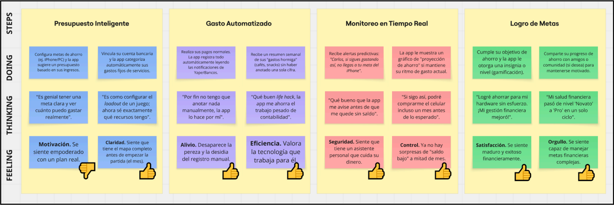
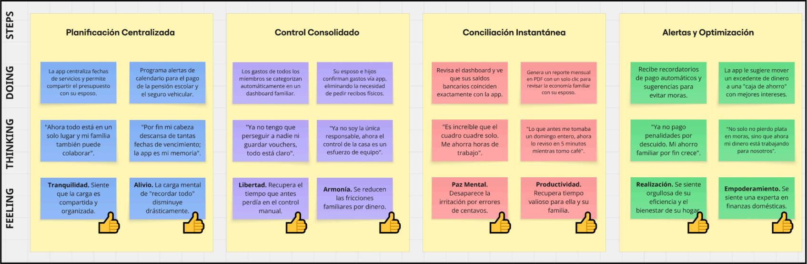
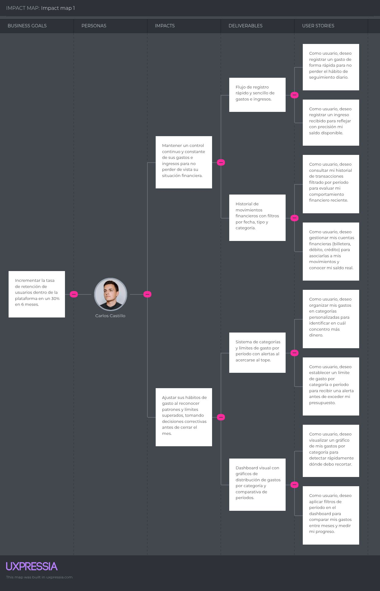
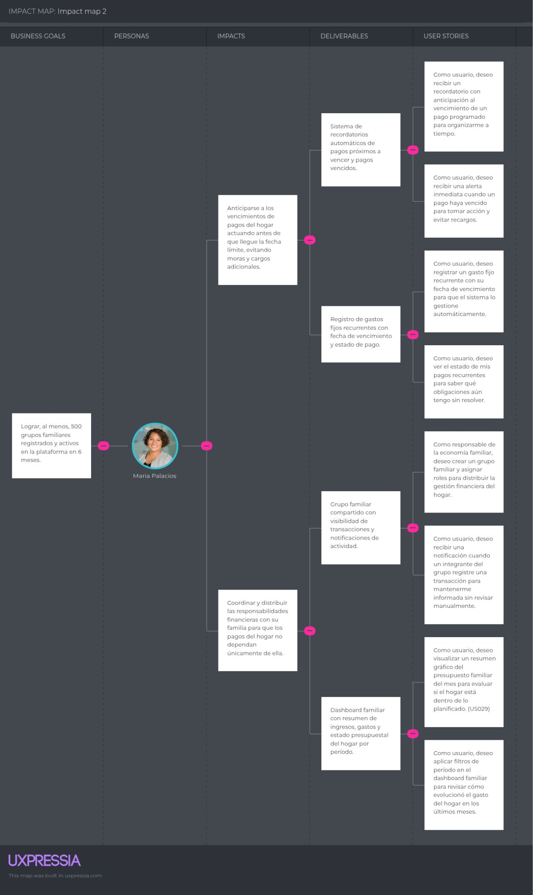

# Capítulo III: Requirements Specification

En este capítulo, se utilizan las fases anteriores de identificación de necesidades
de nuestros segmentos objetivos para transformar cada necesidad en una historia de
usuario que dé a entender lo que requiere cada uno para resolver su situación
problemática.

## 3.1. To-Be Scenario Mapping

El To-Be Scenario Mapping proyecta la experiencia ideal del usuario al interactuar con el nuevo producto, tomando como punto de partida las oportunidades de mejora identificadas previamente en el mapa As-Is. 

Para su elaboración, se utilizó la herramienta Miro, donde se analizaron las actividades actuales de cada User Persona y se reemplazaron sus puntos de dolor con las soluciones concretas que ofrece la plataforma. Durante este proceso de diseño, se realizó un ejercicio de empatía para simular las nuevas acciones, pensamientos y emociones que experimentaría el usuario al utilizar el sistema, lo cual permitió analizar el origen de dichos sentimientos y culminar con una evaluación general de los aspectos positivos y negativos resultantes de este nuevo flujo de interacción.

**User Persona 1: Carlos Castillo**

La implementación de Resolum redefine la gestión financiera de Carlos al sustituir el registro manual en Excel por un flujo de datos pasivo y automatizado, eliminando la fricción que antes provocaba el abandono de sus metas. Al integrar tecnologías de lectura de notificaciones y análisis predictivo, la plataforma transforma la "pereza" y la incertidumbre en un sentimiento de control y seguridad, permitiéndole visualizar el progreso real hacia sus objetivos de hardware y estudios en tiempo real. Este nuevo ecosistema no solo optimiza su precisión contable, sino que utiliza la gamificación para generar un refuerzo positivo, logrando que el usuario perciba su madurez financiera como un logro alcanzable y motivador, desplazando definitivamente la frustración del
modelo anterior.

**User Persona 2: María Palacios**

Para el segmento de María, el escenario To-Be se centra en la drástica reducciónde la carga cognitiva y la recuperación del tiempo personal mediante la centralización de la economía familiar. Resolum elimina el agotamiento derivado de la conciliación manual de vouchers y la persecución de gastos entre miembros del hogar, transformando una labor solitaria e irritante en un proceso transparente y colaborativo. Gracias al sistema de alertas inteligentes para vencimientos y el dashboard de conciliación instantánea, María logra desplazar el estrés por moras e imprevistos hacia una sensación de paz mental y empoderamiento, validando que la eficiencia operativa de la herramienta no solo protege el patrimonio familiar, sino que mejora la armonía y la calidad de vida de todos los integrantes del hogar.

## 3.2. User Stories

Para la especificación de requisitos de los usuarios, se desarrollaron las historias de usuario que describen cada requisito y funcionalidad que debe estar implementado en el desarrollo del producto final para satisfacer las necesidades de los segmentos objetivo.

A continuación se presentan las historias de usuario relacionadas con nuestra aplicación Intiva. Esta sección reúne historias de usuario centradas en la experiencia inicial con la plataforma de los miembros de familias con problemas de gestión financiera y de los responsables económicos de familias.

Primero, se identifican los Epics que agrupan a varias historias de usuario que tratan el mismo tema y que no pueden ser resueltas en un mismo sprint. Para ello, se toma como base para cada épica una funcionalidad relacionada a la aplicación.

### Epics (Themes & Epics)

| Themes | Epic ID | Título | Descripción |
| :--- | :--- | :--- | :--- |
| **Convertirse en usuario de la plataforma** | EP 001 | Comunicación de valor del negocio | **Como** visitante del sitio web estático **Quiero** entender claramente el valor de la plataforma **Para** sentirme motivado a convertirme en usuario de la plataforma y descargar la aplicación. |
| **Convertirse en usuario de la plataforma** | EP 002 | Seguridad de las cuentas de los usuarios | **Como** usuario de la plataforma **Quiero** autenticarme con mis credenciales o registrar una cuenta en la plataforma **Para** acceder de forma segura a la plataforma. |
| **Convertirse en usuario de la plataforma** | EP 003 | Gestión de perfiles de usuarios | **Como** usuario de la aplicación **Quiero** gestionar mi perfil **Para** mantener mi información personal actualizada. |
| **Planes de suscripción** | EP 004 | Acceso a planes de suscripción | **Como** usuario de la aplicación **Quiero** acceder a una mejora en mi plan de suscripción **Para** comparar entre los beneficios y precios. |
| **Administración de las finanzas** | EP 005 | Manejo de gastos e ingresos | **Como** usuario de la aplicación **Quiero** aprender a administrar mis ingresos y gastos **Para** tener un control preciso de mi dinero. |
| **Administración de las finanzas** | EP 006 | Planificación de metas de ahorro | **Como** usuario de la aplicación **Quiero** planificar metas de ahorro **Para** hacer un seguimiento de mi progreso. |
| **Administración de las finanzas** | EP 007 | Administración de cuentas de grupos o familias | **Como** responsable de la economía familiar **Quiero** crear un nuevo grupo **Para** administrar mis finanzas en conjunto a mi familia. |
| **Administración de las finanzas** | EP 008 | Alertas sobre gastos y ahorros | **Como** usuario de la aplicación **Quiero** recibir alertas por eventos relacionados a gastos y ahorros **Para** tener conocimiento de eventos críticos y ajustar los patrones de gasto para cumplir con mis objetivos financieros. |
| **Gráficos estadísticos** | EP 009 | Visualización de datos financieros | **Como** usuario de la aplicación **Quiero** visualizar mis datos financieros en gráficos estadísticos **Para** conocer patrones de gasto e ingreso. |

Luego, a partir de las épicas, se desglosa cada una en pequeñas historias que reciben un poco de la funcionalidad descrita. Además, se redactan los criterios de aceptación para definir condiciones específicas que debe cumplir el requisito definido.

### 3.2. User Stories

| ID | Título | Descripción | Criterios de Aceptación | Relacionado con |
| :--- | :--- | :--- | :--- | :--- |
| **US 001** | Conocer el valor de negocio de la plataforma | **Como** visitante del sitio web estático **Quiero** determinar el valor de negocio y su confiabilidad **Para** tomar la decisión de convertirme en usuario de la plataforma | **Escenario #1: El visitante conoce el propósito de la plataforma.** Dado que el visitante desea saber si la plataforma es confiable Cuando accede al sitio web estático Entonces identifica claramente el propósito general de la plataforma.  **Escenario #2: El visitante conoce sobre los integrantes de la startup.** Dado que el visitante desea saber si la plataforma es confiable Cuando accede a la sección sobre el equipo de desarrollo Entonces visualiza la foto de los integrantes, sus nombres y sus roles en el equipo.  **Escenario #3: Visitante lee los testimonios de clientes.** Dado que el visitante desea saber si la plataforma es confiable Cuando accede a la sección de testimonios Entonces puede conocer las experiencias de otros usuarios con la plataforma y sus funcionalidades.  **Escenario #4: El visitante accede a la sección de términos de servicio (ToS).** Dado que el visitante desea saber si el sitio web es confiable Cuando el visitante accede a la sección de términos y condiciones Entonces puede leer el contrato legal del uso de la plataforma.  **Escenario #5: El visitante toma la decisión de acceder a la plataforma.** Dado que el visitante reconoce que la plataforma es confiable Cuando accede a convertirse en usuario de la plataforma Entonces es redirigido a la página web principal o a la tienda de aplicaciones de su sistema operativo para descargar la aplicación. | EP 001 |
| **US 002** | Conocer el funcionamiento general de la plataforma | **Como** visitante del sitio web estático **Quiero** saber información sobre la plataforma **Para** analizar el uso según mi caso y evaluar la decisión de convertirme en usuario de la plataforma. | **Escenario #1: El visitante conoce el funcionamiento de la solución.** Dado que el visitante desea conocer la plataforma Cuando revisa la sección de funcionamiento Entonces se informa sobre las funcionalidades de forma clara y ordenada. Y visualiza un video que explica el funcionamiento del producto.  **Escenario #2: El visitante conoce los beneficios que ofrece la plataforma.** Dado que el visitante desea conocer la plataforma Cuando accede a la sección de beneficios Entonces encuentra los beneficios que obtendrá por usar la plataforma. | EP 001 |
| **US 003** | Registro de usuario | **Como** visitante **Quiero** registrarme **Para** utilizar las funcionalidades de la aplicación. | **Escenario #1: Visitante realiza un registro exitoso.** Dado que el visitante no posee una cuenta Cuando complete su registro ingresando su nombre completo, correo y contraseña Entonces el sistema crea una cuenta para dicho visitante.  **Escenario #2: Visitante falla al realizar su registro.** Dado que el visitante no posee una cuenta Cuando no ingrese su correo o contraseña en su registro Entonces el sistema avisará al usuario de que no completó alguna información.  **Escenario #3: Visitante intenta crear una cuenta con un correo ya utilizado.** Dado que el visitante no tenga una cuenta Cuando ingrese un correo ya asociado a una cuenta existente y su contraseña en su registro Entonces el sistema avisará al usuario de que ese correo ya está registrado.  **Escenario #5: Visitante realiza un registro exitoso con su cuenta de Google** Dado que el visitante no posee una cuenta Cuando complete su registro con su cuenta de Google Entonces el sistema crea una cuenta para dicho visitante con la información de su cuenta de Google. | EP 002 |
| **US 004** | Validación de información de registro | **Como** visitante **Quiero** registrarme con un correo que posea y una contraseña altamente segura **Para** que no pueda ser robada por externos. | **Escenario #1: Visitante intenta registrarse con un correo invalido** Dado que el usuario no posee una cuenta Cuando ingrese su correo y digite mal el formato de un correo electrónico Entonces el sistema le avisará que el correo no es válido.  **Escenario #2: Visitante intenta utilizar una contraseña débil en su registro** Dado que el visitante no posee una cuenta Cuando digite una contraseña con una longitud menor a 8 dígitos y que no posea símbolos o mayúsculas Entonces el sistema avisará al visitante que su contraseña no es válida.  **Escenario #3: Visitante utiliza una contraseña fuerte en su registro** Dado que el visitante no posee una cuenta Cuando digite una contraseña con una longitud mayor o igual a 8 dígitos y que posea símbolos y caracteres alfanuméricos Entonces el sistema avisará al visitante que su contraseña es fuerte y válida. | EP 002 |
| **US 005** | Inicio de sesión | **Como** usuario no autenticado **Quiero** iniciar sesión **Para** acceder de forma segura a mi cuenta. | **Escenario #1: Usuario ingresa sus credenciales correctamente** Dado que el usuario tenga una cuenta registrada Cuando ingresa su correo y contraseña Entonces accede a su cuenta.  **Escenario #2: Usuario ingresa sus credenciales de manera incorrecta** Dado que el usuario ingresa un correo o contraseña incorrectas Cuando intenta ingresar a su cuenta Entonces el sistema le impide el acceso a su cuenta.  **Escenario #3: Inicio de sesión exitoso con una cuenta Google** Dado que el usuario quiera ingresar al sistema Cuando elija su cuenta de Google Entonces el usuario se auténtica e ingresa a la aplicación.  **Escenario #4: Inicio de sesión exitoso con una cuenta de Google no registrada** Dado que el usuario no registrado quiera ingresar al sistema Cuando elija su cuenta de Google Entonces se le crea automáticamente una cuenta de usuario.  **Escenario #5: Cierre de sesión** Dado que el usuario esté autenticado en la aplicación móvil Cuando salga de su cuenta Entonces su sesión finaliza y debe digitar nuevamente sus credenciales para acceder a la plataforma. | EP 002 |
| ID | Título | Descripción | Criterios de Aceptación | Relacionado con |
| :--- | :--- | :--- | :--- | :--- |
| **US 006** | Restablecer contraseña | **Como** usuario no autenticado **Quiero** restablecer mi contraseña **Para** volver a acceder a mi cuenta | **Escenario #1: Usuario ingresa el código de seguridad** Dado que el usuario no autenticado haya solicitado la recuperación de su contraseña Cuando ingrese el código de 6 dígitos Entonces el sistema valida el código y le permite continuar con el proceso de restablecimiento.  **Escenario #2: Creación de nueva contraseña** Dado que el usuario ingrese una nueva contraseña Cuando cumpla con las validaciones Entonces se restablece su contraseña. | EP 002 |
| **US 007** | Gestionar perfil de usuario | **Como** usuario **Quiero** gestionar mi perfil **Para** conocer acerca de la información personal que está registrada en la plataforma | **Escenario #1: Visualización del perfil de usuario** Dado que el usuario ha iniciado sesión correctamente Cuando accede a su perfil Entonces se muestra su nombre completo, foto de perfil y correo.  **Escenario #2: Actualización de nombre exitoso** Dado que el usuario esté visualizando su perfil Cuando introduzca algún cambio en la información personal de su cuenta Entonces se actualiza su perfil correctamente.  **Escenario #3: Cambio exitoso de foto de perfil** Dado que el usuario accede a su perfil Cuando elige una nueva imagen Entonces se actualiza su foto de perfil.  **Escenario #4: Cancelación de cambio de foto de perfil** Dado que el usuario ha seleccionado una nueva imagen Cuando cancela ejecutar el cambio Entonces se mantiene la foto de perfil anterior.  **Escenario #5: Cancelación por imagen invalida** Dado que el usuario accede a su perfil Cuando intenta subir un archivo que no es una imagen o supera el tamaño permitido Entonces se muestra un mensaje indicando que el archivo no es válido. | EP 003 |
| **US 008** | Adquirir un plan de suscripción | **Como** usuario **Quiero** adquirir un plan de suscripción **Para** acceder a la plataforma y sus beneficios en manejo de ingresos, gastos y ahorros | **Escenario #1: Usuario visualiza los planes de suscripción disponibles** Dado que el usuario accede a la sección de planes de suscripción Cuando se carga la información de los planes disponibles Entonces se muestran los planes con su nombre, precio y beneficios.  **Escenario #2: Usuario no cuenta con un plan activo** Dado que el usuario accede a la sección de planes de suscripción Cuando no existen planes registrados Entonces se muestra un mensaje indicando que no hay planes disponibles.  **Escenario #3: Mejora exitosa del plan de suscripción** Dado que el usuario tiene una suscripción activa Cuando elije un plan con mayores beneficios y se concreta la transacción Entonces se habilita el plan junto a sus beneficios.  **Escenario #4: Error en el proceso de mejora de plan** Dado que el usuario tiene una suscripción activa Cuando elije un plan con mayores beneficios pero no se concreta la transacción Entonces no se activa el plan de suscripción. | EP 004 |
| **US 009** | Ver suscripción actual | **Como** usuario **Quiero** visualizar mi plan actual **Para** mis beneficios actuales | **Escenario #1: Usuario visualiza información de su suscripción actual** Dado que el usuario tenga una suscripción activa Cuando accede a la sección suscripción Entonces se muestra su plan actual con sus beneficios, precio y fecha vigente.  **Escenario #2: Usuario con el plan más alto activo** Dado que el usuario tiene activo el plan de suscripción con mayores beneficios Cuando accede a la sección de suscripción Entonces se muestra su plan actual y se deshabilita la opción de mejora.  **Escenario #3: Usuario posee una suscripción expirada** Dado que el usuario tenga una suscripción vencida Cuando accede a la sección de suscripción Entonces se muestra como expirada y se ofrecen opciones para renovar o elegir una nueva. | EP 004 |
| **US 010** | Realizar pago de suscripción | **Como** usuario **Quiero** pagar un plan de suscripción **Para** activar sus beneficios en la plataforma | **Escenario #1: Usuario paga exitosamente su suscripción** Dado que el usuario ha seleccionado un plan de suscripción Cuando se ingresan sus datos de pago y se confirma la transacción Entonces se activa la suscripción junto a sus beneficios correspondientes.  **Escenario #2: Pago rechazado** Dado que el usuario ha seleccionado un plan de suscripción Cuando se ingresan sus datos de pago y se cancela la transacción Entonces no se activa su plan de suscripción. | EP 004 |
| **US 011** | Gestionar cuentas financieras | **Como** usuario **Quiero** gestionar mis tarjetas o billeteras digitales **Para** asociarlas a mis gastos o ingresos Y trazar un registro de gastos realizados con mis cuentas financieras | **Escenario #1: Usuario registra una billetera** Dado que el usuario desea registrar una billetera Cuando elija el tipo billetera y le da un nombre y asigna su saldo actual Entonces se valida la información y se registra correctamente.  **Escenario #2: Registrar una tarjeta de débito** Dado que el usuario acceda a registrar una cuenta financiera Cuando selecciona el tipo tarjeta de débito e ingresa el nombre y su saldo actual Entonces se valida la información y se registra correctamente.  **Escenario #3: Registrar una tarjeta de crédito** Dado que el usuario acceda a registrar una cuenta financiera Cuando selecciona el tipo tarjetas de crédito e ingresa su nombre y saldo actual Entonces se valida la información y se registra correctamente.  **Escenario #4: Ver cuentas financieras disponibles** Dado que el usuario quiera consultar el estado de sus cuentas Cuando accede a la sección de billetera Entonces se muestra una lista de cuentas financieras registradas.  **Escenario #5: El usuario no cuenta con cuentas bancarias** Dado que el usuario no tenga registrado cuentas bancarias Cuando accede a la sección de billetera Entonces se le da la posibilidad de agregar una cuenta. | EP 005 |
| **US 012** | Registrar transacciones de cuentas financieras | **Como** usuario **Quiero** registrar gastos realizados desde mis cuentas financieras **Para** llevar un control de mis egresos | **Escenario #1: Gasto con billetera o tarjeta de débito** Dado que el usuario tiene una billetera o tarjeta de débito con saldo disponible Cuando registre un gasto seleccionado a esa cuenta e ingrese el monto Entonces se registra el gasto y se descuenta del saldo disponible.  **Escenario #2: Gasto con tarjeta de crédito** Dado que el usuario tiene una tarjeta de crédito con una línea disponible Cuando registra un gasto e ingresa el monto Entonces se registra el gasto y se acumula en la deuda en la tarjeta de crédito.  **Escenario #3: Saldo insuficiente** Dado que el usuario tiene una cuenta con saldo insuficiente Cuando intenta registrar un gasto mayor al saldo disponible Entonces se muestra un mensaje de error y no se registra un gasto. | EP 005 |
| **US 013** | Inhabilitar cuenta bancaria o wallet | **Como** usuario **Quiero** inhabilitar el uso de una cuenta financiera registrada **Para** indicar que ya no voy a usar para futuras transacciones | **Escenario #1: Usuario inicia inhabilitación de cuenta financiera** Dado que el usuario tenga una cuenta financiera activa y ya no la necesite Cuando decide inhabilitarla Entonces recibe un código de 6 dígitos en su correo electrónico.  **Escenario #2: Usuario inhabilita una cuenta financiera** Dado que recibe el código de seguridad en su correo Cuando introduce el código Entonces la cuenta financiera se inhabilitó. | EP 005 |
| **US 014** | Registrar gasto | **Como** usuario **Quiero** registrar un gasto **Para** poseer un registro detallado de los gastos que hago con mi dinero | **Escenario #1: Registro de un gasto con monto fijo** Dado que el usuario tenga una cuenta financiera o efectivo disponible Cuando registra un gasto fijo e ingresa los datos (origen, monto, fecha y frecuencia) Entonces se guarda el gasto correctamente y se actualiza el saldo según el origen seleccionado.  **Escenario #2: Registro con monto inválido** Dado que el usuario registre un gasto Cuando ingrese un monto que supere el saldo o vacío Entonces se muestra un mensaje de error y no se registra el gasto.  **Escenario #3: Registro de un gasto con monto variable** Dado que el usuario haya realizado un gasto Cuando registra un gasto variable e ingresa los datos (origen, monto, fecha y opcionalmente su frecuencia) Entonces se guarda el gasto correctamente y se actualiza el saldo según el origen seleccionado.  **Escenario #4: Registro de un gasto automatico** Dado que el usuario tenga un gasto fijo configurado Cuando se cumpla con la fecha programada Entonces se registra automáticamente el gasto y se actualiza el saldo.  **Escenario #5: Registro de un gasto automatico sin saldo suficiente** Dado que el usuario tenga un gasto fijo configurado y no cuenta con el saldo suficiente Cuando se cumpla con la fecha programada Entonces se registra el gasto con estado pendiente o fallido y se notifica al usuario sobre la falta de saldo. | EP 005 |
| **US 015** | Registrar ingreso | **Como** usuario **Quiero** registrar un ingreso **Para** identificar fácilmente el dinero que recibo | **Escenario #1: Registro de ingreso fijo** Dado que el usuario registre un ingreso fijo Cuando ingrese el origen, monto, frecuencia y fecha Entonces se guarda el ingreso y se actualiza su saldo.  **Escenario #2: Registro de ingreso variable** Dado que el usuario registre un ingreso variable Cuando ingrese el origen, monto, frecuencia y fecha Entonces se guarda el ingreso y se actualiza su saldo.  **Escenario #3: Registro de ingreso automático** Dado que el usuario tenga un ingreso fijo configurado Cuando se cumpla la fecha programada Entonces se registra automáticamente el ingreso y se actualiza el saldo. | EP 005 |
| **US 016** | Historial de transacciones | **Como** usuario **Quiero** visualizar mis ingresos y gastos **Para** revisar mis movimientos financieros | **Escenario #1: Ver historial de transacciones** Dado que el usuario tenga transacciones registradas Cuando accede a la sección de historial de transacciones Entonces se muestra una lista de ingresos y gastos con su información correspondiente.  **Escenario #2: Sin transacciones registradas** Dado que el usuario no tenga transacciones registradas Cuando accede a la sección de historial de transacciones Entonces se muestra un mensaje indicando que no hay movimientos.  **Escenario #3: Filtrado de transacciones** Dado que el usuario visualiza su historial Cuando aplica filtros (fecha, tipo o categoría) Entonces se muestra solo las transacciones que cumplen con dicho criterio. | EP 005 |
| **US 017** | Crear categorías de gastos | **Como** usuario **Quiero** crear categorías de gastos **Para** separarlas de forma ordenada | **Escenario #1: Creación de categoría de gasto** Dado que el usuario se encuentre autenticado Cuando ingresa el nombre de una nueva categoría de gasto Entonces se registra la categoría correctamente.  **Escenario #2: Nombre de categorìa duplicado** Dado que el usuario tenga una categoría con el mismo nombre Cuando intente crear una categoría nueva Entonces se muestra un mensaje de error.  **Escenario #3: Visualización de categorías registradas** Dado que el usuario tenga una categoría registrada Cuando accede a la sección de manejo de gastos e ingresos. Entonces se muestra el nombre de la categoría registrada. | EP 005 |
| **US 018** | Definir límites de gasto | **Como** usuario **Quiero** establecer un límite de gasto **Para** no exceder mi presupuesto | **Escenario #1: Definir límites en categorías** Dado que el usuario tenga categorías de gasto registradas Cuando establece un límite de gasto para esa categoría en un determinado periodo Entonces se guarda el límite configurado y se asociada a esa categoría correspondiente.  **Escenario #2: Definir límites en cuenta bancarias** Dado que tenga cuentas bancarias registradas Cuando establece un límite de gasto para esa cuenta en un determinado período Entonces se guarda el límite configurado y se asocia a esa cuenta.  **Escenario #3: Definir límites por periodos** Dado que el usuario desee control gastos en un tiempo Cuando establece un límite de gasto indicando un periodo (diario, semanal o mensual) Entonces se guarda el límite configurado y se aplica durante ese periodo.  **Escenario #4: Visualizar límites de una tarjeta de crédito** Dado que el usuario tenga una tarjeta de crédito Cuando accede a la información de su tarjeta Entonces se muestra el límite total de crédito Y el monto utilizado y disponible.  **Escenario #5: Usuario visualiza límites de gasto** Dado que el usuario posee límites registrados Cuando accede a la sección de límites Entonces se muestran los límites de gasto registrados Y el monto utilizado y disponible. | EP 005 |
| **US 019** | Crear una meta de ahorro | **Como** usuario **Quiero** crear una meta ahorro **Para** estable un objetivo financiero | **Escenario #1: Crear una meta de ahorro personal** Dado que el usuario tenga una meta de ahorro personal Cuando ingresa el nombre, monto objetivo y la fecha límite Y el tiempo límite para modificar y eliminar dicha meta de ahorro Entonces se registra la meta de ahorro en la cuenta del usuario.  **Escenario #2: Crear una meta de ahorro compartida** Dado que los responsable de familia tenga una meta de ahorro en conjunto Cuando ingrese el nombre de la meta, monto objetivo y la fecha límite Y el tiempo límite para modificar y eliminar dicha meta de ahorro Entonces se registra la meta de ahorro para todo el grupo.  **Escenario #3: Usuario visualiza metas de ahorro personal** Dado que el usuario posee una meta de ahorro registrada Cuando ingrese a la sección de manejo de ahorros Entonces se muestra la meta de ahorro, el monto ahorrado y el tiempo restante para la misma.  **Escenario #4: Integrantes de la familia visualizan metas de ahorro grupales** Dado que la familia posee una meta de ahorro registrada Cuando los integrantes accedan a la sección de manejo de ahorros de la familia Entonces se muestra la meta de ahorro, el monto ahorrado y el tiempo restante para la misma. | EP 006 |
| **US 020** | Modificar una meta de ahorro | **Como** usuario **Quiero** modificar una meta de ahorro existente **Para** ajustarla a mi situación actual | **Escenario #1: Usuario intenta modificar una meta de ahorro** Dado que el tiempo de modificación de la meta de ahorro ha culminado Cuando intente modificar información de la meta registrada Entonces se muestra un mensaje que indica que el tiempo de modificación ya culminó.  **Escenario #2: Modificar una meta de ahorro personal** Dado que el tiempo de modificación de la meta de ahorro aún está vigente Cuando modifique el nombre, monto objetivo o fecha límite Entonces se guardan los cambios y se actualizan los datos.  **Escenario #3: Modificar una meta de ahorro compartida** Dado que el tiempo de modificación de la meta de ahorro compartida aún está vigente Cuando modifique el nombre, monto objetivo o fecha límite Entonces se guardan los cambios y se actualizan los datos. | EP 006 |
| **US 021** | Aportar a una meta de ahorro definida | **Como** usuario **Quiero** registrar aportes de dinero a una meta de especifica **Para** reducir el saldo restante y acercarme al cumplimiento de mi objetivo financiero | **Escenario #1: Registro exitoso de un aporte.** Dado que se ha seleccionado una meta activa personal o compartida Cuando el usuario ingrese un monto válido y confirme la transacción Entonces el sistema descuenta el monto del saldo restante de la meta y registra la contribución en el historial.  **Escenario #2: Intento de aporte de un monto invalido.** Dado que el usuario se encuentra en la pantalla de detalle de una meta Cuando intenta registrar un aporte de cantidad inválida como valor cero o negativo Entonces el sistema muestra un mensaje de error y no actualiza la meta. | EP 006 |
| **US 022** | Cumplimiento de una meta | **Como** usuario **Quiero** saber cuando una meta de ahorro esté completa **Para** saber que logré cumplir a mi objetivo Y mejorar mis hábitos de ahorro | **Escenario #1: Cumplimiento de una meta** Dado que se tenga una de ahorro personal o compartida Cuando se llegue al monto objetivo Entonces se marca la meta como completada Y se notifica al participante o los participantes que aportaron a dicha meta de ahorro.  **Escenario #2: Usuario no cumple una meta** Dado que se tenga una de ahorro personal o compartida Cuando no se logra alcanzar el monto objetivo Entonces se marca la meta como incompleta Y se notifica al participante o los participantes que aportaron a dicha meta de ahorro | EP 006 |
| **US 023** | Gestionar un grupo familiar | **Como** responsable de la economía familiar **Quiero** gestionar un grupo familiar en la plataforma **Para** manejar ingresos, gastos y ahorros compartidos con mi familia | **Escenario #1: Responsable de la economía familiar crea un grupo de familia** Dado que un responsable de familia quiera compartir sus finanzas con otros familiares Cuando ingrese el nombre del grupo y envíe una invitación a otros familiares Entonces se crea un grupo familiar y se asigna como administrador del grupo.  **Escenario #2: Responsable de la economía familiar crea una nueva invitación** Dado que el responsable de la economía familiar quiera agregar integrantes al grupo Cuando cree una nueva invitación Entonces el anterior enlace se invalida y se muestra información de la nueva invitación.  **Escenario #3: Responsable de la economía familiar envía el QR de invitación** Dado que el responsable de la economía familiar quiera agregar integrantes al grupo Cuando les envié un QR con la invitación al grupo Entonces el nuevo integrante debe escanearlo para acceder al grupo.  **Escenario #4: Responsable de la economía familiar envía el enlace de invitación** Dado que el responsable de la economía familiar quiera agregar integrantes al grupo Cuando les envié un enlace de invitación Entonces el nuevo integrante debe acceder a él y aceptar la invitación.  **Escenario #5: Usuario ya pertenece al grupo** Dado que el usuario ya es miembro de un grupo Cuando se intenta enviar una invitación Entonces se muestra un mensaje indicando que ya pertenece al grupo. | EP 007 |
| **US 024** | Aceptar o rechazar invitación al grupo | **Como** integrante de familia **Quiero** aceptar o rechazar una invitación a un grupo **Para** decidir si participo en la gestión financiera familiar | **Escenario #1: Aceptar invitación pendiente** Dado que el usuario tiene una invitación pendiente y vigente Cuando decide aceptarla desde la sección de notificaciones o invitaciones Entonces se agrega como miembro del grupo y puede ver las finanzas familiares.  **Escenario #2: Rechazar invitación pendiente** Dado que el usuario tiene una invitación pendiente Cuando decide rechazarla Entonces no se agrega al grupo y la invitación se marca como rechazada.  **Escenario #3: Invitación expirada** Dado que la invitación ya venció o fue previamente respondida Cuando el usuario intenta interactuar con ella Entonces el sistema muestra un mensaje indicando que la invitación ya no es válida. | EP 007 |
| **US 025** | Gestionar integrantes del grupo | **Como** usuario **Quiero** gestionar y definir roles en los integrantes del grupo familiar **Para** tener conocimiento de quiénes participan en el grupo | **Escenario #1: Usuario visualiza los integrantes del grupo** Dado que un usuario pertenezca a un grupo Cuando visualiza a los integrantes del grupo Entonces se muestra una lista con la información de ellos y su participación en el grupo.  **Escenario #2: No existen integrantes en el grupo** Dado que un responsable de la economía familiar pertenezca a un grupo vacío Cuando accede a la sección de integrantes Entonces se muestra un mensaje invitándolo a agregar al grupo a los integrantes de su familia.  **Escenario #3: Asignación de roles** Dado que el responsable de la economía familiar de un grupo Cuando a un miembro se le asigna un rol Entonces se actualiza el rol del miembro y sus permisos. | EP 007 |
| **US 026** | Recibir alerta por exceso de gasto | **Como** usuario **Quiero** recibir una alerta cuando supere un límite de gasto **Para** saber que debo controlar los gastos que he realizado. | **Escenario #1: Sistema genera alerta por superar límite de gasto de categoría** Dado que el valor actual gastado de un límite asociado a una categoría esté cerca del valor de límite Cuando el usuario registra un gasto para dicho límite Entonces se manda una alerta que indique que se ha sobrepasado el límite de gasto.  **Escenario #2: Alerta por superar límite de cuentas financieras** Dado que el valor actual gastado de un límite asociado a una cuenta financiera esté cerca del valor de límite Cuando el usuario registra un gasto para dicho límite Entonces se manda una alerta que indique que se ha sobrepasado el límite de gasto.  **Escenario #3: Alerta por superar límite de gasto en periodos** Dado que el valor actual gastado de un límite asociado a un periodo esté cerca del valor de límite Cuando el usuario registra un gasto para dicho límite Entonces se manda una alerta que indique que se ha sobrepasado el límite de gasto.  **Escenario #4: Alerta por superar límite de gasto en tarjeta crédito** Dado que el valor actual gastado de un límite asociado a una tarjeta de crédito esté cerca del valor de límite Cuando el usuario registra un gasto para dicho límite Entonces se manda una alerta que indique que se ha sobrepasado el límite de gasto. | EP 008 |
| **US 027** | Recibir notificaciones por proximidad de límite de gasto | **Como** usuario **Quiero** recibir una alerta cuando esté cerca de mi límite de gasto **Para** evitar excederme en los gastos relacionados a dicho límite | **Escenario #1: Sistema genera notificación por proximidad al límite de gasto de categoría** Dado que el valor actual gastado de un límite asociado a una categoría esté cerca del valor de límite Cuando el usuario registra un gasto para dicho límite Entonces se manda una notificación que indique que está próximo a romper el límite de gasto.  **Escenario #2: Sistema genera notificación por proximidad al límite de gasto de billetera** Dado que el valor actual gastado de un límite asociado a una cuenta financiera esté cerca del valor de límite Cuando el usuario registra un gasto para dicho límite Entonces se manda una notificación que indique que está próximo a romper el límite de gasto.  **Escenario #3: Sistema genera notificación por proximidad al límite de gasto por periodo** Dado que el valor actual gastado de un límite asociado a un periodo esté cerca del valor de límite Cuando el usuario registra un gasto para dicho límite Entonces se manda una notificación que indique que está próximo a romper el límite de gasto.  **Escenario #4: Sistema genera notificación por proximidad al límite de gasto de tarjeta bancaria** Dado que el valor actual gastado de un límite asociado a una tarjeta bancaria esté cerca del valor de límite Cuando el usuario registra un gasto para dicho límite Entonces se manda una notificación que indique que está próximo a romper el límite de gasto. | EP 008 |
| **US 028** | Recibir alerta por metas de ahorro | **Como** usuario **Quiero** ser notificado cuando haya o no haya cumplido una meta de ahorro **Para** saber si logré cumplir mi objetivo | **Escenario #1: Usuario completa meta de ahorro** Dado que el usuario ha creado una meta de ahorro Cuando alcance el valor objetivo Entonces se le enviará una notificación felicitándolo por cumplir su objetivo.  **Escenario #2: Usuario no completa meta de ahorro** Dado que el usuario ha creado una meta de ahorro Cuando no logra alcanzar el monto objetivo Entonces se le envía una alerta indicando cuánto le faltó para cumplir su objetivo. | EP 008 |
| **US 029** | Notificación por eventos relacionados a grupos familiares | **Como** usuario **Quiero** que se me notifique cuando se realice una transacción en mi grupo familiar **Para** estar al tanto de los movimientos que realiza mi familia. | **Escenario #1: Usuario recibe una notificación por registro de transacción en el grupo** Dado que un usuario pertenece a un grupo Cuando otro integrante realiza una transacción Entonces se le envía una notificación sobre la acción realizada.  **Escenario #2: Usuario recibe una notificación de un grupo** Dado que un usuario es invitado a un grupo Cuando otro usuario le envía la invitación Entonces el sistema le envía una notificación de invitación al grupo. | EP 008 |
| **US 030** | Recibir recordatorios sobre el vencimiento del pago | **Como** usuario **Quiero** ser notificado sobre de la fecha de pago **Para** no olvidar la fecha de pago | **Escenario #1: Gasto programado cerca a su fecha de vencimiento** Dado que el usuario configuró una fecha de pago a un gasto Cuando dicha fecha se encuentra cerca a su vencimiento Entonces se envía una notificación al usuario indicando qué pago se encuentra cerca a vencer.  **Escenario #2: Fecha de pago ha vencido** Dado que el usuario configuró una fecha de pago a un gasto Cuando dicha fecha vence Entonces se envía una alerta al usuario indicando qué pago es el que ha vencido | EP 008 |
| **US 031** | Visualizar gráficos estadísticos con datos de gastos, ingresos y ahorro | **Como** responsable de la economía familiar **Quiero** visualizar los ingresos, gastos y ahorros mediante un dashboard y gráficos estadísticos **Para** identificar patrones de gasto y tendencias de ahorro Y poder tomar mejores decisiones en el futuro | **Escenario #1: Visualizar gráfico estadístico por tipo de dato financiero** Dado que el usuario quiera visualizar sus datos financieros Cuando acceda al sitio web Entonces se le muestra un dashboard con gráficos según su categoría, cuentas bancarias, límites de gasto y metas de ahorro.  **Escenario #2: Visualizar datos financiero por tipo de gráfico** Dado que el usuario quiera visualizar sus datos financieros por otros tipos de gráficos Cuando acceda al sitio web Entonces se le muestra un dashboard con gráficos según el tipo (barras o circular).  **Escenario #3: Visualizar gráficos estadísticos en un determinado periodo** Dado que el usuario quiera visualizar sus datos financieros en un determinado periodo Cuando acceda al sitio web Entonces se le muestra un dashboard con gráficos según el periodo ingresado.  **Escenario #4: Usuario descarga un gráfico estadístico** Dado que el usuario desea descargar un gráfico estadístico Cuando elija el formato de descarga Entonces se inicia la descarga. | EP 009 |

Además, aparte de las historias de usuario convencionales que van dirigidas a los usuarios de la plataforma, se redactan historias técnicas que poseen información técnica sobre infraestructura, arquitectura, seguridad y soporte funcional de la plataforma.

### Technical Stories

| ID | Título | Descripción | Criterios de Aceptación |
| :--- | :--- | :--- | :--- |
| **TS 001** | Encriptación de contraseñas | **Como** desarrollador **Quiero** que todas las contraseñas se almacenan encriptadas en la base de datos **Para** proteger la información sensible de los usuarios ante brechas de seguridad. | **Escenario #1: Implementación de BCrypt** Dado que el sistema maneje credenciales de acceso Cuando se procesa una contraseña antes de almacenarla Entonces se utiliza BCrypt para generar un hash seguro.  **Escenario #2: Contraseña almacenada correctamente** Dado que un usuario se registra con una contraseña válida Cuando el sistema procesa el registro Entonces la contraseña se almacena usando un algoritmo de hashing como SHA-256 seguro y nunca en texto plano.  **Escenario #3: Verificación en inicio de sesión** Dado que el usuario intenta autenticarse Cuando el sistema compara la contraseña ingresada con la almacenada Entonces la comparación se realiza mediante el algoritmo de hashing, sin desencriptar la contraseña original. |
| **TS 002** | Autenticación con JWT | **Como** desarrollador **Quiero** implementar autenticación basada en JSON Web Tokens **Para** verificar la identidad del usuario en cada solicitud sin mantener sesiones en el servidor. | **Escenario #1: Generación de token válido** Dado que el usuario se autentica correctamente Cuando el sistema valida sus credenciales Entonces se genera un JWT firmado con tiempo de expiración configurado.  **Escenario #2: Token expirado o inválido** Dado que el usuario realiza una solicitud con un token vencido o manipulado Cuando el sistema intenta validarlo Entonces rechaza la solicitud con estado 401 sin revelar detalles internos del sistema.  **Escenario #3: Protección de endpoints privados** Dado que existe un endpoint que requiere autenticación Cuando se accede sin token o con token inválido Entonces el sistema deniega el acceso automáticamente.  **Escenario #4: Uso de patrón chain of responsibility** |
| **TS 003** | Cifrado de comunicaciones con HTTPS | **Como** desarrollador **Quiero** que toda comunicación entre el cliente y el servidor se realice mediante HTTPS con TLS **Para** proteger los datos transmitidos de interceptaciones. | **Escenario #1: Rechazo de conexiones HTTP** Dado que un cliente intenta conectarse mediante HTTP sin cifrado Cuando el servidor recibe la solicitud Entonces redirige automáticamente a HTTPS o rechaza la conexión.  **Escenario #2: Certificado válido en producción** Dado que el sistema está desplegado en producción Cuando el cliente establece conexión Entonces el certificado TLS es válido, no ha expirado y está emitido por una autoridad reconocida. |
| **TS 004** | Stack tecnológico del sitio web estático | **Como** equipo de desarrollo **Quiero** usar un stack tecnológico basado en Astro.js para el sitio web estático **Para** que el desarrollo esté alineado con los requisitos de rendimiento de la plataforma. | **Escenario #1: Requisitos técnicos del stack elegido** Dado el stack seleccionado para el sitio web estático Cuando se revisen los requisitos del proyecto Entonces el stack elegido debe cumplir con criterios clave como generación estática (SSG) y rendimiento optimizado.  **Escenario #2: Stack documentado y acordado** Dado que el equipo inicia el desarrollo del sitio web estático Cuando se define el stack tecnológico Entonces queda documentado el lenguaje de programación, framework y versiones mínimas requeridas. |
| **TS 005** | Stack tecnológico del backend | **Como** desarrollador **Quiero** definir formalmente el stack tecnológico del servidor hecho con Spring Boot **Para** garantizar consistencia, mantenibilidad y escalabilidad en todo el desarrollo del proyecto. | **Escenario #1: Tecnologías a usar para la API** Dado que se requiera implementar una API robusta Cuando se define el uso de Java y Spring Boot Entonces se establece Spring Web, Spring Data JPA, Hibernate, Spring Security y Lombok.  **Escenario #2: Stack documentado y acordado** Dado que el equipo inicia el desarrollo del backend Cuando se define el stack tecnológico Entonces queda documentado el lenguaje de programación, framework y versiones mínimas requeridas.  **Escenario #3: Implementación de un controlador para base de datos PostgreSQL** Dado que la aplicación backend requiera conectarse a una base de datos PostgreSql Cuando se integre el driver Postgre JDBC Driver Entonces se establece una conexión con la base de datos.  **Escenario #4: Versión del JDK** Dado que se requiere estabilidad y soporte a largo plazo en el backend Cuando se define la versión del lenguaje para el proyecto en Spring Boot Entonces se selecciona la versión LTS Java 21. |
| **TS 006** | Stack tecnológico del frontend web | **Como** desarrollador **Quiero** definir el stack tecnológico de la aplicación web Vue **Para** asegurar una base sólida de desarrollo de la interfaz de usuario. | **Escenario #1: Framework y versiones definidas** Dado que el equipo desea desarrollar una aplicación web Cuando se define el uso de Vue y JavaScript Entonces quedan documentadas las dependencias de la interfaz de usuario con PrimeVue, así como la herramienta de build y las versiones mínimas requeridas.  **Escenario #2: Implementación de peticiones HTTP** Dado que el equipo desea que la aplicación web realice peticiones HTTP al API Cuando el equipo evalúa herramientas para consumo de servicios Entonces el equipo decide utilizar la biblioteca Axios para realizar consumo de servicios desde la aplicación web.  **Escenario #3: Implementación de gestión de estados en la aplicación web** Dado que el equipo desea gestionar estados en la aplicación web Cuando evalúa los conocimientos y requisitos del proyecto Entonces el equipo elige Pinia como biblioteca para gestión de estados en Vue.  **Escenario #4: Implementación de i18n en la aplicación web** Dado que el equipo desea que la aplicación web soporte distintos idiomas Cuando evalúa la implementación de internacionalización Entonces el equipo elige la biblioteca Vue-i18n para gestionar traducciones de los textos de la aplicación web.  **Escenario #5: Compatibilidad con navegadores objetivo** Dado que la aplicación web es utilizada por el usuario Cuando accede desde los navegadores Chrome, Firefox o Edge en sus versiones actuales Entonces la aplicación se renderiza y funciona correctamente. |
| **TS 007** | Stack tecnológico de la aplicación móvil | **Como** desarrollador **Quiero** definir el stack de la aplicación móvil nativa para Android Kotlin **Para** garantizar compatibilidad con los dispositivos del segmento objetivo. | **Escenario #1: Versión mínima de Android soportada** Dado que el usuario tiene un dispositivo Android Cuando instala la aplicación Entonces esta es compatible con Android 8.0 o superior, cubriendo al segmento objetivo identificado.  **Escenario #2: Integración de UI y navegación** Dado que se quiera implementar la interfaz de usuario y navegación entre pantallas Cuando se define el stack tecnológico de la aplicación móvil Entonces se integra JetPack Compose para la construcción de la UI Y se implementa la navegación entre pantallas usando Compose Navigation.  **Escenario #3: Consumo de APIs e inyecciones de dependencia** Dado que la aplicación requiera consumir servicios externos Cuando se necesita gestionar las dependencias de red de forma desacoplada Entonces se integra Retrofit para realizar consultas HTTP Y se utiliza Hilt para el manejo de inyecciones de dependencia. |
| **TS 008** | Arquitectura RESTful de la API | **Como** desarrollador **Quiero** que la API siga los principios REST con una estructura de rutas consistente **Para** facilitar la integración entre el frontend, la app móvil y el servidor. | **Escenario #1: Convención de nomenclatura de rutas** Dado que se diseña un nuevo endpoint para el API Cuando se define en qué ruta se implementa Entonces sigue el patrón /api/(versión)/(que nombre se colocará a esta endpoint) en plural y en minúsculas, usando sustantivos y no verbos.  **Escenario #2: Versionado de la API** Dado que se realizan cambios que rompen compatibilidad Cuando se publica una nueva versión Entonces la versión anterior sigue disponible bajo /api/(versión)/(nombre que se coloca al endpoint) durante el ciclo de vida del proyecto. |
| **TS 009** | Manejo estándar de errores HTTP | **Como** desarrollador **Quiero** definir una política uniforme de códigos de estado HTTP y mensajes de error **Para** que los clientes puedan manejar los errores de forma predecible. | **Escenario #1: Errores de validación con 422** Dado que una solicitud contiene campos inválidos o incompletos Cuando el servidor la procesa Entonces responde con estado 422 e indica en el cuerpo qué campos fallaron y su razón.  **Escenario #2: Recursos no encontrados con 404** Dado que se solicita un recurso con un ID que no existe Cuando el servidor busca el recurso Entonces responde con estado 404 y un mensaje descriptivo sin exponer detalles internos.  **Escenario #3: Mal uso de formato o estructura del endpoint con 400** Dado que se envía una petición al servidor con un formato distinto al definido para el endpoint Cuando el servidor intenta analizar el paquete recibido Entonces responde con estado 400 y un mensaje descriptivo sobre qué dato está faltando o con errores.  **Escenario #4: Errores internos con 500** Dado que ocurre un error inesperado en el servidor Cuando el sistema lo detecta Entonces responde con 500, registra el error en los logs y no expone el stack trace al cliente. |
| **TS 010** | Rendimiento y tiempos de respuesta de la API | **Como** desarrollador **Quiero** establecer tiempos de respuesta máximos aceptables para los endpoints principales **Para** garantizar una experiencia de uso fluida para los usuarios. | **Escenario #1: Respuesta en operaciones de consulta** Dado que el usuario realiza una consulta de datos Cuando el sistema procesa la solicitud bajo condiciones normales Entonces el tiempo de respuesta no supera los 2 segundos.  **Escenario #2: Respuesta en operaciones de escritura** Dado que el usuario registra una transacción, gasto o ingreso Cuando el sistema procesa la solicitud Entonces el tiempo de respuesta no supera los 1.5 segundos. |
| **TS 011** | Integración con servicio de almacenamiento de imágenes | **Como** desarrollador **Quiero** usar el servicio de Cloudinary para el almacenamiento de imágenes de perfil mediante un servicio externo **Para** no sobrecargar el servidor propio con archivos binarios. | **Escenario #1: Formato de imagen restringido** Dado que el servicio externo Cloudinary solo acepta imágenes en formatos JPG, PNG y WEBP con tamaño máximo de 5 MB Cuando el sistema recibe una imagen de perfil con uno de los formatos válidos Y la procesa antes de enviarla al API de Cloudinary Entonces Cloudinary la almacena y devuelve el URL de la imagen.  **Escenario #2: Fallo del servicio externo** Dado que el servicio de Cloudinary no está disponible Cuando el sistema intenta procesar la actualización de una foto de perfil Entonces el sistema informa del error sin afectar al resto de funcionalidades de la aplicación. |
| **TS 012** | Disponibilidad y uptime del sistema | **Como** desarrollador **Quiero** que el sistema tenga una disponibilidad mínima definida **Para** garantizar que los usuarios puedan acceder a la plataforma cuando lo necesiten. | **Escenario #1: Disponibilidad mínima en producción** Dado que el sistema está desplegado en producción Cuando se mide el uptime mensual Entonces la disponibilidad no es menor al 95% del tiempo.  **Escenario #2: Notificación de mantenimiento programado** Dado que se planifica una ventana de mantenimiento Cuando el sistema va a estar temporalmente inaccesible Entonces se comunica a los usuarios con al menos 24 horas de anticipación. |
| **TS 013** | Cumplimiento de protección de datos personales | **Como** desarrollador **Quiero** que el sistema gestione los datos personales siguiendo principios básicos de privacidad **Para** proteger la información sensible de los usuarios | **Escenario #1: Datos mínimos requeridos en registro** Dado que un visitante se registra Cuando el sistema solicita su información Entonces solo pide los datos estrictamente necesarios sin solicitar información sensible innecesaria.  **Escenario #2: Acceso restringido a datos entre usuarios** Dado que dos usuarios pertenecen a grupos diferentes Cuando uno intenta acceder a los datos del otro Entonces el sistema deniega el acceso y no expone información privada entre cuentas no relacionadas. |
| **TS 014** | Uso de almacenamiento en caché con redis | **Como** desarrollador **Quiero** almacenar datos en caché con Redis **Para** mejorar el rendimiento de la aplicación y reducir el tiempo de respuestas ante consultas frecuentes | **Escenario #1: Obtener datos desde caché** Dado que haya datos guardados en caché Cuando se realice un consulta para la obtención de datos para el dashboard Entonces el sistema devuelve los datos desde Redis sin consultar directamente a la base de datos.  **Escenario #2: Generar token para recuperación de contraseñas** Dado que se se solicite la recuperación de una contraseña Cuando el sistema genera un token Entonces se almacena en Redis con un tiempo de expiración definido. |
| **TS 015** | Implementación de bases de datos | **Como** desarrollador **Quiero** permitir la persistencia de datos en la aplicación backend y móvil **Para** garantizar almacenamiento confiable y sincronización eficiente de la información. | **Escenario #1: Persistencia de datos con ORM** Dado que existan entidades de dominio mapeadas como clases Java usando JPA Cuando se realiza una operación de escritura o consulta Entonces el ORM traduce las operaciones en instrucciones SQL.  **Escenario #2: Persistencia local en la app móvil con Room** Dado que el acceso este definido mediante interfaces Dao en Room Cuando se ejecute una operación para la base de datos Entonces Room traduce las operaciones a instrucciones SQL. |
| **TS 016** | Configuración de nginx | **Como** desarrollador **Quiero** utilizar nginx como proxy inverso frente al backend **Para** gestionar el enrutamiento de peticiones | **Escenario #1: Enrutamiento de peticiones al backend** Dado que un cliente realiza una petición al backend Cuando nginx la recibe Entonces la reenvía al servicio backend correspondiente sin exponer directamente el puerto interno del servidor de aplicaciones  **Escenario #2: Servicio del frontend web** Dado que un usuario accede a la URL de la aplicación web Cuando nginx recibe la petición Entonces sirve los archivos estáticos del frontend compilado desde el directorio configurado |
| **TS 017** | Integración de notificaciones mediante Firebase Cloud Messaging | **Como** desarrollador **Quiero** utilizar Firebase Cloud Messaging como servicio de notificaciones **Para** que el sistema pueda enviar alertas y recordatorios a los dispositivos móviles | **Escenario #1: Registro del token FCM del dispositivo** Dado que un usuario instala y abre la app móvil Cuando FCM genera un token de dispositivo Entonces la app lo envía al backend para ser almacenado y asociado a la cuenta del usuario  **Escenario #2: Envío de notificación desde el backend** Dado que el sistema detecta un evento que requiere notificar al usuario Cuando llama a la API de FCM con el token del dispositivo destino Entonces FCM entrega la notificación al dispositivo del usuario con el mensaje correspondiente  **Escenario #3: Manejo de token FCM invalido o expirado** Dado que el token FCM almacenado de un usuario ya que no es válido Cuando FCM devuelve un error de token no registrado al intentar enviar la notificación Entonces el backend elimina o invalida el token almacenado sin interrumpir el flujo principal de la app |
| **TS 018** | Integración de autenticación con OAuth 2.0 | **Como** desarrollador **Quiero** integrar google OAuth 2.0 como proveedor de intensidad **Para** permitir que los usuarios se registren e inicien con su cuenta de google de forma segura sin que el sistema gestione sus credenciales de google directamente | **Escenario #1: Validación del token de identidad de Google** Dado que el cliente envía al backend un ID token obtenido tras la autorización del usuario en Google Cuando el backend lo valida contra los endpoints de Google Entonces verifica la firma, la audiencia y la expiración antes de procesar el acceso.  **Escenario #2: Aislamiento de credenciales de Google** Dado que el sistema integra autenticación con Google Cuando el usuario se autentica mediante este proveedor Entonces el sistema nunca almacena la contraseña de Google del usuario, únicamente el identificador único de Google y la información básica de perfil autorizada. |
| **TS 019** | Integración con Google Play Billing | **Como** desarrollador **Quiero** integrar la API de Google Play Billing en el backend y la app móvil **Para** gestionar suscripciones de forma segura. | **Escenario #1: Validación y activación de suscripción premium.** Dado que un usuario completa la compra de un plan premium a través de la aplicación móvil. Cuando el cliente móvil envía el Purchase Token al backend y este es validado con los servidores de Google Entonces el sistema debe actualizar el rol del usuario en Identity and Access Management y habilitar la funciones de Household Management y Analytics.  **Escenario #2: Revocación por expiración de suscripción.** Dado que el backend recibe una notificación de estado de la suscripción vencido Cuando se procesa la pérdida de validez del pago en el contexto de Subscription and Payments Entonces el sistema debe restringir el acceso a herramientas avanzadas y enviar una notificación de alerta al usuario mediante firebase. |
| **TS 020** | Despliegue y configuración del backend en Azure | **Como** desarrollador **Quiero** desplegar el servicio backend en la nube microsoft azure **Para** garantizar disponibilidad, escalabilidad gestionada | **Escenario #1: Despliegue exitoso del servicio backend** Dado que existe una imagen del backend lista para producción Cuando se despliega en el servicio de Azure configurado Entonces el servicio queda accesible en la URL de producción y responde con estado 200 a la ruta de health check definida.  **Escenario #2: Configuración de variables de entorno en Azure** Dado que el backend requiere configuración sensible Cuando se configura el entorno de producción en Azure Entonces dichas variables se definen como configuración de la aplicación en Azure y nunca se incluyen en el código fuente ni en el repositorio. |
| **TS 021** | Distribución de builds de la app móvil mediante Firebase | **Como** desarrollador **Quiero** distribuir las builds de la aplicación móvil mediante Firebase App Distribution **Para** facilitar la entrega de versiones estables y validar funcionalidades | **Escenario #1: Generación de una built distribuible** Dado que se haya pasado las pruebas de funcionalidad en la aplicación móvil Cuando se genera un APK Entonces ya estarà listo para ser distribuido  **Escenario #2: Publicación en Firebase App Distribution** Dado que se haya genera un APK Cuando se publica una nueva versión y se autoriza a los miembros del equipo Entonces se distribuye el built para la ejecución en cada dispositivo móvil.  **Escenario #3: Publicación de builds versionados** Dado que un build tenga una versión definida bajo versionado semántico Cuando se distribuye mediante Firebase App Distribution Entonces la versión es visible y permite identificar los cambios de esa versión. |
| **TS 022** | Despliegue de la instancia de Redis en Redis Cloud | **Como** desarrollador **Quiero** desplegar Redis en Redis Cloud como servicio gestionado **Para** contar con una instancia de Redis en la nube garantizando persistencia y acceso seguro desde el backend | **Escenario #1: Conectividad seguridad desde el backend hacia Redis Cloud** Dado que el backend requiere acceder a la instancia de redis en producción Cuando se configura la cadena de conexión con las credenciales de Redis Cloud Entonces la conexión entre el backend y Redis Cloud se realiza mediante TLS sin exponer el acceso.  **Escenario #2: Gestión de credenciales** Dado que Redis Cloud requiere una URL y contraseña de conexión Cuando el backend se configura para conectarse a ella Entonces dichas credenciales se gestionan como variables de entorno en el sistema de despliegue. |

Finalmente, se redactan Spike Stories que describen flujos de investigación sobre temas no abordados en la idea inicial de la solución. Además, se colocan Spike Stories referentes a decisiones técnicas o de negocio que el equipo debe evaluar para el desarrollo de la aplicación.

### Spike Stories

| ID | Título | Descripción | Criterios de Aceptación |
| :--- | :--- | :--- | :--- |
| **SS 01** | Decisión tecnológica entre plataformas de despliegue para base de datos PostgreSQL | **Como** equipo de desarrollo **Quiero** evaluar y comparar las opciones de despliegue de base de datos de tipo PostgreSQL entre Neon, Google Cloud SQL y Prisma **Para** tomar una decisión técnica que garantice performance, un plan gratuito y facilidad de uso. | **Escenario 1: Evaluación de características técnicas** Dado que existen múltiples opciones de despliegue PostgreSQL como Neon, Google Cloud SQL y Prisma Cuando se analicen sus características técnicas (performance y plan gratuito) Entonces se debe redactar un documento comparativo detallado con ventajas y desventajas de cada opción  **Escenario 2: Evaluación de planes gratuitos** Dado que cada proveedor tiene un modelo de planes gratuitos Cuando se realice el análisis de precios basado en el uso del proyecto Entonces se debe identificar la opción con mayor relación entre costo y eficiencia y documentar la información encontrada.  **Escenario 3: Facilidad de integración** Dado que el sistema actual utiliza PostgreSQL Cuando se pruebe la integración con cada opción (Neon, Google Cloud SQL y Prisma) Entonces se debe documentar el nivel de esfuerzo requerido, compatibilidad y posibles limitaciones.  **Escenario 4: Toma de decisión** Dado que se han recopilado los resultados técnicos, de costos e integración Cuando el equipo revise la información consolidada Entonces se debe seleccionar una opción recomendada y justificar la decisión en un documento final. |
| **SS 02** | Investigación sobre el cálculo de descuentos obligations para personas en planilla en Perú | **Como** equipo de desarrollo **Quiero** investigar los impuestos, seguros y otros descuentos aplicables a los sueldos de trabajadores en Perú **Para** comprender correctamente el proceso del registro del salario neto de los usuarios y asegurar la disponibilidad de información sobre el registro de este tipo de ingresos. | **Escenario 1: Identificación de conceptos de descuento** Dado que los sueldos están sujetos a múltiples deducciones Cuando el desarrollador investigue las normativas vigentes Entonces se debe obtener un listado completo de impuestos, seguros y otros descuentos aplicables.  **Escenario 2: Clasificación de deducciones** Dado que existen diferentes tipos de descuentos (obligatorios y opcionales) Cuando se analicen los conceptos identificados Entonces se deben clasificar según su naturaleza: impuestos, aportes a seguridad social, seguros y otros.  **Escenario 3: Cálculo de impacto en el salario** Dado que cada deducción afecta el salario bruto Cuando se evalúen ejemplos prácticos de sueldos Entonces se debe estimar el impacto porcentual y absoluto en el salario neto.  **Escenario 4: Documentación de resultados** Dado que la información investigada será utilizada por el equipo Cuando se consoliden los hallazgos Entonces se debe redactar un documento claro que explique cada deducción, su cálculo y ejemplos aplicados. |

## 3.3. Impact Mapping

En esta sección, se presentarán los mapas de impacto para cada segmento objetivo definido para el desarrollo del proyecto. El objetivo de desarrollar estos mapas es alinear los objetivos de negocio con las necesidades de los usuarios. También, se puede visualizar de manera clara qué impacto se desea generar en el comportamiento de los usuarios finales y qué entregables se deben desarrollar para alcanzar cada una de las metas descritas.

**Segmento 1: Integrantes de familias con problemas de gestión financiera**

En este primer segmento, el objetivo de negocio es incrementar la tasa de retención de usuarios dentro de la plataforma en un 30% en 6 meses. Para contribuir a ello, se busca reducir en un 45% la cantidad de usuarios que exceden su presupuesto mensual durante el primer año de uso. Se considera al actor Carlos Castillo, representante del segmento de integrantes jóvenes de familias con dificultades para mantener constancia en el seguimiento de sus finanzas. Se identifica que el cambio clave no es solo registrar gastos, sino mantener el hábito y usar esa información para corregir decisiones antes de agotar el presupuesto. Por ello, se priorizan funcionalidades orientadas al registro rápido de movimientos, la visualización del historial financiero y alertas de límite que permitan actuar a tiempo.

En la imagen muestra que Carlos se conecta con el objetivo de negocio de incrementar la tasa de retención en un 30% en 6 meses a través de dos flujos principales.

El primero busca que mantenga un control continuo de sus gastos e ingresos sin perder el hábito. Como Carlos representa a jóvenes que suelen abandonar el seguimiento por lo tedioso que resulta el registro manual, se le propone un flujo de registro rápido y sencillo que reduzca esa fricción al mínimo. A esto se suma un historial con filtros por fecha, tipo y categoría y la gestión de sus cuentas financieras como billeteras y tarjetas (US9), para que siempre sepa cuánto tiene disponible y pueda revisar sus movimientos sin complicarse. Cuando Carlos encuentra esa utilidad de forma constante, tiene más razones para seguir usando la plataforma.

El segundo flujo apunta a que Carlos corrija sus hábitos de gasto antes de que se le acabe el presupuesto. Para eso se le ofrece un sistema de categorías personalizadas con límites por período y alertas que le avisan cuando está a punto de pasarse, de modo que pueda actuar a tiempo. Además, un dashboard con gráficos de distribución por categoría y comparativa entre meses le permite ver rápidamente en qué está gastando más y cómo va evolucionando. Cuando Carlos puede ver ese progreso de forma clara y tomar decisiones antes de cerrar el mes, la plataforma deja de ser una carga y se convierte en una herramienta que realmente le sirve, lo que favorece que siga activo en ella.

**Segmento 2: Responsables de la economía familiar**

Por otro lado, en el segundo segmento el objetivo de negocio es lograr al menos 500 grupos familiares registrados y activos en la plataforma en 6 meses. Para contribuir a ello, se busca aumentar en un 25% la cantidad de usuarios que pagan sus servicios y préstamos a tiempo dentro de los primeros seis meses de uso. Se considera a Maria Palacios como representante de los responsables económicos del hogar que conocen sus obligaciones pero las olvidan por la carga del día a día, o que gestionan solos lo que debería ser una responsabilidad compartida. El cambio clave es pasar de una gestión reactiva a una anticipada y distribuida entre los miembros del hogar. Por ello, se priorizan funcionalidades orientadas a recordatorios automáticos, registro de gastos recurrentes con estado de pago y gestión financiera compartida a través de grupos familiares.

En la imagen muestra que Maria se conecta con el objetivo del negocio de lograr al menos 500 grupos familiares registrados y activos en 6 meses a través de dos flujos principales. El primero busca que deje de gestionar los pagos del hogar de forma reactiva y empiece a anticiparse antes de que venzan. Como Maria representa a responsables económicos que conocen sus obligaciones pero las olvidan por la carga del día a día, se le propone un sistema de recordatorios automáticos que le avise con anticipación sobre pagos próximos y de inmediato cuando alguno ya venció. A esto se suma el registro de gastos fijos recurrentes con fecha de vencimiento y estado de pago, para que en cualquier momento pueda saber qué está pendiente, qué ya pagó y qué se le pasó, sin depender de su memoria ni de apuntes dispersos. Cuando Maria siente ese nivel de control, tiene más motivos para mantener su grupo activo en la plataforma.

El segundo flujo apunta a que Maria deje de cargar sola con la gestión financiera del hogar y empiece a distribuir esa responsabilidad con su familia, que es justamente el cambio que impulsa la creación y activación de grupos en la plataforma. Para eso se le ofrece un grupo familiar compartido donde puede asignar roles y recibir notificaciones cada vez que un integrante registra una transacción, sin tener que revisar todo manualmente. Además, un dashboard familiar con resumen gráfico por período le permite ver si el hogar está dentro de lo planificado y cómo ha evolucionado el gasto entre meses. Cuando más integrantes de la familia participan activamente en ese grupo, la plataforma gana en valor para todos ellos y contribuye directamente a alcanzar la meta de grupos familiares activos definida como objetivo de negocio.

## 3.4. Product Backlog

En esta sección, se muestra la tabla del Product Backlog priorizado del producto solución. Para ello, se utilizaron puntos de historia de usuario que son asignados a cada historia de usuario creada según su importancia para el contexto del negocio. Luego, para la estimación de puntos de historia de usuario se utilizó la escala Fibonacci (1, 2, 3 y 5).

### 3.4. Product Backlog

| # Orden | ID | Título | Descripción | Story Points |
| :--- | :--- | :--- | :--- | :--- |
| **01** | TS 004 | Stack tecnológico del sitio web estático | **Como** equipo de desarrollo **Quiero** usar un stack tecnológico basado en Astro.js para el sitio web estático **Para** que el desarrollo esté alineado con los requisitos de rendimiento de la plataforma. | 1 |
| **02** | US 001 | Conocer el valor de negocio de la plataforma | **Como** visitante del sitio web estático **Quiero** determinar el valor de negocio y su confiabilidad **Para** tomar la decisión de convertirme en usuario de la plataforma | 1 |
| **03** | US 002 | Conocer el funcionamiento general de la plataforma | **Como** visitante del sitio web estático **Quiero** saber información sobre la plataforma **Para** analizar el uso según mi caso y evaluar la decisión de convertirme en usuario de la plataforma. | 1 |
| **04** | SS 002 | Cálculo de descuentos obligations para personas en planilla en Perú | **Como** equipo de desarrollo **Quiero** investigar los impuestos, seguros y otros descuentos aplicables a los sueldos de trabajadores en Perú **Para** comprender correctamente el proceso del registro del salario neto de los usuarios y asegurar la disponibilidad de información sobre el registro de este tipo de ingresos. | 2 |
| **05** | US 011 | Gestionar cuentas financieras | **Como** usuario **Quiero** gestionar mis tarjetas o billeteras digitales **Para** asociarlas a mis gastos o ingresos Y trazar un registro de gastos realizados con mis cuentas financieras | 3 |
| **06** | US 012 | Registro de transacciones de cuentas financieras | **Como** usuario **Quiero** registrar gastos realizados desde mis cuentas financieras **Para** llevar un control de mis gastos | 2 |
| **07** | US 014 | Registrar gasto | **Como** usuario **Quiero** registrar un gasto **Para** poseer un registro detallado de los gastos que hago con mi dinero | 2 |
| **08** | US 015 | Registrar ingreso | **Como** usuario **Quiero** registrar un ingreso **Para** identificar fácilmente el dinero que recibo | 2 |
| **09** | US 031 | Visualizar gráficos estadísticos con datos de gastos, ingresos y ahorro | **Como** usuario **Quiero** visualizar mis gastos mediante un dashboard **Para** analizar mis finanzas | 5 |
| **10** | US 016 | Historial de transacciones | **Como** usuario **Quiero** visualizar mis ingresos y gastos **Para** revisar mis movimientos financieros | 1 |
| **11** | US 017 | Crear categorías de gastos | **Como** usuario **Quiero** crear categorías de gastos **Para** separarlas de forma ordenada | 2 |
| **12** | US 018 | Definir límites de gasto | **Como** usuario **Quiero** establecer un límite de gasto **Para** no exceder mi presupuesto y maximizar el ahorro | 3 |
| **13** | US 019 | Crear una meta de ahorro | **Como** usuario **Quiero** crear una meta ahorro **Para** establecer y planificar un objetivo financiero a futuro | 2 |
| **14** | US 020 | Modificar una meta de ahorro | **Como** usuario **Quiero** modificar una meta de ahorro existente **Para** ajustarla a mi situación actual | 1 |
| **15** | US 013 | Inhabilitar cuenta bancaria o wallet | **Como** usuario **Quiero** inhabilitar el uso de una cuenta financiera registrada **Para** indicar que ya no voy a usar para futuras transacciones | 2 |
| **16** | US 021 | Aportar a una meta de ahorro definida | **Como** usuario **Quiero** registrar aportes de dinero a una meta de especifica **Para** reducir el saldo restante y acercarme al cumplimiento de mi objetivo financiero | 2 |
| **17** | US 022 | Cumplimiento de una meta | **Como** usuario **Quiero** saber cuando una meta de ahorro esté completa **Para** saber que logré cumplir a mi objetivo Y mejorar mis hábitos de ahorro | 2 |
| **18** | US 023 | Gestionar un grupo familiar | **Como** responsable de la economía familiar **Quiero** gestionar un grupo familiar en la plataforma **Para** manejar ingresos, gastos y ahorros compartidos con mi familia | 3 |
| **19** | US 024 | Aceptar o rechazar invitación al grupo | **Como** integrante de familia **Quiero** aceptar o rechazar una invitación a un grupo **Para** decidir si participo en la gestión financiera familiar | 1 |
| **20** | US 025 | Gestionar integrantes del grupo | **Como** usuario **Quiero** gestionar y definir roles en los integrantes del grupo familiar **Para** tener conocimiento de quiénes participan en el grupo | 2 |
| **21** | US 026 | Recibir alerta por exceso de gasto | **Como** usuario **Quiero** recibir una alerta cuando supere un límite de gasto **Para** saber que debo controlar los gastos que he realizado. | 3 |
| **22** | US 027 | Recibir notificaciones por proximidad de límite de gasto | **Como** usuario **Quiero** recibir una alerta cuando esté cerca de mi límite de gasto **Para** evitar excederme en los gastos relacionados a dicho límite | 3 |
| **23** | US 028 | Recibir alerta por metas de ahorro | **Como** usuario **Quiero** ser notificado cuando haya o no haya cumplido una meta de ahorro **Para** saber si logré cumplir mi objetivo | 3 |
| **24** | US 029 | Notificación por eventos relacionados a grupos familiares | **Como** usuario **Quiero** que se me notifique cuando se realice una transacción en mi grupo familiar **Para** estar al tanto de los movimientos que realiza mi familia. | 3 |
| **25** | US 030 | Recibir recordatorios sobre el vencimiento del pago | **Como** usuario **Quiero** ser notificado sobre la próxima fecha de pago **Para** evitar el pago de moras y suspensión de servicios | 3 |
| **26** | US 003 | Registro de usuario | **Como** visitante **Quiero** registrarme **Para** utilizar las funcionalidades de la aplicación. | 1 |
| **27** | US 005 | Inicio de sesión | **Como** usuario no autenticado **Quiero** iniciar sesión **Para** acceder de forma segura a mi cuenta. | 1 |
| **28** | US 007 | Gestionar perfil de usuario | **Como** usuario **Quiero** gestionar mi perfil **Para** conocer acerca de la información personal que está registrada en la plataforma | 1 |
| **29** | US 009 | Ver suscripción actual | **Como** usuario **Quiero** visualizar mi plan actual **Para** mis beneficios actuales | 1 |
| **30** | US 008 | Adquirir un plan de suscripción | **Como** usuario **Quiero** adquirir un plan de suscripción **Para** acceder a la plataforma y sus beneficios en manejo de ingresos, gastos y ahorros | 2 |
| **31** | US 010 | Realizar pago de suscripción | **Como** usuario **Quiero** pagar un plan de suscripción **Para** activar sus beneficios en la plataforma | 2 |
| **32** | US 006 | Restablecer contraseña | **Como** usuario no autenticado **Quiero** restablecer mi contraseña **Para** volver a acceder a mi cuenta | 1 |
| **33** | US 004 | Validación de información de registro | **Como** visitante **Quiero** registrarme con un correo que posea y una contraseña altamente segura **Para** que no pueda ser robada por externos. | 1 |
| **34** | SS 001 | Decisión tecnológica entre plataformas de despliegue para base de datos PostgreSQL | **Como** equipo de desarrollo **Quiero** evaluar y comparar las opciones de despliegue de base de datos de tipo PostgreSQL entre Neon, Google Cloud SQL y Prisma **Para** tomar una decisión técnica que garantice performance, un plan gratuito y facilidad de uso. | 3 |
| **35** | TS 005 | Stack tecnológico del backend | **Como** desarrollador **Quiero** definir formalmente el stack tecnológico del servidor hecho con Spring Boot **Para** garantizar consistencia, mantenibilidad y escalabilidad en todo el desarrollo del proyecto. | 2 |
| **36** | TS 008 | Arquitectura RESTful de la API | **Como** desarrollador **Quiero** que la API siga los principios REST con una estructura de rutas consistente **Para** facilitar la integración entre el frontend, la app móvil y el servidor. | 2 |
| **37** | TS 015 | Implementación de bases de datos | **Como** desarrollador **Quiero** permitir la persistencia de datos en la aplicación backend y móvil **Para** garantizar almacenamiento confiable y sincronización eficiente de la información. | 3 |
| **38** | TS 020 | Despliegue y configuración del backend en Azure | **Como** desarrollador **Quiero** desplegar el servicio backend en la nube microsoft azure **Para** garantizar disponibilidad, escalabilidad gestionada | 1 |
| **39** | TS 007 | Stack tecnológico de la aplicación móvil Android | **Como** desarrollador **Quiero** definir el stack de la aplicación móvil nativa para Android Kotlin **Para** garantizar compatibilidad con los dispositivos del segmento objetivo. | 2 |
| **40** | TS 009 | Manejo estándar de errores HTTP | **Como** desarrollador **Quiero** definir una política uniforme de códigos de estado HTTP y mensajes de error **Para** que los clientes puedan manejar los errores de forma predecible. | 1 |
| **41** | TS 001 | Encriptación de contraseñas | **Como** desarrollador **Quiero** que todas las contraseñas se almacenan encriptadas en la base de datos **Para** proteger la información sensible de los usuarios ante brechas de seguridad. | 1 |
| **42** | TS 002 | Autenticación con JWT | **Como** desarrollador **Quiero** implementar autenticación basada en JSON Web Tokens **Para** verificar la identidad del usuario en cada solicitud sin mantener sesiones en el servidor. | 3 |
| **43** | TS 003 | Cifrado de comunicaciones con HTTPS | **Como** desarrollador **Quiero** que toda comunicación entre el cliente y el servidor se realice mediante HTTPS con TLS **Para** proteger los datos transmitidos de interceptaciones. | 3 |
| **44** | TS 010 | Rendimiento y tiempos de respuesta de la API | **Como** desarrollador **Quiero** establecer tiempos de respuesta máximos aceptables para los endpoints principales **Para** garantizar una experiencia de uso fluida para los usuarios. | 5 |
| **45** | TS 011 | Integración con servicio de almacenamiento de imágenes | **Como** desarrollador **Quiero** usar el servicio de Cloudinary para el almacenamiento de imágenes de perfil mediante un servicio externo **Para** no sobrecargar el servidor propio con archivos binarios. | 3 |
| **46** | TS 012 | Disponibilidad y uptime del sistema | **Como** desarrollador **Quiero** que el sistema tenga una disponibilidad mínima definida **Para** garantizar que los usuarios puedan acceder a la plataforma cuando lo necesiten. | 5 |
| **47** | TS 013 | Cumplimiento de protección de datos personales | **Como** desarrollador **Quiero** que el sistema gestione los datos personales siguiendo principios básicos de privacidad **Para** proteger la información sensible de los usuarios | 2 |
| **48** | TS 021 | Distribución de builds de la app móvil mediante Firebase | **Como** desarrollador **Quiero** distribuir las builds de la aplicación móvil mediante Firebase App Distribution **Para** facilitar la entrega de versiones estables y validar funcionalidades | 2 |
| **49** | TS 006 | Stack tecnológico del frontend web | **Como** desarrollador **Quiero** definir el stack tecnológico de la aplicación web Vue **Para** asegurar una base sólida de desarrollo de la interfaz de usuario. | 2 |
| **50** | TS 014 | Uso de almacenamiento en caché con redis | **Como** desarrollador **Quiero** almacenar datos en caché con Redis **Para** mejorar el rendimiento de la aplicación y reducir el tiempo de respuestas ante consultas frecuentes | 3 |
| **51** | TS 016 | Configuración de nginx | **Como** desarrollador **Quiero** utilizar nginx como proxy inverso frente al backend **Para** gestionar el enrutamiento de peticiones | 3 |
| **52** | TS 017 | Integración de notificaciones mediante Firebase Cloud Messaging | **Como** desarrollador **Quiero** utilizar Firebase Cloud Messaging como servicio de notificaciones **Para** que el sistema pueda enviar alertas y recordatorios a los dispositivos móviles | 3 |
| **53** | TS 019 | Integración con Google Play Billing | **Como** desarrollador **Quiero** integrar la API de Google Play Billing en el backend y la app móvil **Para** gestionar suscripciones de forma segura. | 3 |
| **54** | TS 018 | Integración de autenticación con OAuth 2.0 | **Como** desarrollador **Quiero** integrar google OAuth 2.0 como proveedor de intensidad **Para** permitir que los usuarios se registren e inicien con su cuenta de google de forma segura sin que el sistema gestione sus credenciales de google directamente | 3 |
| **55** | TS 022 | Despliegue de la instancia de Redis en Redis Cloud | **Como** desarrollador **Quiero** desplegar Redis en Redis Cloud como servicio gestionado **Para** contar con una instancia de Redis en la nube garantizando persistencia y acceso seguro desde el backend | 2 |