# Capítulo IV: Strategic-Level Software Design
## 4.1. Strategic-Level Attribute-Driven Design
Aquí se explica el proceso de diseño Attribute-Driven Design aplicado a Intiva, detallando su propósito, los inputs considerados, los drivers arquitectónicos, las decisiones de diseño tomadas, los escenarios de atributos de calidad y las primeras vistas de la arquitectura de solución a alto nivel.
### 4.1.1. Design Purpose
El propósito del diseño de Intiva es establecer una arquitectura de software que soporte la gestión financiera personal y familiar de forma centralizada, asegurando mantenibilidad, seguridad y facilidad de uso para usuarios con poca experiencia en herramientas financieras. Se trata de un sistema greenfield desarrollado por una startup en etapa inicial, cuyo diseño debe habilitar tres frontends (landing page estática, aplicación web y aplicación móvil nativa Android) consumiendo un conjunto de APIs RESTful propias.

La solución busca reemplazar los métodos manuales identificados en la etapa de needfinding (hojas de cálculo en Excel, notas del celular y revisión de billeteras digitales) por una plataforma que registre ingresos y gastos, los clasifique por categorías, controle límites de presupuesto, gestione metas de ahorro y envíe recordatorios automáticos de pagos. Adicionalmente, el diseño debe soportar un modelo colaborativo de grupo familiar que permita compartir información financiera entre miembros, respetando la privacidad de los gastos personales de cada integrante, requisito levantado explícitamente durante las entrevistas.
### 4.1.2. Attribute-Driven Design Inputs
Esta sección contiene las secciones para los tres tipos de input para el proceso de diseño con Attribute-Driven Design.
#### 4.1.2.1. Primary Functionality (Primary User Stories)
A continuación se presentan las historias de usuario arquitectónicamente significativas, es decir, aquellas que son críticas para la propuesta de valor del negocio, que presentan mayor riesgo técnico o que atraviesan más de un bounded context del sistema.

| Epic / User Story ID | Título | Descripción | Criterios de Aceptación | Relacionado con (Epic ID) |
|---|---|---|---|---|
| EP 002 / US 003 | Registro de usuario | Como visitante quiero registrarme para utilizar las funcionalidades de la aplicación. | Dado que el visitante no posee una cuenta, cuando complete su registro ingresando nombre completo, correo y contraseña, entonces el sistema crea una cuenta para dicho visitante. | EP 002 |
| EP 002 / US 005 | Inicio de sesión | Como usuario no autenticado quiero iniciar sesión para acceder de forma segura a mi cuenta. | Dado que el usuario tenga una cuenta registrada, cuando ingresa su correo y contraseña, entonces accede a su cuenta mediante un token de sesión válido. | EP 002 |
| EP 005 / US 014 | Registrar gasto | Como usuario quiero registrar un gasto para poseer un registro detallado de los gastos que hago con mi dinero. | Dado que el usuario tenga una cuenta financiera o efectivo disponible, cuando registra un gasto e ingresa origen, monto, fecha y frecuencia, entonces se guarda el gasto y se actualiza el saldo según el origen seleccionado. | EP 005 |
| EP 005 / US 018 | Definir límites de gasto | Como usuario quiero establecer un límite de gasto para no exceder mi presupuesto. | Dado que el usuario tenga categorías o cuentas registradas, cuando establece un límite para un periodo determinado (diario, semanal o mensual), entonces se guarda el límite configurado y se aplica durante ese periodo. | EP 005 |
| EP 006 / US 019 | Crear una meta de ahorro | Como usuario quiero crear una meta de ahorro para establecer un objetivo financiero, ya sea personal o compartido con mi familia. | Dado que el usuario ingrese el nombre, monto objetivo y fecha límite, cuando confirme la creación, entonces se registra la meta en su cuenta o para todo el grupo familiar según corresponda. | EP 006 |
| EP 007 / US 023 | Gestionar un grupo familiar | Como responsable de la economía familiar quiero gestionar un grupo familiar en la plataforma para manejar ingresos, gastos y ahorros compartidos con mi familia. | Dado que un responsable de familia quiera compartir sus finanzas, cuando ingrese el nombre del grupo y envíe invitaciones mediante enlace o código QR, entonces se crea el grupo familiar y queda asignado como administrador. | EP 007 |
| EP 008 / US 030 | Recibir recordatorios sobre el vencimiento del pago | Como usuario quiero ser notificado sobre la fecha de pago para no olvidar la fecha de pago. | Dado que el usuario configuró una fecha de pago a un gasto, cuando dicha fecha se encuentra cerca de su vencimiento, entonces se envía una notificación al usuario indicando qué pago está próximo a vencer. | EP 008 |
| EP 008 / US 029 | Notificación por eventos relacionados a grupos familiares | Como usuario quiero que se me notifique cuando se realice una transacción en mi grupo familiar para estar al tanto de los movimientos que realiza mi familia. | Dado que un usuario pertenece a un grupo, cuando otro integrante realiza una transacción, entonces se le envía una notificación sobre la acción realizada. | EP 008 |
| EP 009 / US 031 | Visualizar gráficos estadísticos con datos de gastos, ingresos y ahorro | Como responsable de la economía familiar quiero visualizar los ingresos, gastos y ahorros mediante un dashboard y gráficos estadísticos para identificar patrones de gasto y tendencias de ahorro. | Dado que el usuario quiera visualizar sus datos financieros, cuando acceda al dashboard, entonces se muestran gráficos según categoría, cuentas, límites de gasto y metas de ahorro, filtrables por periodo. | EP 009 |
| EP 004 / US 010 | Realizar pago de suscripción | Como usuario quiero pagar un plan de suscripción para activar sus beneficios en la plataforma. | Dado que el usuario ha seleccionado un plan, cuando se confirma la transacción con el proveedor de pagos, entonces se activa la suscripción junto a sus beneficios correspondientes. | EP 004 |
#### 4.1.2.2. Quality Attribute Scenarios
En esta sección se detallan los escenarios de atributos de calidad que tienen mayor impacto sobre las decisiones arquitectónicas de Intiva. Estos escenarios derivan directamente de los requisitos no funcionales identificados previamente y representan situaciones clave que el sistema debe ser capaz de manejar con eficacia.

| Atributo | Fuente | Estímulo | Artefacto | Entorno | Respuesta | Medida |
|---|---|---|---|---|---|---|
| **Usabilidad** | Usuario sin experiencia previa en apps financieras | Intenta registrar un gasto por primera vez | Aplicación móvil (Jetpack Compose) | Producción, uso diario | El sistema guía el registro con terminología intuitiva y campos mínimos | Registro completado en menos de 5 pasos |
| **Rendimiento** | Usuario | Registra una transacción de ingreso o gasto | API REST de transacciones | Producción bajo condiciones normales | El sistema persiste la operación y actualiza el saldo | Tiempo de respuesta menor a 1.5 s en operaciones de escritura y 2 s en consultas |
| **Seguridad** | Usuario no autorizado | Intenta acceder con credenciales inválidas o con un token manipulado | Servicio de autenticación (IAM) | Producción | El sistema rechaza el acceso con estado 401 sin exponer detalles internos | 100% de intentos inválidos bloqueados; contraseñas almacenadas con hash BCrypt |
| **Privacidad** | Integrante de un grupo familiar | Intenta consultar los gastos personales de otro miembro del grupo | Bounded Context de Household Management | Producción, entorno compartido | El sistema restringe la visualización según el rol y la marca de privacidad del registro | 0 accesos no autorizados a gastos marcados como personales |
| **Disponibilidad** | Usuario | Solicita acceso a su información financiera en cualquier momento | Backend desplegado en Azure | Producción | El sistema responde sin interrupciones del servicio | Uptime mensual no menor al 95% |
| **Interoperabilidad** | Servicio externo (Firebase Cloud Messaging, Google Play Billing, Cloudinary) | Devuelve un error, un token inválido o no está disponible | Adaptadores de integración del backend | Producción | El sistema maneja la excepción sin interrumpir el flujo principal de la aplicación | 100% de fallos de terceros manejados sin caída del servicio |
| **Modificabilidad** | Equipo de desarrollo | Necesita añadir un nuevo tipo de cuenta financiera o una nueva categoría de análisis | Bounded Contexts del backend | Desarrollo | El cambio se realiza dentro de un solo bounded context sin afectar a los demás | Modificación localizada en un único módulo del backend |
#### 4.1.2.3. Constraints
En esta sección reunimos aquellas condiciones que no son opcionales y son restricciones establecidas por necesidades propias del negocio y del contexto académico del proyecto, las cuales debemos respetar para asegurar que la solución propuesta sea viable y cumpla con las expectativas. A continuación, se presentan los principales constraints en forma de Technical Stories, sirviendo como guía concreta para el desarrollo del sistema.

| ID | Título | Descripción | Criterios de Aceptación | Relacionado con |
|---|---|---|---|---|
| C-01 | Stack tecnológico del backend | El backend debe implementarse con Java 21 (LTS) y Spring Boot, empleando Spring Web, Spring Data JPA, Hibernate, Spring Security y Lombok. | Dado que se requiere estabilidad y soporte a largo plazo, cuando se inicie el desarrollo del backend, entonces el stack debe quedar documentado con sus versiones mínimas requeridas. | TS 005 |
| C-02 | Stack tecnológico del frontend web | La aplicación web debe desarrollarse en Vue con PrimeVue, Pinia para gestión de estados, Axios para peticiones HTTP y Vue-i18n para internacionalización. | Dado que se define el stack de la aplicación web, cuando se compile el proyecto, entonces la aplicación debe renderizarse correctamente en Chrome, Firefox y Edge en sus versiones actuales. | TS 006 |
| C-03 | Stack tecnológico de la aplicación móvil | La aplicación móvil debe ser nativa Android en Kotlin, usando Jetpack Compose, Compose Navigation, Retrofit y Hilt. | Dado que el usuario tiene un dispositivo Android, cuando instala la aplicación, entonces esta es compatible con Android 8.0 o superior, cubriendo al segmento objetivo identificado. | TS 007 |
| C-04 | Stack del sitio web estático | La landing page debe construirse con Astro.js para garantizar generación estática y rendimiento optimizado. | Dado el stack seleccionado, cuando se revisen los requisitos del proyecto, entonces debe cumplir con generación estática (SSG) y rendimiento optimizado. | TS 004 |
| C-05 | Arquitectura RESTful obligatoria | La comunicación entre los frontends y el backend debe realizarse mediante APIs RESTful propias, con rutas versionadas y nomenclatura consistente. | Dado que se diseña un nuevo endpoint, cuando se define su ruta, entonces sigue el patrón `/api/{versión}/{recurso}` en plural, minúsculas y usando sustantivos. | TS 008 |
| C-06 | Persistencia y caché | La persistencia principal debe realizarse en PostgreSQL mediante JPA, con Redis desplegado en Redis Cloud para caché y tokens temporales, y Room para persistencia local en la app móvil. | Dado que se requiere reducir tiempos de respuesta en consultas frecuentes, cuando se consulten datos del dashboard, entonces el sistema los obtiene desde Redis sin consultar directamente la base de datos. | TS 014, TS 015, TS 022 |
| C-07 | Dependencia de servicios externos | La solución depende de Firebase Cloud Messaging para notificaciones push, Google OAuth 2.0 para autenticación federada, Cloudinary para almacenamiento de imágenes y Google Play Billing para suscripciones. | Dado que un servicio externo no esté disponible, cuando el sistema intente consumirlo, entonces informa del error sin afectar al resto de funcionalidades de la aplicación. | TS 011, TS 017, TS 018, TS 019 |
| C-08 | Despliegue en la nube con planes gratuitos | El backend debe desplegarse en Microsoft Azure y la infraestructura debe apoyarse en planes gratuitos o de bajo costo, dada la condición de startup sin financiamiento. | Dado que existe una imagen del backend lista para producción, cuando se despliega en Azure, entonces el servicio queda accesible en la URL de producción y responde con estado 200 al health check definido. | TS 020 |
| C-09 | Cifrado de comunicaciones y datos sensibles | Toda comunicación cliente-servidor debe realizarse mediante HTTPS con TLS, y las contraseñas deben almacenarse únicamente como hash. | Dado que un cliente intenta conectarse mediante HTTP, cuando el servidor recibe la solicitud, entonces redirige automáticamente a HTTPS o rechaza la conexión. | TS 001, TS 003 |
| C-10 | Alcance y plazos académicos | El desarrollo debe ejecutarse por un equipo de estudiantes dentro de los plazos de los hitos TB1, TP1, TB2 y TF1, entregando obligatoriamente landing page, aplicación web, aplicación móvil y APIs propias. | Dado que el proyecto es académico, cuando se planifique cada sprint, entonces el alcance comprometido debe ser alcanzable dentro del hito correspondiente. | — |
### 4.1.3. Architectural Drivers Backlog
En esta sección identificamos y priorizamos los principales drivers que deben guiar nuestra arquitectura, junto con las restricciones impuestas. A continuación, presentamos el Architectural Drivers Backlog, organizado para resaltar aquellos elementos que tienen mayor relevancia para los stakeholders y que representan mayor impacto en la complejidad técnica de la arquitectura.

| Driver ID | Título de Driver | Descripción | Importancia para Stakeholders (High, Medium, Low) | Impacto en Architecture Technical Complexity (High, Medium, Low) |
|---|---|---|---|---|
| D-01 | Registro centralizado de ingresos y gastos | Unificar el registro y consulta de transacciones financieras en una sola plataforma, eliminando el uso de Excel y notas manuales. | High | Medium |
| D-02 | Gestión financiera familiar compartida | Permitir la creación de grupos familiares con roles, invitaciones y visibilidad compartida de ingresos, gastos y metas. | High | High |
| D-03 | Privacidad dentro del entorno compartido | Garantizar que un integrante pueda mantener en reserva sus gastos personales aun perteneciendo a un grupo familiar. | High | High |
| D-04 | Alertas y recordatorios automáticos | Notificar vencimientos de pago, excesos de límites de gasto y eventos del grupo familiar mediante notificaciones push. | High | Medium |
| D-05 | Visualización de datos financieros | Ofrecer un dashboard con gráficos estadísticos por categoría, cuenta, límite y periodo, con opción de descarga. | High | Medium |
| D-06 | Facilidad de uso y lenguaje intuitivo | Mantener una interfaz simple, con terminología no técnica, dirigida a usuarios sin experiencia previa en finanzas. | High | Low |
| D-07 | Seguridad de las cuentas y los datos | Proteger credenciales y datos financieros mediante hashing, JWT, HTTPS/TLS y autenticación federada con Google. | High | Medium |
| D-08 | Multiplataforma (web, móvil y landing) | Soportar tres clientes distintos consumiendo el mismo conjunto de APIs RESTful. | Medium | High |
| D-09 | Rendimiento en consultas frecuentes | Mantener tiempos de respuesta bajos en el registro de transacciones y en la carga del dashboard mediante caché. | Medium | Medium |
| D-10 | Monetización freemium | Definir planes gratuito y premium, con validación de suscripciones a través del proveedor de pagos. | Medium | Medium |
| D-11 | Metas de ahorro personales y compartidas | Registrar, modificar y hacer seguimiento de metas con aportes individuales y grupales. | Medium | Medium |
| D-12 | Disponibilidad del servicio | Mantener la plataforma accesible con un uptime mensual no menor al 95% sobre infraestructura en planes gratuitos. | Medium | Low |

Los drivers clasificados como (High, High) —D-02 y D-03— son los que se abordan en la primera iteración del proceso de diseño, ya que constituyen simultáneamente el principal diferenciador del producto y el mayor desafío técnico de la arquitectura, al requerir un modelo de permisos y visibilidad granular dentro de un contexto compartido.
### 4.1.4. Architectural Design Decisions

### 4.1.5. Quality Attribute Scenario Refinements

## 4.2. Strategic-Level Domain-Driven Design

### 4.2.1. EventStorming

### 4.2.2. Candidate Context Discovery

### 4.2.3. Domain Message Flows Modeling

En esta sección se explica y evidencia el proceso seguido para visualizar cómo deben colaborar los bounded contexts al resolver los casos que se presentan en el negocio para las personas usuarias del sistema. Para ello se aplicó la técnica de visualización **Domain Storytelling**.

Cada historia se construyó a partir del comportamiento realmente implementado en el backend (`intiva-api-platform`): los *command* y *query handlers*, los *domain events* publicados y los servicios de Anti-Corruption Layer (ACL) que consume cada contexto. En lugar de la notación icónica clásica, las historias se representan como diagramas de secuencia por carriles —uno por actor o bounded context—, donde cada flecha numerada corresponde a una oración de la historia (*actor — actividad — objeto de trabajo — destinatario*), preservando el orden narrativo que exige Domain Storytelling.

Se seleccionaron cinco historias que cubren los procesos de negocio más representativos: el alta de una persona usuaria, la formación de una economía familiar, el registro de una transacción con evaluación de límite de gasto, el recordatorio de un pago recurrente y la consulta del panel de analíticas.

Cada historia se presenta a continuación en dos representaciones complementarias: el **diagrama de Domain Storytelling** en notación pictográfica —actores y sistemas, objetos de trabajo y actividades numeradas— y, como apoyo de lectura, el mismo flujo expresado como diagrama de secuencia por carriles. Los diagramas pictográficos se encuentran en `assets/img/cap04/` en formato PNG y SVG editable.

#### 4.2.3.1. Historia 1 — Registro y preparación inicial de una nueva persona usuaria

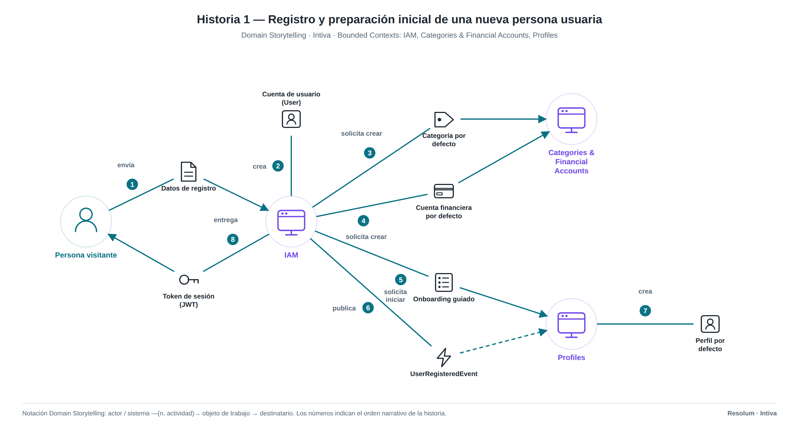

*Diagrama de Domain Storytelling — Historia 1: registro y preparación inicial de una nueva persona usuaria. Fuente: elaboración propia a partir de `intiva-api-platform`.*

**Representación de apoyo (diagrama de secuencia por carriles):**

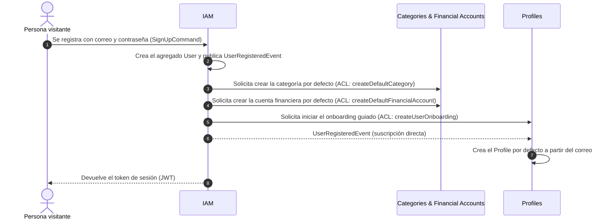
```mermaid
sequenceDiagram
    autonumber
    actor V as Persona visitante
    participant IAM as IAM
    participant CAT as Categories & Financial Accounts
    participant PRO as Profiles
    V->>IAM: Se registra con correo y contraseña (SignUpCommand)
    IAM->>IAM: Crea el agregado User y publica UserRegisteredEvent
    IAM->>CAT: Solicita crear la categoría por defecto (ACL: createDefaultCategory)
    IAM->>CAT: Solicita crear la cuenta financiera por defecto (ACL: createDefaultFinancialAccount)
    IAM->>PRO: Solicita iniciar el onboarding guiado (ACL: createUserOnboarding)
    IAM-->>PRO: UserRegisteredEvent (suscripción directa)
    PRO->>PRO: Crea el Profile por defecto a partir del correo
    IAM-->>V: Devuelve el token de sesión (JWT)
```

Cuando una persona visitante se registra, IAM crea el agregado `User` y, en el mismo evento de dominio (`UserRegisteredEvent`), dispara en cadena la creación de una categoría por defecto y una cuenta financiera por defecto en *Categories & Financial Accounts*, y solicita a *Profiles* que inicie el onboarding guiado. Esta preparación inicial es la que hace posible el escenario de usabilidad **QAS-01**: la persona puede registrar su primera transacción sin tener que configurar antes una categoría ni una cuenta.

Es notable que la creación del `Profile` no ocurre por la llamada ACL de IAM, sino porque *Profiles* escucha por su cuenta el mismo evento de dominio: dos mecanismos de integración conviven para un mismo disparador, lo cual se retoma como hallazgo en la sección 4.2.5.

#### 4.2.3.2. Historia 2 — Una economía familiar se organiza (Household)

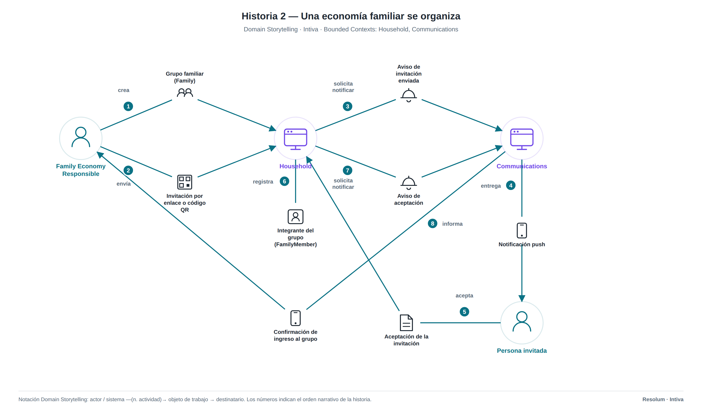

*Diagrama de Domain Storytelling — Historia 2: una economía familiar se organiza. Fuente: elaboración propia a partir de `intiva-api-platform`.*

**Representación de apoyo (diagrama de secuencia por carriles):**

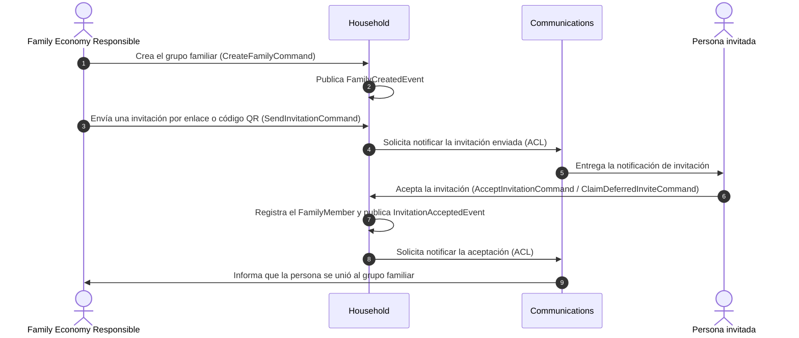
```mermaid
sequenceDiagram
    autonumber
    actor R as Family Economy Responsible
    participant HH as Household
    participant COM as Communications
    actor I as Persona invitada
    R->>HH: Crea el grupo familiar (CreateFamilyCommand)
    HH->>HH: Publica FamilyCreatedEvent
    R->>HH: Envía una invitación por enlace o código QR (SendInvitationCommand)
    HH->>COM: Solicita notificar la invitación enviada (ACL)
    COM->>I: Entrega la notificación de invitación
    I->>HH: Acepta la invitación (AcceptInvitationCommand / ClaimDeferredInviteCommand)
    HH->>HH: Registra el FamilyMember y publica InvitationAcceptedEvent
    HH->>COM: Solicita notificar la aceptación (ACL)
    COM->>R: Informa que la persona se unió al grupo familiar
```

Esta historia evidencia el rol diferencial de *Household*: el *Family Economy Responsible* crea el grupo familiar y envía una invitación —por enlace o código QR, incluso a personas que aún no tienen la aplicación instalada, mediante *Deferred Deep Link*—. Cada evento relevante del ciclo de vida de la invitación (enviada y aceptada) se traduce en una llamada explícita al ACL de *Communications* para notificar a la persona correspondiente. A diferencia de la Historia 1, aquí *Household* sí controla explícitamente cuándo notificar, en lugar de dejar que *Communications* escuche sus eventos de forma autónoma.

#### 4.2.3.3. Historia 3 — Se registra una transacción familiar y se evalúa un límite de gasto

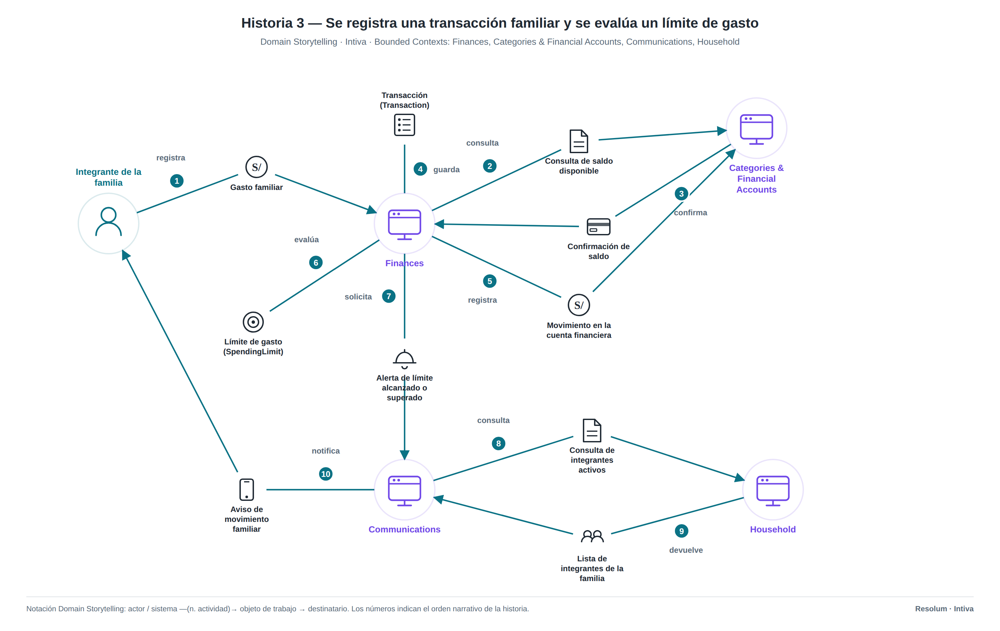

*Diagrama de Domain Storytelling — Historia 3: registro de una transacción familiar y evaluación de un límite de gasto. Fuente: elaboración propia a partir de `intiva-api-platform`.*

**Representación de apoyo (diagrama de secuencia por carriles):**

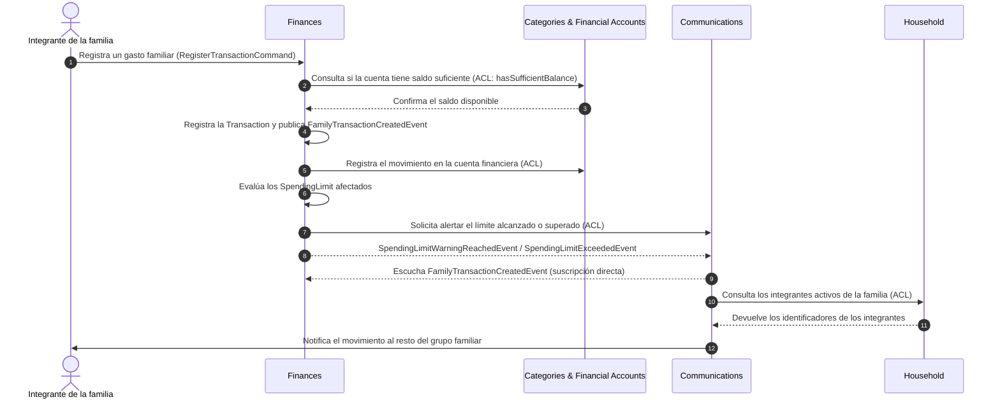
```mermaid
sequenceDiagram
    autonumber
    actor M as Integrante de la familia
    participant FIN as Finances
    participant CAT as Categories & Financial Accounts
    participant COM as Communications
    participant HH as Household
    M->>FIN: Registra un gasto familiar (RegisterTransactionCommand)
    FIN->>CAT: Consulta si la cuenta tiene saldo suficiente (ACL: hasSufficientBalance)
    CAT-->>FIN: Confirma el saldo disponible
    FIN->>FIN: Registra la Transaction y publica FamilyTransactionCreatedEvent
    FIN->>CAT: Registra el movimiento en la cuenta financiera (ACL)
    FIN->>FIN: Evalúa los SpendingLimit afectados
    FIN->>COM: Solicita alertar el límite alcanzado o superado (ACL)
    FIN-->>COM: SpendingLimitWarningReachedEvent / SpendingLimitExceededEvent
    COM-->>FIN: Escucha FamilyTransactionCreatedEvent (suscripción directa)
    COM->>HH: Consulta los integrantes activos de la familia (ACL)
    HH-->>COM: Devuelve los identificadores de los integrantes
    COM->>M: Notifica el movimiento al resto del grupo familiar
```

Esta es la historia que atraviesa el mayor número de contextos y la que sustenta los drivers **QAS-05** y **US 014**. El registro de la transacción exige una validación síncrona del saldo antes de aceptarse —de ahí la llamada ACL bloqueante a *Categories & Financial Accounts*—, mientras que las consecuencias del registro (alertar el límite, avisar a la familia) se propagan de forma asíncrona para no penalizar el tiempo de respuesta de la operación principal. Se observa nuevamente la convivencia de los dos mecanismos: *Finances* llama explícitamente al ACL de *Communications* para las alertas de límite (paso 7), mientras que *Communications* se suscribe por su cuenta al evento de transacción familiar (paso 9).

#### 4.2.3.4. Historia 4 — Un pago recurrente está por vencer

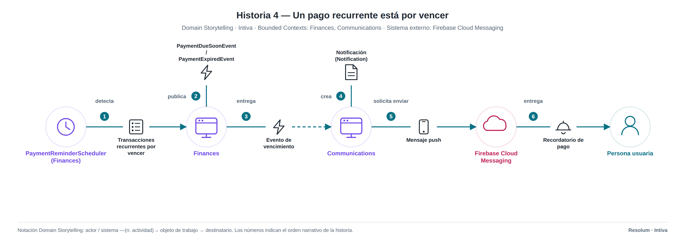

*Diagrama de Domain Storytelling — Historia 4: un pago recurrente está por vencer. Fuente: elaboración propia a partir de `intiva-api-platform`.*

**Representación de apoyo (diagrama de secuencia por carriles):**

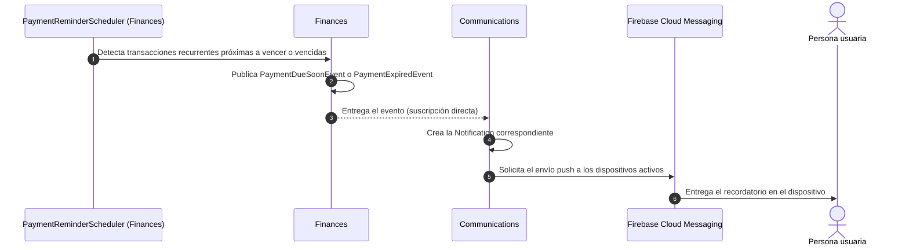
```mermaid
sequenceDiagram
    autonumber
    participant SCH as PaymentReminderScheduler (Finances)
    participant FIN as Finances
    participant COM as Communications
    participant FCM as Firebase Cloud Messaging
    actor U as Persona usuaria
    SCH->>FIN: Detecta transacciones recurrentes próximas a vencer o vencidas
    FIN->>FIN: Publica PaymentDueSoonEvent o PaymentExpiredEvent
    FIN-->>COM: Entrega el evento (suscripción directa)
    COM->>COM: Crea la Notification correspondiente
    COM->>FCM: Solicita el envío push a los dispositivos activos
    FCM->>U: Entrega el recordatorio en el dispositivo
```

A diferencia de las historias anteriores, este flujo no lo inicia una persona sino un proceso programado (`PaymentReminderScheduler` / `RecurringTransactionScheduler`, dentro de *Finances*). Al detectar que una transacción recurrente está por vencer o ya venció, *Finances* publica `PaymentDueSoonEvent` o `PaymentExpiredEvent`; *Communications* los escucha directamente —sin ACL de por medio— y entrega el recordatorio. Es el mismo patrón de suscripción directa detectado en la Historia 3, y es la materialización del driver **US 030**.

#### 4.2.3.5. Historia 5 — La familia visualiza sus métricas financieras

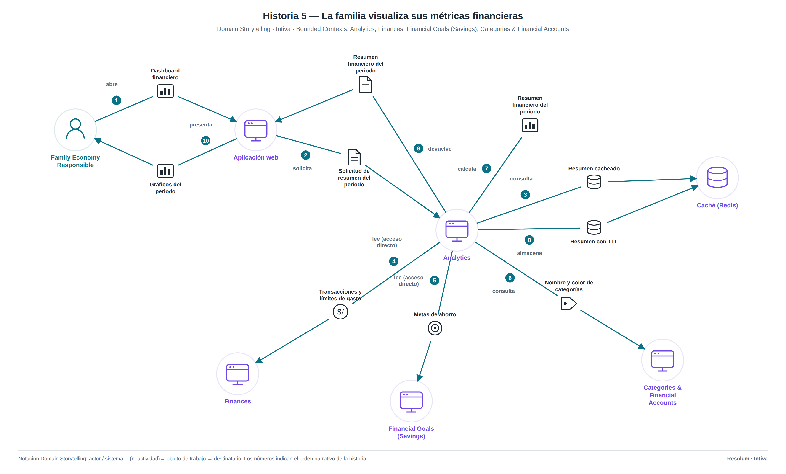

*Diagrama de Domain Storytelling — Historia 5: la familia visualiza sus métricas financieras. Fuente: elaboración propia a partir de `intiva-api-platform`.*

**Representación de apoyo (diagrama de secuencia por carriles):**

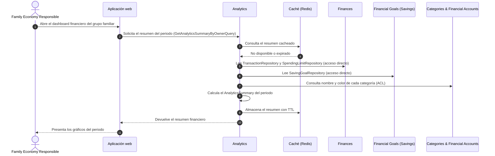
```mermaid
sequenceDiagram
    autonumber
    actor R as Family Economy Responsible
    participant WEB as Aplicación web
    participant ANA as Analytics
    participant RDS as Caché (Redis)
    participant FIN as Finances
    participant SAV as Financial Goals (Savings)
    participant CAT as Categories & Financial Accounts
    R->>WEB: Abre el dashboard financiero del grupo familiar
    WEB->>ANA: Solicita el resumen del periodo (GetAnalyticsSummaryByOwnerQuery)
    ANA->>RDS: Consulta el resumen cacheado
    RDS-->>ANA: No disponible o expirado
    ANA->>FIN: Lee TransactionRepository y SpendingLimitRepository (acceso directo)
    ANA->>SAV: Lee SavingGoalRepository (acceso directo)
    ANA->>CAT: Consulta nombre y color de cada categoría (ACL)
    ANA->>ANA: Calcula el AnalyticsSummary del periodo
    ANA->>RDS: Almacena el resumen con TTL
    ANA-->>WEB: Devuelve el resumen financiero
    WEB-->>R: Presenta los gráficos del periodo
```

Al abrir el dashboard en la aplicación web, *Analytics* debe reunir información de tres contextos distintos. Aquí se documenta de forma explícita una decisión de diseño que se retoma como crítica en la sección 4.2.5: el acceso a *Finances* y a *Savings* ocurre leyendo sus repositorios directamente —sin pasar por un ACL ni por la Application Layer de esos contextos—, mientras que el acceso a *Categories & Financial Accounts* sí respeta el patrón ACL usado en el resto del sistema. El resultado se cachea en Redis para no recalcular el resumen en cada consulta, lo que es la implementación concreta del driver **QAS-04**.
### 4.2.4. Bounded Context Canvases

A partir de los ocho bounded contexts identificados en el Candidate Context Discovery, el equipo elaboró el Bounded Context Canvas de cada uno siguiendo el proceso iterativo propuesto por Nick Tune:

1. **Context Overview Definition** — nombre, propósito y clasificación estratégica del contexto.
2. **Business Rules Distillation & Ubiquitous Language Capture** — el vocabulario y las reglas de negocio no ambiguas que gobiernan el contexto.
3. **Capability Analysis** — qué hace el contexto, expresado como los *Commands*, *Queries* y *Domain Events* realmente implementados.
4. **Capability Layering** — distinguiendo qué capacidades son el núcleo de la responsabilidad del contexto y cuáles son de soporte.
5. **Dependencies Capture** — con quién colabora el contexto y mediante qué mecanismo (entrante y saliente).
6. **Design Critique** — una revisión honesta de las decisiones de diseño, incluyendo aquellas que se apartan del patrón ideal.

Los ocho contextos se presentan en el orden en que colaboran a lo largo del ciclo de vida de una persona usuaria: primero identidad y perfil, luego los contextos de soporte financiero, después el núcleo transaccional y familiar, y por último comunicación y analítica.

Cada canvas se presenta a continuación en su representación visual —siguiendo la plantilla del Bounded Context Canvas, con las seis secciones del proceso numeradas— acompañada de la tabla con el detalle completo del contenido. Los canvases se encuentran en `assets/img/cap04/`.

#### 4.2.4.1. Identity and Access Management (IAM)

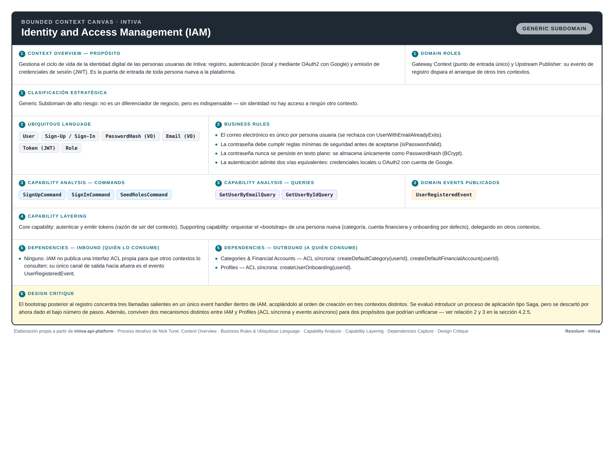

*Bounded Context Canvas de Identity and Access Management (IAM). Fuente: elaboración propia a partir de `intiva-api-platform`.*

| Sección del Canvas | Contenido |
| --- | --- |
| **1. Context Overview — Propósito** | Gestiona el ciclo de vida de la identidad digital de las personas usuarias de Intiva: registro, autenticación (local y mediante OAuth2 con Google) y emisión de credenciales de sesión (JWT). Es la puerta de entrada de toda persona nueva a la plataforma. |
| **Clasificación estratégica** | Generic Subdomain de alto riesgo: no es un diferenciador de negocio, pero es indispensable — sin identidad no hay acceso a ningún otro contexto. |
| **Domain Roles** | Gateway Context (punto de entrada único) y Upstream Publisher: su evento de registro dispara el arranque de otros tres contextos. |
| **2. Ubiquitous Language** | • User • Sign-Up / Sign-In • PasswordHash (VO) • Email (VO) • Token (JWT) • Role |
| **Business Rules** | • El correo electrónico es único por persona usuaria (se rechaza con UserWithEmailAlreadyExits). • La contraseña debe cumplir reglas mínimas de seguridad antes de aceptarse (isPasswordValid). • La contraseña nunca se persiste en texto plano: se almacena únicamente como PasswordHash (BCrypt). • La autenticación admite dos vías equivalentes: credenciales locales u OAuth2 con cuenta de Google. |
| **3. Capability Analysis — Commands** | • SignUpCommand • SignInCommand • SeedRolesCommand |
| **Capability Analysis — Queries** | • GetUserByEmailQuery • GetUserByIdQuery |
| **Capability Analysis — Domain Events publicados** | UserRegisteredEvent |
| **4. Capability Layering** | Core capability: autenticar y emitir tokens (razón de ser del contexto). Supporting capability: orquestar el «bootstrap» de una persona nueva (categoría, cuenta financiera y onboarding por defecto), delegando en otros contextos. |
| **5. Dependencies — Inbound (quién lo consume)** | Ninguno. IAM no publica una interfaz ACL propia para que otros contextos lo consulten; su único canal de salida hacia afuera es el evento UserRegisteredEvent. |
| **Dependencies — Outbound (a quién consume)** | • Categories & Financial Accounts — ACL síncrona: createDefaultCategory(userId), createDefaultFinancialAccount(userId). • Profiles — ACL síncrona: createUserOnboarding(userId). |
| **6. Design Critique** | El bootstrap posterior al registro concentra tres llamadas salientes en un único event handler dentro de IAM, acoplándolo al orden de creación en tres contextos distintos. Se evaluó introducir un proceso de aplicación tipo Saga, pero se descartó por ahora dado el bajo número de pasos. Además, conviven dos mecanismos distintos entre IAM y Profiles (ACL síncrona y evento asíncrono) para dos propósitos que podrían unificarse — ver relación 2 y 3 en la sección 4.2.5. |

#### 4.2.4.2. Profiles

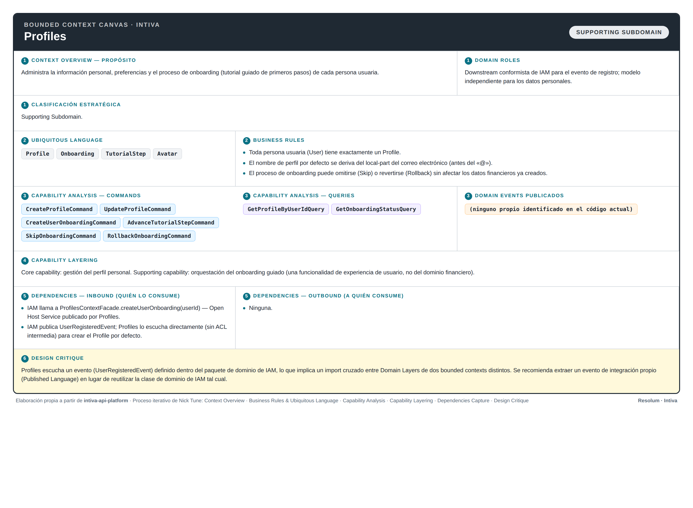

*Bounded Context Canvas de Profiles. Fuente: elaboración propia a partir de `intiva-api-platform`.*

| Sección del Canvas | Contenido |
| --- | --- |
| **1. Context Overview — Propósito** | Administra la información personal, preferencias y el proceso de onboarding (tutorial guiado de primeros pasos) de cada persona usuaria. |
| **Clasificación estratégica** | Supporting Subdomain. |
| **Domain Roles** | Downstream conformista de IAM para el evento de registro; modelo independiente para los datos personales. |
| **2. Ubiquitous Language** | • Profile • Onboarding • TutorialStep • Avatar |
| **Business Rules** | • Toda persona usuaria (User) tiene exactamente un Profile. • El nombre de perfil por defecto se deriva del local-part del correo electrónico (antes del «@»). • El proceso de onboarding puede omitirse (Skip) o revertirse (Rollback) sin afectar los datos financieros ya creados. |
| **3. Capability Analysis — Commands** | • CreateProfileCommand • UpdateProfileCommand • CreateUserOnboardingCommand • AdvanceTutorialStepCommand • SkipOnboardingCommand • RollbackOnboardingCommand |
| **Capability Analysis — Queries** | • GetProfileByUserIdQuery • GetOnboardingStatusQuery |
| **Capability Analysis — Domain Events publicados** | (ninguno propio identificado en el código actual) |
| **4. Capability Layering** | Core capability: gestión del perfil personal. Supporting capability: orquestación del onboarding guiado (una funcionalidad de experiencia de usuario, no del dominio financiero). |
| **5. Dependencies — Inbound (quién lo consume)** | • IAM llama a ProfilesContextFacade.createUserOnboarding(userId) — Open Host Service publicado por Profiles. • IAM publica UserRegisteredEvent; Profiles lo escucha directamente (sin ACL intermedia) para crear el Profile por defecto. |
| **Dependencies — Outbound (a quién consume)** | Ninguna. |
| **6. Design Critique** | Profiles escucha un evento (UserRegisteredEvent) definido dentro del paquete de dominio de IAM, lo que implica un import cruzado entre Domain Layers de dos bounded contexts distintos. Se recomienda extraer un evento de integración propio (Published Language) en lugar de reutilizar la clase de dominio de IAM tal cual. |

#### 4.2.4.3. Categories & Financial Accounts

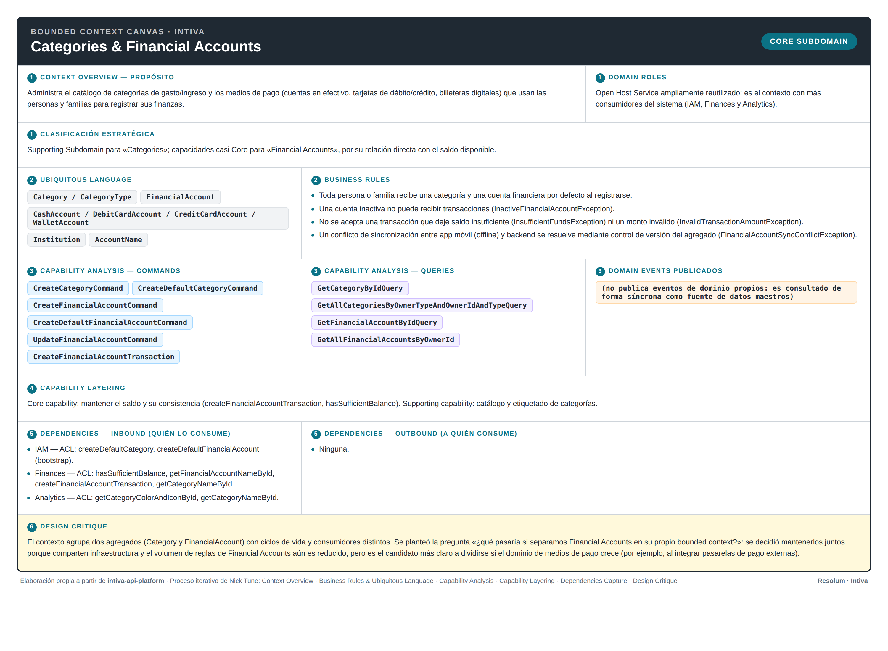

*Bounded Context Canvas de Categories & Financial Accounts. Fuente: elaboración propia a partir de `intiva-api-platform`.*

| Sección del Canvas | Contenido |
| --- | --- |
| **1. Context Overview — Propósito** | Administra el catálogo de categorías de gasto/ingreso y los medios de pago (cuentas en efectivo, tarjetas de débito/crédito, billeteras digitales) que usan las personas y familias para registrar sus finanzas. |
| **Clasificación estratégica** | Supporting Subdomain para «Categories»; capacidades casi Core para «Financial Accounts», por su relación directa con el saldo disponible. |
| **Domain Roles** | Open Host Service ampliamente reutilizado: es el contexto con más consumidores del sistema (IAM, Finances y Analytics). |
| **2. Ubiquitous Language** | • Category / CategoryType • FinancialAccount • CashAccount / DebitCardAccount / CreditCardAccount / WalletAccount • Institution • AccountName |
| **Business Rules** | • Toda persona o familia recibe una categoría y una cuenta financiera por defecto al registrarse. • Una cuenta inactiva no puede recibir transacciones (InactiveFinancialAccountException). • No se acepta una transacción que deje saldo insuficiente (InsufficientFundsException) ni un monto inválido (InvalidTransactionAmountException). • Un conflicto de sincronización entre app móvil (offline) y backend se resuelve mediante control de versión del agregado (FinancialAccountSyncConflictException). |
| **3. Capability Analysis — Commands** | • CreateCategoryCommand • CreateDefaultCategoryCommand • CreateFinancialAccountCommand • CreateDefaultFinancialAccountCommand • UpdateFinancialAccountCommand • CreateFinancialAccountTransaction |
| **Capability Analysis — Queries** | • GetCategoryByIdQuery • GetAllCategoriesByOwnerTypeAndOwnerIdAndTypeQuery • GetFinancialAccountByIdQuery • GetAllFinancialAccountsByOwnerId |
| **Capability Analysis — Domain Events publicados** | (no publica eventos de dominio propios: es consultado de forma síncrona como fuente de datos maestros) |
| **4. Capability Layering** | Core capability: mantener el saldo y su consistencia (createFinancialAccountTransaction, hasSufficientBalance). Supporting capability: catálogo y etiquetado de categorías. |
| **5. Dependencies — Inbound (quién lo consume)** | • IAM — ACL: createDefaultCategory, createDefaultFinancialAccount (bootstrap). • Finances — ACL: hasSufficientBalance, getFinancialAccountNameById, createFinancialAccountTransaction, getCategoryNameById. • Analytics — ACL: getCategoryColorAndIconById, getCategoryNameById. |
| **Dependencies — Outbound (a quién consume)** | Ninguna. |
| **6. Design Critique** | El contexto agrupa dos agregados (Category y FinancialAccount) con ciclos de vida y consumidores distintos. Se planteó la pregunta «¿qué pasaría si separamos Financial Accounts en su propio bounded context?»: se decidió mantenerlos juntos porque comparten infraestructura y el volumen de reglas de Financial Accounts aún es reducido, pero es el candidato más claro a dividirse si el dominio de medios de pago crece (por ejemplo, al integrar pasarelas de pago externas). |

#### 4.2.4.4. Finances

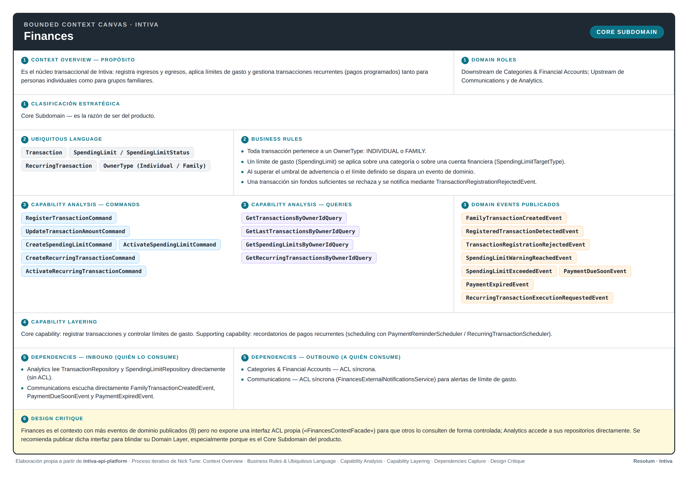

*Bounded Context Canvas de Finances. Fuente: elaboración propia a partir de `intiva-api-platform`.*

| Sección del Canvas | Contenido |
| --- | --- |
| **1. Context Overview — Propósito** | Es el núcleo transaccional de Intiva: registra ingresos y egresos, aplica límites de gasto y gestiona transacciones recurrentes (pagos programados) tanto para personas individuales como para grupos familiares. |
| **Clasificación estratégica** | Core Subdomain — es la razón de ser del producto. |
| **Domain Roles** | Downstream de Categories & Financial Accounts; Upstream de Communications y de Analytics. |
| **2. Ubiquitous Language** | • Transaction • SpendingLimit / SpendingLimitStatus • RecurringTransaction • OwnerType (Individual / Family) |
| **Business Rules** | • Toda transacción pertenece a un OwnerType: INDIVIDUAL o FAMILY. • Un límite de gasto (SpendingLimit) se aplica sobre una categoría o sobre una cuenta financiera (SpendingLimitTargetType). • Al superar el umbral de advertencia o el límite definido se dispara un evento de dominio. • Una transacción sin fondos suficientes se rechaza y se notifica mediante TransactionRegistrationRejectedEvent. |
| **3. Capability Analysis — Commands** | • RegisterTransactionCommand • UpdateTransactionAmountCommand • CreateSpendingLimitCommand • ActivateSpendingLimitCommand • CreateRecurringTransactionCommand • ActivateRecurringTransactionCommand |
| **Capability Analysis — Queries** | • GetTransactionsByOwnerIdQuery • GetLastTransactionsByOwnerIdQuery • GetSpendingLimitsByOwnerIdQuery • GetRecurringTransactionsByOwnerIdQuery |
| **Capability Analysis — Domain Events publicados** | • FamilyTransactionCreatedEvent • RegisteredTransactionDetectedEvent • TransactionRegistrationRejectedEvent • SpendingLimitWarningReachedEvent • SpendingLimitExceededEvent • PaymentDueSoonEvent • PaymentExpiredEvent • RecurringTransactionExecutionRequestedEvent |
| **4. Capability Layering** | Core capability: registrar transacciones y controlar límites de gasto. Supporting capability: recordatorios de pagos recurrentes (scheduling con PaymentReminderScheduler / RecurringTransactionScheduler). |
| **5. Dependencies — Inbound (quién lo consume)** | • Analytics lee TransactionRepository y SpendingLimitRepository directamente (sin ACL). • Communications escucha directamente FamilyTransactionCreatedEvent, PaymentDueSoonEvent y PaymentExpiredEvent. |
| **Dependencies — Outbound (a quién consume)** | • Categories & Financial Accounts — ACL síncrona. • Communications — ACL síncrona (FinancesExternalNotificationsService) para alertas de límite de gasto. |
| **6. Design Critique** | Finances es el contexto con más eventos de dominio publicados (8) pero no expone una interfaz ACL propia («FinancesContextFacade») para que otros lo consulten de forma controlada; Analytics accede a sus repositorios directamente. Se recomienda publicar dicha interfaz para blindar su Domain Layer, especialmente porque es el Core Subdomain del producto. |

#### 4.2.4.5. Financial Goals (Savings)

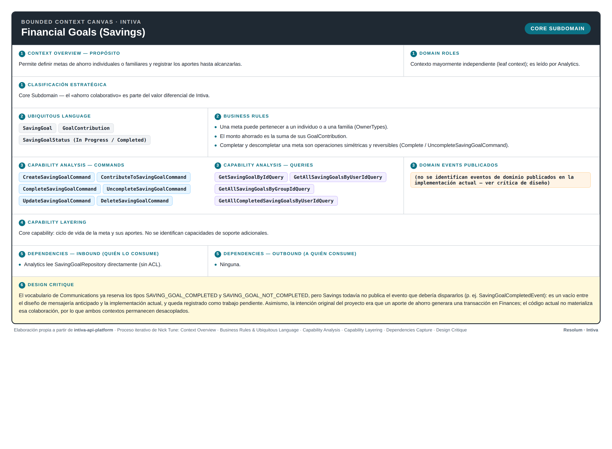

*Bounded Context Canvas de Financial Goals (Savings). Fuente: elaboración propia a partir de `intiva-api-platform`.*

| Sección del Canvas | Contenido |
| --- | --- |
| **1. Context Overview — Propósito** | Permite definir metas de ahorro individuales o familiares y registrar los aportes hasta alcanzarlas. |
| **Clasificación estratégica** | Core Subdomain — el «ahorro colaborativo» es parte del valor diferencial de Intiva. |
| **Domain Roles** | Contexto mayormente independiente (leaf context); es leído por Analytics. |
| **2. Ubiquitous Language** | • SavingGoal • GoalContribution • SavingGoalStatus (In Progress / Completed) |
| **Business Rules** | • Una meta puede pertenecer a un individuo o a una familia (OwnerTypes). • El monto ahorrado es la suma de sus GoalContribution. • Completar y descompletar una meta son operaciones simétricas y reversibles (Complete / UncompleteSavingGoalCommand). |
| **3. Capability Analysis — Commands** | • CreateSavingGoalCommand • ContributeToSavingGoalCommand • CompleteSavingGoalCommand • UncompleteSavingGoalCommand • UpdateSavingGoalCommand • DeleteSavingGoalCommand |
| **Capability Analysis — Queries** | • GetSavingGoalByIdQuery • GetAllSavingGoalsByUserIdQuery • GetAllSavingGoalsByGroupIdQuery • GetAllCompletedSavingGoalsByUserIdQuery |
| **Capability Analysis — Domain Events publicados** | (no se identifican eventos de dominio publicados en la implementación actual — ver crítica de diseño) |
| **4. Capability Layering** | Core capability: ciclo de vida de la meta y sus aportes. No se identifican capacidades de soporte adicionales. |
| **5. Dependencies — Inbound (quién lo consume)** | Analytics lee SavingGoalRepository directamente (sin ACL). |
| **Dependencies — Outbound (a quién consume)** | Ninguna. |
| **6. Design Critique** | El vocabulario de Communications ya reserva los tipos SAVING_GOAL_COMPLETED y SAVING_GOAL_NOT_COMPLETED, pero Savings todavía no publica el evento que debería dispararlos (p. ej. SavingGoalCompletedEvent): es un vacío entre el diseño de mensajería anticipado y la implementación actual, y queda registrado como trabajo pendiente. Asimismo, la intención original del proyecto era que un aporte de ahorro generara una transacción en Finances; el código actual no materializa esa colaboración, por lo que ambos contextos permanecen desacoplados. |

#### 4.2.4.6. Household

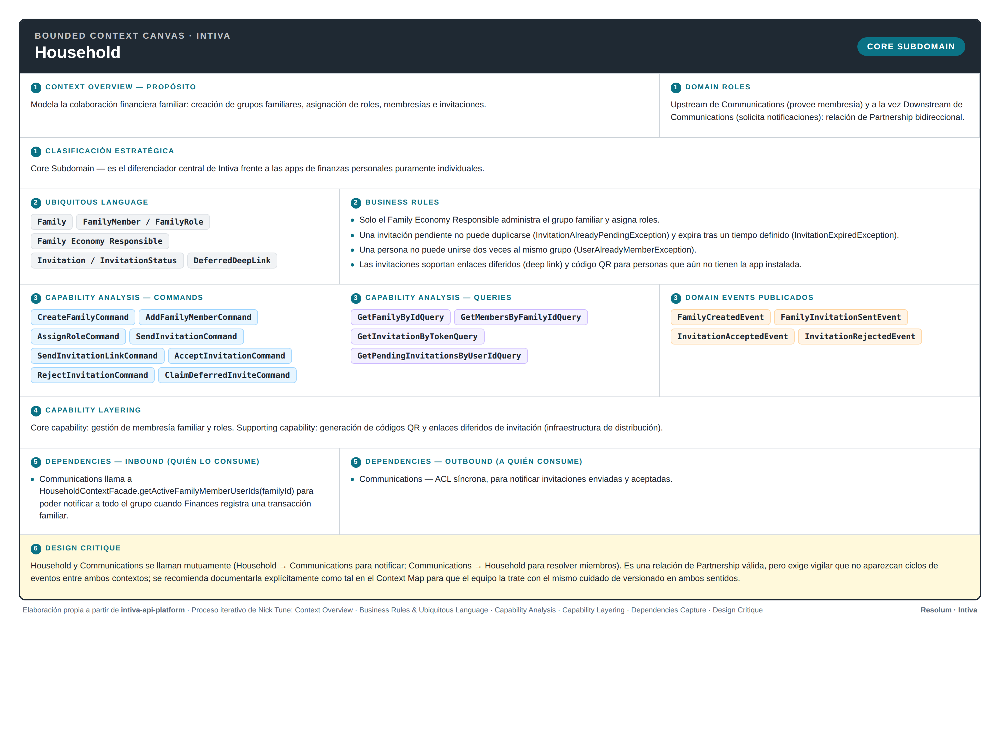

*Bounded Context Canvas de Household. Fuente: elaboración propia a partir de `intiva-api-platform`.*

| Sección del Canvas | Contenido |
| --- | --- |
| **1. Context Overview — Propósito** | Modela la colaboración financiera familiar: creación de grupos familiares, asignación de roles, membresías e invitaciones. |
| **Clasificación estratégica** | Core Subdomain — es el diferenciador central de Intiva frente a las apps de finanzas personales puramente individuales. |
| **Domain Roles** | Upstream de Communications (provee membresía) y a la vez Downstream de Communications (solicita notificaciones): relación de Partnership bidireccional. |
| **2. Ubiquitous Language** | • Family • FamilyMember / FamilyRole • Family Economy Responsible • Invitation / InvitationStatus • DeferredDeepLink |
| **Business Rules** | • Solo el Family Economy Responsible administra el grupo familiar y asigna roles. • Una invitación pendiente no puede duplicarse (InvitationAlreadyPendingException) y expira tras un tiempo definido (InvitationExpiredException). • Una persona no puede unirse dos veces al mismo grupo (UserAlreadyMemberException). • Las invitaciones soportan enlaces diferidos (deep link) y código QR para personas que aún no tienen la app instalada. |
| **3. Capability Analysis — Commands** | • CreateFamilyCommand • AddFamilyMemberCommand • AssignRoleCommand • SendInvitationCommand • SendInvitationLinkCommand • AcceptInvitationCommand • RejectInvitationCommand • ClaimDeferredInviteCommand |
| **Capability Analysis — Queries** | • GetFamilyByIdQuery • GetMembersByFamilyIdQuery • GetInvitationByTokenQuery • GetPendingInvitationsByUserIdQuery |
| **Capability Analysis — Domain Events publicados** | • FamilyCreatedEvent • FamilyInvitationSentEvent • InvitationAcceptedEvent • InvitationRejectedEvent |
| **4. Capability Layering** | Core capability: gestión de membresía familiar y roles. Supporting capability: generación de códigos QR y enlaces diferidos de invitación (infraestructura de distribución). |
| **5. Dependencies — Inbound (quién lo consume)** | Communications llama a HouseholdContextFacade.getActiveFamilyMemberUserIds(familyId) para poder notificar a todo el grupo cuando Finances registra una transacción familiar. |
| **Dependencies — Outbound (a quién consume)** | Communications — ACL síncrona, para notificar invitaciones enviadas y aceptadas. |
| **6. Design Critique** | Household y Communications se llaman mutuamente (Household → Communications para notificar; Communications → Household para resolver miembros). Es una relación de Partnership válida, pero exige vigilar que no aparezcan ciclos de eventos entre ambos contextos; se recomienda documentarla explícitamente como tal en el Context Map para que el equipo la trate con el mismo cuidado de versionado en ambos sentidos. |

#### 4.2.4.7. Communications

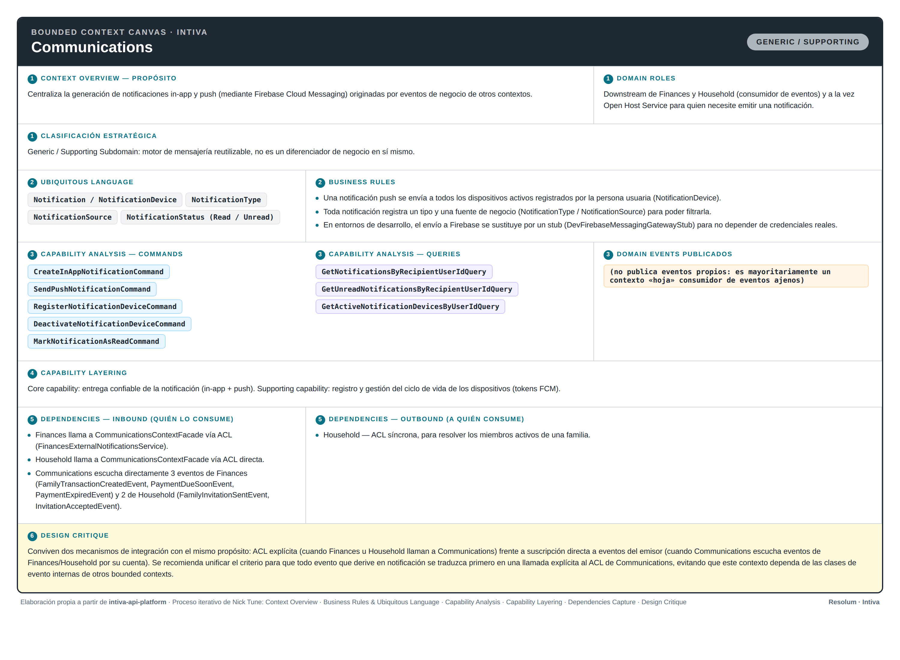

*Bounded Context Canvas de Communications. Fuente: elaboración propia a partir de `intiva-api-platform`.*

| Sección del Canvas | Contenido |
| --- | --- |
| **1. Context Overview — Propósito** | Centraliza la generación de notificaciones in-app y push (mediante Firebase Cloud Messaging) originadas por eventos de negocio de otros contextos. |
| **Clasificación estratégica** | Generic / Supporting Subdomain: motor de mensajería reutilizable, no es un diferenciador de negocio en sí mismo. |
| **Domain Roles** | Downstream de Finances y Household (consumidor de eventos) y a la vez Open Host Service para quien necesite emitir una notificación. |
| **2. Ubiquitous Language** | • Notification / NotificationDevice • NotificationType • NotificationSource • NotificationStatus (Read / Unread) |
| **Business Rules** | • Una notificación push se envía a todos los dispositivos activos registrados por la persona usuaria (NotificationDevice). • Toda notificación registra un tipo y una fuente de negocio (NotificationType / NotificationSource) para poder filtrarla. • En entornos de desarrollo, el envío a Firebase se sustituye por un stub (DevFirebaseMessagingGatewayStub) para no depender de credenciales reales. |
| **3. Capability Analysis — Commands** | • CreateInAppNotificationCommand • SendPushNotificationCommand • RegisterNotificationDeviceCommand • DeactivateNotificationDeviceCommand • MarkNotificationAsReadCommand |
| **Capability Analysis — Queries** | • GetNotificationsByRecipientUserIdQuery • GetUnreadNotificationsByRecipientUserIdQuery • GetActiveNotificationDevicesByUserIdQuery |
| **Capability Analysis — Domain Events publicados** | (no publica eventos propios: es mayoritariamente un contexto «hoja» consumidor de eventos ajenos) |
| **4. Capability Layering** | Core capability: entrega confiable de la notificación (in-app + push). Supporting capability: registro y gestión del ciclo de vida de los dispositivos (tokens FCM). |
| **5. Dependencies — Inbound (quién lo consume)** | • Finances llama a CommunicationsContextFacade vía ACL (FinancesExternalNotificationsService). • Household llama a CommunicationsContextFacade vía ACL directa. • Communications escucha directamente 3 eventos de Finances (FamilyTransactionCreatedEvent, PaymentDueSoonEvent, PaymentExpiredEvent) y 2 de Household (FamilyInvitationSentEvent, InvitationAcceptedEvent). |
| **Dependencies — Outbound (a quién consume)** | Household — ACL síncrona, para resolver los miembros activos de una familia. |
| **6. Design Critique** | Conviven dos mecanismos de integración con el mismo propósito: ACL explícita (cuando Finances u Household llaman a Communications) frente a suscripción directa a eventos del emisor (cuando Communications escucha eventos de Finances/Household por su cuenta). Se recomienda unificar el criterio para que todo evento que derive en notificación se traduzca primero en una llamada explícita al ACL de Communications, evitando que este contexto dependa de las clases de evento internas de otros bounded contexts. |

#### 4.2.4.8. Analytics

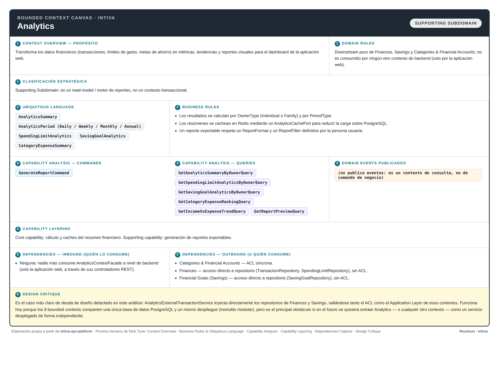

*Bounded Context Canvas de Analytics. Fuente: elaboración propia a partir de `intiva-api-platform`.*

| Sección del Canvas | Contenido |
| --- | --- |
| **1. Context Overview — Propósito** | Transforma los datos financieros (transacciones, límites de gasto, metas de ahorro) en métricas, tendencias y reportes visuales para el dashboard de la aplicación web. |
| **Clasificación estratégica** | Supporting Subdomain: es un read-model / motor de reportes, no un contexto transaccional. |
| **Domain Roles** | Downstream puro de Finances, Savings y Categories & Financial Accounts; no es consumido por ningún otro contexto de backend (solo por la aplicación web). |
| **2. Ubiquitous Language** | • AnalyticsSummary • AnalyticsPeriod (Daily / Weekly / Monthly / Annual) • SpendingLimitAnalytics • SavingGoalAnalytics • CategoryExpenseSummary |
| **Business Rules** | • Los resultados se calculan por OwnerType (Individual o Family) y por PeriodType. • Los resúmenes se cachean en Redis mediante un AnalyticsCachePort para reducir la carga sobre PostgreSQL. • Un reporte exportable respeta un ReportFormat y un ReportFilter definidos por la persona usuaria. |
| **3. Capability Analysis — Commands** | GenerateReportCommand |
| **Capability Analysis — Queries** | • GetAnalyticsSummaryByOwnerQuery • GetSpendingLimitAnalyticsByOwnerQuery • GetSavingGoalAnalyticsByOwnerQuery • GetCategoryExpenseRankingQuery • GetIncomeVsExpenseTrendQuery • GetReportPreviewQuery |
| **Capability Analysis — Domain Events publicados** | (no publica eventos: es un contexto de consulta, no de comando de negocio) |
| **4. Capability Layering** | Core capability: cálculo y cacheo del resumen financiero. Supporting capability: generación de reportes exportables. |
| **5. Dependencies — Inbound (quién lo consume)** | Ninguna: nadie más consume AnalyticsContextFacade a nivel de backend (solo la aplicación web, a través de sus controladores REST). |
| **Dependencies — Outbound (a quién consume)** | • Categories & Financial Accounts — ACL síncrona. • Finances — acceso directo a repositorio (TransactionRepository, SpendingLimitRepository), sin ACL. • Financial Goals (Savings) — acceso directo a repositorio (SavingGoalRepository), sin ACL. |
| **6. Design Critique** | Es el caso más claro de deuda de diseño detectado en este análisis: AnalyticsExternalTransactionService inyecta directamente los repositorios de Finances y Savings, saltándose tanto el ACL como el Application Layer de esos contextos. Funciona hoy porque los 8 bounded contexts comparten una única base de datos PostgreSQL y un mismo despliegue (monolito modular), pero es el principal obstáculo si en el futuro se quisiera extraer Analytics — o cualquier otro contexto — como un servicio desplegado de forma independiente. |

### 4.2.5. Context Mapping

Con las *Dependencies Capture* de cada Bounded Context Canvas ya relevadas, el equipo construyó el Context Map de Intiva: una visualización de las relaciones estructurales entre los ocho bounded contexts. El mapa distingue tres tipos de colaboración presentes en el sistema: llamadas síncronas a través de una interfaz publicada (**Anti-Corruption Layer / Open Host Service**), colaboración asíncrona mediante *domain events* (**Conformist**) y —como hallazgo relevante del análisis— **acceso directo a repositorios de persistencia sin pasar por ninguna interfaz de contexto**, lo cual se documenta como deuda de diseño más que como un patrón deliberado.

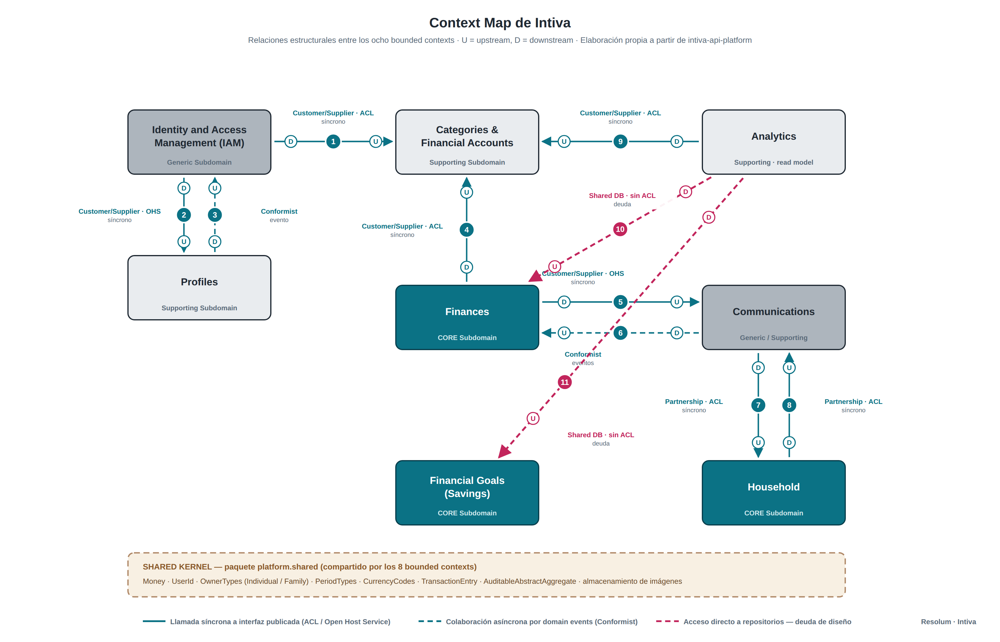

*Context Map de Intiva, en notación de Context Mapping de Domain-Driven Design: cada relación indica su extremo upstream (U, proveedor) y downstream (D, consumidor), junto con el patrón de relación aplicado. Los números remiten a la tabla de relaciones que se detalla a continuación. Fuente: elaboración propia a partir de `intiva-api-platform`.*

#### Tabla de relaciones entre bounded contexts

| # | Relación (llamador → llamado) | Patrón DDD | Mecanismo de integración | Evidencia en el código |
| --- | --- | --- | --- | --- |
| 1 | IAM → Categories & Financial Accounts | Customer/Supplier con Anti-Corruption Layer (ACL) | Llamada síncrona a la interfaz publicada (CategoriesContextFacade, FinancialAccountContextFacade) a través de un wrapper propio de IAM (IamExternalCategoriesService, IamExternalFinancialAccountsService). | UserRegisteredEventHandler crea la categoría y la cuenta financiera por defecto tras el registro. |
| 2 | IAM → Profiles | Customer/Supplier con ACL (Open Host Service publicado por Profiles) | Llamada síncrona a ProfilesContextFacade a través de IamProfilesExternalService. | createUserOnboarding(userId). |
| 3 | Profiles → IAM | Conformist (Published Language implícito) | Evento de dominio asíncrono (Spring ApplicationEvent) — Profiles escucha UserRegisteredEvent directamente, sin traducción propia. | Profiles.UserRegisteredEventHandler crea el Profile por defecto. |
| 4 | Finances → Categories & Financial Accounts | Customer/Supplier con ACL | Llamada síncrona vía FinancesExternalCategoriesService / FinancesExternalFinancialAccountService. | Validación de saldo suficiente y registro del movimiento en la cuenta. |
| 5 | Finances → Communications | Customer/Supplier con ACL / Open Host Service | Llamada síncrona vía FinancesExternalNotificationsService → CommunicationsContextFacade. | Alertas de límite de gasto (warning / exceeded). |
| 6 | Communications → Finances | Conformist | Suscripción asíncrona directa a eventos de dominio ajenos: FamilyTransactionCreatedEvent, PaymentDueSoonEvent, PaymentExpiredEvent. | FamilyEventHandler, PaymentReminderEventHandler. |
| 7 | Communications → Household | Customer/Supplier con ACL (Partnership junto con la relación 8) | Llamada síncrona vía CommunicationsExternalHouseholdService → HouseholdContextFacade. | Obtener miembros activos de la familia para notificar una transacción familiar. |
| 8 | Household → Communications | Customer/Supplier con ACL (Partnership junto con la relación 7) | Llamada síncrona directa a CommunicationsContextFacade. | Notificar invitaciones enviadas y aceptadas. |
| 9 | Analytics → Categories & Financial Accounts | Customer/Supplier con ACL | Llamada síncrona vía CategoriesContextFacade. | Nombre y color de categoría para los reportes. |
| 10 | Analytics → Finances | Shared Database / Conformist (sin ACL) — deuda de diseño | Acceso directo a TransactionRepository y SpendingLimitRepository. | Cálculo de AnalyticsSummary y SpendingLimitAnalytics. |
| 11 | Analytics → Financial Goals (Savings) | Shared Database / Conformist (sin ACL) — deuda de diseño | Acceso directo a SavingGoalRepository. | Cálculo de SavingGoalAnalytics. |
#### Shared Kernel

Los ocho bounded contexts comparten deliberadamente el paquete `platform.shared`, que actúa como un **Shared Kernel**: `Money`, `UserId`, `OwnerTypes`, `PeriodTypes`, `CurrencyCodes`, `TransactionEntry` y la clase base `AuditableAbstractAggregate`, además de servicios transversales como el almacenamiento de imágenes (Cloudinary). Mantener estos tipos de valor en un único lugar evita que cada contexto reinvente su propia noción de "dinero" o de "titular" (individual frente a familiar), lo cual sería especialmente riesgoso en un dominio financiero donde la consistencia de estos conceptos es crítica. El costo de este acuerdo es el habitual del Shared Kernel: cualquier cambio a estos tipos requiere coordinación entre los responsables de los ocho contextos.

#### Discusión de diseño: preguntas "¿qué pasaría si…?"

Siguiendo las preguntas de diseño sugeridas para el proceso de Context Mapping, el equipo discutió explícitamente las siguientes alternativas antes de llegar al mapa presentado:

- **"¿Qué pasaría si movemos este *capability* a otro bounded context?"** — Se evaluó extraer *Financial Accounts* fuera de *Categories* hacia un contexto propio de "Payment Methods". Se decidió no hacerlo todavía: comparten infraestructura y el volumen de reglas de negocio de *Financial Accounts* aún es reducido, pero queda identificado como el candidato más claro a separarse si el dominio de medios de pago crece (por ejemplo, al integrar pasarelas de pago externas).
- **"¿Qué pasaría si aislamos los *core capabilities* y movemos los otros a un contexto aparte?"** — Aplicado a *Finances*: se consideró separar el recordatorio de pagos recurrentes (*scheduling*) en un contexto de soporte independiente del núcleo transaccional. Se descartó porque ambos comparten el agregado `RecurringTransaction` y la separación duplicaría reglas de negocio sin un beneficio claro todavía.
- **"¿Qué pasaría si creamos un *shared service* para reducir la duplicación entre múltiples bounded contexts?"** — Ya está aplicado como el Shared Kernel descrito arriba, para los tipos de valor fundamentales del dominio financiero (`Money`, `UserId`, `OwnerTypes`, etc.).
- **"¿Qué pasaría si duplicamos una funcionalidad para romper la dependencia?"** — Se propone como evolución futura para *Analytics*: en lugar de leer los repositorios de *Finances* y *Savings* directamente (relaciones 10 y 11), *Analytics* podría mantener su propio modelo de lectura (al estilo CQRS), alimentado por eventos de dominio o por un Open Host Service de solo lectura publicado por esos contextos. Esto eliminaría la deuda de diseño identificada sin sacrificar el rendimiento del dashboard, y es coherente con la alternativa diferida en la Candidate Pattern Evaluation Matrix de la sección 4.1.4.
- **"¿Qué pasaría si partimos el bounded context en múltiples bounded contexts?"** — Aplicado a *Communications*: se evaluó separar la gestión de dispositivos (tokens de notificación push) de la generación y entrega de notificaciones. Se descartó porque ambos comparten el mismo ciclo de vida operativo y la separación solo añadiría una llamada más entre contextos sin reducir el acoplamiento real.

**Conclusión del Context Mapping.** En conjunto, el Context Map confirma que *Finances* y *Household* son los Core Subdomains del negocio —motivo por el cual concentran más eventos de dominio y más relaciones entrantes—, mientras que *IAM*, *Communications* y *Analytics* cumplen roles de soporte genérico. La relación menos saludable del mapa es el acceso directo de *Analytics* a los repositorios de *Finances* y *Savings* (relaciones 10 y 11): funciona hoy porque los ocho bounded contexts comparten una única base de datos PostgreSQL y un mismo despliegue —el monolito modular decidido en la Iteración 1 del ADD—, pero se documenta explícitamente como deuda de diseño a resolver antes de considerar cualquier extracción futura de un bounded context como servicio independiente.

## 4.3. Software Architecture

### 4.3.1. Software Architecture System Landscape Diagram

### 4.3.2. Software Architecture Context Level Diagrams

### 4.3.3. Software Architecture Container Level Diagrams

### 4.3.4. Software Architecture Deployment Diagrams

