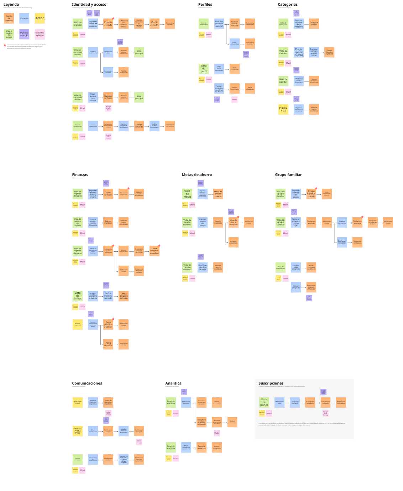
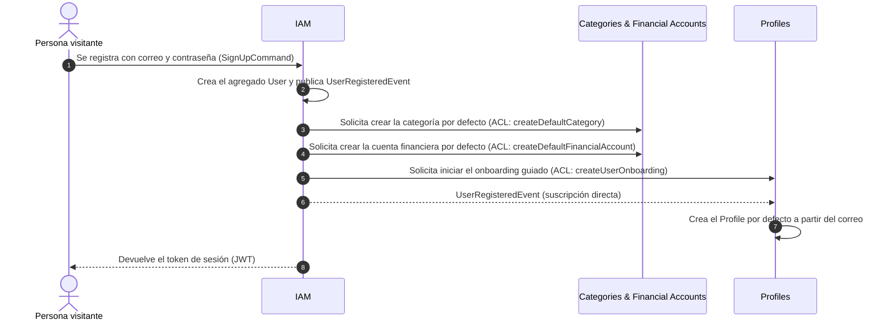
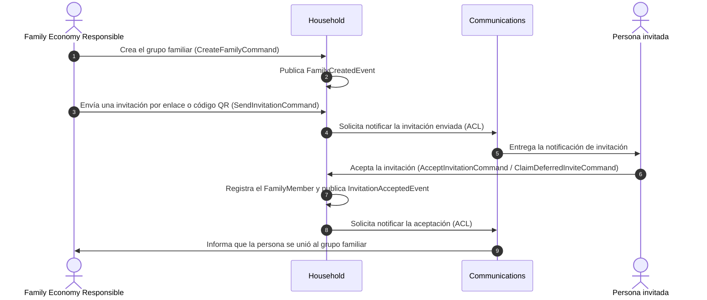
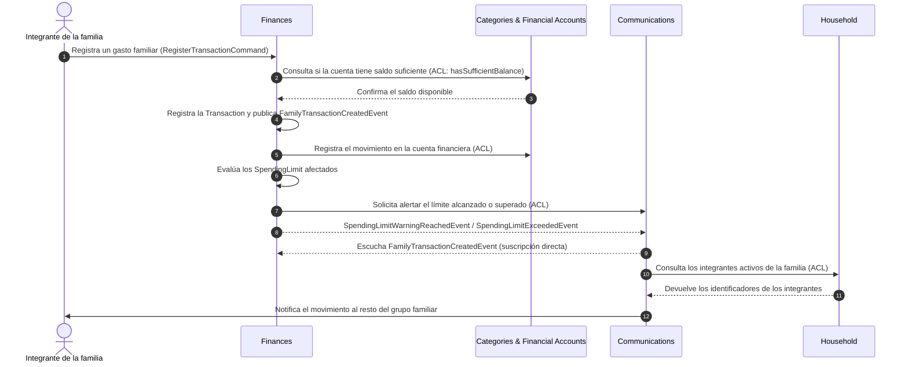
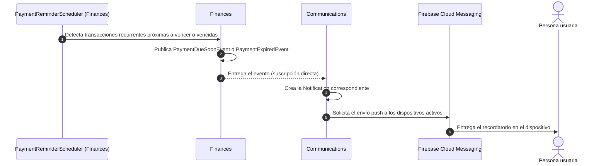
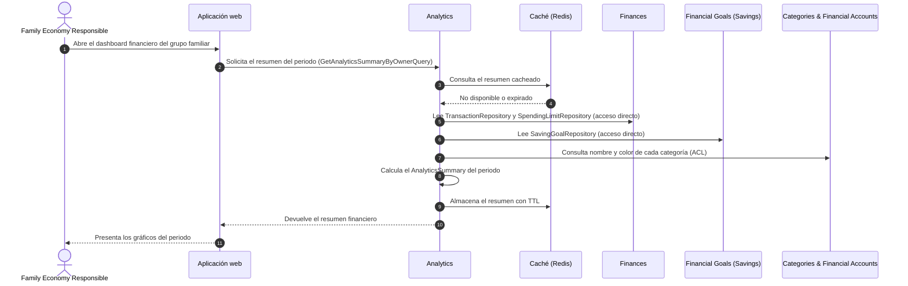
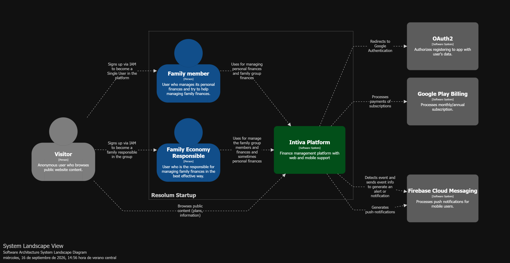
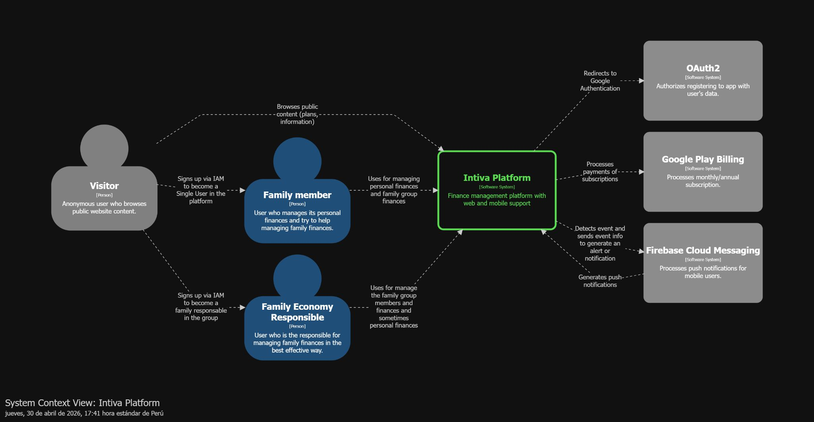
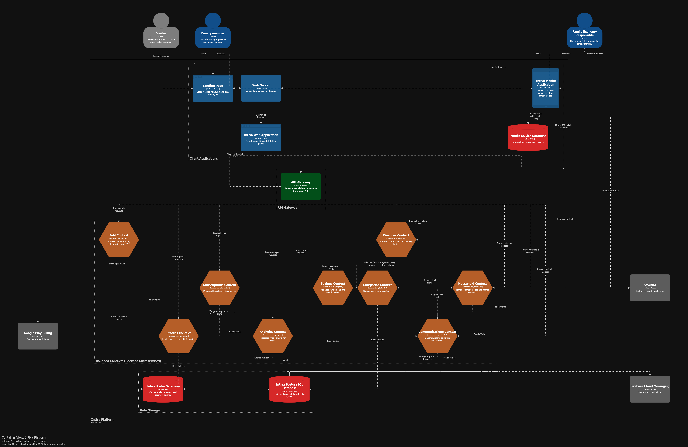
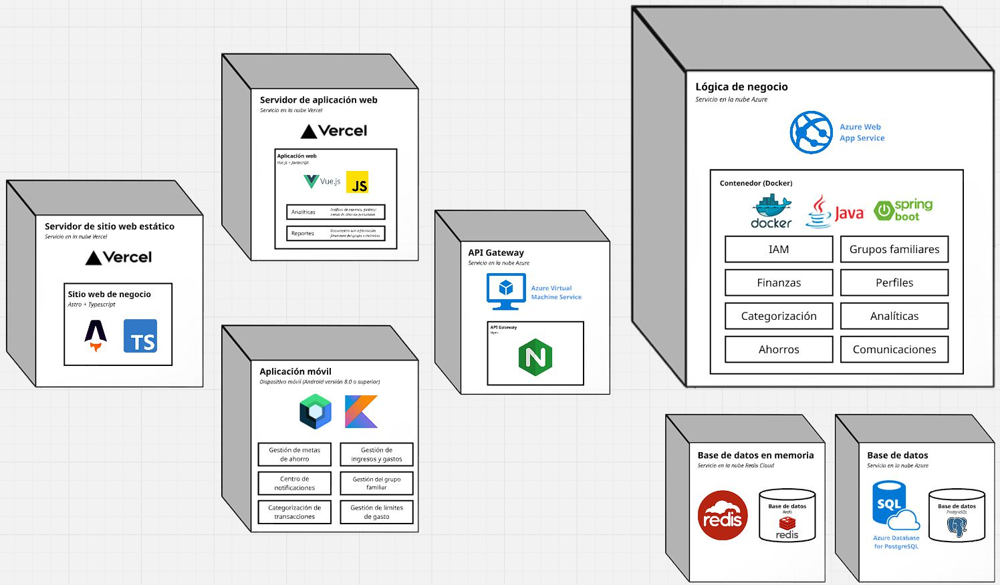

# Capítulo IV: Strategic-Level Software Design
## 4.1. Strategic-Level Attribute-Driven Design
Aquí se explica el proceso de diseño Attribute-Driven Design aplicado a Intiva, detallando su propósito, los inputs considerados, los drivers arquitectónicos, las decisiones de diseño tomadas, los escenarios de atributos de calidad y las primeras vistas de la arquitectura de solución a alto nivel.
### 4.1.1. Design Purpose
El propósito del diseño de Intiva es establecer una arquitectura de software que soporte la gestión financiera personal y familiar de forma centralizada, asegurando mantenibilidad, seguridad y facilidad de uso para usuarios con poca experiencia en herramientas financieras. Se trata de un sistema greenfield desarrollado por una startup en etapa inicial, cuyo diseño debe habilitar tres frontends (landing page estática, aplicación web y aplicación móvil nativa Android) consumiendo un conjunto de APIs RESTful propias.

La solución busca reemplazar los métodos manuales identificados en la etapa de needfinding (hojas de cálculo en Excel, notas del celular y revisión de billeteras digitales) por una plataforma que registre ingresos y gastos, los clasifique por categorías, controle límites de presupuesto, gestione metas de ahorro y envíe recordatorios automáticos de pagos. Adicionalmente, el diseño debe soportar un modelo colaborativo de grupo familiar que permita compartir información financiera entre miembros, respetando la privacidad de los gastos personales de cada integrante, requisito levantado explícitamente durante las entrevistas.
### 4.1.2. Attribute-Driven Design Inputs
Esta sección contiene las secciones para los tres tipos de input para el proceso de diseño con Attribute-Driven Design.
#### 4.1.2.1. Primary Functionality (Primary User Stories)
A continuación se presentan las historias de usuario arquitectónicamente significativas, es decir, aquellas que son críticas para la propuesta de valor del negocio, que presentan mayor riesgo técnico o que atraviesan más de un bounded context del sistema.

| Epic / User Story ID | Título | Descripción | Criterios de Aceptación | Relacionado con (Epic ID) |
|---|---|---|---|---|
| EP 002 / US 003 | Registro de usuario | Como visitante quiero registrarme para utilizar las funcionalidades de la aplicación. | Dado que el visitante no posee una cuenta, cuando complete su registro ingresando nombre completo, correo y contraseña, entonces el sistema crea una cuenta para dicho visitante. | EP 002 |
| EP 002 / US 005 | Inicio de sesión | Como usuario no autenticado quiero iniciar sesión para acceder de forma segura a mi cuenta. | Dado que el usuario tenga una cuenta registrada, cuando ingresa su correo y contraseña, entonces accede a su cuenta mediante un token de sesión válido. | EP 002 |
| EP 005 / US 014 | Registrar gasto | Como usuario quiero registrar un gasto para poseer un registro detallado de los gastos que hago con mi dinero. | Dado que el usuario tenga una cuenta financiera o efectivo disponible, cuando registra un gasto e ingresa origen, monto, fecha y frecuencia, entonces se guarda el gasto y se actualiza el saldo según el origen seleccionado. | EP 005 |
| EP 005 / US 018 | Definir límites de gasto | Como usuario quiero establecer un límite de gasto para no exceder mi presupuesto. | Dado que el usuario tenga categorías o cuentas registradas, cuando establece un límite para un periodo determinado (diario, semanal o mensual), entonces se guarda el límite configurado y se aplica durante ese periodo. | EP 005 |
| EP 006 / US 019 | Crear una meta de ahorro | Como usuario quiero crear una meta de ahorro para establecer un objetivo financiero, ya sea personal o compartido con mi familia. | Dado que el usuario ingrese el nombre, monto objetivo y fecha límite, cuando confirme la creación, entonces se registra la meta en su cuenta o para todo el grupo familiar según corresponda. | EP 006 |
| EP 007 / US 023 | Gestionar un grupo familiar | Como responsable de la economía familiar quiero gestionar un grupo familiar en la plataforma para manejar ingresos, gastos y ahorros compartidos con mi familia. | Dado que un responsable de familia quiera compartir sus finanzas, cuando ingrese el nombre del grupo y envíe invitaciones mediante enlace o código QR, entonces se crea el grupo familiar y queda asignado como administrador. | EP 007 |
| EP 008 / US 030 | Recibir recordatorios sobre el vencimiento del pago | Como usuario quiero ser notificado sobre la fecha de pago para no olvidar la fecha de pago. | Dado que el usuario configuró una fecha de pago a un gasto, cuando dicha fecha se encuentra cerca de su vencimiento, entonces se envía una notificación al usuario indicando qué pago está próximo a vencer. | EP 008 |
| EP 008 / US 029 | Notificación por eventos relacionados a grupos familiares | Como usuario quiero que se me notifique cuando se realice una transacción en mi grupo familiar para estar al tanto de los movimientos que realiza mi familia. | Dado que un usuario pertenece a un grupo, cuando otro integrante realiza una transacción, entonces se le envía una notificación sobre la acción realizada. | EP 008 |
| EP 009 / US 031 | Visualizar gráficos estadísticos con datos de gastos, ingresos y ahorro | Como responsable de la economía familiar quiero visualizar los ingresos, gastos y ahorros mediante un dashboard y gráficos estadísticos para identificar patrones de gasto y tendencias de ahorro. | Dado que el usuario quiera visualizar sus datos financieros, cuando acceda al dashboard, entonces se muestran gráficos según categoría, cuentas, límites de gasto y metas de ahorro, filtrables por periodo. | EP 009 |
| EP 004 / US 010 | Realizar pago de suscripción | Como usuario quiero pagar un plan de suscripción para activar sus beneficios en la plataforma. | Dado que el usuario ha seleccionado un plan, cuando se confirma la transacción con el proveedor de pagos, entonces se activa la suscripción junto a sus beneficios correspondientes. | EP 004 |
#### 4.1.2.2. Quality Attribute Scenarios
En esta sección se detallan los escenarios de atributos de calidad que tienen mayor impacto sobre las decisiones arquitectónicas de Intiva. Estos escenarios derivan directamente de los requisitos no funcionales identificados previamente y representan situaciones clave que el sistema debe ser capaz de manejar con eficacia.

| Atributo | Fuente | Estímulo | Artefacto | Entorno | Respuesta | Medida |
|---|---|---|---|---|---|---|
| **Usabilidad** | Usuario sin experiencia previa en apps financieras | Intenta registrar un gasto por primera vez | Aplicación móvil (Jetpack Compose) | Producción, uso diario | El sistema guía el registro con terminología intuitiva y campos mínimos | Registro completado en menos de 5 pasos |
| **Rendimiento** | Usuario | Registra una transacción de ingreso o gasto | API REST de transacciones | Producción bajo condiciones normales | El sistema persiste la operación y actualiza el saldo | Tiempo de respuesta menor a 1.5 s en operaciones de escritura y 2 s en consultas |
| **Seguridad** | Usuario no autorizado | Intenta acceder con credenciales inválidas o con un token manipulado | Servicio de autenticación (IAM) | Producción | El sistema rechaza el acceso con estado 401 sin exponer detalles internos | 100% de intentos inválidos bloqueados; contraseñas almacenadas con hash BCrypt |
| **Privacidad** | Integrante de un grupo familiar | Intenta consultar los gastos personales de otro miembro del grupo | Bounded Context de Household Management | Producción, entorno compartido | El sistema restringe la visualización según el rol y la marca de privacidad del registro | 0 accesos no autorizados a gastos marcados como personales |
| **Disponibilidad** | Usuario | Solicita acceso a su información financiera en cualquier momento | Backend desplegado en Azure | Producción | El sistema responde sin interrupciones del servicio | Uptime mensual no menor al 95% |
| **Interoperabilidad** | Servicio externo (Firebase Cloud Messaging, Google Play Billing, Cloudinary) | Devuelve un error, un token inválido o no está disponible | Adaptadores de integración del backend | Producción | El sistema maneja la excepción sin interrumpir el flujo principal de la aplicación | 100% de fallos de terceros manejados sin caída del servicio |
| **Modificabilidad** | Equipo de desarrollo | Necesita añadir un nuevo tipo de cuenta financiera o una nueva categoría de análisis | Bounded Contexts del backend | Desarrollo | El cambio se realiza dentro de un solo bounded context sin afectar a los demás | Modificación localizada en un único módulo del backend |
#### 4.1.2.3. Constraints
En esta sección reunimos aquellas condiciones que no son opcionales y son restricciones establecidas por necesidades propias del negocio y del contexto académico del proyecto, las cuales debemos respetar para asegurar que la solución propuesta sea viable y cumpla con las expectativas. A continuación, se presentan los principales constraints en forma de Technical Stories, sirviendo como guía concreta para el desarrollo del sistema.

| ID | Título | Descripción | Criterios de Aceptación | Relacionado con |
|---|---|---|---|---|
| C-01 | Stack tecnológico del backend | El backend debe implementarse con Java 21 (LTS) y Spring Boot, empleando Spring Web, Spring Data JPA, Hibernate, Spring Security y Lombok. | Dado que se requiere estabilidad y soporte a largo plazo, cuando se inicie el desarrollo del backend, entonces el stack debe quedar documentado con sus versiones mínimas requeridas. | TS 005 |
| C-02 | Stack tecnológico del frontend web | La aplicación web debe desarrollarse en Vue con PrimeVue, Pinia para gestión de estados, Axios para peticiones HTTP y Vue-i18n para internacionalización. | Dado que se define el stack de la aplicación web, cuando se compile el proyecto, entonces la aplicación debe renderizarse correctamente en Chrome, Firefox y Edge en sus versiones actuales. | TS 006 |
| C-03 | Stack tecnológico de la aplicación móvil | La aplicación móvil debe ser nativa Android en Kotlin, usando Jetpack Compose, Compose Navigation, Retrofit y Hilt. | Dado que el usuario tiene un dispositivo Android, cuando instala la aplicación, entonces esta es compatible con Android 8.0 o superior, cubriendo al segmento objetivo identificado. | TS 007 |
| C-04 | Stack del sitio web estático | La landing page debe construirse con Astro.js para garantizar generación estática y rendimiento optimizado. | Dado el stack seleccionado, cuando se revisen los requisitos del proyecto, entonces debe cumplir con generación estática (SSG) y rendimiento optimizado. | TS 004 |
| C-05 | Arquitectura RESTful obligatoria | La comunicación entre los frontends y el backend debe realizarse mediante APIs RESTful propias, con rutas versionadas y nomenclatura consistente. | Dado que se diseña un nuevo endpoint, cuando se define su ruta, entonces sigue el patrón `/api/{versión}/{recurso}` en plural, minúsculas y usando sustantivos. | TS 008 |
| C-06 | Persistencia y caché | La persistencia principal debe realizarse en PostgreSQL mediante JPA, con Redis desplegado en Redis Cloud para caché y tokens temporales, y Room para persistencia local en la app móvil. | Dado que se requiere reducir tiempos de respuesta en consultas frecuentes, cuando se consulten datos del dashboard, entonces el sistema los obtiene desde Redis sin consultar directamente la base de datos. | TS 014, TS 015, TS 022 |
| C-07 | Dependencia de servicios externos | La solución depende de Firebase Cloud Messaging para notificaciones push, Google OAuth 2.0 para autenticación federada, Cloudinary para almacenamiento de imágenes y Google Play Billing para suscripciones. | Dado que un servicio externo no esté disponible, cuando el sistema intente consumirlo, entonces informa del error sin afectar al resto de funcionalidades de la aplicación. | TS 011, TS 017, TS 018, TS 019 |
| C-08 | Despliegue en la nube con planes gratuitos | El backend debe desplegarse en Microsoft Azure y la infraestructura debe apoyarse en planes gratuitos o de bajo costo, dada la condición de startup sin financiamiento. | Dado que existe una imagen del backend lista para producción, cuando se despliega en Azure, entonces el servicio queda accesible en la URL de producción y responde con estado 200 al health check definido. | TS 020 |
| C-09 | Cifrado de comunicaciones y datos sensibles | Toda comunicación cliente-servidor debe realizarse mediante HTTPS con TLS, y las contraseñas deben almacenarse únicamente como hash. | Dado que un cliente intenta conectarse mediante HTTP, cuando el servidor recibe la solicitud, entonces redirige automáticamente a HTTPS o rechaza la conexión. | TS 001, TS 003 |
| C-10 | Alcance y plazos académicos | El desarrollo debe ejecutarse por un equipo de estudiantes dentro de los plazos de los hitos TB1, TP1, TB2 y TF1, entregando obligatoriamente landing page, aplicación web, aplicación móvil y APIs propias. | Dado que el proyecto es académico, cuando se planifique cada sprint, entonces el alcance comprometido debe ser alcanzable dentro del hito correspondiente. | — |
### 4.1.3. Architectural Drivers Backlog
En esta sección identificamos y priorizamos los principales drivers que deben guiar nuestra arquitectura, junto con las restricciones impuestas. A continuación, presentamos el Architectural Drivers Backlog, organizado para resaltar aquellos elementos que tienen mayor relevancia para los stakeholders y que representan mayor impacto en la complejidad técnica de la arquitectura.

| Driver ID | Título de Driver | Descripción | Importancia para Stakeholders (High, Medium, Low) | Impacto en Architecture Technical Complexity (High, Medium, Low) |
|---|---|---|---|---|
| D-01 | Registro centralizado de ingresos y gastos | Unificar el registro y consulta de transacciones financieras en una sola plataforma, eliminando el uso de Excel y notas manuales. | High | Medium |
| D-02 | Gestión financiera familiar compartida | Permitir la creación de grupos familiares con roles, invitaciones y visibilidad compartida de ingresos, gastos y metas. | High | High |
| D-03 | Privacidad dentro del entorno compartido | Garantizar que un integrante pueda mantener en reserva sus gastos personales aun perteneciendo a un grupo familiar. | High | High |
| D-04 | Alertas y recordatorios automáticos | Notificar vencimientos de pago, excesos de límites de gasto y eventos del grupo familiar mediante notificaciones push. | High | Medium |
| D-05 | Visualización de datos financieros | Ofrecer un dashboard con gráficos estadísticos por categoría, cuenta, límite y periodo, con opción de descarga. | High | Medium |
| D-06 | Facilidad de uso y lenguaje intuitivo | Mantener una interfaz simple, con terminología no técnica, dirigida a usuarios sin experiencia previa en finanzas. | High | Low |
| D-07 | Seguridad de las cuentas y los datos | Proteger credenciales y datos financieros mediante hashing, JWT, HTTPS/TLS y autenticación federada con Google. | High | Medium |
| D-08 | Multiplataforma (web, móvil y landing) | Soportar tres clientes distintos consumiendo el mismo conjunto de APIs RESTful. | Medium | High |
| D-09 | Rendimiento en consultas frecuentes | Mantener tiempos de respuesta bajos en el registro de transacciones y en la carga del dashboard mediante caché. | Medium | Medium |
| D-10 | Monetización freemium | Definir planes gratuito y premium, con validación de suscripciones a través del proveedor de pagos. | Medium | Medium |
| D-11 | Metas de ahorro personales y compartidas | Registrar, modificar y hacer seguimiento de metas con aportes individuales y grupales. | Medium | Medium |
| D-12 | Disponibilidad del servicio | Mantener la plataforma accesible con un uptime mensual no menor al 95% sobre infraestructura en planes gratuitos. | Medium | Low |

Los drivers clasificados como (High, High) —D-02 y D-03— son los que se abordan en la primera iteración del proceso de diseño, ya que constituyen simultáneamente el principal diferenciador del producto y el mayor desafío técnico de la arquitectura, al requerir un modelo de permisos y visibilidad granular dentro de un contexto compartido.
### 4.1.4. Architectural Design Decisions

Con el Architectural Drivers Backlog ya consolidado, el equipo llevó a cabo el proceso de toma de decisiones siguiendo las etapas del Quality Attribute Workshop. El trabajo no se resolvió en una sola sesión, sino en cuatro iteraciones sucesivas, cada una enfocada en un subconjunto acotado de drivers. Esta forma de avanzar responde a una razón práctica: intentar resolver los doce drivers simultáneamente habría llevado a decisiones apresuradas, mientras que abordarlos por grupos permitió que las decisiones de una iteración sirvieran como punto de partida verificado para la siguiente.

El criterio de entrada a cada iteración fue el mismo. Primero se seleccionaron los drivers pendientes de mayor prioridad según la clasificación del backlog. Luego se identificaron los patrones y tácticas candidatas capaces de satisfacerlos, limitando la evaluación a los tres más relevantes en cada caso, tal como recomienda el método cuando el abanico de alternativas es amplio. Después se contrastó cada candidato mediante la Candidate Pattern Evaluation Matrix, registrando de forma explícita sus ventajas y desventajas frente al driver evaluado. Finalmente se tomó la decisión, se instanciaron los elementos arquitectónicos correspondientes y se dejó constancia de las consecuencias asumidas.

Es importante señalar que varias de las decisiones registradas aquí no son óptimas en términos absolutos, sino óptimas bajo las restricciones del proyecto. Las constraints C-08 (despliegue sobre planes gratuitos) y C-10 (plazos académicos) actuaron como filtro permanente: alternativas técnicamente superiores fueron descartadas o pospuestas por resultar inviables dentro de esos límites. Cuando esto ocurrió, se dejó asentada la condición bajo la cual la alternativa descartada volvería a ser pertinente.

#### Iteración 1: estructura general del sistema

**Drivers considerados:** D-02 (Gestión financiera familiar compartida), D-03 (Privacidad dentro del entorno compartido) y D-07 (Seguridad de las cuentas y los datos).

Esta primera iteración partió de los dos únicos drivers clasificados como (High, High) en el backlog. La razón para atacarlos primero es que ambos definen simultáneamente la propuesta de valor del producto y el punto de mayor dificultad técnica de la arquitectura. Un usuario debe poder compartir su economía con su familia sin perder el control sobre lo que decide mantener en reserva, condición que apareció de forma explícita en las entrevistas del Capítulo II. Resolver esto exige un modelo de visibilidad que no puede quedar librado a la interfaz de usuario, porque cualquier consulta directa a la API lo dejaría sin efecto.

Las tácticas evaluadas correspondieron a la categoría de seguridad y modificabilidad. Por el lado de seguridad se consideraron *limit access* y *authorize actors*, entendiendo que la decisión sobre qué puede ver cada integrante debe tomarse en el modelo de dominio y no en la capa de presentación. Por el lado de modificabilidad se consideró *encapsulate* y *restrict dependencies*, dado que el conjunto de reglas de visibilidad tenderá a crecer y conviene que quede confinado en un lugar identificable.

**Candidate Pattern Evaluation Matrix: estructura general del sistema**

| Driver ID | Título de Driver | Patrón 1: Monolito en capas técnicas | | Patrón 2: Monolito modular por Bounded Context | | Patrón 3: Microservicios |  |
|---|---|---|---|---|---|---|---|
| | | **Pro** | **Con** | **Pro** | **Con** | **Pro** | **Con** |
| D-02 | Gestión financiera familiar compartida | Permite compartir entidades entre funcionalidades sin ningún costo de integración, ya que todo el dominio vive en un mismo conjunto de servicios. | Las reglas del grupo familiar quedarían mezcladas con las del registro de transacciones, sin un lugar claro donde localizarlas ni un responsable único de mantenerlas. | Concentra el modelo de grupo, roles e invitaciones en un módulo con frontera propia, que el resto del sistema consulta a través de una interfaz publicada. | Obliga al equipo a sostener la disciplina de no cruzar la frontera, porque el lenguaje no impide técnicamente un acceso indebido entre módulos. | Aísla físicamente el servicio de grupos familiares y permite evolucionarlo y escalarlo con independencia del resto. | Introduce consistencia eventual en operaciones que hoy son atómicas y exige coordinación distribuida para algo que ocurre dentro de una misma solicitud. |
| D-03 | Privacidad dentro del entorno compartido | Facilita aplicar filtros de consulta rápidos sobre un mismo modelo de datos. | Dispersa la regla de privacidad en cada servicio que consulte transacciones, con alto riesgo de que alguna consulta nueva la omita por descuido. | Permite que la titularidad del registro forme parte del modelo de dominio y que la verificación de pertenencia se delegue en un único módulo consultable. | El aislamiento es lógico y no físico, de modo que un error de programación aún podría sortear la frontera sin ser detectado por el compilador. | Ofrece aislamiento real, con superficie de acceso reducida a lo que cada servicio expone deliberadamente. | El costo operativo y de infraestructura resulta desproporcionado frente al beneficio en el estado actual del producto. |
| D-07 | Seguridad de las cuentas y los datos | Ofrece un único punto de configuración para la cadena de filtros de seguridad. | Sin fronteras internas, cualquier componente termina con acceso potencial a toda la información persistida. | Mantiene la identidad y la emisión de credenciales en un contexto propio, separado del dominio financiero que las consume. | El contexto de identidad comparte proceso con el resto, de modo que una falla grave lo afecta todo por igual. | Permite endurecer y auditar el servicio de identidad de forma independiente al resto del sistema. | Multiplica los puntos de entrada a proteger y la superficie de ataque asociada al tránsito entre servicios. |

**Decisión adoptada.** Se optó por el monolito modular organizado por bounded contexts. El razonamiento fue que este patrón conserva el beneficio central del enfoque orientado a servicios, que es la existencia de fronteras de dominio explícitas, sin asumir el costo de infraestructura y de coordinación distribuida que las constraints C-08 y C-10 vuelven inviable. La alternativa de microservicios no se rechazó por considerarse inadecuada, sino que quedó pospuesta: la descomposición en contextos que se adopta ahora es precisamente la que permitiría extraer un módulo como servicio autónomo más adelante sin rehacer el modelo de dominio.

De esta iteración se desprenden las siguientes decisiones concretas.

| ID | Decisión | Fundamento |
|---|---|---|
| AD-01 | Estructurar el backend como un monolito modular, con un módulo por bounded context y un único artefacto desplegable en Azure. | Concilia el aislamiento de dominio que exigen D-02 y D-03 con las restricciones de costo y plazo. |
| AD-02 | Organizar internamente cada contexto en capas orientadas al dominio (`domain.model`, `domain.services`, `application.internal`, `infrastructure`, `interfaces.rest`), con las dependencias apuntando hacia el dominio. | Evita que las reglas financieras queden atadas a JPA o a Spring Web, lo que permitiría sustituir persistencia o transporte sin tocar el núcleo. |
| AD-03 | Representar la titularidad de todo registro financiero mediante el value object compartido `OwnerTypes`, con los valores INDIVIDUAL y FAMILY, en lugar de duplicar entidades para el caso personal y el familiar. | Traslada la decisión de privacidad al modelo: la marca viaja con el dato, de modo que ninguna consulta puede ignorarla sin que sea evidente. |
| AD-04 | Concentrar en el contexto Household la verificación de pertenencia y rol dentro de un grupo, exponiéndola como servicio consultable por los demás contextos. | Impide que la regla de D-03 se reimplemente de forma divergente en cada contexto que necesite aplicarla. |
| AD-05 | Emplear una única base de datos PostgreSQL con esquema compartido, separando las tablas por contexto mediante convenciones de nomenclatura. | Preserva la atomicidad de operaciones que atraviesan contextos y se ajusta a C-06 y C-08. Se asume conscientemente el riesgo de acoplamiento por datos. |

#### Iteración 2: colaboración entre bounded contexts

**Drivers considerados:** D-01 (Registro centralizado de ingresos y gastos), D-04 (Alertas y recordatorios automáticos) y D-11 (Metas de ahorro personales y compartidas).

Definida la estructura, la segunda iteración tuvo que resolver un problema que la primera dejó abierto. Si los contextos tienen fronteras, hace falta decidir cómo se comunican sin anularlas. El caso que puso el asunto en evidencia fue el registro de un gasto familiar, porque desencadena una secuencia que involucra a cuatro contextos distintos: se valida el saldo de la cuenta, se persiste la transacción, se reevalúan los límites que pudieran verse afectados y se avisa al resto del grupo. Tratar todos esos pasos por igual habría sido un error, ya que solo el primero condiciona si la operación puede aceptarse.

Las tácticas evaluadas fueron *use an intermediary* para el desacoplamiento estructural e *introduce concurrency* para el temporal. La distinción resultó determinante: hay colaboraciones que deben completarse antes de responder al usuario y otras que solo necesitan ocurrir, sin que importe si lo hacen dentro de la misma solicitud.

**Candidate Pattern Evaluation Matrix: mecanismo de colaboración entre contextos**

| Driver ID | Título de Driver | Patrón 1: Acceso directo al repositorio ajeno | | Patrón 2: Anti-Corruption Layer sobre Open Host Service | | Patrón 3: Domain Events en proceso | |
|---|---|---|---|---|---|---|---|
| | | **Pro** | **Con** | **Pro** | **Con** | **Pro** | **Con** |
| D-01 | Registro centralizado de ingresos y gastos | Consulta el saldo disponible con la menor latencia posible, sin capas intermedias. | Acopla el contexto consumidor al esquema de tablas del proveedor, de modo que un cambio de columna rompe un módulo ajeno sin previo aviso. | Expresa la validación de saldo como una pregunta al contexto dueño de esa información, que responde según sus propias reglas. | Agrega dos clases por relación y mantiene el acoplamiento temporal, ya que la llamada sigue siendo bloqueante. | No aplica, porque la validación de saldo debe resolverse antes de aceptar la transacción y no admite tratamiento diferido. | Un evento no puede condicionar la aceptación de la operación que lo origina. |
| D-04 | Alertas y recordatorios automáticos | Permitiría consultar directamente las tablas de notificaciones desde el contexto financiero. | Convierte a Finances en responsable de cómo se persiste una notificación, que es una decisión ajena a su dominio. | Deja explícito que Finances solicita una alerta y que Communications decide cómo entregarla. | Mantiene a Finances esperando el resultado del envío, aunque ese resultado no cambie nada de la operación principal. | Permite que la evaluación de límites y el aviso al grupo ocurran fuera del tiempo de respuesta de la transacción. | No garantiza el orden de ejecución ni la entrega si el proceso se interrumpe, ya que no se implementa un patrón outbox. |
| D-11 | Metas de ahorro personales y compartidas | Facilitaría leer aportes y transacciones desde un mismo lugar. | Impide que la regla de cierre de una meta quede bajo el control del agregado que la representa. | Permite consultar la información de la meta sin exponer su modelo interno al resto del sistema. | Añade un paso de traducción en colaboraciones que son poco frecuentes. | Habilita que el cumplimiento de una meta dispare la felicitación sin que quien registra el aporte deba esperarla. | Dificulta seguir la traza completa de la operación durante la depuración. |

**Decisión adoptada.** Lejos de elegir un único patrón, la iteración concluyó que los dos últimos son complementarios y que el primero debía descartarse como mecanismo general. Toda colaboración que condicione el resultado de una operación se resuelve de forma síncrona mediante una interfaz publicada por el contexto proveedor y consumida a través de un adaptador propio del consumidor. Toda consecuencia posterior, en cambio, se propaga mediante eventos de dominio. El criterio que separa ambos casos quedó formulado así: si el resultado de la colaboración puede cambiar la decisión de aceptar o rechazar la operación, es síncrona; si solo describe algo que debe ocurrir después, es asíncrona.

Conviene anticipar que este criterio no se aplicó de manera uniforme en toda la implementación. El análisis posterior de los flujos de mensajes reveló que el contexto Analytics accede de forma directa a repositorios de Finances y Savings, precisamente el patrón que aquí se descartó. Ese hallazgo se documenta en detalle en la sección 4.2.5 y se registra como deuda de diseño al cierre de este apartado.

| ID | Decisión | Fundamento |
|---|---|---|
| AD-06 | Resolver toda colaboración síncrona mediante un `ContextFacade` publicado por el contexto proveedor y consumido a través de un servicio adaptador propio del consumidor. | Hace visible cada dependencia entre contextos y permite sustituir la implementación del proveedor sin propagar el cambio. |
| AD-07 | Propagar los efectos posteriores a una operación mediante eventos de dominio en proceso, fuera de la transacción que los origina. | Evita que el registro de un gasto quede esperando el envío de notificaciones que no condicionan su resultado. |
| AD-08 | Separar comandos y consultas en la capa de aplicación de cada contexto, manteniendo las invariantes dentro del agregado correspondiente. | Sitúa cada regla de negocio junto al elemento que la hace cumplir, lo que localiza los cambios futuros. |
| AD-09 | Mantener un Shared Kernel acotado en `platform.shared`, con los tipos `Money`, `UserId`, `OwnerTypes`, `PeriodTypes`, `CurrencyCodes` y la clase base de agregados auditables. | Evita que cada contexto construya su propia noción de dinero o de titular, divergencia especialmente riesgosa en un dominio financiero. |
| AD-10 | Exponer la funcionalidad mediante rutas REST versionadas bajo `/api/v1/{recurso}`, con recursos y ensambladores propios de cada contexto. | Da cumplimiento a C-05 y habilita que los tres clientes consuman un contrato único. |

#### Iteración 3: rendimiento de las consultas y disponibilidad

**Drivers considerados:** D-05 (Visualización de datos financieros), D-09 (Rendimiento en consultas frecuentes) y D-12 (Disponibilidad del servicio).

La tercera iteración se ocupó del comportamiento del sistema en tiempo de ejecución. El punto crítico identificado fue el panel de analíticas, que necesita reunir información de tres contextos distintos y agregarla por periodo. A diferencia del registro de una transacción, que trabaja sobre un dato puntual, el cálculo del resumen recorre todo el histórico del titular. El problema se agrava con el uso, ya que cuanto más tiempo lleve una familia en la plataforma, más costoso resulta recalcular sus métricas.

Las tácticas evaluadas pertenecen a la categoría de rendimiento, en particular *maintain multiple copies of computations* y *bound execution times*, junto con *state resynchronization* para el escenario de pérdida de conectividad asociado a D-12.

**Candidate Pattern Evaluation Matrix: estrategia de cálculo de métricas**

| Driver ID | Título de Driver | Patrón 1: Cálculo bajo demanda sin caché | | Patrón 2: Caché cache-aside en Redis con TTL | | Patrón 3: Vista materializada en PostgreSQL | |
|---|---|---|---|---|---|---|---|
| | | **Pro** | **Con** | **Pro** | **Con** | **Pro** | **Con** |
| D-05 | Visualización de datos financieros | Garantiza que el gráfico refleje siempre el último movimiento registrado. | El tiempo de respuesta se degrada de forma sostenida a medida que crece el histórico del usuario. | Responde de inmediato a la consulta repetida del mismo periodo, que es el caso más frecuente en el uso real. | Introduce una ventana durante la cual el panel puede no reflejar una transacción recién registrada. | Precalcula el resultado sin depender de un servicio adicional al gestor de base de datos. | Pierde flexibilidad frente a filtros por periodos arbitrarios, que es justamente lo que el panel ofrece. |
| D-09 | Rendimiento en consultas frecuentes | No requiere gestionar invalidación ni coherencia entre copias. | Cada apertura del panel repite un cálculo idéntico al anterior sin ninguna ganancia. | Reduce la consulta recurrente a una lectura en memoria y el proveedor ofrece un plan gratuito compatible con C-08. | Obliga a definir una política de invalidación por titular y periodo, que agrega lógica a mantener. | Traslada el costo del cálculo a un momento distinto del de la consulta. | El refresco compite por los mismos recursos que la carga transaccional, en la misma instancia. |
| D-12 | Disponibilidad del servicio | Ninguna: ante indisponibilidad del backend no hay respuesta posible. | Concentra toda la capacidad de respuesta en un único componente. | Permite seguir sirviendo el último resumen disponible aunque el cálculo momentáneamente falle. | Agrega una dependencia externa cuya caída también debe contemplarse. | Mantiene el resultado disponible mientras la base de datos lo esté. | Comparte destino con la base de datos: si ella no responde, la vista tampoco. |

**Decisión adoptada.** Se eligió la caché cache-aside sobre Redis. El argumento decisivo fue que la desactualización acotada por un TTL resulta tolerable para métricas financieras de periodo, que no son valores de precisión instantánea sino agregados de tendencia. Un usuario que consulta cuánto gastó en el mes no necesita que la cifra incluya el gasto registrado hace treinta segundos, mientras que sí necesita que el panel abra sin demora. La vista materializada se descartó porque el panel permite filtrar por periodos arbitrarios y precalcular todas las combinaciones posibles carecía de sentido.

| ID | Decisión | Fundamento |
|---|---|---|
| AD-11 | Almacenar el resumen analítico en Redis bajo estrategia cache-aside con tiempo de vida acotado, recalculándolo solo cuando no exista una entrada vigente. | Resuelve D-05 y D-09 asumiendo una desactualización tolerable para el tipo de información presentada. |
| AD-12 | Incorporar persistencia local mediante Room y SQLite en la aplicación móvil, con sincronización diferida al recuperar la conexión. | Responde al hallazgo de las entrevistas sobre registro de gastos en movilidad y aporta disponibilidad percibida frente a D-12. |
| AD-13 | Ejecutar la detección de vencimientos mediante procesos programados dentro del propio contexto Finances, en lugar de un orquestador externo. | Mantiene la regla del vencimiento junto al agregado que la define y evita infraestructura adicional. |

#### Iteración 4: seguridad, clientes y despliegue

**Drivers considerados:** D-06 (Facilidad de uso y lenguaje intuitivo), D-07 (Seguridad de las cuentas y los datos), D-08 (Multiplataforma) y D-10 (Monetización freemium).

La última iteración definió la frontera externa del sistema. Dos asuntos quedaban pendientes: cómo se autentica quien accede y cómo se relacionan los tres clientes exigidos por las constraints con un backend único. El segundo punto tenía además una consecuencia de diseño que no era obvia al principio. Las constraints obligan a construir tres frontends, pero no dicen qué debe hacer cada uno, y asignarles a todos las mismas funciones habría desperdiciado sus diferencias. El User Task Matrix del Capítulo II mostraba que el registro de gastos es una tarea de alta frecuencia y contexto móvil, mientras que la lectura de gráficos es una tarea de menor frecuencia que se beneficia de una pantalla amplia.

**Candidate Pattern Evaluation Matrix: autenticación y gestión de sesión**

| Driver ID | Título de Driver | Patrón 1: Sesión en servidor | | Patrón 2: Token JWT firmado sin estado | | Patrón 3: Delegación total a proveedor externo | |
|---|---|---|---|---|---|---|---|
| | | **Pro** | **Con** | **Pro** | **Con** | **Pro** | **Con** |
| D-07 | Seguridad de las cuentas y los datos | Permite revocar una sesión de forma inmediata desde el servidor. | Obliga a mantener estado compartido entre instancias, lo que penaliza cualquier crecimiento horizontal. | Valida cada petición sin consultar la base de datos y funciona igual para los tres clientes. | La revocación anticipada requiere una lista de bloqueo, que reintroduce estado. | Traslada la custodia de credenciales a un tercero especializado. | Deja al sistema sin acceso para quien no posea una cuenta del proveedor, lo que excluye parte del segmento objetivo. |
| D-08 | Multiplataforma | Funciona con normalidad en navegadores mediante cookies de sesión. | Encaja mal con un cliente móvil nativo, que no comparte el modelo de cookies del navegador. | Se transporta igual en web y en móvil, sin tratamiento diferenciado por cliente. | Exige manejar con cuidado el vencimiento y la renovación en cada cliente. | Uniformiza el acceso entre plataformas. | Introduce dependencia de la disponibilidad del proveedor para toda operación de acceso. |

**Candidate Pattern Evaluation Matrix: estrategia de clientes**

| Driver ID | Título de Driver | Patrón 1: Cliente único multiplataforma | | Patrón 2: Tres clientes especializados sobre una API común | | Patrón 3: Backend for Frontend por cliente | |
|---|---|---|---|---|---|---|---|
| | | **Pro** | **Con** | **Pro** | **Con** | **Pro** | **Con** |
| D-06 | Facilidad de uso y lenguaje intuitivo | Asegura una experiencia idéntica en todas las plataformas. | Impide adaptar cada interfaz a la tarea que realmente predomina en ese dispositivo. | Permite que la aplicación móvil optimice el registro rápido y que la web optimice la lectura de gráficos. | Obliga a mantener coherencia de lenguaje y de terminología entre tres interfaces distintas. | Facilita ajustar la respuesta del servidor a lo que cada interfaz necesita mostrar. | Agrega una capa intermedia sin beneficio perceptible para el usuario final. |
| D-08 | Multiplataforma | Reduce el esfuerzo de desarrollo a una sola base de código. | Incumple de forma directa las constraints C-02, C-03 y C-04, que imponen tecnologías distintas por cliente. | Da cumplimiento a las tres constraints de stack y mantiene un contrato único de integración. | Triplica el esfuerzo de interfaz y exige coordinar la evolución del contrato. | Permite optimizar el volumen de datos enviado a cada cliente. | Multiplica los despliegues y el costo asociado, incompatible con C-08. |
| D-10 | Monetización freemium | Simplifica la integración con la tienda de aplicaciones. | Limita la posibilidad de ofrecer la contratación por canales distintos al móvil. | Permite que la compra ocurra en el cliente móvil y que la validación se resuelva en el servidor. | Requiere que el backend consulte al proveedor de pagos antes de activar beneficios. | Podría adaptar la presentación de planes por canal. | El costo no se justifica para una funcionalidad de uso esporádico. |

**Decisión adoptada.** Se optó por el token JWT firmado, complementado con almacenamiento de contraseñas mediante función de hash y con la posibilidad de autenticación federada con Google como vía alternativa y no excluyente. La delegación total a un proveedor externo se descartó porque habría dejado fuera a quienes no poseen cuenta de Google, situación nada infrecuente en el segmento objetivo. Para los clientes se eligió el esquema de tres frontends especializados sobre una API común, con asignación diferenciada de responsabilidades.

| ID | Decisión | Fundamento |
|---|---|---|
| AD-14 | Autenticar mediante token JWT firmado, almacenar contraseñas únicamente como hash y admitir autenticación federada con Google como alternativa equivalente. | Atiende D-07 y D-08 sin excluir a quienes no poseen cuenta del proveedor externo. |
| AD-15 | Entregar alertas y recordatorios mediante notificaciones push, disparadas por los eventos de dominio que las originan. | Da cumplimiento a D-04 y a las historias US 026, US 027, US 029 y US 030. |
| AD-16 | Aislar cada servicio externo tras un adaptador propio en la capa de infraestructura, que traduzca su respuesta y absorba sus fallos. | Impide que la caída de un tercero se propague al dominio, según exige C-07. |
| AD-17 | Asignar responsabilidades diferenciadas por cliente: la landing comunica la propuesta de valor, la aplicación móvil concentra el registro cotidiano y la aplicación web concentra la analítica. | Alinea cada cliente con la tarea predominante identificada en el User Task Matrix. |
| AD-18 | Exponer el backend detrás de un proxy inverso que actúe también como punto único de entrada, con cifrado de transporte terminado en él. | Cumple C-09 y TS 016, sin exponer puertos internos del servicio. |
| AD-19 | Validar toda suscripción del lado del servidor contra el proveedor de pagos, sin confiar en el resultado que informe el cliente. | Previene la activación fraudulenta de beneficios premium, requisito implícito de D-10 y US 010. |

#### Deuda de diseño asumida

El proceso dejó dos decisiones que el equipo considera incorrectas pero que se mantienen de forma consciente en esta versión. Se registran aquí para que su trazabilidad no dependa de la memoria de quienes participaron.

| ID | Descripción | Origen | Condición para resolverla |
|---|---|---|---|
| DT-01 | El contexto Analytics accede de forma directa a los repositorios de Finances y de Savings, sin mediar la interfaz publicada por esos contextos. | Combinación de AD-05, que habilita técnicamente el acceso al compartirse la base de datos, con la presión de plazo de C-10. | Debe resolverse mediante un modelo de lectura propio de Analytics, alimentado por eventos, antes de intentar cualquier extracción de contextos como servicios independientes. |
| DT-02 | El contexto Profiles escucha un evento definido dentro del paquete de dominio de IAM, en lugar de un evento de integración declarado como lenguaje publicado. | AD-07 no fijó una convención explícita sobre qué eventos son públicos y cuáles internos. | Extraer el evento de integración hacia el kernel compartido cuando se formalice el catálogo de eventos públicos del sistema. |

### 4.1.5. Quality Attribute Scenario Refinements

Al concluir el Quality Attribute Workshop, el equipo revisó los escenarios formulados en la sección 4.1.2.2 y los reescribió incorporando las decisiones adoptadas. La diferencia entre ambas versiones no es de redacción sino de naturaleza. Los escenarios iniciales describían un comportamiento deseado sin comprometerse con ninguna solución, mientras que los refinados señalan el artefacto concreto que recibe el estímulo, cuantifican la respuesta esperada y dejan constancia de las preguntas que quedaron abiertas y de los problemas detectados durante la discusión.

Tres decisiones influyeron especialmente en esta revisión. La primera fue el traslado de la regla de privacidad al modelo de dominio mediante AD-03 y AD-04, que convirtió un enunciado genérico sobre visibilidad en un escenario verificable con una medida de cero accesos indebidos. La segunda fue la separación entre colaboraciones síncronas y asíncronas establecida en AD-07, que obligó a distinguir qué parte del tiempo de respuesta corresponde realmente a la operación y qué parte ocurre después de ella. La tercera fue la introducción de la caché de AD-11, que llevó a desdoblar el escenario original de rendimiento en dos escenarios independientes, porque la escritura de una transacción y la lectura del panel de analíticas tienen artefactos, tácticas y medidas distintas, y tratarlos como uno solo ocultaba esa diferencia.

Los escenarios se presentan a continuación en orden de prioridad, criterio que combina la importancia asignada por los stakeholders en el Architectural Drivers Backlog con la frecuencia con que el estímulo se presenta durante el uso real del sistema.

**Scenario Refinement for Scenario 1**

| Campo | Contenido |
|---|---|
| **Scenario(s)** | Una persona sin experiencia previa en aplicaciones financieras registra su primer gasto inmediatamente después de crear su cuenta, sin haber configurado categorías ni cuentas, y completa la operación siguiendo instrucciones guiadas. |
| **Business Goals** | Reducir la barrera de entrada al producto para el segmento objetivo, que según las entrevistas abandona las herramientas actuales por la fricción del registro manual, e incrementar la retención temprana de usuarios registrados. |
| **Relevant Quality Attributes** | Usabilidad. |
| **Scenario Components** | |
| Stimulus | Intenta registrar un gasto por primera vez sin configuración previa. |
| Stimulus Source | Persona usuaria recién registrada, sin experiencia en herramientas de gestión financiera. |
| Environment | Producción, durante el primer uso de la aplicación. |
| Artifact (if Known) | Aplicación móvil construida con Jetpack Compose y el flujo de preparación inicial que se dispara al completarse el registro. |
| Response | El sistema presenta un formulario que solicita únicamente monto, fecha y origen, apoyándose en la categoría y la cuenta financiera creadas por defecto durante el registro, con terminología libre de tecnicismos financieros. |
| Response Measure | El registro se completa en cinco pasos o menos, sin que la persona deba configurar nada de forma previa. |
| **Questions** | ¿La categoría creada por defecto resulta comprensible para alguien que nunca ha clasificado un gasto, o conviene nombrarla de forma más descriptiva? ¿Cinco pasos es un límite adecuado o debería ajustarse tras las primeras pruebas con usuarios reales? |
| **Issues** | La preparación inicial concentra tres llamadas salientes en un único manejador de evento dentro de IAM, lo que acopla ese contexto al orden de creación en otros tres. Si alguna de esas llamadas falla, la persona podría quedar sin categoría o sin cuenta por defecto, con lo que el escenario dejaría de cumplirse sin que el fallo sea visible. |

**Scenario Refinement for Scenario 2**

| Campo | Contenido |
|---|---|
| **Scenario(s)** | Un integrante de un grupo familiar consulta el historial del grupo, donde coexisten transacciones compartidas y gastos personales de otros integrantes, y obtiene únicamente aquello que le corresponde ver. |
| **Business Goals** | Sostener el principal diferenciador del producto frente a la competencia, que consiste en permitir la gestión financiera compartida sin obligar a renunciar a la privacidad individual, requisito levantado de forma explícita durante las entrevistas. |
| **Relevant Quality Attributes** | Privacidad, Seguridad. |
| **Scenario Components** | |
| Stimulus | Solicita el historial de transacciones del grupo familiar al que pertenece. |
| Stimulus Source | Integrante de un grupo familiar activo. |
| Environment | Producción, en un grupo familiar con varios integrantes que registran movimientos de forma simultánea. |
| Artifact (if Known) | Agregado `Transaction` con el value object `OwnerTypes` y la interfaz publicada por el contexto Household para verificar pertenencia y rol. |
| Response | El sistema devuelve exclusivamente las transacciones marcadas como familiares del grupo correspondiente. Los gastos personales de otros integrantes no aparecen en el listado ni contribuyen a los totales del grupo. De forma complementaria, toda transacción familiar genera la notificación correspondiente al resto de integrantes activos. |
| Response Measure | Cero accesos a transacciones marcadas como personales de otro integrante. Totalidad de las transacciones familiares notificadas al resto del grupo. |
| **Questions** | ¿Debe una persona con rol administrador del grupo conservar la misma restricción sobre los gastos personales del resto, o existe algún caso legítimo de excepción? ¿Qué ocurre con las transacciones familiares ya registradas cuando un integrante abandona el grupo? |
| **Issues** | El filtrado depende de que toda consulta nueva respete la marca de titularidad. Al no existir un mecanismo que lo imponga técnicamente, una consulta agregada mal construida podría exponer información personal de forma indirecta a través de un total. Se requiere cobertura de pruebas específica sobre este punto. |

**Scenario Refinement for Scenario 3**

| Campo | Contenido |
|---|---|
| **Scenario(s)** | Una persona usuaria registra un ingreso o un gasto desde cualquiera de los clientes y recibe confirmación de la operación sin que el envío de alertas ni de notificaciones al grupo demore esa respuesta. |
| **Business Goals** | Sustituir de forma efectiva las hojas de cálculo y las notas del teléfono que el segmento objetivo utiliza hoy, lo cual exige que registrar un movimiento resulte al menos tan rápido como anotarlo manualmente. |
| **Relevant Quality Attributes** | Rendimiento. |
| **Scenario Components** | |
| Stimulus | Registra una transacción de ingreso o de gasto, de titularidad individual o familiar. |
| Stimulus Source | Persona usuaria autenticada. |
| Environment | Producción, bajo condiciones normales de carga. |
| Artifact (if Known) | Manejador del comando de registro de transacciones en el contexto Finances, junto con la validación síncrona de saldo contra el contexto de cuentas financieras. |
| Response | El sistema verifica el saldo disponible, persiste la transacción, actualiza el saldo de la cuenta y devuelve la confirmación. La evaluación de los límites de gasto afectados y el aviso al grupo familiar se propagan mediante eventos, fuera de la transacción principal. |
| Response Measure | Menos de 1.5 segundos en la operación de escritura. Los efectos posteriores se completan fuera de ese tiempo de respuesta. |
| **Questions** | ¿La validación de saldo debe seguir siendo bloqueante para transacciones asociadas a efectivo, donde el concepto de saldo disponible es menos preciso? ¿Conviene diferenciar la medida según se registre desde el cliente móvil o desde el web? |
| **Issues** | Al no implementarse un patrón de publicación transaccional de eventos, una caída del proceso entre la persistencia de la transacción y la publicación del evento dejaría el movimiento registrado sin que se emita la alerta ni la notificación correspondiente. La probabilidad es baja pero la inconsistencia sería silenciosa. |

**Scenario Refinement for Scenario 4**

| Campo | Contenido |
|---|---|
| **Scenario(s)** | Un actor no autorizado intenta acceder a un recurso protegido presentando credenciales inválidas, un token vencido o un token cuya firma ha sido alterada, y el sistema rechaza el acceso sin revelar información que facilite un nuevo intento. |
| **Business Goals** | Proteger la información financiera de los usuarios y sostener la confianza en la plataforma, considerando que el producto administra datos sensibles del hogar. |
| **Relevant Quality Attributes** | Seguridad. |
| **Scenario Components** | |
| Stimulus | Solicita un recurso protegido de la API con credenciales o token inválidos. |
| Stimulus Source | Actor no autorizado, incluyendo intentos automatizados. |
| Environment | Producción, con la API expuesta públicamente. |
| Artifact (if Known) | Filtro de autenticación del contexto IAM, sobre comunicación cifrada terminada en el proxy inverso. |
| Response | El sistema rechaza la petición con estado 401, sin revelar si el correo consultado existe, sin distinguir entre usuario inexistente y contraseña incorrecta y sin exponer trazas internas en el cuerpo de la respuesta. |
| Response Measure | Totalidad de los intentos con credenciales o token inválidos bloqueados. Ninguna contraseña almacenada fuera de su forma cifrada. Ninguna petición atendida sobre canal sin cifrar. |
| **Questions** | ¿Debe incorporarse limitación de intentos por origen para mitigar ataques de fuerza bruta? ¿Cuál es el tiempo de vigencia adecuado del token, considerando que un valor bajo obliga a renovaciones frecuentes en el cliente móvil? |
| **Issues** | El esquema sin estado no permite revocar un token antes de su vencimiento. Ante la sospecha de que un token haya sido comprometido, la única mitigación disponible hoy es esperar a que expire, lo que constituye una limitación conocida que debería resolverse mediante una lista de bloqueo. |

**Scenario Refinement for Scenario 5**

| Campo | Contenido |
|---|---|
| **Scenario(s)** | La persona responsable de la economía familiar abre el panel de analíticas del grupo y cambia el periodo consultado, obteniendo los gráficos de gastos, ingresos y ahorro sin una espera perceptible. |
| **Business Goals** | Convertir la información registrada en decisiones financieras concretas, que es el beneficio final que el producto promete y el que sostiene la conversión hacia el plan de pago. |
| **Relevant Quality Attributes** | Rendimiento. |
| **Scenario Components** | |
| Stimulus | Solicita el resumen financiero de un periodo determinado. |
| Stimulus Source | Responsable de la economía familiar, desde la aplicación web. |
| Environment | Producción, sobre un histórico acumulado de transacciones, límites de gasto y metas de ahorro. |
| Artifact (if Known) | Manejador de la consulta de resumen analítico en el contexto Analytics, con caché cache-aside sobre Redis. |
| Response | Si existe un resumen vigente en caché para ese titular y periodo, se devuelve directamente. En caso contrario, el contexto recalcula el resumen, lo almacena con tiempo de vida acotado y lo entrega. |
| Response Measure | Menos de 2 segundos en la consulta. La consulta servida desde caché debe resultar sensiblemente más rápida que el recálculo completo. |
| **Questions** | ¿Qué tiempo de vida resulta aceptable antes de que la desactualización se vuelva perceptible para el usuario? ¿Debe invalidarse la caché al registrarse una transacción, o basta con esperar el vencimiento natural de la entrada? |
| **Issues** | El cálculo del resumen accede de forma directa a los repositorios de Finances y de Savings, incumpliendo el mecanismo de colaboración acordado en AD-06. Esto hace que un cambio de esquema en esos contextos pueda romper Analytics sin aviso. Corresponde a la deuda DT-01. |

**Scenario Refinement for Scenario 6**

| Campo | Contenido |
|---|---|
| **Scenario(s)** | Una persona usuaria intenta registrar un movimiento encontrándose sin conexión a internet, y la operación no se pierde: el dato se conserva localmente y se sincroniza al restablecerse la conectividad. |
| **Business Goals** | Sostener el hábito de registro, que es la condición sin la cual ninguna otra funcionalidad del producto aporta valor, considerando que buena parte de los gastos ocurren fuera del hogar. |
| **Relevant Quality Attributes** | Disponibilidad. |
| **Scenario Components** | |
| Stimulus | Registra o consulta información financiera durante una pérdida de conectividad o una indisponibilidad temporal del backend. |
| Stimulus Source | Persona usuaria en movilidad. |
| Environment | Producción, sobre infraestructura contratada en planes gratuitos o de bajo costo. |
| Artifact (if Known) | Persistencia local de la aplicación móvil y servicio backend desplegado detrás del proxy inverso. |
| Response | La aplicación registra el movimiento en el almacenamiento local y lo sincroniza contra el servidor cuando la conexión se restablece, sin que la persona deba repetir la operación. El servicio responde al mecanismo de verificación de estado definido. |
| Response Measure | Disponibilidad mensual no inferior al 95 por ciento. Ninguna transacción perdida por registro sin conexión. |
| **Questions** | ¿Cómo debe resolverse el conflicto si el mismo movimiento se registra desde dos dispositivos distintos antes de sincronizar? ¿Qué debe mostrarse al usuario mientras un registro permanece pendiente de sincronización? |
| **Issues** | El objetivo de disponibilidad depende de infraestructura en planes gratuitos, cuyos acuerdos de nivel de servicio no garantizan el valor comprometido. La medida es, en rigor, una aspiración del equipo antes que una garantía contractual del proveedor. |

**Scenario Refinement for Scenario 7**

| Campo | Contenido |
|---|---|
| **Scenario(s)** | Un servicio externo del que depende la plataforma devuelve un error o deja de responder, y la funcionalidad asociada se degrada sin arrastrar consigo al resto del sistema. |
| **Business Goals** | Evitar que la dependencia de terceros gratuitos comprometa la percepción de confiabilidad del producto, factor determinante para una startup sin posicionamiento previo. |
| **Relevant Quality Attributes** | Interoperabilidad, Disponibilidad. |
| **Scenario Components** | |
| Stimulus | Un servicio externo devuelve un error, un token inválido o no responde dentro del tiempo esperado. |
| Stimulus Source | Proveedor externo de notificaciones, almacenamiento de imágenes, pagos o autenticación federada. |
| Environment | Producción. |
| Artifact (if Known) | Adaptadores de integración ubicados en la capa de infraestructura de los contextos que consumen cada servicio. |
| Response | El adaptador captura el fallo, lo registra y devuelve un resultado controlado. Si falla el servicio de notificaciones, el aviso queda persistido y consultable dentro de la aplicación aunque no llegue al dispositivo. Si falla el almacenamiento de imágenes, el perfil se guarda conservando la imagen anterior. Si falla la autenticación federada, permanece disponible el acceso con credenciales locales. En ningún caso la excepción del proveedor alcanza al dominio. |
| Response Measure | Totalidad de los fallos de terceros manejados sin interrupción del servicio. La funcionalidad afectada se degrada mientras el resto de la aplicación permanece operativa. |
| **Questions** | ¿Debe reintentarse el envío de una notificación fallida, y con qué política? ¿Conviene informar al usuario que una notificación no pudo entregarse, o basta con que la encuentre dentro de la aplicación? |
| **Issues** | No existe hoy un mecanismo de reintento ni de cola de pendientes. Un fallo momentáneo del proveedor de notificaciones se traduce en un aviso que nunca llega al dispositivo, aunque quede registrado en la aplicación. |

**Scenario Refinement for Scenario 8**

| Campo | Contenido |
|---|---|
| **Scenario(s)** | El equipo de desarrollo incorpora un nuevo tipo de cuenta financiera o una nueva dimensión de análisis, y el cambio queda confinado a un único contexto sin obligar a modificar los demás. |
| **Business Goals** | Permitir que el producto evolucione dentro de los plazos de cada entrega sin que el costo de cada cambio crezca con el tamaño del sistema. |
| **Relevant Quality Attributes** | Modificabilidad. |
| **Scenario Components** | |
| Stimulus | Se requiere añadir un nuevo tipo de cuenta financiera o una nueva métrica al panel de analíticas. |
| Stimulus Source | Equipo de desarrollo. |
| Environment | Desarrollo, durante un sprint del ciclo académico. |
| Artifact (if Known) | Contextos Categories and Financial Accounts y Analytics. |
| Response | El cambio se implementa dentro de un solo bounded context. Los contextos consumidores continúan operando a través de la interfaz publicada, sin requerir modificaciones en su capa de dominio. |
| Response Measure | Modificación localizada en un único módulo del backend, sin cambios en el dominio de los contextos consumidores. |
| **Questions** | ¿Cómo se verifica de forma automática que una modificación no ha cruzado la frontera del contexto? ¿Conviene incorporar pruebas de arquitectura que fallen ante una dependencia no permitida? |
| **Issues** | Mientras persista la deuda DT-01, este escenario no se cumple para Analytics. Un cambio en el esquema de Finances o de Savings se propagaría a Analytics de forma inmediata, precisamente porque el acceso no pasa por ninguna interfaz publicada. |

## 4.2. Strategic-Level Domain-Driven Design

### 4.2.1. EventStorming

Para construir un entendimiento común del dominio antes de proponer cualquier descomposición en módulos, el equipo realizó una sesión de EventStorming en su modalidad Big Picture. La sesión se desarrolló de forma remota sobre un lienzo de Miro y tuvo una duración aproximada de dos horas, ajustándose al rango recomendado para este tipo de taller. La decisión de trabajar primero sobre los eventos del negocio, y no sobre entidades ni sobre tablas, respondió a una preocupación concreta: el equipo venía de redactar treinta y una historias de usuario agrupadas en nueve épicas, y esa organización, aunque útil para planificar el trabajo, no revelaba por sí sola dónde estaban las fronteras naturales del dominio.

Los insumos de entrada fueron las historias de usuario del Capítulo III, los mapas To-Be de la sección 3.1 y los hallazgos de las entrevistas de la sección 2.2. Ninguno de los integrantes del equipo es experto en finanzas personales, de modo que el rol de conocedor del dominio se asumió de forma rotativa apoyándose en la evidencia recogida durante el needfinding. Cuando surgió una duda que la evidencia no resolvía, se anotó como punto caliente en lugar de zanjarla por consenso improvisado.

**Notación empleada**

Se respetó la convención de colores habitual del método, que asigna un significado fijo a cada tipo de nota adhesiva. Mantenerla resultó importante porque permite leer el lienzo sin necesidad de explicarlo.

| Color | Elemento | Qué representa en el lienzo |
|---|---|---|
| Naranja | Evento de dominio | Un hecho que ya ocurrió y que le importa a alguien del negocio, redactado siempre en pasado. |
| Azul | Comando | La intención que provoca el evento, redactada en infinitivo o imperativo. |
| Amarillo | Actor o rol de usuario | Quién ejecuta el comando. |
| Verde | Vista o modelo de lectura | La pantalla o la información que alguien necesita consultar antes de decidir. |
| Lila | Política o regla de negocio | La reacción automática ante un evento, formulada como "cada vez que ocurre X, entonces Y". |
| Rosado | Sistema externo | Un servicio fuera del control del equipo que participa del flujo. |

**Desarrollo de la sesión**

La sesión avanzó en cinco momentos claramente diferenciados.

El primero fue la exploración caótica. Durante los primeros veinte minutos cada participante escribió, sin coordinarse con los demás y sin preocuparse por el orden, todos los eventos que reconocía en la gestión financiera personal y familiar. El resultado fue deliberadamente desordenado y contenía duplicados evidentes. Esto no se corrigió en el momento, porque el propósito de la etapa es recoger la mayor cantidad posible de hechos antes de empezar a filtrar.

El segundo momento fue la ordenación temporal. Los eventos se acomodaron en una línea única, desde la llegada de una persona visitante a la landing hasta la consulta de sus métricas financieras. Aquí apareció el primer trabajo de lenguaje: notas como "gasto guardado", "movimiento anotado" y "egreso registrado" describían el mismo hecho con tres nombres distintos, y hubo que acordar cuál se conservaba. Se optó por "Transacción registrada", que es el término que el equipo terminó usando también en el código.

El tercer momento consistió en identificar los eventos pivote. Se marcaron aquellos hechos que cambian de manera irreversible el estado del negocio y que, una vez ocurridos, abren posibilidades que antes no existían. El registro de una persona usuaria es uno de ellos, porque a partir de allí la persona puede hacer cosas que como visitante no podía. La creación de un grupo familiar es otro, porque inaugura la dimensión compartida del producto. Estos eventos sirvieron después para cortar la línea de tiempo en tramos.

El cuarto momento fue el de comandos, actores y políticas. Hacia atrás desde cada evento se preguntó qué acción lo provoca y quién la ejecuta. Hacia adelante se preguntó qué debe ocurrir de forma automática a continuación. Esta última pregunta resultó ser la más productiva de toda la sesión, porque cada política que conecta dos tramos distintos de la línea de tiempo anticipa una colaboración entre partes del sistema que hasta ese momento parecían independientes.

El quinto y último momento fue la identificación de agregados y puntos calientes. Los comandos y eventos se agruparon alrededor del elemento del dominio que decide si el evento ocurre o no. Las dudas que no pudieron resolverse con la evidencia disponible se marcaron en rojo y se trataron al final.

**Eventos de dominio identificados**

La siguiente tabla recoge el resultado de la ordenación temporal, ya depurado de duplicados. Los eventos marcados con asterisco son los eventos pivote que delimitan los tramos de la línea de tiempo.

| Evento de dominio | Comando que lo provoca | Actor | Agregado que decide |
|---|---|---|---|
| Persona usuaria registrada (*) | Registrarse | Persona visitante | User |
| Persona usuaria autenticada | Iniciar sesión | Persona usuaria no autenticada | User |
| Recuperación de contraseña solicitada | Solicitar restablecimiento | Persona usuaria no autenticada | User |
| Perfil por defecto creado | Crear perfil | Política P-01 | Profile |
| Onboarding iniciado | Iniciar onboarding | Política P-01 | Onboarding |
| Paso del tutorial avanzado | Avanzar paso del tutorial | Persona usuaria | Onboarding |
| Onboarding omitido | Omitir onboarding | Persona usuaria | Onboarding |
| Categoría por defecto creada | Crear categoría por defecto | Política P-01 | Category |
| Cuenta financiera por defecto creada | Crear cuenta por defecto | Política P-01 | FinancialAccount |
| Categoría creada | Crear categoría | Persona usuaria | Category |
| Cuenta financiera registrada | Registrar cuenta financiera | Persona usuaria | FinancialAccount |
| Cuenta financiera inhabilitada | Inhabilitar cuenta financiera | Persona usuaria | FinancialAccount |
| Saldo de cuenta actualizado | Registrar movimiento en cuenta | Política P-02 | FinancialAccount |
| Transacción registrada (*) | Registrar transacción | Persona usuaria | Transaction |
| Ingreso registrado | Registrar ingreso | Persona usuaria | Transaction |
| Transacción familiar registrada (*) | Registrar transacción de titularidad familiar | Integrante de la familia | Transaction |
| Límite de gasto definido | Definir límite de gasto | Persona usuaria | SpendingLimit |
| Proximidad al límite alcanzada | Política P-03 | Sin actor humano | SpendingLimit |
| Límite de gasto excedido (*) | Política P-03 | Sin actor humano | SpendingLimit |
| Transacción recurrente programada | Programar transacción recurrente | Persona usuaria | RecurringTransaction |
| Pago próximo a vencer (*) | Política programada P-06 | Proceso programado | RecurringTransaction |
| Pago vencido | Política programada P-06 | Proceso programado | RecurringTransaction |
| Meta de ahorro creada | Crear meta de ahorro | Persona usuaria | SavingGoal |
| Meta de ahorro modificada | Modificar meta de ahorro | Persona usuaria | SavingGoal |
| Aporte registrado | Aportar a una meta | Persona usuaria | SavingGoal |
| Meta de ahorro cumplida (*) | Política P-07 | Sin actor humano | SavingGoal |
| Grupo familiar creado (*) | Crear grupo familiar | Responsable de la economía familiar | Family |
| Invitación enviada | Enviar invitación | Responsable de la economía familiar | Invitation |
| Invitación aceptada (*) | Aceptar invitación o reclamar invitación diferida | Persona invitada | Invitation |
| Invitación rechazada | Rechazar invitación | Persona invitada | Invitation |
| Rol de integrante modificado | Cambiar rol de integrante | Responsable de la economía familiar | FamilyMember |
| Integrante retirado del grupo | Retirar integrante | Responsable de la economía familiar | FamilyMember |
| Token de dispositivo registrado | Registrar token de dispositivo | Aplicación móvil | Device |
| Notificación creada | Crear notificación | Políticas P-04 a P-08 | Notification |
| Notificación entregada | Respuesta del proveedor | Servicio de mensajería en la nube | Notification |
| Resumen analítico calculado | Consultar resumen del periodo | Persona usuaria | AnalyticsSummary |
| Suscripción adquirida | Adquirir suscripción | Persona usuaria | Subscription |
| Suscripción validada | Respuesta del proveedor | Proveedor de pagos | Subscription |

**Políticas identificadas**

Las políticas fueron el hallazgo de mayor utilidad para el diseño estratégico, y conviene detenerse en por qué. Cada una de ellas describe algo que debe ocurrir sin que nadie lo ordene explícitamente, lo que significa que conecta dos partes del dominio que podrían pertenecer a responsables distintos. Al mapearlas sobre la línea de tiempo se hizo visible el patrón de colaboración que después se formalizó en el Context Map.

| Política | Formulación | Tramos que conecta |
|---|---|---|
| P-01 | Cada vez que una persona se registra, se le crea una categoría por defecto, una cuenta financiera por defecto, un perfil y un onboarding guiado. | Identidad hacia categorías, cuentas y perfiles |
| P-02 | Cada vez que se registra una transacción, se actualiza el saldo de la cuenta financiera asociada. | Transacciones hacia cuentas |
| P-03 | Cada vez que se registra un gasto, se reevalúan los límites de gasto que pudieran verse afectados. | Transacciones hacia límites |
| P-04 | Cada vez que un límite se aproxima o se supera, se alerta a quien lo definió. | Límites hacia notificaciones |
| P-05 | Cada vez que se registra una transacción familiar, se notifica al resto de integrantes activos del grupo. | Transacciones hacia notificaciones y grupo familiar |
| P-06 | Cada vez que un pago recurrente se aproxima a su vencimiento o ya venció, se envía un recordatorio. | Pagos recurrentes hacia notificaciones |
| P-07 | Cada vez que un aporte completa el monto objetivo, la meta se marca como cumplida y se felicita a quien ahorró. | Metas de ahorro hacia notificaciones |
| P-08 | Cada vez que se envía o se acepta una invitación, se notifica a la persona correspondiente. | Grupo familiar hacia notificaciones |
| P-09 | Cada vez que se consulta el panel con un periodo distinto, se recupera de caché o se recalcula el resumen correspondiente. | Analítica hacia transacciones, límites y metas |

**Modelos de lectura identificados**

Durante la sesión se anotaron también las vistas que alguien necesita consultar para poder decidir. Estas son: historial de transacciones, saldo por cuenta financiera, consumo actual de un límite, progreso de una meta de ahorro, lista de integrantes del grupo, bandeja de notificaciones y resumen analítico del periodo.

**Puntos calientes y su resolución**

Seis dudas quedaron sin resolver durante la sesión y se marcaron en rojo. Todas se discutieron al cierre y sus resoluciones condicionaron decisiones posteriores del diseño.

| Punto caliente | Resolución acordada |
|---|---|
| ¿Un gasto personal de un integrante debe sumar a los totales del grupo familiar? | No. La titularidad se modela como parte del propio dato mediante `OwnerTypes`, según la decisión AD-03. |
| ¿Puede invitarse a alguien que todavía no tiene cuenta en la plataforma? | Sí, mediante invitaciones diferidas que la persona reclama después de registrarse. |
| ¿Qué ocurre con las transacciones de un integrante que abandona el grupo? | Las transacciones familiares ya registradas permanecen en el histórico del grupo. El integrante pierde el acceso y deja de recibir notificaciones. |
| ¿Puede una meta de ahorro pertenecer a la vez a una persona y a una familia? | No. Una meta tiene una única titularidad, resuelta con el mismo mecanismo del primer punto. |
| ¿Debe bloquearse el registro de un gasto que supera un límite? | No. El límite informa, no restringe. Se registra el gasto y se alerta, lo cual es coherente con el enfoque educativo del producto descrito en la sección 2.1.2. |
| ¿Con qué frecuencia debe recalcularse el resumen analítico? | Mediante caché con tiempo de vida acotado, en lugar de recalcular en cada consulta, según la decisión AD-11. |

Por último, se presenta el EventStorming desarrollado en Miro:

**Board en Miro**

### 4.2.2. Candidate Context Discovery

A partir del dominio ya modelado como EventStorm, el equipo realizó una segunda sesión con un objetivo distinto: identificar dónde conviene trazar las fronteras del sistema. La sesión tomó algo menos de dos horas y se desarrolló sobre el mismo lienzo de Miro, reagrupando las notas adhesivas existentes en lugar de crear nuevas.

El criterio que guió el trabajo merece una aclaración, porque no es el que resultaría intuitivo. La tentación inicial fue agrupar por entidades compartidas, es decir, reunir en un mismo bloque todo aquello que toca la misma tabla. El equipo descartó ese camino siguiendo lo que plantea la literatura de Domain-Driven Design: un bounded context se delimita por el lenguaje, no por los datos. Allí donde una misma palabra empieza a significar otra cosa, hay una frontera, aunque la información subyacente sea la misma. Este criterio resultó decisivo en al menos tres ocasiones durante la sesión.

**Técnicas aplicadas**

Se emplearon de forma combinada las tres técnicas sugeridas para este tipo de sesión, cada una en el momento en que resultaba más útil.

La técnica de *look for pivotal events* se aplicó primero, aprovechando que los eventos pivote ya habían quedado marcados en la sesión anterior. Estos hechos funcionan como bisagras del proceso de negocio, y los tramos que quedan entre ellos son candidatos naturales a convertirse en contextos. El registro de una persona usuaria separó el tramo de acceso del resto. La creación de un grupo familiar separó el tramo de economía compartida. El registro de una transacción separó el núcleo financiero de todo lo que ocurre a partir de él.

La técnica de *start with value* se aplicó a continuación, para decidir dónde concentrar el esfuerzo de modelado. El equipo se preguntó qué partes del dominio sostienen efectivamente la propuesta de valor frente a los competidores analizados en la sección 2.1. La respuesta apuntó al registro de transacciones con evaluación de límites, a la economía familiar compartida con reserva de lo personal y a las metas de ahorro con aportes individuales y grupales. Esos tres bloques se clasificaron como núcleo del dominio y son los que recibieron mayor atención en el modelado posterior.

La técnica de *start with simple* se aplicó al final, como verificación. Cada agrupación propuesta se sometió a la prueba de poder describirse en una sola frase que tuviera sentido para alguien ajeno al equipo. Las agrupaciones que no superaron esa prueba fueron revisadas, porque la dificultad para nombrarlas solía indicar que reunían responsabilidades que no tenían relación entre sí.

**Fronteras reveladas por la prueba del lenguaje**

Tres casos merecen comentario porque no eran evidentes al observar únicamente el modelo de datos.

El primero es la palabra cuenta. En el tramo de acceso significa identidad digital con credenciales asociadas. En el tramo financiero significa medio de pago con saldo, ya sea una billetera, una tarjeta o el efectivo disponible. Son dos conceptos sin nada en común más allá del nombre, y esa colisión confirmó la separación entre el contexto de identidad y el de cuentas financieras.

El segundo es la palabra integrante. En el tramo familiar designa a una persona con un rol y unos permisos dentro de un grupo. En el tramo de perfiles designa simplemente a una persona con datos personales y preferencias de uso. Nuevamente, dos significados distintos que justificaron separar Household de Profiles.

El tercero es la palabra transacción. En el núcleo financiero es un hecho que modifica un saldo y que debe validarse antes de aceptarse. En el tramo analítico es un dato de entrada para una agregación por periodo, sobre el que ya no se ejerce ninguna regla. Aunque ambos leen la misma información, las reglas que la gobiernan son distintas, y esto llevó a separar Analytics del núcleo transaccional en lugar de incluir los reportes dentro de Finances.

Un cuarto caso se resolvió en sentido contrario y conviene mencionarlo para no dar la impresión de que la separación es siempre la respuesta. Categoría y cuenta financiera son conceptos distintos, pero comparten el lenguaje de la clasificación del gasto, se crean juntas durante la preparación inicial de una persona usuaria y ninguna concentra todavía un volumen de reglas propio que justifique separarlas. Se mantuvieron en un mismo contexto, dejando constancia de que es el candidato más claro a dividirse cuando el dominio de medios de pago crezca.

**Contextos candidatos resultantes**

La sesión concluyó con ocho contextos candidatos. La tabla siguiente los presenta junto con el vocabulario que los distingue, los agregados que contienen y su clasificación estratégica.

| Bounded Context candidato | Lenguaje que lo distingue | Agregados | Clasificación |
|---|---|---|---|
| Identity and Access Management | User, registro, inicio de sesión, token, hash de contraseña, rol | User, Role | Subdominio genérico de alto riesgo |
| Profiles | Perfil, onboarding, paso del tutorial, avatar | Profile, Onboarding | Subdominio de soporte |
| Categories and Financial Accounts | Categoría, cuenta financiera, saldo, tipo de cuenta | Category, FinancialAccount | Subdominio de soporte |
| Finances | Transacción, límite de gasto, transacción recurrente, periodo | Transaction, SpendingLimit, RecurringTransaction | Subdominio núcleo |
| Financial Goals | Meta de ahorro, aporte, monto objetivo, fecha límite | SavingGoal, Contribution | Subdominio núcleo |
| Household | Familia, integrante, invitación, rol, invitación diferida | Family, FamilyMember, Invitation | Subdominio núcleo |
| Communications | Notificación, dispositivo, token de dispositivo, entrega | Notification, Device | Subdominio de soporte |
| Analytics | Resumen analítico, analítica de límites, analítica de metas | AnalyticsSummary | Subdominio de soporte |

**Fundamento de la clasificación estratégica**

Los tres contextos clasificados como núcleo concentran aquello que distingue a Intiva de las alternativas existentes en el mercado. Ninguno de los competidores analizados combina el registro con evaluación de límites, la economía familiar con reserva de lo personal y las metas de ahorro compartidas. Son también los contextos con mayor cantidad de eventos de dominio y mayor número de relaciones entrantes, lo cual es coherente con su rol.

Los cuatro contextos de soporte resultan necesarios para que los anteriores funcionen y aportan valor perceptible al usuario, pero no constituyen por sí mismos una ventaja competitiva. Cualquier producto del rubro cuenta con perfiles, categorías, notificaciones y algún tipo de reporte.

El contexto de identidad se clasificó como genérico porque el registro, la autenticación y la emisión de credenciales son un problema ya resuelto por la industria, que conviene atender con mecanismos estándar antes que con modelado propio. Se le añadió la calificación de alto riesgo por una razón distinta de su valor: no diferencia al producto, pero su falla bloquea el acceso a todo lo demás.

**Sobre un noveno contexto candidato**

Durante la agrupación apareció un noveno bloque, formado alrededor de la adquisición y validación de suscripciones, con un vocabulario propio compuesto por plan, suscripción, beneficio y facturación. Corresponde a las historias US 008, US 009 y US 010 y sostiene el modelo freemium descrito en el driver D-10. El equipo lo reconoce como un bounded context legítimo, ya que su lenguaje no se solapa con ningún otro, y así figura en el diagrama de contenedores de la sección 4.3.2.

Sin embargo, este contexto no se desarrolla en los Bounded Context Canvases de la sección 4.2.4 ni aparece en el Context Map de la sección 4.2.5. La razón es que a la fecha de esta entrega su modelo todavía no está implementado, y documentarlo con el mismo nivel de detalle que los demás supondría describir un diseño que no ha sido contrastado contra el código. Se prefiere dejar constancia de su existencia como contexto previsto y postergar su desarrollo detallado, señalando que la decisión AD-19 ya establece su restricción principal, que es validar toda compra del lado del servidor.

Los ocho contextos restantes son los que se detallan de forma individual en la sección 4.2.4. Sus colaboraciones, anticipadas aquí por las políticas P-01 a P-09, se modelan como flujos de mensajes en la sección 4.2.3 y se formalizan como relaciones estructurales en la sección 4.2.5.

### 4.2.3. Domain Message Flows Modeling

En esta sección se explica y evidencia el proceso seguido para visualizar cómo deben colaborar los bounded contexts al resolver los casos que se presentan en el negocio para las personas usuarias del sistema. Para ello se aplicó la técnica de visualización **Domain Storytelling**.

Cada historia se construyó a partir del comportamiento realmente implementado en el backend (`intiva-api-platform`): los *command* y *query handlers*, los *domain events* publicados y los servicios de Anti-Corruption Layer (ACL) que consume cada contexto. En lugar de la notación icónica clásica, las historias se representan como diagramas de secuencia por carriles —uno por actor o bounded context—, donde cada flecha numerada corresponde a una oración de la historia (*actor — actividad — objeto de trabajo — destinatario*), preservando el orden narrativo que exige Domain Storytelling.

Se seleccionaron cinco historias que cubren los procesos de negocio más representativos: el alta de una persona usuaria, la formación de una economía familiar, el registro de una transacción con evaluación de límite de gasto, el recordatorio de un pago recurrente y la consulta del panel de analíticas.

Cada historia se presenta a continuación en dos representaciones complementarias: el **diagrama de Domain Storytelling** en notación pictográfica —actores y sistemas, objetos de trabajo y actividades numeradas— y, como apoyo de lectura, el mismo flujo expresado como diagrama de secuencia por carriles. Los diagramas pictográficos se encuentran en `assets/img/cap04/` en formato PNG y SVG editable.

#### 4.2.3.1. Historia 1 — Registro y preparación inicial de una nueva persona usuaria

*Diagrama de Domain Storytelling — Historia 1: registro y preparación inicial de una nueva persona usuaria. Fuente: elaboración propia a partir de `intiva-api-platform`.*

**Representación de apoyo (diagrama de secuencia por carriles):**

Cuando una persona visitante se registra, IAM crea el agregado `User` y, en el mismo evento de dominio (`UserRegisteredEvent`), dispara en cadena la creación de una categoría por defecto y una cuenta financiera por defecto en *Categories & Financial Accounts*, y solicita a *Profiles* que inicie el onboarding guiado. Esta preparación inicial es la que hace posible el escenario de usabilidad **QAS-01**: la persona puede registrar su primera transacción sin tener que configurar antes una categoría ni una cuenta.

Es notable que la creación del `Profile` no ocurre por la llamada ACL de IAM, sino porque *Profiles* escucha por su cuenta el mismo evento de dominio: dos mecanismos de integración conviven para un mismo disparador, lo cual se retoma como hallazgo en la sección 4.2.5.

#### 4.2.3.2. Historia 2 — Una economía familiar se organiza (Household)

*Diagrama de Domain Storytelling — Historia 2: una economía familiar se organiza. Fuente: elaboración propia a partir de `intiva-api-platform`.*

**Representación de apoyo (diagrama de secuencia por carriles):**

Esta historia evidencia el rol diferencial de *Household*: el *Family Economy Responsible* crea el grupo familiar y envía una invitación —por enlace o código QR, incluso a personas que aún no tienen la aplicación instalada, mediante *Deferred Deep Link*—. Cada evento relevante del ciclo de vida de la invitación (enviada y aceptada) se traduce en una llamada explícita al ACL de *Communications* para notificar a la persona correspondiente. A diferencia de la Historia 1, aquí *Household* sí controla explícitamente cuándo notificar, en lugar de dejar que *Communications* escuche sus eventos de forma autónoma.

#### 4.2.3.3. Historia 3 — Se registra una transacción familiar y se evalúa un límite de gasto

*Diagrama de Domain Storytelling — Historia 3: registro de una transacción familiar y evaluación de un límite de gasto. Fuente: elaboración propia a partir de `intiva-api-platform`.*

**Representación de apoyo (diagrama de secuencia por carriles):**

Esta es la historia que atraviesa el mayor número de contextos y la que sustenta los drivers **QAS-05** y **US 014**. El registro de la transacción exige una validación síncrona del saldo antes de aceptarse —de ahí la llamada ACL bloqueante a *Categories & Financial Accounts*—, mientras que las consecuencias del registro (alertar el límite, avisar a la familia) se propagan de forma asíncrona para no penalizar el tiempo de respuesta de la operación principal. Se observa nuevamente la convivencia de los dos mecanismos: *Finances* llama explícitamente al ACL de *Communications* para las alertas de límite (paso 7), mientras que *Communications* se suscribe por su cuenta al evento de transacción familiar (paso 9).

#### 4.2.3.4. Historia 4 — Un pago recurrente está por vencer

*Diagrama de Domain Storytelling — Historia 4: un pago recurrente está por vencer. Fuente: elaboración propia a partir de `intiva-api-platform`.*

**Representación de apoyo (diagrama de secuencia por carriles):**

A diferencia de las historias anteriores, este flujo no lo inicia una persona sino un proceso programado (`PaymentReminderScheduler` / `RecurringTransactionScheduler`, dentro de *Finances*). Al detectar que una transacción recurrente está por vencer o ya venció, *Finances* publica `PaymentDueSoonEvent` o `PaymentExpiredEvent`; *Communications* los escucha directamente —sin ACL de por medio— y entrega el recordatorio. Es el mismo patrón de suscripción directa detectado en la Historia 3, y es la materialización del driver **US 030**.

#### 4.2.3.5. Historia 5 — La familia visualiza sus métricas financieras

*Diagrama de Domain Storytelling — Historia 5: la familia visualiza sus métricas financieras. Fuente: elaboración propia a partir de `intiva-api-platform`.*

**Representación de apoyo (diagrama de secuencia por carriles):**

Al abrir el dashboard en la aplicación web, *Analytics* debe reunir información de tres contextos distintos. Aquí se documenta de forma explícita una decisión de diseño que se retoma como crítica en la sección 4.2.5: el acceso a *Finances* y a *Savings* ocurre leyendo sus repositorios directamente —sin pasar por un ACL ni por la Application Layer de esos contextos—, mientras que el acceso a *Categories & Financial Accounts* sí respeta el patrón ACL usado en el resto del sistema. El resultado se cachea en Redis para no recalcular el resumen en cada consulta, lo que es la implementación concreta del driver **QAS-04**.
### 4.2.4. Bounded Context Canvases

A partir de los ocho bounded contexts identificados en el Candidate Context Discovery, el equipo elaboró el Bounded Context Canvas de cada uno siguiendo el proceso iterativo propuesto por Nick Tune:

1. **Context Overview Definition** — nombre, propósito y clasificación estratégica del contexto.
2. **Business Rules Distillation & Ubiquitous Language Capture** — el vocabulario y las reglas de negocio no ambiguas que gobiernan el contexto.
3. **Capability Analysis** — qué hace el contexto, expresado como los *Commands*, *Queries* y *Domain Events* realmente implementados.
4. **Capability Layering** — distinguiendo qué capacidades son el núcleo de la responsabilidad del contexto y cuáles son de soporte.
5. **Dependencies Capture** — con quién colabora el contexto y mediante qué mecanismo (entrante y saliente).
6. **Design Critique** — una revisión honesta de las decisiones de diseño, incluyendo aquellas que se apartan del patrón ideal.

Los ocho contextos se presentan en el orden en que colaboran a lo largo del ciclo de vida de una persona usuaria: primero identidad y perfil, luego los contextos de soporte financiero, después el núcleo transaccional y familiar, y por último comunicación y analítica.

Cada canvas se presenta a continuación en su representación visual —siguiendo la plantilla del Bounded Context Canvas, con las seis secciones del proceso numeradas— acompañada de la tabla con el detalle completo del contenido. Los canvases se encuentran en `assets/img/cap04/`.

#### 4.2.4.1. Identity and Access Management (IAM)

*Bounded Context Canvas de Identity and Access Management (IAM). Fuente: elaboración propia a partir de `intiva-api-platform`.*

| Sección del Canvas | Contenido |
| --- | --- |
| **1. Context Overview — Propósito** | Gestiona el ciclo de vida de la identidad digital de las personas usuarias de Intiva: registro, autenticación (local y mediante OAuth2 con Google) y emisión de credenciales de sesión (JWT). Es la puerta de entrada de toda persona nueva a la plataforma. |
| **Clasificación estratégica** | Generic Subdomain de alto riesgo: no es un diferenciador de negocio, pero es indispensable — sin identidad no hay acceso a ningún otro contexto. |
| **Domain Roles** | Gateway Context (punto de entrada único) y Upstream Publisher: su evento de registro dispara el arranque de otros tres contextos. |
| **2. Ubiquitous Language** | • User • Sign-Up / Sign-In • PasswordHash (VO) • Email (VO) • Token (JWT) • Role |
| **Business Rules** | • El correo electrónico es único por persona usuaria (se rechaza con UserWithEmailAlreadyExits). • La contraseña debe cumplir reglas mínimas de seguridad antes de aceptarse (isPasswordValid). • La contraseña nunca se persiste en texto plano: se almacena únicamente como PasswordHash (BCrypt). • La autenticación admite dos vías equivalentes: credenciales locales u OAuth2 con cuenta de Google. |
| **3. Capability Analysis — Commands** | • SignUpCommand • SignInCommand • SeedRolesCommand |
| **Capability Analysis — Queries** | • GetUserByEmailQuery • GetUserByIdQuery |
| **Capability Analysis — Domain Events publicados** | UserRegisteredEvent |
| **4. Capability Layering** | Core capability: autenticar y emitir tokens (razón de ser del contexto). Supporting capability: orquestar el «bootstrap» de una persona nueva (categoría, cuenta financiera y onboarding por defecto), delegando en otros contextos. |
| **5. Dependencies — Inbound (quién lo consume)** | Ninguno. IAM no publica una interfaz ACL propia para que otros contextos lo consulten; su único canal de salida hacia afuera es el evento UserRegisteredEvent. |
| **Dependencies — Outbound (a quién consume)** | • Categories & Financial Accounts — ACL síncrona: createDefaultCategory(userId), createDefaultFinancialAccount(userId). • Profiles — ACL síncrona: createUserOnboarding(userId). |
| **6. Design Critique** | El bootstrap posterior al registro concentra tres llamadas salientes en un único event handler dentro de IAM, acoplándolo al orden de creación en tres contextos distintos. Se evaluó introducir un proceso de aplicación tipo Saga, pero se descartó por ahora dado el bajo número de pasos. Además, conviven dos mecanismos distintos entre IAM y Profiles (ACL síncrona y evento asíncrono) para dos propósitos que podrían unificarse — ver relación 2 y 3 en la sección 4.2.5. |

#### 4.2.4.2. Profiles

*Bounded Context Canvas de Profiles. Fuente: elaboración propia a partir de `intiva-api-platform`.*

| Sección del Canvas | Contenido |
| --- | --- |
| **1. Context Overview — Propósito** | Administra la información personal, preferencias y el proceso de onboarding (tutorial guiado de primeros pasos) de cada persona usuaria. |
| **Clasificación estratégica** | Supporting Subdomain. |
| **Domain Roles** | Downstream conformista de IAM para el evento de registro; modelo independiente para los datos personales. |
| **2. Ubiquitous Language** | • Profile • Onboarding • TutorialStep • Avatar |
| **Business Rules** | • Toda persona usuaria (User) tiene exactamente un Profile. • El nombre de perfil por defecto se deriva del local-part del correo electrónico (antes del «@»). • El proceso de onboarding puede omitirse (Skip) o revertirse (Rollback) sin afectar los datos financieros ya creados. |
| **3. Capability Analysis — Commands** | • CreateProfileCommand • UpdateProfileCommand • CreateUserOnboardingCommand • AdvanceTutorialStepCommand • SkipOnboardingCommand • RollbackOnboardingCommand |
| **Capability Analysis — Queries** | • GetProfileByUserIdQuery • GetOnboardingStatusQuery |
| **Capability Analysis — Domain Events publicados** | (ninguno propio identificado en el código actual) |
| **4. Capability Layering** | Core capability: gestión del perfil personal. Supporting capability: orquestación del onboarding guiado (una funcionalidad de experiencia de usuario, no del dominio financiero). |
| **5. Dependencies — Inbound (quién lo consume)** | • IAM llama a ProfilesContextFacade.createUserOnboarding(userId) — Open Host Service publicado por Profiles. • IAM publica UserRegisteredEvent; Profiles lo escucha directamente (sin ACL intermedia) para crear el Profile por defecto. |
| **Dependencies — Outbound (a quién consume)** | Ninguna. |
| **6. Design Critique** | Profiles escucha un evento (UserRegisteredEvent) definido dentro del paquete de dominio de IAM, lo que implica un import cruzado entre Domain Layers de dos bounded contexts distintos. Se recomienda extraer un evento de integración propio (Published Language) en lugar de reutilizar la clase de dominio de IAM tal cual. |

#### 4.2.4.3. Categories & Financial Accounts

*Bounded Context Canvas de Categories & Financial Accounts. Fuente: elaboración propia a partir de `intiva-api-platform`.*

| Sección del Canvas | Contenido |
| --- | --- |
| **1. Context Overview — Propósito** | Administra el catálogo de categorías de gasto/ingreso y los medios de pago (cuentas en efectivo, tarjetas de débito/crédito, billeteras digitales) que usan las personas y familias para registrar sus finanzas. |
| **Clasificación estratégica** | Supporting Subdomain para «Categories»; capacidades casi Core para «Financial Accounts», por su relación directa con el saldo disponible. |
| **Domain Roles** | Open Host Service ampliamente reutilizado: es el contexto con más consumidores del sistema (IAM, Finances y Analytics). |
| **2. Ubiquitous Language** | • Category / CategoryType • FinancialAccount • CashAccount / DebitCardAccount / CreditCardAccount / WalletAccount • Institution • AccountName |
| **Business Rules** | • Toda persona o familia recibe una categoría y una cuenta financiera por defecto al registrarse. • Una cuenta inactiva no puede recibir transacciones (InactiveFinancialAccountException). • No se acepta una transacción que deje saldo insuficiente (InsufficientFundsException) ni un monto inválido (InvalidTransactionAmountException). • Un conflicto de sincronización entre app móvil (offline) y backend se resuelve mediante control de versión del agregado (FinancialAccountSyncConflictException). |
| **3. Capability Analysis — Commands** | • CreateCategoryCommand • CreateDefaultCategoryCommand • CreateFinancialAccountCommand • CreateDefaultFinancialAccountCommand • UpdateFinancialAccountCommand • CreateFinancialAccountTransaction |
| **Capability Analysis — Queries** | • GetCategoryByIdQuery • GetAllCategoriesByOwnerTypeAndOwnerIdAndTypeQuery • GetFinancialAccountByIdQuery • GetAllFinancialAccountsByOwnerId |
| **Capability Analysis — Domain Events publicados** | (no publica eventos de dominio propios: es consultado de forma síncrona como fuente de datos maestros) |
| **4. Capability Layering** | Core capability: mantener el saldo y su consistencia (createFinancialAccountTransaction, hasSufficientBalance). Supporting capability: catálogo y etiquetado de categorías. |
| **5. Dependencies — Inbound (quién lo consume)** | • IAM — ACL: createDefaultCategory, createDefaultFinancialAccount (bootstrap). • Finances — ACL: hasSufficientBalance, getFinancialAccountNameById, createFinancialAccountTransaction, getCategoryNameById. • Analytics — ACL: getCategoryColorAndIconById, getCategoryNameById. |
| **Dependencies — Outbound (a quién consume)** | Ninguna. |
| **6. Design Critique** | El contexto agrupa dos agregados (Category y FinancialAccount) con ciclos de vida y consumidores distintos. Se planteó la pregunta «¿qué pasaría si separamos Financial Accounts en su propio bounded context?»: se decidió mantenerlos juntos porque comparten infraestructura y el volumen de reglas de Financial Accounts aún es reducido, pero es el candidato más claro a dividirse si el dominio de medios de pago crece (por ejemplo, al integrar pasarelas de pago externas). |

#### 4.2.4.4. Finances

*Bounded Context Canvas de Finances. Fuente: elaboración propia a partir de `intiva-api-platform`.*

| Sección del Canvas | Contenido |
| --- | --- |
| **1. Context Overview — Propósito** | Es el núcleo transaccional de Intiva: registra ingresos y egresos, aplica límites de gasto y gestiona transacciones recurrentes (pagos programados) tanto para personas individuales como para grupos familiares. |
| **Clasificación estratégica** | Core Subdomain — es la razón de ser del producto. |
| **Domain Roles** | Downstream de Categories & Financial Accounts; Upstream de Communications y de Analytics. |
| **2. Ubiquitous Language** | • Transaction • SpendingLimit / SpendingLimitStatus • RecurringTransaction • OwnerType (Individual / Family) |
| **Business Rules** | • Toda transacción pertenece a un OwnerType: INDIVIDUAL o FAMILY. • Un límite de gasto (SpendingLimit) se aplica sobre una categoría o sobre una cuenta financiera (SpendingLimitTargetType). • Al superar el umbral de advertencia o el límite definido se dispara un evento de dominio. • Una transacción sin fondos suficientes se rechaza y se notifica mediante TransactionRegistrationRejectedEvent. |
| **3. Capability Analysis — Commands** | • RegisterTransactionCommand • UpdateTransactionAmountCommand • CreateSpendingLimitCommand • ActivateSpendingLimitCommand • CreateRecurringTransactionCommand • ActivateRecurringTransactionCommand |
| **Capability Analysis — Queries** | • GetTransactionsByOwnerIdQuery • GetLastTransactionsByOwnerIdQuery • GetSpendingLimitsByOwnerIdQuery • GetRecurringTransactionsByOwnerIdQuery |
| **Capability Analysis — Domain Events publicados** | • FamilyTransactionCreatedEvent • RegisteredTransactionDetectedEvent • TransactionRegistrationRejectedEvent • SpendingLimitWarningReachedEvent • SpendingLimitExceededEvent • PaymentDueSoonEvent • PaymentExpiredEvent • RecurringTransactionExecutionRequestedEvent |
| **4. Capability Layering** | Core capability: registrar transacciones y controlar límites de gasto. Supporting capability: recordatorios de pagos recurrentes (scheduling con PaymentReminderScheduler / RecurringTransactionScheduler). |
| **5. Dependencies — Inbound (quién lo consume)** | • Analytics lee TransactionRepository y SpendingLimitRepository directamente (sin ACL). • Communications escucha directamente FamilyTransactionCreatedEvent, PaymentDueSoonEvent y PaymentExpiredEvent. |
| **Dependencies — Outbound (a quién consume)** | • Categories & Financial Accounts — ACL síncrona. • Communications — ACL síncrona (FinancesExternalNotificationsService) para alertas de límite de gasto. |
| **6. Design Critique** | Finances es el contexto con más eventos de dominio publicados (8) pero no expone una interfaz ACL propia («FinancesContextFacade») para que otros lo consulten de forma controlada; Analytics accede a sus repositorios directamente. Se recomienda publicar dicha interfaz para blindar su Domain Layer, especialmente porque es el Core Subdomain del producto. |

#### 4.2.4.5. Financial Goals (Savings)

*Bounded Context Canvas de Financial Goals (Savings). Fuente: elaboración propia a partir de `intiva-api-platform`.*

| Sección del Canvas | Contenido |
| --- | --- |
| **1. Context Overview — Propósito** | Permite definir metas de ahorro individuales o familiares y registrar los aportes hasta alcanzarlas. |
| **Clasificación estratégica** | Core Subdomain — el «ahorro colaborativo» es parte del valor diferencial de Intiva. |
| **Domain Roles** | Contexto mayormente independiente (leaf context); es leído por Analytics. |
| **2. Ubiquitous Language** | • SavingGoal • GoalContribution • SavingGoalStatus (In Progress / Completed) |
| **Business Rules** | • Una meta puede pertenecer a un individuo o a una familia (OwnerTypes). • El monto ahorrado es la suma de sus GoalContribution. • Completar y descompletar una meta son operaciones simétricas y reversibles (Complete / UncompleteSavingGoalCommand). |
| **3. Capability Analysis — Commands** | • CreateSavingGoalCommand • ContributeToSavingGoalCommand • CompleteSavingGoalCommand • UncompleteSavingGoalCommand • UpdateSavingGoalCommand • DeleteSavingGoalCommand |
| **Capability Analysis — Queries** | • GetSavingGoalByIdQuery • GetAllSavingGoalsByUserIdQuery • GetAllSavingGoalsByGroupIdQuery • GetAllCompletedSavingGoalsByUserIdQuery |
| **Capability Analysis — Domain Events publicados** | (no se identifican eventos de dominio publicados en la implementación actual — ver crítica de diseño) |
| **4. Capability Layering** | Core capability: ciclo de vida de la meta y sus aportes. No se identifican capacidades de soporte adicionales. |
| **5. Dependencies — Inbound (quién lo consume)** | Analytics lee SavingGoalRepository directamente (sin ACL). |
| **Dependencies — Outbound (a quién consume)** | Ninguna. |
| **6. Design Critique** | El vocabulario de Communications ya reserva los tipos SAVING_GOAL_COMPLETED y SAVING_GOAL_NOT_COMPLETED, pero Savings todavía no publica el evento que debería dispararlos (p. ej. SavingGoalCompletedEvent): es un vacío entre el diseño de mensajería anticipado y la implementación actual, y queda registrado como trabajo pendiente. Asimismo, la intención original del proyecto era que un aporte de ahorro generara una transacción en Finances; el código actual no materializa esa colaboración, por lo que ambos contextos permanecen desacoplados. |

#### 4.2.4.6. Household

*Bounded Context Canvas de Household. Fuente: elaboración propia a partir de `intiva-api-platform`.*

| Sección del Canvas | Contenido |
| --- | --- |
| **1. Context Overview — Propósito** | Modela la colaboración financiera familiar: creación de grupos familiares, asignación de roles, membresías e invitaciones. |
| **Clasificación estratégica** | Core Subdomain — es el diferenciador central de Intiva frente a las apps de finanzas personales puramente individuales. |
| **Domain Roles** | Upstream de Communications (provee membresía) y a la vez Downstream de Communications (solicita notificaciones): relación de Partnership bidireccional. |
| **2. Ubiquitous Language** | • Family • FamilyMember / FamilyRole • Family Economy Responsible • Invitation / InvitationStatus • DeferredDeepLink |
| **Business Rules** | • Solo el Family Economy Responsible administra el grupo familiar y asigna roles. • Una invitación pendiente no puede duplicarse (InvitationAlreadyPendingException) y expira tras un tiempo definido (InvitationExpiredException). • Una persona no puede unirse dos veces al mismo grupo (UserAlreadyMemberException). • Las invitaciones soportan enlaces diferidos (deep link) y código QR para personas que aún no tienen la app instalada. |
| **3. Capability Analysis — Commands** | • CreateFamilyCommand • AddFamilyMemberCommand • AssignRoleCommand • SendInvitationCommand • SendInvitationLinkCommand • AcceptInvitationCommand • RejectInvitationCommand • ClaimDeferredInviteCommand |
| **Capability Analysis — Queries** | • GetFamilyByIdQuery • GetMembersByFamilyIdQuery • GetInvitationByTokenQuery • GetPendingInvitationsByUserIdQuery |
| **Capability Analysis — Domain Events publicados** | • FamilyCreatedEvent • FamilyInvitationSentEvent • InvitationAcceptedEvent • InvitationRejectedEvent |
| **4. Capability Layering** | Core capability: gestión de membresía familiar y roles. Supporting capability: generación de códigos QR y enlaces diferidos de invitación (infraestructura de distribución). |
| **5. Dependencies — Inbound (quién lo consume)** | Communications llama a HouseholdContextFacade.getActiveFamilyMemberUserIds(familyId) para poder notificar a todo el grupo cuando Finances registra una transacción familiar. |
| **Dependencies — Outbound (a quién consume)** | Communications — ACL síncrona, para notificar invitaciones enviadas y aceptadas. |
| **6. Design Critique** | Household y Communications se llaman mutuamente (Household → Communications para notificar; Communications → Household para resolver miembros). Es una relación de Partnership válida, pero exige vigilar que no aparezcan ciclos de eventos entre ambos contextos; se recomienda documentarla explícitamente como tal en el Context Map para que el equipo la trate con el mismo cuidado de versionado en ambos sentidos. |

#### 4.2.4.7. Communications

*Bounded Context Canvas de Communications. Fuente: elaboración propia a partir de `intiva-api-platform`.*

| Sección del Canvas | Contenido |
| --- | --- |
| **1. Context Overview — Propósito** | Centraliza la generación de notificaciones in-app y push (mediante Firebase Cloud Messaging) originadas por eventos de negocio de otros contextos. |
| **Clasificación estratégica** | Generic / Supporting Subdomain: motor de mensajería reutilizable, no es un diferenciador de negocio en sí mismo. |
| **Domain Roles** | Downstream de Finances y Household (consumidor de eventos) y a la vez Open Host Service para quien necesite emitir una notificación. |
| **2. Ubiquitous Language** | • Notification / NotificationDevice • NotificationType • NotificationSource • NotificationStatus (Read / Unread) |
| **Business Rules** | • Una notificación push se envía a todos los dispositivos activos registrados por la persona usuaria (NotificationDevice). • Toda notificación registra un tipo y una fuente de negocio (NotificationType / NotificationSource) para poder filtrarla. • En entornos de desarrollo, el envío a Firebase se sustituye por un stub (DevFirebaseMessagingGatewayStub) para no depender de credenciales reales. |
| **3. Capability Analysis — Commands** | • CreateInAppNotificationCommand • SendPushNotificationCommand • RegisterNotificationDeviceCommand • DeactivateNotificationDeviceCommand • MarkNotificationAsReadCommand |
| **Capability Analysis — Queries** | • GetNotificationsByRecipientUserIdQuery • GetUnreadNotificationsByRecipientUserIdQuery • GetActiveNotificationDevicesByUserIdQuery |
| **Capability Analysis — Domain Events publicados** | (no publica eventos propios: es mayoritariamente un contexto «hoja» consumidor de eventos ajenos) |
| **4. Capability Layering** | Core capability: entrega confiable de la notificación (in-app + push). Supporting capability: registro y gestión del ciclo de vida de los dispositivos (tokens FCM). |
| **5. Dependencies — Inbound (quién lo consume)** | • Finances llama a CommunicationsContextFacade vía ACL (FinancesExternalNotificationsService). • Household llama a CommunicationsContextFacade vía ACL directa. • Communications escucha directamente 3 eventos de Finances (FamilyTransactionCreatedEvent, PaymentDueSoonEvent, PaymentExpiredEvent) y 2 de Household (FamilyInvitationSentEvent, InvitationAcceptedEvent). |
| **Dependencies — Outbound (a quién consume)** | Household — ACL síncrona, para resolver los miembros activos de una familia. |
| **6. Design Critique** | Conviven dos mecanismos de integración con el mismo propósito: ACL explícita (cuando Finances u Household llaman a Communications) frente a suscripción directa a eventos del emisor (cuando Communications escucha eventos de Finances/Household por su cuenta). Se recomienda unificar el criterio para que todo evento que derive en notificación se traduzca primero en una llamada explícita al ACL de Communications, evitando que este contexto dependa de las clases de evento internas de otros bounded contexts. |

#### 4.2.4.8. Analytics

*Bounded Context Canvas de Analytics. Fuente: elaboración propia a partir de `intiva-api-platform`.*

| Sección del Canvas | Contenido |
| --- | --- |
| **1. Context Overview — Propósito** | Transforma los datos financieros (transacciones, límites de gasto, metas de ahorro) en métricas, tendencias y reportes visuales para el dashboard de la aplicación web. |
| **Clasificación estratégica** | Supporting Subdomain: es un read-model / motor de reportes, no un contexto transaccional. |
| **Domain Roles** | Downstream puro de Finances, Savings y Categories & Financial Accounts; no es consumido por ningún otro contexto de backend (solo por la aplicación web). |
| **2. Ubiquitous Language** | • AnalyticsSummary • AnalyticsPeriod (Daily / Weekly / Monthly / Annual) • SpendingLimitAnalytics • SavingGoalAnalytics • CategoryExpenseSummary |
| **Business Rules** | • Los resultados se calculan por OwnerType (Individual o Family) y por PeriodType. • Los resúmenes se cachean en Redis mediante un AnalyticsCachePort para reducir la carga sobre PostgreSQL. • Un reporte exportable respeta un ReportFormat y un ReportFilter definidos por la persona usuaria. |
| **3. Capability Analysis — Commands** | GenerateReportCommand |
| **Capability Analysis — Queries** | • GetAnalyticsSummaryByOwnerQuery • GetSpendingLimitAnalyticsByOwnerQuery • GetSavingGoalAnalyticsByOwnerQuery • GetCategoryExpenseRankingQuery • GetIncomeVsExpenseTrendQuery • GetReportPreviewQuery |
| **Capability Analysis — Domain Events publicados** | (no publica eventos: es un contexto de consulta, no de comando de negocio) |
| **4. Capability Layering** | Core capability: cálculo y cacheo del resumen financiero. Supporting capability: generación de reportes exportables. |
| **5. Dependencies — Inbound (quién lo consume)** | Ninguna: nadie más consume AnalyticsContextFacade a nivel de backend (solo la aplicación web, a través de sus controladores REST). |
| **Dependencies — Outbound (a quién consume)** | • Categories & Financial Accounts — ACL síncrona. • Finances — acceso directo a repositorio (TransactionRepository, SpendingLimitRepository), sin ACL. • Financial Goals (Savings) — acceso directo a repositorio (SavingGoalRepository), sin ACL. |
| **6. Design Critique** | Es el caso más claro de deuda de diseño detectado en este análisis: AnalyticsExternalTransactionService inyecta directamente los repositorios de Finances y Savings, saltándose tanto el ACL como el Application Layer de esos contextos. Funciona hoy porque los 8 bounded contexts comparten una única base de datos PostgreSQL y un mismo despliegue (monolito modular), pero es el principal obstáculo si en el futuro se quisiera extraer Analytics — o cualquier otro contexto — como un servicio desplegado de forma independiente. |

### 4.2.5. Context Mapping

Con las *Dependencies Capture* de cada Bounded Context Canvas ya relevadas, el equipo construyó el Context Map de Intiva: una visualización de las relaciones estructurales entre los ocho bounded contexts. El mapa distingue tres tipos de colaboración presentes en el sistema: llamadas síncronas a través de una interfaz publicada (**Anti-Corruption Layer / Open Host Service**), colaboración asíncrona mediante *domain events* (**Conformist**) y —como hallazgo relevante del análisis— **acceso directo a repositorios de persistencia sin pasar por ninguna interfaz de contexto**, lo cual se documenta como deuda de diseño más que como un patrón deliberado.

*Context Map de Intiva, en notación de Context Mapping de Domain-Driven Design: cada relación indica su extremo upstream (U, proveedor) y downstream (D, consumidor), junto con el patrón de relación aplicado. Los números remiten a la tabla de relaciones que se detalla a continuación. Fuente: elaboración propia a partir de `intiva-api-platform`.*

#### Tabla de relaciones entre bounded contexts

| # | Relación (llamador → llamado) | Patrón DDD | Mecanismo de integración | Evidencia en el código |
| --- | --- | --- | --- | --- |
| 1 | IAM → Categories & Financial Accounts | Customer/Supplier con Anti-Corruption Layer (ACL) | Llamada síncrona a la interfaz publicada (CategoriesContextFacade, FinancialAccountContextFacade) a través de un wrapper propio de IAM (IamExternalCategoriesService, IamExternalFinancialAccountsService). | UserRegisteredEventHandler crea la categoría y la cuenta financiera por defecto tras el registro. |
| 2 | IAM → Profiles | Customer/Supplier con ACL (Open Host Service publicado por Profiles) | Llamada síncrona a ProfilesContextFacade a través de IamProfilesExternalService. | createUserOnboarding(userId). |
| 3 | Profiles → IAM | Conformist (Published Language implícito) | Evento de dominio asíncrono (Spring ApplicationEvent) — Profiles escucha UserRegisteredEvent directamente, sin traducción propia. | Profiles.UserRegisteredEventHandler crea el Profile por defecto. |
| 4 | Finances → Categories & Financial Accounts | Customer/Supplier con ACL | Llamada síncrona vía FinancesExternalCategoriesService / FinancesExternalFinancialAccountService. | Validación de saldo suficiente y registro del movimiento en la cuenta. |
| 5 | Finances → Communications | Customer/Supplier con ACL / Open Host Service | Llamada síncrona vía FinancesExternalNotificationsService → CommunicationsContextFacade. | Alertas de límite de gasto (warning / exceeded). |
| 6 | Communications → Finances | Conformist | Suscripción asíncrona directa a eventos de dominio ajenos: FamilyTransactionCreatedEvent, PaymentDueSoonEvent, PaymentExpiredEvent. | FamilyEventHandler, PaymentReminderEventHandler. |
| 7 | Communications → Household | Customer/Supplier con ACL (Partnership junto con la relación 8) | Llamada síncrona vía CommunicationsExternalHouseholdService → HouseholdContextFacade. | Obtener miembros activos de la familia para notificar una transacción familiar. |
| 8 | Household → Communications | Customer/Supplier con ACL (Partnership junto con la relación 7) | Llamada síncrona directa a CommunicationsContextFacade. | Notificar invitaciones enviadas y aceptadas. |
| 9 | Analytics → Categories & Financial Accounts | Customer/Supplier con ACL | Llamada síncrona vía CategoriesContextFacade. | Nombre y color de categoría para los reportes. |
| 10 | Analytics → Finances | Shared Database / Conformist (sin ACL) — deuda de diseño | Acceso directo a TransactionRepository y SpendingLimitRepository. | Cálculo de AnalyticsSummary y SpendingLimitAnalytics. |
| 11 | Analytics → Financial Goals (Savings) | Shared Database / Conformist (sin ACL) — deuda de diseño | Acceso directo a SavingGoalRepository. | Cálculo de SavingGoalAnalytics. |
#### Shared Kernel

Los ocho bounded contexts comparten deliberadamente el paquete `platform.shared`, que actúa como un **Shared Kernel**: `Money`, `UserId`, `OwnerTypes`, `PeriodTypes`, `CurrencyCodes`, `TransactionEntry` y la clase base `AuditableAbstractAggregate`, además de servicios transversales como el almacenamiento de imágenes (Cloudinary). Mantener estos tipos de valor en un único lugar evita que cada contexto reinvente su propia noción de "dinero" o de "titular" (individual frente a familiar), lo cual sería especialmente riesgoso en un dominio financiero donde la consistencia de estos conceptos es crítica. El costo de este acuerdo es el habitual del Shared Kernel: cualquier cambio a estos tipos requiere coordinación entre los responsables de los ocho contextos.

#### Discusión de diseño: preguntas "¿qué pasaría si…?"

Siguiendo las preguntas de diseño sugeridas para el proceso de Context Mapping, el equipo discutió explícitamente las siguientes alternativas antes de llegar al mapa presentado:

- **"¿Qué pasaría si movemos este *capability* a otro bounded context?"** — Se evaluó extraer *Financial Accounts* fuera de *Categories* hacia un contexto propio de "Payment Methods". Se decidió no hacerlo todavía: comparten infraestructura y el volumen de reglas de negocio de *Financial Accounts* aún es reducido, pero queda identificado como el candidato más claro a separarse si el dominio de medios de pago crece (por ejemplo, al integrar pasarelas de pago externas).
- **"¿Qué pasaría si aislamos los *core capabilities* y movemos los otros a un contexto aparte?"** — Aplicado a *Finances*: se consideró separar el recordatorio de pagos recurrentes (*scheduling*) en un contexto de soporte independiente del núcleo transaccional. Se descartó porque ambos comparten el agregado `RecurringTransaction` y la separación duplicaría reglas de negocio sin un beneficio claro todavía.
- **"¿Qué pasaría si creamos un *shared service* para reducir la duplicación entre múltiples bounded contexts?"** — Ya está aplicado como el Shared Kernel descrito arriba, para los tipos de valor fundamentales del dominio financiero (`Money`, `UserId`, `OwnerTypes`, etc.).
- **"¿Qué pasaría si duplicamos una funcionalidad para romper la dependencia?"** — Se propone como evolución futura para *Analytics*: en lugar de leer los repositorios de *Finances* y *Savings* directamente (relaciones 10 y 11), *Analytics* podría mantener su propio modelo de lectura (al estilo CQRS), alimentado por eventos de dominio o por un Open Host Service de solo lectura publicado por esos contextos. Esto eliminaría la deuda de diseño identificada sin sacrificar el rendimiento del dashboard, y es coherente con la alternativa diferida en la Candidate Pattern Evaluation Matrix de la sección 4.1.4.
- **"¿Qué pasaría si partimos el bounded context en múltiples bounded contexts?"** — Aplicado a *Communications*: se evaluó separar la gestión de dispositivos (tokens de notificación push) de la generación y entrega de notificaciones. Se descartó porque ambos comparten el mismo ciclo de vida operativo y la separación solo añadiría una llamada más entre contextos sin reducir el acoplamiento real.

**Conclusión del Context Mapping.** En conjunto, el Context Map confirma que *Finances* y *Household* son los Core Subdomains del negocio —motivo por el cual concentran más eventos de dominio y más relaciones entrantes—, mientras que *IAM*, *Communications* y *Analytics* cumplen roles de soporte genérico. La relación menos saludable del mapa es el acceso directo de *Analytics* a los repositorios de *Finances* y *Savings* (relaciones 10 y 11): funciona hoy porque los ocho bounded contexts comparten una única base de datos PostgreSQL y un mismo despliegue —el monolito modular decidido en la Iteración 1 del ADD—, pero se documenta explícitamente como deuda de diseño a resolver antes de considerar cualquier extracción futura de un bounded context como servicio independiente.

## 4.3. Software Architecture

En esta sección, el equipo presenta y explica la representación de la Arquitectura de Software para la solución Intiva, aplicando el C4 Model y utilizando la herramienta Structurizr. A continuación, se desglosa el diseño desde una vista macro del ecosistema tecnológico, pasando por el contexto del sistema, los contenedores internos, hasta llegar a la distribución física en el diagrama de despliegue.

### 4.3.1. Software Architecture System Landscape Diagram

En esta sección se presenta el System Landscape Diagram, el cual ilustra el panorama tecnológico completo, delimitando la frontera de la empresa frente a los sistemas externos que no controla.

**Explicación del diagrama:**
El diagrama muestra a la startup Resolum como el límite empresarial ("Enterprise Boundary") que agrupa a sus usuarios registrados (Integrantes de familia y Responsables de la economía familiar) y a su producto central, Intiva Platform. Fuera de este límite se ubican los Visitantes anónimos y los tres sistemas de software externos con los que la empresa interactúa: OAuth2 (para autenticación), Google Play Billing (para procesamiento de pagos) y Firebase Cloud Messaging (para el envío de notificaciones).

### 4.3.1. Software Architecture Context Level Diagrams

En esta sección se presenta el Context Level Diagram. A diferencia del Landscape, este diagrama hace un acercamiento para mostrar a Intiva Platform como un recuadro único en el centro, rodeado por sus usuarios y otros sistemas con los que interactúa directamente.

**Explicación del diagrama:**
Intiva Platform se posiciona como el núcleo de la solución para la gestión financiera. Interactúa directamente con los usuarios (Visitantes, Integrantes y Responsables familiares) quienes acceden para gestionar presupuestos, ingresos y ahorros. Para lograrlo, el sistema central delega responsabilidades críticas a servicios externos: la gestión de identidad y registro a OAuth2, el cobro de suscripciones a Google Play Billing, y las alertas en tiempo real a Firebase Cloud Messaging.

### 4.3.2. Software Architecture Container Level Diagrams

En esta sección se presenta el Container Diagram de la plataforma Intiva. Dicho diagrama muestra los elementos de alto nivel de la arquitectura de software, cómo se distribuyen las responsabilidades entre ellos, las principales decisiones de tecnología y cómo los contenedores se comunican entre sí.

**Explicación del diagrama:**
En el diagrama se observan los diversos contenedores que componen el sistema. El flujo inicia con los visitantes accediendo a la Landing Page estática. Una vez registrados, utilizan la aplicación móvil nativa para operaciones diarias o la aplicación web para visualizar analíticas avanzadas. Ambos clientes consumen servicios web enviando peticiones HTTPS mediante JSON al API Gateway (NGINX), el cual enruta la información hacia los contextos correspondientes (microservicios lógicos en Spring Boot).

A continuación, se detallan las responsabilidades y tecnologías de cada contenedor:

| Contenedor | Tecnología | Descripción |
| :--- | :--- | :--- |
| **Landing Page** | Astro.js | Sitio web estático donde se muestra información relacionada a Intiva como funcionalidades, beneficios y testimonios. |
| **Web Server** | NGINX | Balanceador para acceder a la aplicación web y servir los archivos PWA de la aplicación. |
| **Web Application** | Vue.js | Aplicación para navegadores web que contiene la funcionalidad de analíticas y gráficos estadísticos para familias y usuarios. |
| **Mobile Application** | Kotlin | Aplicación para dispositivos móviles que contiene las funcionalidades de gestión de finanzas y la creación de grupos familiares. |
| **Mobile Local Database** | SQLite | Base de datos local del dispositivo donde se almacenan transacciones registradas cuando no hay conexión a Internet. |
| **API Gateway** | NGINX | Punto de acceso hacia los contextos que conforman el API. Recibe solicitudes y las envía a los controladores. |
| **IAM Context** | Java, Spring Boot | Bounded Context que gestiona autenticación, registro, autorización y generación de JWT. |
| **Profiles Context** | Java, Spring Boot | Bounded Context que maneja información personal de los usuarios. |
| **Subscriptions Context** | Java, Spring Boot | Bounded Context encargado del manejo del ciclo de vida de las suscripciones de los usuarios. |
| **Analytics Context** | Java, Spring Boot | Bounded Context encargado de procesar información para generar métricas destinadas a los gráficos de la aplicación web. |
| **Savings Context** | Java, Spring Boot | Bounded Context encargado de gestionar las metas de ahorro y las contribuciones aportadas. |
| **Finances Context** | Java, Spring Boot | Core Bounded Context encargado del registro de transacciones, límites de gasto y transacciones recurrentes. |
| **Categories Context** | Java, Spring Boot | Bounded Context que se encarga de categorizar las transacciones de los usuarios. |
| **Household Context** | Java, Spring Boot | Core Bounded Context que se encarga de la gestión de grupos familiares para el control en conjunto de la economía. |
| **Communications Context** | Java, Spring Boot | Bounded Context que delega notificaciones push a los dispositivos de los usuarios mediante Firebase. |
| **PostgreSQL Database** | PostgreSQL | Base de datos relacional principal donde se almacena en tablas toda la información del sistema. |
| **Cache Server Database** | Redis | Base de datos clave-valor en memoria que almacena métricas para agilizar la carga de los gráficos esstadísticos. |

### 4.3.3. Software Architecture Deployment Diagrams

En esta sección se presenta y explica el Deployment Diagram, el cual ilustra cómo los contenedores de software descritos anteriormente se mapean a la infraestructura física y de nube para su ejecución en entornos de producción.

**Explicación del diagrama:**
El despliegue de la arquitectura se basa en un enfoque de alta disponibilidad en la nube. Por el lado del cliente, la aplicación móvil de Kotlin se ejecuta en los dispositivos Android de los usuarios (versión 8.0 o superior), mientras que las aplicaciones web (Vue.js) y el sitio estático (Astro.js) se renderizan en los navegadores web de los clientes.

En el backend, el núcleo del sistema se aloja en **Microsoft Azure**. Las peticiones entrantes son recibidas por un servidor NGINX que actúa como proxy inverso y API Gateway, protegiendo los puertos internos y enrutando el tráfico hacia el monolito modular desarrollado en Spring Boot. Para la persistencia de datos, el sistema se conecta a una instancia gestionada de **PostgreSQL**, mientras que el almacenamiento en caché para optimizar las analíticas y la gestión de tokens se delega a un clúster manejado por **Redis Cloud**, garantizando seguridad y baja latencia a través de conexiones cifradas TLS.

