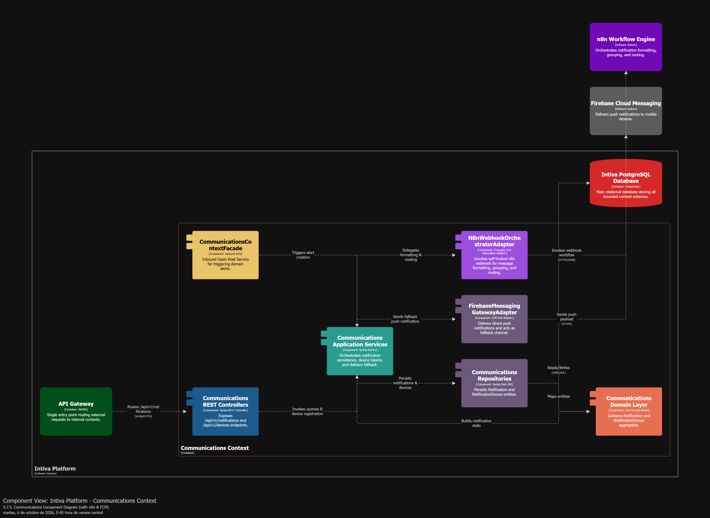
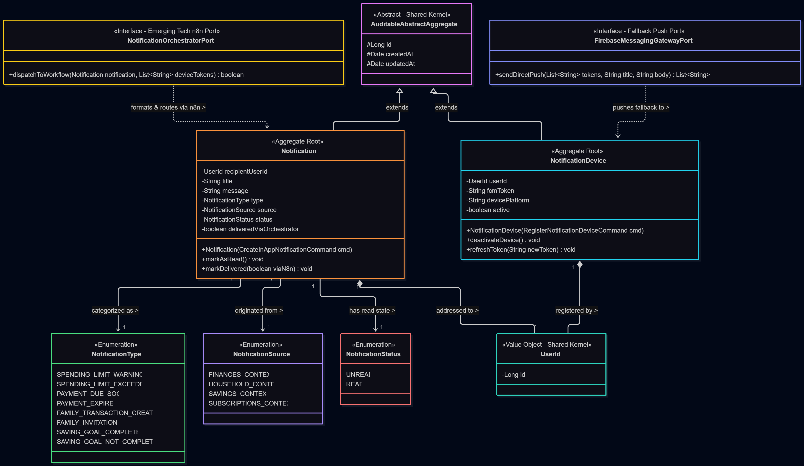
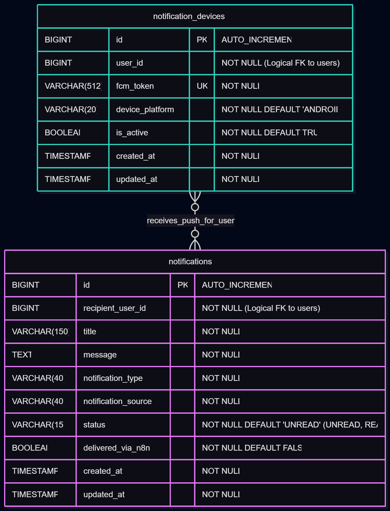

# Capítulo V: Tactical-Level Software Design

En este capítulo se presenta y explica la propuesta para la perspectiva táctica del diseño de la solución de software Intiva, desglosando cada uno de los ocho *Bounded Contexts* identificados en el diseño estratégico. Para cada contexto se documentan a manera de diccionario las clases que conforman sus cuatro capas arquitectónicas (*Domain*, *Interface*, *Application* e *Infrastructure*), junto con sus respectivos diagramas de arquitectura a nivel de componentes (C4 Model) y la estructura para los diagramas a nivel de código.

---

## 5.1. Bounded Context: Identity and Access Management (IAM)

Este contexto gestiona el ciclo de vida de la identidad digital de las personas usuarias en la plataforma: registro, autenticación (mediante credenciales locales o federada con Google OAuth2), asignación de roles y emisión de credenciales de sesión mediante JSON Web Tokens (JWT). Asimismo, actúa como *Upstream Publisher* disparando el aprovisionamiento inicial (*bootstrap*) de datos por defecto cuando un nuevo usuario se registra.

### 5.1.1. Domain Layer

En esta capa se representa el núcleo de identidad y las reglas de negocio asociadas a la validez de credenciales y unicidad de usuarios, haciendo uso de *Aggregates*, *Entities*, *Value Objects*, *Commands*, *Queries*, *Domain Events* e interfaces de servicio.

| Clase / Interfaz | Categoría Táctica | Propósito | Atributos | Métodos | Relaciones |
| :--- | :--- | :--- | :--- | :--- | :--- |
| **`User`** | Aggregate Root | Representa la cuenta de identidad digital de una persona usuaria en la plataforma y gobierna las invariantes de acceso. | `- id: Long` `- email: Email` `- passwordHash: PasswordHash` `- googleId: String` `- roles: Set<Role>` `- active: boolean` | `+ User(SignUpCommand, String hashedPwd)` `+ verifyPassword(String): boolean` `+ assignRole(Role): void` `+ linkGoogleAccount(String): void` | Extiende de `AuditableAbstractAggregate`; contiene `Email`, `PasswordHash` y una colección de `Role` (`1..*`). |
| **`Role`** | Entity | Representa el rol de autorización asignado a un usuario dentro de la plataforma. | `- id: Long` `- name: Roles` | `+ getStringName(): String` `+ getDefaultRole(): Role` | Asociado a `User` en relación muchos a muchos (`*..*`). |
| **`Roles`** | Enumeration | Define el catálogo cerrado de roles de acceso permitidos en el sistema. | `ROLE_USER` `ROLE_PREMIUM_USER` `ROLE_FAMILY_ADMIN` | `+ valueOf(String): Roles` | Utilizado por la entidad `Role` (`1`). |
| **`Email`** | Value Object | Encapsula y valida el formato del correo electrónico del usuario. | `- address: String` | `+ Email(String address)` `+ validate(): boolean` | Composición dentro de `User` (`1`). |
| **`PasswordHash`** | Value Object | Encapsula el hash criptográfico de la contraseña, impidiendo que se manipule en texto plano. | `- value: String` | `+ PasswordHash(String value)` `+ isPasswordValid(String raw): boolean` | Composición dentro de `User` (`1`). |
| **`SignUpCommand`** | Command | Transporta la intención de registrar un nuevo usuario en el sistema. | `- fullName: String` `- email: String` `- password: String` | `+ email(): String` `+ password(): String` | Consumido por `UserCommandService`. |
| **`SignInCommand`** | Command | Transporta la intención de autenticar a un usuario existente. | `- email: String` `- password: String` `- idTokenGoogle: String` | `+ email(): String` `+ password(): String` | Consumido por `UserCommandService`. |
| **`SeedRolesCommand`** | Command | Ordena la inicialización de los roles base del sistema al arrancar la aplicación. | *(Sin atributos)* | *(Constructor por defecto)* | Consumido por `RoleCommandService`. |
| **`GetUserByIdQuery`** | Query | Solicita la búsqueda de un usuario por su identificador único. | `- userId: Long` | `+ userId(): Long` | Consumido por `UserQueryService`. |
| **`GetUserByEmailQuery`** | Query | Solicita la búsqueda de un usuario a partir de su dirección de correo. | `- email: String` | `+ email(): String` | Consumido por `UserQueryService`. |
| **`UserRegisteredEvent`** | Domain Event | Notifica al ecosistema que un nuevo usuario ha completado su registro exitosamente. | `- userId: Long` `- email: String` `- occurredOn: Instant` | `+ getUserId(): Long` `+ getEmail(): String` | Publicado por `User`; escuchado en la capa de aplicación. |
| **`UserCommandService`** | Domain Service (Interface) | Define el contrato para los casos de uso de escritura sobre el agregado `User`. | *(Interface)* | `+ handle(SignUpCommand): Optional<User>` `+ handle(SignInCommand): Optional<Pair<User, String>>` | Implementado en la capa de aplicación por `UserCommandServiceImpl`. |
| **`UserQueryService`** | Domain Service (Interface) | Define el contrato para las consultas sobre el agregado `User`. | *(Interface)* | `+ handle(GetUserByIdQuery): Optional<User>` `+ handle(GetUserByEmailQuery): Optional<User>` | Implementado en la capa de aplicación por `UserQueryServiceImpl`. |

### 5.1.2. Interface Layer

En esta capa se ubican los controladores REST que exponen los endpoints de autenticación hacia los clientes web y móvil, así como los recursos (DTOs) y ensambladores encargados de transformar los datos de entrada y salida.

| Clase | Categoría Táctica | Propósito | Atributos | Métodos | Relaciones |
| :--- | :--- | :--- | :--- | :--- | :--- |
| **`AuthenticationController`** | REST Controller | Expone los endpoints públicos `/api/v1/auth/sign-up`, `/api/v1/auth/sign-in` y `/api/v1/auth/google` para el registro e inicio de sesión. | `- userCommandService: UserCommandService` | `+ signUp(SignUpResource): ResponseEntity<UserResource>` `+ signIn(SignInResource): ResponseEntity<AuthenticatedUserResource>` `+ googleAuth(GoogleTokenResource): ResponseEntity<AuthenticatedUserResource>` | Invoca a `UserCommandService` y utiliza los *Assemblers* de la capa de interfaz. |
| **`UsersController`** | REST Controller | Expone endpoints protegidos bajo `/api/v1/users` para consultar información de identidad de cuentas registradas. | `- userQueryService: UserQueryService` | `+ getUserById(Long userId): ResponseEntity<UserResource>` | Invoca a `UserQueryService`. |
| **`SignUpCommandFromResourceAssembler`** | Assembler | Transforma el DTO de entrada `SignUpResource` en un objeto de dominio `SignUpCommand`. | *(Clase utilitaria estática)* | `+ toCommandFromResource(SignUpResource): SignUpCommand` | Utilizado por `AuthenticationController`. |
| **`AuthenticatedUserResourceFromEntityAssembler`** | Assembler | Ensambla la respuesta con el ID del usuario, su correo y el token JWT generado tras autenticarse. | *(Clase utilitaria estática)* | `+ toResourceFromEntity(User, String token): AuthenticatedUserResource` | Utilizado por `AuthenticationController`. |

### 5.1.3. Application Layer

En esta capa se manejan los flujos de procesos de negocio del contexto, implementando los manejadores de comandos, consultas y eventos de dominio.

| Clase | Categoría Táctica | Propósito | Atributos | Métodos | Relaciones |
| :--- | :--- | :--- | :--- | :--- | :--- |
| **`UserCommandServiceImpl`** | Command Handler | Orquesta el registro y autenticación de usuarios, validando unicidad de correo, encriptando contraseñas y emitiendo el evento `UserRegisteredEvent`. | `- userRepository: UserRepository` `- hashingService: HashingService` `- tokenService: TokenService` `- oauth2Service: OAuth2IntegrationService` `- eventPublisher: ApplicationEventPublisher` | `+ handle(SignUpCommand): Optional<User>` `+ handle(SignInCommand): Optional<Pair<User, String>>` | Implementa `UserCommandService`; consume repositorios y adaptadores de infraestructura. |
| **`UserQueryServiceImpl`** | Query Handler | Ejecuta las consultas de lectura sobre usuarios registrados en la base de datos. | `- userRepository: UserRepository` | `+ handle(GetUserByIdQuery): Optional<User>` `+ handle(GetUserByEmailQuery): Optional<User>` | Implementa `UserQueryService` y consume `UserRepository`. |
| **`RoleCommandServiceImpl`** | Command Handler | Ejecuta la inicialización de los roles por defecto del sistema al iniciar la aplicación. | `- roleRepository: RoleRepository` | `+ handle(SeedRolesCommand): void` | Implementa `RoleCommandService` y consume `RoleRepository`. |
| **`UserRegisteredEventHandler`** | Event Handler | Escucha el evento `UserRegisteredEvent` y coordina el aprovisionamiento inicial (*bootstrap*) de datos por defecto para el nuevo usuario. | `- externalCategoriesService: IamExternalCategoriesService` `- externalAccountsService: IamExternalFinancialAccountsService` `- externalProfilesService: IamProfilesExternalService` | `+ on(UserRegisteredEvent): void` | Escucha `UserRegisteredEvent` y dispara las operaciones de inicialización. |

### 5.1.4. Infrastructure Layer

En esta capa se ubican las implementaciones concretas de persistencia en PostgreSQL, el almacenamiento de tokens temporales en Redis, los servicios criptográficos (BCrypt y JWT) y la integración con Google OAuth2.

| Clase / Interfaz | Categoría Táctica | Propósito | Atributos | Métodos | Relaciones |
| :--- | :--- | :--- | :--- | :--- | :--- |
| **`UserRepository`** | Repository (JPA) | Interfaz de persistencia que gestiona el acceso a la tabla `users` en PostgreSQL mediante Spring Data JPA. | *(Interface JPA)* | `+ findByEmail(Email): Optional<User>` `+ existsByEmail(Email): boolean` | Extiende `JpaRepository<User, Long>`; inyectado en los servicios de aplicación. |
| **`RoleRepository`** | Repository (JPA) | Gestiona la persistencia de los roles del sistema en PostgreSQL. | *(Interface JPA)* | `+ findByName(Roles): Optional<Role>` | Extiende `JpaRepository<Role, Long>`. |
| **`BCryptHashingServiceImpl`** | Security Adapter | Implementa la encriptación irreversible de contraseñas utilizando el algoritmo BCrypt. | `- passwordEncoder: BCryptPasswordEncoder` | `+ encode(CharSequence): String` `+ matches(CharSequence, String): boolean` | Inyectado en `UserCommandServiceImpl`. |
| **`BearerTokenServiceImpl`** | Security Adapter | Genera y valida la firma y expiración de los tokens JWT utilizando una cadena de responsabilidad (*Chain of Responsibility*). | `- secret: String` `- expirationDays: int` | `+ generateToken(String username): String` `+ validateToken(String token): boolean` `+ getUsernameFromToken(String): String` | Utilizado por `UserCommandServiceImpl` y el filtro de seguridad HTTP. |
| **`IamRedisTokenAdapter`** | Cache Adapter | Almacena y valida en Redis Cloud los códigos temporales de 6 dígitos para recuperación de contraseña con tiempo de expiración (TTL). | `- redisTemplate: StringRedisTemplate` | `+ saveRecoveryCode(String email, String code, Duration ttl): void` `+ validateAndConsumeCode(String email, String code): boolean` | Se conecta al contenedor `Intiva Redis Database`. |
| **`GoogleOAuth2Adapter`** | External Service Adapter | Valida los *ID Tokens* emitidos por Google contra los certificados públicos de OAuth 2.0 sin almacenar contraseñas externas. | `- verifier: GoogleIdTokenVerifier` | `+ verifyGoogleToken(String idToken): Optional<GoogleUserPayload>` | Se comunica con el sistema externo `Google OAuth2`. |

### 5.1.5. Bounded Context Software Architecture Component Level Diagrams

En esta sección se presenta el diagrama de componentes del contenedor **IAM Context**, mostrando sus bloques estructurales internos y sus interacciones con la infraestructura y servicios externos.

**Explicación del diagrama:**
El componente **`IAM REST Controllers`** recibe las solicitudes HTTP de autenticación y consulta de usuarios enrutadas desde el API Gateway y las delega a **`IAM Application Services`**. Esta capa coordina los casos de uso apoyándose en las reglas e invariantes de **`IAM Domain Layer`**. Para las operaciones técnicas, el servicio de aplicación invoca a **`Security Adapters (BCrypt & JWT)`** para el hashing de contraseñas y firma de tokens, a **`Google OAuth2 Adapter`** para validar inicios de sesión federados, a **`IAM Redis Token Adapter`** para almacenar códigos de recuperación en Redis, y a **`IAM Persistence Repositories`** para persistir las entidades en PostgreSQL.

### 5.1.6. Bounded Context Software Architecture Code Level Diagrams

#### 5.1.6.1. Bounded Context Domain Layer Class Diagrams

#### 5.1.6.2. Bounded Context Database Design Diagram

---

## 5.2. Bounded Context: Profiles

Este contexto administra la información personal, las preferencias de cuenta, el almacenamiento de imágenes de perfil (avatares) y el proceso de *onboarding* (tutorial guiado de primeros pasos) de cada persona usuaria dentro de la plataforma.

### 5.2.1. Domain Layer

En esta capa se modelan los agregados `Profile` y `Onboarding`, junto con las reglas de derivación de nombres por defecto y progresión reversible del tutorial inicial.

| Clase / Interfaz | Categoría Táctica | Propósito | Atributos | Métodos | Relaciones |
| :--- | :--- | :--- | :--- | :--- | :--- |
| **`Profile`** | Aggregate Root | Representa el perfil personal de un usuario registrado, incluyendo su nombre visible, correo de contacto y avatar. | `- id: Long` `- userId: UserId` `- fullName: String` `- email: String` `- avatar: Avatar` | `+ Profile(CreateProfileCommand)` `+ updatePersonalData(String fullName): void` `+ updateAvatar(Avatar newAvatar): void` | Extiende de `AuditableAbstractAggregate`; contiene `UserId` (Shared Kernel) y `Avatar` (`1`). |
| **`Onboarding`** | Aggregate Root | Controla el estado y avance del tutorial guiado de primeros pasos para usuarios nuevos. | `- id: Long` `- userId: UserId` `- currentStep: TutorialStep` `- completed: boolean` `- skipped: boolean` | `+ advanceStep(): void` `+ skipOnboarding(): void` `+ rollbackOnboarding(): void` | Extiende de `AuditableAbstractAggregate`; utiliza el objeto de valor `TutorialStep` (`1`). |
| **`Avatar`** | Value Object | Encapsula la URL pública y metadatos de validación de la imagen de perfil almacenada en la nube. | `- imageUrl: String` `- format: String` `- sizeInBytes: Long` | `+ Avatar(String url, String format, Long size)` `+ isValidFormatAndSize(): boolean` | Composición dentro de `Profile` (`1`). |
| **`TutorialStep`** | Value Object | Representa el paso actual dentro de la secuencia del tutorial de bienvenida. | `- stepNumber: int` `- stepCode: String` | `+ next(): TutorialStep` `+ reset(): TutorialStep` | Composición dentro de `Onboarding` (`1`). |
| **`CreateProfileCommand`** | Command | Solicita la creación del perfil personal derivando el nombre inicial del correo electrónico. | `- userId: Long` `- email: String` `- fullName: String` | `+ userId(): Long` `+ email(): String` | Consumido por `ProfileCommandService`. |
| **`UpdateProfileCommand`** | Command | Solicita la actualización del nombre o imagen de avatar del usuario. | `- userId: Long` `- fullName: String` `- imageFileBytes: byte[]` | `+ userId(): Long` `+ fullName(): String` | Consumido por `ProfileCommandService`. |
| **`CreateUserOnboardingCommand`** | Command | Ordena inicializar el registro de seguimiento del tutorial para un usuario recién creado. | `- userId: Long` | `+ userId(): Long` | Consumido por `OnboardingCommandService`. |
| **`AdvanceTutorialStepCommand`** | Command | Ordena avanzar al siguiente paso del tutorial de primeros pasos. | `- userId: Long` | `+ userId(): Long` | Consumido por `OnboardingCommandService`. |
| **`SkipOnboardingCommand`** | Command | Permite al usuario omitir el tutorial guiado sin afectar sus datos financieros. | `- userId: Long` | `+ userId(): Long` | Consumido por `OnboardingCommandService`. |
| **`RollbackOnboardingCommand`** | Command | Permite revertir o reiniciar el estado del tutorial guiado. | `- userId: Long` | `+ userId(): Long` | Consumido por `OnboardingCommandService`. |
| **`GetProfileByUserIdQuery`** | Query | Consulta los datos del perfil asociados al identificador de un usuario. | `- userId: Long` | `+ userId(): Long` | Consumido por `ProfileQueryService`. |
| **`GetOnboardingStatusQuery`** | Query | Consulta el estado actual del tutorial guiado de un usuario. | `- userId: Long` | `+ userId(): Long` | Consumido por `OnboardingQueryService`. |
| **`ProfileCommandService`** | Domain Service (Interface) | Define el contrato de escritura para la creación y actualización de perfiles. | *(Interface)* | `+ handle(CreateProfileCommand): Optional<Profile>` `+ handle(UpdateProfileCommand): Optional<Profile>` | Implementado por `ProfileCommandServiceImpl`. |
| **`OnboardingCommandService`** | Domain Service (Interface) | Define el contrato de escritura para gestionar el flujo de *onboarding*. | *(Interface)* | `+ handle(CreateUserOnboardingCommand): Optional<Onboarding>` `+ handle(AdvanceTutorialStepCommand): Optional<Onboarding>` `+ handle(SkipOnboardingCommand): void` | Implementado por `OnboardingCommandServiceImpl`. |

### 5.2.2. Interface Layer

Expone los endpoints REST para la gestión del perfil y del tutorial de bienvenida, además de la fachada pública consumida durante el registro inicial.

| Clase | Categoría Táctica | Propósito | Atributos | Métodos | Relaciones |
| :--- | :--- | :--- | :--- | :--- | :--- |
| **`ProfilesController`** | REST Controller | Expone los endpoints bajo `/api/v1/profiles` para consultar y actualizar la información personal y la foto de perfil. | `- profileCommandService: ProfileCommandService` `- profileQueryService: ProfileQueryService` | `+ getProfileByUserId(Long userId): ResponseEntity<ProfileResource>` `+ updateProfile(Long userId, UpdateProfileResource): ResponseEntity<ProfileResource>` | Invoca a `ProfileCommandService` y `ProfileQueryService`. |
| **`OnboardingController`** | REST Controller | Expone los endpoints bajo `/api/v1/onboarding` para consultar, avanzar, omitir o reiniciar el tutorial guiado. | `- onboardingCommandService: OnboardingCommandService` `- onboardingQueryService: OnboardingQueryService` | `+ getStatus(Long userId): ResponseEntity<OnboardingResource>` `+ advanceStep(Long userId): ResponseEntity<OnboardingResource>` `+ skip(Long userId): ResponseEntity<Void>` | Invoca a `OnboardingCommandService` y `OnboardingQueryService`. |
| **`ProfilesContextFacade`** | Inbound ACL / OHS | Fachada pública (*Open Host Service*) que permite inicializar el flujo de *onboarding* para un usuario nuevo. | `- onboardingCommandService: OnboardingCommandService` | `+ createUserOnboarding(Long userId): void` | Invoca a `OnboardingCommandService`. |
| **`ProfileResourceFromEntityAssembler`** | Assembler | Transforma la entidad `Profile` en un DTO `ProfileResource` para su serialización JSON. | *(Clase utilitaria estática)* | `+ toResourceFromEntity(Profile): ProfileResource` | Utilizado por `ProfilesController`. |

### 5.2.3. Application Layer

Implementa los casos de uso de actualización de datos personales, manejo de errores ante fallos del servicio de imágenes externo y gestión de pasos del tutorial.

| Clase | Categoría Táctica | Propósito | Atributos | Métodos | Relaciones |
| :--- | :--- | :--- | :--- | :--- | :--- |
| **`ProfileCommandServiceImpl`** | Command Handler | Gestiona la creación y actualización del perfil; coordina la subida de imágenes con el adaptador de Cloudinary y conserva el avatar anterior si el servicio externo falla. | `- profileRepository: ProfileRepository` `- cloudinaryPort: ImageStoragePort` | `+ handle(CreateProfileCommand): Optional<Profile>` `+ handle(UpdateProfileCommand): Optional<Profile>` | Implementa `ProfileCommandService`; consume `ProfileRepository` y `CloudinaryStorageAdapter`. |
| **`ProfileQueryServiceImpl`** | Query Handler | Recupera la información del perfil de usuario desde la base de datos. | `- profileRepository: ProfileRepository` | `+ handle(GetProfileByUserIdQuery): Optional<Profile>` | Implementa `ProfileQueryService` y consume `ProfileRepository`. |
| **`OnboardingCommandServiceImpl`** | Command Handler | Ejecuta las transiciones de estado del tutorial guiado (avanzar, omitir o revertir). | `- onboardingRepository: OnboardingRepository` | `+ handle(CreateUserOnboardingCommand): Optional<Onboarding>` `+ handle(AdvanceTutorialStepCommand): Optional<Onboarding>` `+ handle(SkipOnboardingCommand): void` `+ handle(RollbackOnboardingCommand): void` | Implementa `OnboardingCommandService` y consume `OnboardingRepository`. |
| **`ProfileCreationEventHandler`** | Event Handler | Escucha el evento de registro de usuario y dispara la creación automática del perfil por defecto tomando el prefijo del correo electrónico. | `- profileCommandService: ProfileCommandService` | `+ onUserRegistered(UserRegisteredEvent): void` | Invoca a `ProfileCommandService`. |

### 5.2.4. Infrastructure Layer

Contiene los repositorios JPA para la persistencia de perfiles y estados de *onboarding*, así como el adaptador de integración con **Cloudinary**.

| Clase / Interfaz | Categoría Táctica | Propósito | Atributos | Métodos | Relaciones |
| :--- | :--- | :--- | :--- | :--- | :--- |
| **`ProfileRepository`** | Repository (JPA) | Gestiona la persistencia de la entidad `Profile` en la tabla `profiles` de PostgreSQL. | *(Interface JPA)* | `+ findByUserId(UserId): Optional<Profile>` `+ existsByUserId(UserId): boolean` | Extiende `JpaRepository<Profile, Long>`. |
| **`OnboardingRepository`** | Repository (JPA) | Gestiona la persistencia del estado del tutorial en la tabla `onboardings` de PostgreSQL. | *(Interface JPA)* | `+ findByUserId(UserId): Optional<Onboarding>` | Extiende `JpaRepository<Onboarding, Long>`. |
| **`CloudinaryStorageAdapter`** | External Service Adapter | Sube las imágenes de perfil (JPG, PNG, WEBP hasta 5 MB) a la API de Cloudinary y retorna la URL segura; captura caídas del proveedor sin interrumpir el flujo principal. | `- cloudinaryClient: Cloudinary` `- maxFileSizeBytes: Long` | `+ uploadAvatar(byte[] fileBytes, String fileName): Optional<String>` | Se comunica con el sistema externo `Cloudinary Service`. |

### 5.2.5. Bounded Context Software Architecture Component Level Diagrams

En esta sección se presenta el diagrama de componentes del contenedor **Profiles Context**, reflejando la descomposición interna y su integración con el almacenamiento en la nube y base de datos.

**Explicación del diagrama:**
Las peticiones de gestión de perfil y tutorial ingresan desde el API Gateway hacia **`Profiles REST Controllers`**, mientras que las solicitudes internas de inicialización ingresan por **`ProfilesContextFacade`**. Ambos delegan el procesamiento a **`Profiles Application Services`**, el cual aplica las reglas de negocio definidas en **`Profiles Domain Layer`**. Para el almacenamiento de fotos de perfil, el servicio de aplicación utiliza **`Cloudinary Storage Adapter`** para comunicarse vía HTTPS con el servicio externo Cloudinary, mientras que los datos estructurados de `Profile` y `Onboarding` son almacenados en PostgreSQL a través de **`Profiles Persistence Repositories`**.

### 5.2.6. Bounded Context Software Architecture Code Level Diagrams

#### 5.2.6.1. Bounded Context Domain Layer Class Diagrams

#### 5.2.6.2. Bounded Context Database Design Diagram

---

## 5.3. Bounded Context: Categories & Financial Accounts

Este contexto administra el catálogo de categorías de gasto e ingreso y los medios de pago (efectivo, tarjetas de débito/crédito y billeteras digitales) utilizados por personas y familias. Como parte de la incorporación de tecnologías emergentes (**AD-21** y **AD-22**), integra un adaptador de Inteligencia Artificial conectado a un **LLM externo** para sugerir automáticamente la categoría de un gasto a partir de su descripción o comercio.

### 5.3.1. Domain Layer

En esta capa se definen los agregados `Category` y `FinancialAccount`, junto con las reglas de consistencia de saldos, control de versión para sincronización *offline* y el puerto de dominio para la clasificación inteligente con IA.

| Clase / Interfaz | Categoría Táctica | Propósito | Atributos | Métodos | Relaciones |
| :--- | :--- | :--- | :--- | :--- | :--- |
| **`Category`** | Aggregate Root | Representa una categoría de clasificación para transacciones financieras, asociada a un titular individual o familiar. | `- id: Long` `- name: String` `- type: CategoryType` `- color: String` `- icon: String` `- ownerType: OwnerTypes` `- ownerId: Long` | `+ Category(CreateCategoryCommand)` `+ updateDetails(String name, String color, String icon): void` | Extiende de `AuditableAbstractAggregate`; utiliza `CategoryType` y `OwnerTypes` (Shared Kernel). |
| **`FinancialAccount`** | Aggregate Root | Representa un medio de pago o cuenta financiera (efectivo, tarjeta o billetera), controlando su saldo disponible, estado de activación y versión de sincronización. | `- id: Long` `- name: AccountName` `- type: FinancialAccountType` `- balance: Money` `- creditLimit: Money` `- institution: Institution` `- active: boolean` `- syncVersion: Long` `- ownerType: OwnerTypes` `- ownerId: Long` | `+ applyTransaction(Money amount, String opType): void` `+ hasSufficientBalance(Money amount): boolean` `+ deactivate(): void` `+ validateSyncVersion(Long clientVersion): void` | Extiende de `AuditableAbstractAggregate`; compuesta por `AccountName`, `Institution` y `Money`. |
| **`CategorySuggestion`** | Value Object | Encapsula el resultado de la sugerencia automática generada por el LLM, incluyendo la categoría propuesta y su nivel de confianza. | `- suggestedCategoryName: String` `- categoryId: Long` `- confidenceScore: double` `- requiresExplicitConfirmation: boolean` | `+ isLowConfidence(): boolean` `+ fallbackToOther(Long otherCategoryId): CategorySuggestion` | Retornado por `CategoryClassifierPort`. |
| **`AccountName`** | Value Object | Encapsula y valida el nombre asignado por el usuario a su cuenta financiera. | `- value: String` | `+ AccountName(String value)` | Composición dentro de `FinancialAccount` (`1`). |
| **`Institution`** | Value Object | Representa la entidad bancaria o emisora de la billetera digital asociada a la cuenta. | `- name: String` | `+ Institution(String name)` | Composición dentro de `FinancialAccount` (`0..1`). |
| **`CreateCategoryCommand`** | Command | Solicita la creación de una nueva categoría verificando que no exista duplicidad de nombre para el titular. | `- name: String` `- type: String` `- color: String` `- icon: String` `- ownerType: String` `- ownerId: Long` | `+ name(): String` `+ ownerId(): Long` | Consumido por `CategoryCommandService`. |
| **`CreateDefaultCategoryCommand`** | Command | Ordena la creación del catálogo de categorías por defecto al registrarse un usuario. | `- ownerId: Long` `- ownerType: String` | `+ ownerId(): Long` | Consumido por `CategoryCommandService`. |
| **`CreateFinancialAccountCommand`** | Command | Solicita el registro de una nueva cuenta financiera con su saldo inicial. | `- name: String` `- type: String` `- initialBalance: BigDecimal` `- institution: String` `- ownerType: String` `- ownerId: Long` | `+ name(): String` `- initialBalance(): BigDecimal` | Consumido por `FinancialAccountCommandService`. |
| **`CreateFinancialAccountTransaction`** | Command | Ordena aplicar un cargo o abono sobre el saldo o línea de crédito de una cuenta activa. | `- accountId: Long` `- amount: BigDecimal` `- operationType: String` `- expectedVersion: Long` | `+ accountId(): Long` `+ amount(): BigDecimal` | Consumido por `FinancialAccountCommandService`. |
| **`SuggestCategoryByMerchantQuery`** | Query | Solicita al clasificador de IA una sugerencia de categoría a partir del comercio o descripción del gasto (US 033). | `- merchantDescription: String` `- ownerType: String` `- ownerId: Long` | `+ merchantDescription(): String` `+ ownerId(): Long` | Consumido por `CategoryQueryService`. |
| **`CategoryClassifierPort`** | Domain Port (Interface) | Define el contrato en el dominio para invocar al clasificador inteligente de gastos sin acoplar el dominio al proveedor de IA. | *(Interface)* | `+ classifyExpense(String description, List<String> userCategories): CategorySuggestion` | Implementado en infraestructura por `LlmClassifierServiceAdapter`. |

### 5.3.2. Interface Layer

Expone los controladores REST para la administración de categorías, cuentas financieras y sugerencias por IA, además del *Open Host Service* publicado para el resto del sistema.

| Clase | Categoría Táctica | Propósito | Atributos | Métodos | Relaciones |
| :--- | :--- | :--- | :--- | :--- | :--- |
| **`CategoriesController`** | REST Controller | Gestiona las peticiones HTTP bajo `/api/v1/categories` para crear, listar categorías y solicitar sugerencias automáticas con IA. | `- categoryCommandService: CategoryCommandService` `- categoryQueryService: CategoryQueryService` | `+ createCategory(CreateCategoryResource): ResponseEntity<CategoryResource>` `+ getCategoriesByOwner(...): ResponseEntity<List<CategoryResource>>` `+ suggestCategory(SuggestCategoryResource): ResponseEntity<CategorySuggestionResource>` | Consume `CategoryCommandService` y `CategoryQueryService`. |
| **`FinancialAccountsController`** | REST Controller | Expone los endpoints bajo `/api/v1/financial-accounts` para registrar cuentas, consultarlas e inhabilitarlas. | `- accountCommandService: FinancialAccountCommandService` `- accountQueryService: FinancialAccountQueryService` | `+ createAccount(CreateFinancialAccountResource): ResponseEntity<FinancialAccountResource>` `+ getAccountsByOwner(Long ownerId): ResponseEntity<List<FinancialAccountResource>>` `+ disableAccount(Long id, DisableAccountResource): ResponseEntity<Void>` | Consume `FinancialAccountCommandService` y `FinancialAccountQueryService`. |
| **`CategoriesContextFacade`** | Inbound ACL / OHS | Fachada pública que expone operaciones de creación por defecto y consulta de metadatos (nombre, color, ícono). | `- categoryCommandService: CategoryCommandService` `- categoryQueryService: CategoryQueryService` | `+ createDefaultCategory(Long userId): Long` `+ getCategoryNameById(Long categoryId): String` `+ getCategoryColorAndIconById(Long categoryId): Pair<String, String>` | Delega a los servicios de aplicación de categorías. |
| **`FinancialAccountContextFacade`** | Inbound ACL / OHS | Fachada pública que expone la validación de saldo suficiente y el registro de movimientos en cuentas. | `- accountCommandService: FinancialAccountCommandService` `- accountQueryService: FinancialAccountQueryService` | `+ createDefaultFinancialAccount(Long userId): Long` `+ hasSufficientBalance(Long accountId, BigDecimal amount): boolean` `+ createFinancialAccountTransaction(...): void` | Delega a los servicios de aplicación de cuentas financieras. |

### 5.3.3. Application Layer

Coordina los casos de uso de actualización de saldos, validación de fondos, control de conflictos de sincronización *offline* y degradación elegante para las sugerencias de IA.

| Clase | Categoría Táctica | Propósito | Atributos | Métodos | Relaciones |
| :--- | :--- | :--- | :--- | :--- | :--- |
| **`CategoryCommandServiceImpl`** | Command Handler | Ejecuta la creación de categorías personalizadas y por defecto, validando que no existan nombres duplicados para el mismo titular. | `- categoryRepository: CategoryRepository` | `+ handle(CreateCategoryCommand): Optional<Category>` `+ handle(CreateDefaultCategoryCommand): Optional<Category>` | Implementa `CategoryCommandService`; utiliza `CategoryRepository`. |
| **`CategoryQueryServiceImpl`** | Query Handler | Recupera las categorías del usuario y orquesta el flujo de sugerencia por IA (**AD-21** y **AD-22**): consulta al puerto del clasificador y, si la confianza es baja o el proveedor falla, ofrece elección manual o `"Otros"`, sin guardar el gasto y exigiendo confirmación explícita. | `- categoryRepository: CategoryRepository` `- classifierPort: CategoryClassifierPort` | `+ handle(GetCategoryByIdQuery): Optional<Category>` `+ handle(GetAllCategoriesByOwnerTypeAndOwnerIdAndTypeQuery): List<Category>` `+ handle(SuggestCategoryByMerchantQuery): CategorySuggestion` | Implementa `CategoryQueryService`; consume `CategoryRepository` y `CategoryClassifierPort`. |
| **`FinancialAccountCommandServiceImpl`** | Command Handler | Gestiona el ciclo de vida de las cuentas financieras y la aplicación de cargos/abonos, verificando fondos suficientes (`InsufficientFundsException`) y versión de sincronización (`FinancialAccountSyncConflictException`). | `- accountRepository: FinancialAccountRepository` | `+ handle(CreateFinancialAccountCommand): Optional<FinancialAccount>` `+ handle(CreateFinancialAccountTransaction): Optional<FinancialAccount>` `+ handle(UpdateFinancialAccountCommand): Optional<FinancialAccount>` | Implementa `FinancialAccountCommandService`; utiliza `FinancialAccountRepository`. |
| **`FinancialAccountQueryServiceImpl`** | Query Handler | Ejecuta las consultas de cuentas financieras activas y verificación de saldos por titular. | `- accountRepository: FinancialAccountRepository` | `+ handle(GetFinancialAccountByIdQuery): Optional<FinancialAccount>` `+ handle(GetAllFinancialAccountsByOwnerId): List<FinancialAccount>` | Implementa `FinancialAccountQueryService`; utiliza `FinancialAccountRepository`. |

### 5.3.4. Infrastructure Layer

Contiene los repositorios JPA hacia PostgreSQL y el adaptador **`LlmClassifierServiceAdapter` (`ClassifierService`)** que conecta el contexto con el modelo de lenguaje externo.

| Clase / Interfaz | Categoría Táctica | Propósito | Atributos | Métodos | Relaciones |
| :--- | :--- | :--- | :--- | :--- | :--- |
| **`CategoryRepository`** | Repository (JPA) | Persiste y consulta las entidades `Category` en la tabla `categories` de PostgreSQL. | *(Interface JPA)* | `+ findByOwnerTypeAndOwnerId(OwnerTypes, Long): List<Category>` `+ existsByNameAndOwnerId(String, Long): boolean` | Extiende `JpaRepository<Category, Long>`. |
| **`FinancialAccountRepository`** | Repository (JPA) | Persiste y consulta las cuentas financieras en la tabla `financial_accounts` de PostgreSQL. | *(Interface JPA)* | `+ findByOwnerTypeAndOwnerIdAndActiveTrue(OwnerTypes, Long): List<FinancialAccount>` | Extiende `JpaRepository<FinancialAccount, Long>`. |
| **`LlmClassifierServiceAdapter`** (`ClassifierService`) | Emerging Tech AI Adapter | Implementa la decisión **AD-21**: arma un *prompt* con la descripción del gasto y las categorías del usuario, lo envía a la API del LLM externo e interpreta la respuesta con su nivel de confianza; valida que la respuesta pertenezca al catálogo autorizado; ante caídas habilita selección manual (**AD-22**, TS 024). | `- restClient: RestClient` `- llmApiUrl: String` `- llmApiKey: String` `- confidenceThreshold: double` | `+ classifyExpense(String description, List<String> userCategories): CategorySuggestion` `- buildPrompt(String, List<String>): String` | Implementa `CategoryClassifierPort`; consume el sistema externo `External LLM API (AI)`. |

### 5.3.5. Bounded Context Software Architecture Component Level Diagrams

En esta sección se presenta el diagrama de componentes del contenedor **Categories & Financial Accounts Context**, destacando la integración del adaptador de Inteligencia Artificial.

**Explicación del diagrama:**
Las solicitudes externas llegan a **`Categories & Accounts Controllers`** a través del API Gateway, mientras que las consultas internas de otros módulos ingresan mediante **`Categories & Accounts Facades`**. Ambos componentes delegan la orquestación a **`Categories & Accounts App Services`**, el cual valida reglas de saldo, activación y sincronización en **`Categories & Accounts Domain Layer`**. Para la sugerencia inteligente de categorías (US 033), la capa de aplicación invoca a **`LlmClassifierServiceAdapter (AI)`**, que envía el *prompt* mediante HTTPS/JSON al sistema externo **`External LLM API (AI)`**. Finalmente, **`Categories & Accounts Repositories`** persiste las cuentas y categorías en PostgreSQL.

### 5.3.6. Bounded Context Software Architecture Code Level Diagrams

#### 5.3.6.1. Bounded Context Domain Layer Class Diagrams

#### 5.3.6.2. Bounded Context Database Design Diagram

---

## 5.4. Bounded Context: Finances

Este contexto gestiona ingresos, gastos, límites y pagos recurrentes. Para US 032 y TS 023 incorpora propuestas de gasto del fondo familiar, separadas de los movimientos confirmados: todos los miembros deben aprobar la misma propuesta y el smart contract debe confirmar su validación antes de registrar el gasto (AD-23 a AD-25). Para US 033, el gasto personal se guarda después de revisar la categoría sugerida por IA.

### 5.4.1. Domain Layer

En esta capa se modelan Transaction, SpendingLimit, RecurringTransaction y SharedFundProposal, separando movimientos confirmados de acuerdos pendientes.

| Clase / Interfaz | Categoría Táctica | Propósito | Atributos | Métodos | Relaciones |
| :--- | :--- | :--- | :--- | :--- | :--- |
| **`Transaction`** | Aggregate Root | Movimiento confirmado, personal o familiar. La propuesta familiar se modela por separado. | `id`, `financialAccountId`, `categoryId`, `amount: Money`, `type`, `status`, `description`, `transactionDate`, `ownerType`, `ownerId`, `proposalId: UUID?` | `register()`, `isFamilyTransaction()` | Publica FamilyTransactionCreatedEvent tras conciliación; proposalId único si proviene del fondo. |
| **`SpendingLimit`** | Aggregate Root | Representa un tope presupuestario configurado por periodo sobre una categoría o cuenta financiera. | `- id: Long` `- targetType: SpendingLimitTargetType` `- targetId: Long` `- limitAmount: Money` `- currentSpentAmount: Money` `- warningThresholdPercent: int` `- period: PeriodTypes` `- status: SpendingLimitStatus` `- ownerType: OwnerTypes` `- ownerId: Long` | `+ evaluateExpense(Money expenseAmount): SpendingLimitStatus` `+ isWarningReached(): boolean` `+ isExceeded(): boolean` `+ activate(): void` | Extiende de `AuditableAbstractAggregate`; emite `SpendingLimitWarningReachedEvent` y `SpendingLimitExceededEvent`. |
| **`RecurringTransaction`** | Aggregate Root | Representa un gasto o ingreso fijo programado con fecha de vencimiento y frecuencia periódica. | `- id: Long` `- financialAccountId: Long` `- categoryId: Long` `- amount: Money` `- frequency: PeriodTypes` `- nextDueDate: LocalDate` `- active: boolean` `- ownerType: OwnerTypes` `- ownerId: Long` | `+ isDueSoon(LocalDate today): boolean` `+ isExpired(LocalDate today): boolean` `+ advanceNextDueDate(): void` `+ activate(): void` | Extiende de `AuditableAbstractAggregate`; emite `PaymentDueSoonEvent` y `PaymentExpiredEvent`. |
| **`TransactionStatus`** | Enumeration | Resultado del registro de un movimiento; no equivale al estado de una propuesta. | `CONFIRMED`, `FAILED_INSUFFICIENT_FUNDS` | `valueOf(String)` | Utilizado por Transaction. |
| **`SpendingLimitTargetType`** | Enumeration | Define sobre qué elemento se aplica el límite de gasto. | `CATEGORY` `FINANCIAL_ACCOUNT` `PERIOD` | `+ valueOf(String): SpendingLimitTargetType` | Utilizado por `SpendingLimit` (`1`). |
| **`RegisterTransactionCommand`** | Command | Registra un movimiento personal revisado; el cliente no puede usar este comando para eludir el contrato del fondo. | `accountId`, `categoryId`, `amount`, `type`, `description`, `ownerId` | `amount()` | Consumido por TransactionCommandService. |

| **`CreateSpendingLimitCommand`** | Command | Solicita configurar un nuevo límite de gasto por categoría, cuenta o periodo. | `- targetType: String` `- targetId: Long` `- limitAmount: BigDecimal` `- period: String` `- ownerType: String` `- ownerId: Long` | `+ limitAmount(): BigDecimal` | Consumido por `SpendingLimitCommandService`. |
| **`CreateRecurringTransactionCommand`** | Command | Solicita programar un ingreso o gasto recurrente con fecha de pago. | `- accountId: Long` `- categoryId: Long` `- amount: BigDecimal` `- frequency: String` `- nextDueDate: LocalDate` `- ownerId: Long` | `+ nextDueDate(): LocalDate` | Consumido por `RecurringTransactionCommandService`. |
| **`FamilyTransactionCreatedEvent`** | Domain Event | Notifica que un integrante ha registrado una transacción dentro del grupo familiar. | `- transactionId: Long` `- familyId: Long` `- authorUserId: Long` `- amount: BigDecimal` | `+ getFamilyId(): Long` | Publicado por `Transaction`. |
| **`SpendingLimitWarningReachedEvent`** | Domain Event | Notifica que el gasto acumulado se encuentra próximo a alcanzar el límite configurado (US 027). | `- spendingLimitId: Long` `- ownerId: Long` `- currentPercentage: double` | `+ getSpendingLimitId(): Long` | Publicado por `SpendingLimit`. |
| **`SpendingLimitExceededEvent`** | Domain Event | Notifica que un gasto registrado ha superado el límite de presupuesto establecido (US 026). | `- spendingLimitId: Long` `- ownerId: Long` `- exceededAmount: BigDecimal` | `+ getExceededAmount(): BigDecimal` | Publicado por `SpendingLimit`. |
| **`PaymentDueSoonEvent`** | Domain Event | Notifica que un pago recurrente programado está próximo a su fecha de vencimiento (US 030). | `- recurringTransactionId: Long` `- ownerId: Long` `- dueDate: LocalDate` | `+ getDueDate(): LocalDate` | Publicado por `RecurringTransaction`. |

| **`SharedFundProposal`** | Aggregate Root | Gasto propuesto, separado del movimiento; US 032 y TS 023. | `id: UUID`, `familyId`, `amount: Money`, `recipient`, `termsHash`, `requiredMemberIds: Set<UserId>`, `status: ProposalStatus` | `approve(member, signature)`, `reject(member)`, `isUnanimous()` | Composición de ProposalApproval; instantánea de miembros y condiciones inmutables. |
| **`ProposalApproval`** | Entity | Un voto por miembro sobre el hash de la misma propuesta. | `proposalId`, `memberId`, `decision`, `signature`, `signedAt` | `matchesTermsHash(hash)` | UNIQUE(proposalId, memberId); una firma no sustituye otras aprobaciones. |
| **`ProposalStatus`** | Enumeration | Distingue acuerdo, envío y confirmación del contrato. | `PENDING_APPROVAL`, `READY_FOR_SUBMISSION`, `PENDING_CHAIN`, `CONFIRMED`, `REJECTED`, `ERROR` | `valueOf(String)` | El saldo no cambia antes de CONFIRMED. |
| **`SmartContractGatewayPort`** | Domain Port | Envía aprobaciones firmadas y consulta resultado sin custodiar claves privadas. | Interfaz | `submitApprovedProposal(proposal, signatures)`, `getResult(reference)` | Implementado por SmartContractGatewayAdapter. |

### 5.4.2. Interface Layer

Expone endpoints para movimientos confirmados, propuestas del fondo familiar, aprobaciones firmadas, límites y pagos recurrentes.

| Clase | Categoría Táctica | Propósito | Atributos | Métodos | Relaciones |
| :--- | :--- | :--- | :--- | :--- | :--- |
| **`TransactionsController`** | REST Controller | Registra movimientos personales revisados y consulta historial. | `transactionCommandService`, `transactionQueryService` | `registerTransaction(resource)`, `getTransactionsByOwner(...)` | No expone un parámetro para confirmar arbitrariamente gastos del fondo. |
| **`SpendingLimitsController`** | REST Controller | Expone `/api/v1/spending-limits` para crear, activar y consultar límites de gasto y su monto utilizado/disponible. | `- limitCommandService: SpendingLimitCommandService` `- limitQueryService: SpendingLimitQueryService` | `+ createSpendingLimit(CreateSpendingLimitResource): ResponseEntity<SpendingLimitResource>` `+ getLimitsByOwner(Long ownerId): ResponseEntity<List<SpendingLimitResource>>` | Invoca a `SpendingLimitCommandService` y `SpendingLimitQueryService`. |
| **`RecurringTransactionsController`** | REST Controller | Expone `/api/v1/recurring-transactions` para configurar y listar pagos e ingresos programados. | `- recurringCommandService: RecurringTransactionCommandService` `- recurringQueryService: RecurringTransactionQueryService` | `+ createRecurring(CreateRecurringResource): ResponseEntity<RecurringTransactionResource>` `+ getRecurringByOwner(Long ownerId): ResponseEntity<List<RecurringTransactionResource>>` | Invoca a `RecurringTransactionCommandService` y `RecurringTransactionQueryService`. |

| **`SharedFundProposalsController`** | REST Controller | Crear propuesta, aprobar/firmar, rechazar y consultar estado. | `proposalService` | `propose(resource)`, `approve(id, signedVote)`, `reject(id)`, `getStatus(id)` | Autoriza al miembro autenticado; no hay excepción administrativa. |

### 5.4.3. Application Layer

Valida saldos, coordina propuestas y aprobaciones unánimes, verifica el resultado del contrato y concilia cada gasto una sola vez. Los procesos programados de vencimiento se conservan (AD-13).

| Clase | Categoría Táctica | Propósito | Atributos | Métodos | Relaciones |
| :--- | :--- | :--- | :--- | :--- | :--- |
| **`TransactionCommandServiceImpl`** | Command Handler | Valida permisos y saldo del movimiento personal. Para el fondo solo admite conciliación interna de un resultado confirmado del contrato. | `transactionRepository`, `limitRepository`, `externalAccountService`, `eventPublisher` | `handle(RegisterTransactionCommand)`, `applyConfirmedProposal(result)` | Actualiza saldo y publica eventos en una unidad transaccional; evita duplicación por proposalId. |
| **`TransactionQueryServiceImpl`** | Query Handler | Ejecuta consultas de historial de transacciones (`GetTransactionsByOwnerIdQuery`, `GetLastTransactionsByOwnerIdQuery`) respetando la marca de privacidad `OwnerTypes` (**AD-03**). | `- transactionRepository: TransactionRepository` | `+ handle(GetTransactionsByOwnerIdQuery): List<Transaction>` `+ handle(GetLastTransactionsByOwnerIdQuery): List<Transaction>` | Implementa `TransactionQueryService` y consume `TransactionRepository`. |
| **`SpendingLimitCommandServiceImpl`** | Command Handler | Gestiona la creación y activación de límites de presupuesto por categoría, cuenta o periodo. | `- limitRepository: SpendingLimitRepository` | `+ handle(CreateSpendingLimitCommand): Optional<SpendingLimit>` `+ handle(ActivateSpendingLimitCommand): Optional<SpendingLimit>` | Implementa `SpendingLimitCommandService`; consume `SpendingLimitRepository`. |
| **`PaymentReminderScheduler`** | Application Scheduler | Proceso programado (**AD-13**) que inspecciona diariamente las `RecurringTransaction` activas y publica `PaymentDueSoonEvent` o `PaymentExpiredEvent`. | `- recurringRepository: RecurringTransactionRepository` `- eventPublisher: ApplicationEventPublisher` | `+ checkUpcomingAndExpiredPayments(): void` | Consulta `RecurringTransactionRepository` y publica eventos de vencimiento. |
| **`FinancesExternalFinancialAccountService`** | Outbound ACL Service | Adaptador ACL que consulta disponibilidad de saldo y solicita aplicar cargos/abonos al contexto de cuentas financieras. | `- accountFacade: FinancialAccountContextFacade` | `+ hasSufficientBalance(Long accountId, BigDecimal amount): boolean` `+ registerAccountMovement(...): void` | Consume `FinancialAccountContextFacade`. |
| **`FinancesExternalNotificationsService`** | Outbound ACL Service | Adaptador ACL que solicita el envío de alertas cuando un límite de gasto alcanza su umbral o se excede. | `- commsFacade: CommunicationsContextFacade` | `+ notifySpendingLimitAlert(Long ownerId, String alertType): void` | Consume `CommunicationsContextFacade`. |

| **`SharedFundProposalService`** | Application Service | Valida miembros, hash y firmas; exige unanimidad y concilia una sola vez después de confirmación. | `proposalRepository`, `householdFacade`, `contractGateway`, `transactionService` | `propose(...)`, `approve(...)`, `reject(...)`, `reconcile(...)` | Cambiar condiciones o miembros exige nueva propuesta; fallo requiere consultar estado antes de reenviar. |

### 5.4.4. Infrastructure Layer

Implementa los repositorios de persistencia relacional en PostgreSQL para transacciones, límites de gasto y pagos programados.

| Clase / Interfaz | Categoría Táctica | Propósito | Atributos | Métodos | Relaciones |
| :--- | :--- | :--- | :--- | :--- | :--- |
| **`TransactionRepository`** | Repository (JPA) | Persiste movimientos confirmados y evita duplicar el gasto conciliado del fondo. | Interfaz JPA | `findByOwnerTypeAndOwnerId(...)`, `existsByProposalId(UUID)` | Restricción UNIQUE sobre proposal_id cuando existe. |
| **`SpendingLimitRepository`** | Repository (JPA) | Persiste y consulta los límites de gasto activos asociados a un titular, categoría o cuenta. | *(Interface JPA)* | `+ findByOwnerTypeAndOwnerIdAndStatus(OwnerTypes, Long, SpendingLimitStatus): List<SpendingLimit>` | Extiende `JpaRepository<SpendingLimit, Long>`. |
| **`RecurringTransactionRepository`** | Repository (JPA) | Persiste transacciones recurrentes y permite a los *schedulers* consultar pagos próximos a vencer. | *(Interface JPA)* | `+ findByActiveTrueAndNextDueDateLessThanEqual(LocalDate): List<RecurringTransaction>` | Extiende `JpaRepository<RecurringTransaction, Long>`. |

| **`SharedFundProposalRepository`** | Repository (JPA) | Persiste propuestas, votos y referencia de red fuera de blockchain. | Interfaz JPA | `findById(UUID)`, `save(proposal)` | Concurrencia con versión; índice único por propuesta y miembro. |
| **`SmartContractGatewayAdapter`** | External Service Adapter | Verifica el contrato configurado, envía firmas y consulta confirmaciones (AD-24/25). | `rpcClient`, `contractAddress`, `networkId` | `submitApprovedProposal(...)`, `getResult(...)` | Implementa SmartContractGatewayPort; proveedor, red y confirmaciones se validarán en pruebas. |

### 5.4.5. Bounded Context Software Architecture Component Level Diagrams

El diagrama muestra el registro personal, la validación unánime del fondo mediante smart contracts y los recordatorios existentes.

**Explicación del diagrama:**
Los controladores reciben movimientos personales revisados y propuestas del fondo. Los servicios de aplicación verifican membresía mediante Household, recopilan firmas sobre la misma propuesta y consultan el contrato a través de SmartContractGatewayAdapter. Solo un resultado confirmado permite conciliar el gasto de forma idempotente; rechazo, error o aprobaciones incompletas no modifican el saldo. Los repositorios guardan los datos fuera de blockchain y los schedulers conservan los recordatorios de vencimiento.

### 5.4.6. Bounded Context Software Architecture Code Level Diagrams

#### 5.4.6.1. Bounded Context Domain Layer Class Diagrams

#### 5.4.6.2. Bounded Context Database Design Diagram

## 5.5. Bounded Context: Financial Goals (Savings)

Este contexto constituye uno de los subdominios núcleo (*Core Subdomain*) de la plataforma: permite definir metas de ahorro individuales o familiares y registrar los aportes progresivos hasta alcanzarlas. Como parte de las tecnologías emergentes incorporadas al diseño, este contexto integra un adaptador hacia una red de **Smart Contracts (Blockchain)** que permite registrar condiciones inmutables de ahorro y verificar automáticamente el cumplimiento de los hitos financieros antes de habilitar o marcar como completado un objetivo.

### 5.5.1. Domain Layer

En esta capa se modela el ciclo de vida de las metas de ahorro (`SavingGoal`), sus contribuciones individuales o grupales (`GoalContribution`), las reglas de reversibilidad de estado y el puerto de dominio para la verificación en cadena (*on-chain*) mediante contratos inteligentes.

| Clase / Interfaz | Categoría Táctica | Propósito | Atributos | Métodos | Relaciones |
| :--- | :--- | :--- | :--- | :--- | :--- |
| **`SavingGoal`** | Aggregate Root | Representa un objetivo de ahorro personal o compartido en familia, controlando el monto acumulado, fechas límite de modificación y estado de cumplimiento. | `- id: Long` `- name: String` `- targetAmount: Money` `- currentSavedAmount: Money` `- deadlineDate: LocalDate` `- modificationLimitDate: LocalDate` `- status: SavingGoalStatus` `- smartContractAddress: String` `- ownerType: OwnerTypes` `- ownerId: Long` `- contributions: List<GoalContribution>` | `+ SavingGoal(CreateSavingGoalCommand)` `+ addContribution(GoalContribution): void` `+ canBeModified(LocalDate today): boolean` `+ completeGoal(): void` `+ uncompleteGoal(): void` | Extiende de `AuditableAbstractAggregate`; contiene una colección de `GoalContribution` (`0..*`) y utiliza `Money` y `OwnerTypes` (Shared Kernel). |
| **`GoalContribution`** | Entity | Representa un aporte monetario específico realizado por un usuario hacia una meta de ahorro activa. | `- id: Long` `- contributorUserId: UserId` `- amount: Money` `- contributionDate: LocalDateTime` `- txHash: String` | `+ GoalContribution(UserId, Money, String txHash)` `+ isValidAmount(): boolean` | Pertenece al agregado `SavingGoal` (`1`). |
| **`SavingGoalStatus`** | Enumeration | Define los estados posibles de una meta de ahorro a lo largo de su ciclo de vida. | `IN_PROGRESS` `COMPLETED` `INCOMPLETE_EXPIRED` | `+ valueOf(String): SavingGoalStatus` | Utilizado por `SavingGoal` (`1`). |
| **`CreateSavingGoalCommand`** | Command | Solicita la creación de una nueva meta de ahorro personal o familiar con fecha límite y ventana de edición. | `- name: String` `- targetAmount: BigDecimal` `- deadlineDate: LocalDate` `- modificationLimitDate: LocalDate` `- ownerType: String` `- ownerId: Long` | `+ targetAmount(): BigDecimal` `+ deadlineDate(): LocalDate` | Consumido por `SavingGoalCommandService`. |
| **`ContributeToSavingGoalCommand`** | Command | Ordena registrar un aporte monetario positivo sobre una meta de ahorro existente. | `- savingGoalId: Long` `- contributorUserId: Long` `- amount: BigDecimal` | `+ savingGoalId(): Long` `+ amount(): BigDecimal` | Consumido por `SavingGoalCommandService`. |
| **`UpdateSavingGoalCommand`** | Command | Solicita actualizar el nombre, monto objetivo o fecha límite mientras el periodo de modificación siga vigente (US 020). | `- savingGoalId: Long` `- name: String` `- targetAmount: BigDecimal` `- deadlineDate: LocalDate` | `+ savingGoalId(): Long` | Consumido por `SavingGoalCommandService`. |
| **`CompleteSavingGoalCommand`** | Command | Ordena marcar explícitamente una meta de ahorro como completada. | `- savingGoalId: Long` | `+ savingGoalId(): Long` | Consumido por `SavingGoalCommandService`. |
| **`UncompleteSavingGoalCommand`** | Command | Revierte de forma simétrica el estado de una meta completada a en progreso. | `- savingGoalId: Long` | `+ savingGoalId(): Long` | Consumido por `SavingGoalCommandService`. |
| **`DeleteSavingGoalCommand`** | Command | Solicita eliminar una meta de ahorro dentro del tiempo límite permitido. | `- savingGoalId: Long` | `+ savingGoalId(): Long` | Consumido por `SavingGoalCommandService`. |
| **`GetSavingGoalByIdQuery`** | Query | Consulta el detalle y aportes de una meta específica por su identificador. | `- savingGoalId: Long` | `+ savingGoalId(): Long` | Consumido por `SavingGoalQueryService`. |
| **`GetAllSavingGoalsByUserIdQuery`** | Query | Consulta todas las metas de ahorro individuales asociadas a un usuario. | `- userId: Long` | `+ userId(): Long` | Consumido por `SavingGoalQueryService`. |
| **`GetAllSavingGoalsByGroupIdQuery`** | Query | Consulta todas las metas de ahorro compartidas pertenecientes a un grupo familiar. | `- groupId: Long` | `+ groupId(): Long` | Consumido por `SavingGoalQueryService`. |
| **`SmartContractEscrowPort`** | Domain Port (Interface) | Define la abstracción para desplegar y verificar reglas inmutables de cumplimiento de metas de ahorro en Blockchain. | *(Interface)* | `+ deploySavingRule(Long goalId, BigDecimal target, LocalDate deadline): String` `+ recordOnChainContribution(String contractAddr, BigDecimal amount): String` `+ verifyMilestoneCompletion(String contractAddr): boolean` | Implementado en infraestructura por `SmartContractEscrowAdapter`. |

### 5.5.2. Interface Layer

Expone los endpoints REST para gestionar metas de ahorro personales y familiares, así como el registro de aportes.

| Clase | Categoría Táctica | Propósito | Atributos | Métodos | Relaciones |
| :--- | :--- | :--- | :--- | :--- | :--- |
| **`SavingGoalsController`** | REST Controller | Expone los endpoints bajo `/api/v1/saving-goals` para crear, modificar, eliminar, consultar metas y registrar contribuciones. | `- goalCommandService: SavingGoalCommandService` `- goalQueryService: SavingGoalQueryService` | `+ createGoal(CreateSavingGoalResource): ResponseEntity<SavingGoalResource>` `+ addContribution(Long id, ContributeResource): ResponseEntity<SavingGoalResource>` `+ updateGoal(Long id, UpdateSavingGoalResource): ResponseEntity<SavingGoalResource>` `+ getGoalsByUser(Long userId): ResponseEntity<List<SavingGoalResource>>` `+ getGoalsByGroup(Long groupId): ResponseEntity<List<SavingGoalResource>>` | Invoca a `SavingGoalCommandService` y `SavingGoalQueryService`. |
| **`SavingGoalResourceFromEntityAssembler`** | Assembler | Transforma el agregado `SavingGoal` y su progreso en un DTO `SavingGoalResource`. | *(Clase utilitaria estática)* | `+ toResourceFromEntity(SavingGoal): SavingGoalResource` | Utilizado por `SavingGoalsController`. |

### 5.5.3. Application Layer

Coordina la creación y actualización de metas, validando ventanas de modificación, sumatoria de aportes y sincronización de estados con el contrato inteligente.

| Clase | Categoría Táctica | Propósito | Atributos | Métodos | Relaciones |
| :--- | :--- | :--- | :--- | :--- | :--- |
| **`SavingGoalCommandServiceImpl`** | Command Handler | Ejecuta la creación y modificación de metas (verificando que la fecha límite de edición no haya expirado), registra los aportes, invoca la validación del Smart Contract y marca la meta como `COMPLETED` al alcanzar el monto objetivo. | `- savingGoalRepository: SavingGoalRepository` `- smartContractPort: SmartContractEscrowPort` | `+ handle(CreateSavingGoalCommand): Optional<SavingGoal>` `+ handle(ContributeToSavingGoalCommand): Optional<SavingGoal>` `+ handle(UpdateSavingGoalCommand): Optional<SavingGoal>` `+ handle(CompleteSavingGoalCommand): Optional<SavingGoal>` `+ handle(UncompleteSavingGoalCommand): Optional<SavingGoal>` `+ handle(DeleteSavingGoalCommand): void` | Implementa `SavingGoalCommandService`; consume `SavingGoalRepository` y `SmartContractEscrowPort`. |
| **`SavingGoalQueryServiceImpl`** | Query Handler | Ejecuta las consultas de metas de ahorro por ID, por usuario individual, por grupo familiar y metas completadas. | `- savingGoalRepository: SavingGoalRepository` | `+ handle(GetSavingGoalByIdQuery): Optional<SavingGoal>` `+ handle(GetAllSavingGoalsByUserIdQuery): List<SavingGoal>` `+ handle(GetAllSavingGoalsByGroupIdQuery): List<SavingGoal>` `+ handle(GetAllCompletedSavingGoalsByUserIdQuery): List<SavingGoal>` | Implementa `SavingGoalQueryService` y consume `SavingGoalRepository`. |

### 5.5.4. Infrastructure Layer

Contiene la implementación de persistencia JPA en PostgreSQL y el adaptador Web3 que interactúa con la red Blockchain para las reglas de ahorro.

| Clase / Interfaz | Categoría Táctica | Propósito | Atributos | Métodos | Relaciones |
| :--- | :--- | :--- | :--- | :--- | :--- |
| **`SavingGoalRepository`** | Repository (JPA) | Gestiona la persistencia del agregado `SavingGoal` y sus entidades `GoalContribution` en PostgreSQL. | *(Interface JPA)* | `+ findByOwnerTypeAndOwnerId(OwnerTypes, Long): List<SavingGoal>` `+ findByOwnerTypeAndOwnerIdAndStatus(OwnerTypes, Long, SavingGoalStatus): List<SavingGoal>` | Extiende `JpaRepository<SavingGoal, Long>`. |
| **`SmartContractEscrowAdapter`** | Emerging Tech Blockchain Adapter | Conecta el backend mediante JSON-RPC (Web3j) con la red Blockchain para desplegar contratos de metas compartidas/personales y verificar de forma transparente e inmutable que la suma de aportes cumplió la condición pactada. | `- web3jClient: Web3j` `- credentials: Credentials` `- rpcEndpointUrl: String` | `+ deploySavingRule(Long goalId, BigDecimal target, LocalDate deadline): String` `+ recordOnChainContribution(String contractAddr, BigDecimal amount): String` `+ verifyMilestoneCompletion(String contractAddr): boolean` | Implementa `SmartContractEscrowPort`; se comunica con `Blockchain Smart Contracts`. |

### 5.5.5. Bounded Context Software Architecture Component Level Diagrams

En esta sección se presenta el diagrama de componentes del contenedor **Financial Goals (Savings) Context**, mostrando sus componentes internos y su integración con la base de datos y la red de contratos inteligentes.

**Explicación del diagrama:**
El componente **`Savings REST Controllers`** recibe las solicitudes HTTP desde el API Gateway y las delega a **`Savings Application Services`**. Esta capa aplica las reglas de negocio sobre los agregados `SavingGoal` y `GoalContribution` definidos en **`Savings Domain Layer`**. Cuando se crea una meta o se registra un nuevo aporte, la capa de aplicación se apoya en **`SmartContractEscrowAdapter (Web3)`** para registrar y verificar de manera inmutable las condiciones del objetivo en **`Blockchain Smart Contracts`**, mientras que **`Savings Persistence Repositories`** almacena el estado relacional en PostgreSQL.

### 5.5.6. Bounded Context Software Architecture Code Level Diagrams

#### 5.5.6.1. Bounded Context Domain Layer Class Diagrams

#### 5.5.6.2. Bounded Context Database Design Diagram

---

## 5.6. Bounded Context: Household

Este contexto modela la colaboración financiera familiar (*Core Subdomain*): gestiona la creación de grupos familiares, la administración de membresías y roles de acceso, y el ciclo de vida de invitaciones mediante enlaces diferidos (*Deferred Deep Links*) y códigos QR. Además, concentra la verificación de pertenencia y rol como servicio consultable según la decisión arquitectónica **AD-04**.

Para el fondo de US 032, Household proporciona la instantánea de miembros activos a Finances. El rol de administrador no permite validar una propuesta sin las aprobaciones de todos. Las firmas de cada miembro se verifican sobre las mismas condiciones (AD-23).

### 5.6.1. Domain Layer

En esta capa se definen los agregados `Family`, `FamilyMember` e `Invitation`, junto con las reglas que garantizan que solo el responsable económico administre el grupo y que las invitaciones no se dupliquen ni se reutilicen una vez expiradas.

| Clase / Interfaz | Categoría Táctica | Propósito | Atributos | Métodos | Relaciones |
| :--- | :--- | :--- | :--- | :--- | :--- |
| **`Family`** | Aggregate Root | Representa un grupo familiar creado para la gestión compartida de ingresos, gastos y metas de ahorro. | `- id: Long` `- name: String` `- adminUserId: UserId` `- active: boolean` `- members: List<FamilyMember>` | `+ Family(CreateFamilyCommand)` `+ addMember(UserId, FamilyRole): FamilyMember` `+ assignMemberRole(UserId, FamilyRole): void` `+ isUserActiveMember(UserId): boolean` | Extiende de `AuditableAbstractAggregate`; contiene una colección de `FamilyMember` (`1..*`) y emite `FamilyCreatedEvent`. |
| **`FamilyMember`** | Entity / Aggregate | Representa la membresía activa de un usuario dentro de un grupo familiar con su rol y permisos asignados. | `- id: Long` `- familyId: Long` `- userId: UserId` `- role: FamilyRole` `- joinedAt: LocalDateTime` `- active: boolean` | `+ updateRole(FamilyRole newRole): void` `+ deactivateMembership(): void` `+ isResponsibleAdmin(): boolean` | Asociado a `Family` (`1`) y tipado con `FamilyRole` (`1`). |
| **`Invitation`** | Aggregate Root | Gestiona el ciclo de vida de una invitación enviada a un familiar, soportando tokens QR y enlaces diferidos. | `- id: Long` `- familyId: Long` `- inviterUserId: UserId` `- inviteeEmail: String` `- token: String` `- deepLink: DeferredDeepLink` `- status: InvitationStatus` `- expiresAt: LocalDateTime` | `+ accept(UserIdaccepterId): void` `+ reject(): void` `+ invalidatePreviousLink(): void` `+ isExpired(LocalDateTime now): boolean` | Extiende de `AuditableAbstractAggregate`; utiliza `DeferredDeepLink`, `InvitationStatus` y emite `FamilyInvitationSentEvent`, `InvitationAcceptedEvent` e `InvitationRejectedEvent`. |
| **`FamilyRole`** | Enumeration | Define los niveles de autoridad dentro de un grupo familiar. | `FAMILY_ECONOMY_RESPONSIBLE` `FAMILY_MEMBER` | `+ valueOf(String): FamilyRole` | Utilizado por `FamilyMember` (`1`). |
| **`InvitationStatus`** | Enumeration | Define los estados válidos de una invitación familiar. | `PENDING` `ACCEPTED` `REJECTED` `EXPIRED` `INVALIDATED` | `+ valueOf(String): InvitationStatus` | Utilizado por `Invitation` (`1`). |
| **`DeferredDeepLink`** | Value Object | Encapsula el enlace diferido y payload QR para invitar a familiares que aún no tienen la aplicación instalada. | `- deepLinkUrl: String` `- qrCodePayload: String` | `+ DeferredDeepLink(String token)` | Composición dentro de `Invitation` (`1`). |
| **`CreateFamilyCommand`** | Command | Solicita crear un grupo familiar asignando al creador como administrador responsable. | `- name: String` `- creatorUserId: Long` | `+ name(): String` `+ creatorUserId(): Long` | Consumido por `FamilyCommandService`. |
| **`SendInvitationCommand`** | Command | Ordena generar y enviar una invitación a un integrante familiar. | `- familyId: Long` `- inviterUserId: Long` `- inviteeEmail: String` | `+ familyId(): Long` `- inviteeEmail(): String` | Consumido por `InvitationCommandService`. |
| **`AcceptInvitationCommand`** | Command | Ordena aceptar una invitación pendiente y vigente para unirse al grupo (US 024). | `- invitationToken: String` `- userId: Long` | `+ invitationToken(): String` `- userId: Long` | Consumido por `InvitationCommandService`. |
| **`ClaimDeferredInviteCommand`** | Command | Permite reclamar una invitación diferida tras instalar la aplicación y registrarse. | `- deepLinkToken: String` `- newUserId: Long` | `+ deepLinkToken(): String` | Consumido por `InvitationCommandService`. |
| **`AssignRoleCommand`** | Command | Ordena cambiar el rol y permisos de un integrante dentro del grupo familiar (US 025). | `- familyId: Long` `- adminUserId: Long` `- targetMemberUserId: Long` `- newRole: String` | `+ targetMemberUserId(): Long` `- newRole(): String` | Consumido por `FamilyCommandService`. |

### 5.6.2. Interface Layer

Expone los controladores REST para administrar familias e invitaciones, así como la fachada pública (`HouseholdContextFacade`) establecida en **AD-04**.

| Clase | Categoría Táctica | Propósito | Atributos | Métodos | Relaciones |
| :--- | :--- | :--- | :--- | :--- | :--- |
| **`FamiliesController`** | REST Controller | Expone `/api/v1/families` para crear grupos familiares, listar integrantes y asignar roles. | `- familyCommandService: FamilyCommandService` `- familyQueryService: FamilyQueryService` | `+ createFamily(CreateFamilyResource): ResponseEntity<FamilyResource>` `+ getMembersByFamily(Long familyId): ResponseEntity<List<FamilyMemberResource>>` `+ assignRole(Long familyId, AssignRoleResource): ResponseEntity<FamilyMemberResource>` | Invoca a `FamilyCommandService` y `FamilyQueryService`. |
| **`InvitationsController`** | REST Controller | Expone `/api/v1/invitations` para generar enlaces/QR de invitación, aceptar, rechazar o reclamar invitaciones diferidas. | `- invitationCommandService: InvitationCommandService` `- invitationQueryService: InvitationQueryService` | `+ sendInvitation(SendInvitationResource): ResponseEntity<InvitationResource>` `+ acceptInvitation(String token): ResponseEntity<Void>` `+ rejectInvitation(String token): ResponseEntity<Void>` `+ claimDeferredInvite(ClaimInviteResource): ResponseEntity<Void>` | Invoca a `InvitationCommandService` y `InvitationQueryService`. |
| **`HouseholdContextFacade`** | Inbound ACL / OHS | Fachada pública (**AD-04**) que expone la consulta de miembros activos de una familia y la validación de pertenencia/rol para otros contextos. | `- familyQueryService: FamilyQueryService` | `+ getActiveFamilyMemberUserIds(Long familyId): List<Long>` `+ isUserMemberOfFamily(Long userId, Long familyId): boolean` | Delega a `FamilyQueryService`. |

### 5.6.3. Application Layer

Orquesta las reglas de membresía familiar, generación e invalidación de enlaces de invitación anteriores y notificación de eventos grupales.

| Clase | Categoría Táctica | Propósito | Atributos | Métodos | Relaciones |
| :--- | :--- | :--- | :--- | :--- | :--- |
| **`FamilyCommandServiceImpl`** | Command Handler | Gestiona la creación de la familia, alta de miembros verificando que no pertenezcan dos veces al mismo grupo (`UserAlreadyMemberException`), y asignación de roles. | `- familyRepository: FamilyRepository` `- memberRepository: FamilyMemberRepository` | `+ handle(CreateFamilyCommand): Optional<Family>` `+ handle(AddFamilyMemberCommand): Optional<FamilyMember>` `+ handle(AssignRoleCommand): Optional<FamilyMember>` | Implementa `FamilyCommandService`; consume `FamilyRepository` y `FamilyMemberRepository`. |
| **`InvitationCommandServiceImpl`** | Command Handler | Crea invitaciones invalidando enlaces previos si se solicita uno nuevo, valida que no existan duplicados pendientes (`InvitationAlreadyPendingException`) ni tokens vencidos (`InvitationExpiredException`), y solicita notificar al invitado y al administrador. | `- invitationRepository: InvitationRepository` `- familyRepository: FamilyRepository` `- externalCommsService: HouseholdExternalCommunicationsService` | `+ handle(SendInvitationCommand): Optional<Invitation>` `+ handle(SendInvitationLinkCommand): Optional<Invitation>` `+ handle(AcceptInvitationCommand): Optional<Invitation>` `+ handle(RejectInvitationCommand): void` `+ handle(ClaimDeferredInviteCommand): Optional<Invitation>` | Implementa `InvitationCommandService`; consume `InvitationRepository` y el servicio ACL saliente. |
| **`FamilyQueryServiceImpl`** | Query Handler | Resuelve las consultas de grupos familiares y listado de integrantes activos (`GetFamilyByIdQuery`, `GetMembersByFamilyIdQuery`). | `- familyRepository: FamilyRepository` `- memberRepository: FamilyMemberRepository` | `+ handle(GetFamilyByIdQuery): Optional<Family>` `+ handle(GetMembersByFamilyIdQuery): List<FamilyMember>` | Implementa `FamilyQueryService`. |

### 5.6.4. Infrastructure Layer

Implementa los repositorios JPA para persistir grupos familiares, integrantes e invitaciones en PostgreSQL.

| Clase / Interfaz | Categoría Táctica | Propósito | Atributos | Métodos | Relaciones |
| :--- | :--- | :--- | :--- | :--- | :--- |
| **`FamilyRepository`** | Repository (JPA) | Persiste y consulta entidades `Family` en la tabla `families` de PostgreSQL. | *(Interface JPA)* | `+ findByAdminUserId(UserId): List<Family>` | Extiende `JpaRepository<Family, Long>`. |
| **`FamilyMemberRepository`** | Repository (JPA) | Persiste y consulta las membresías en la tabla `family_members` de PostgreSQL. | *(Interface JPA)* | `+ findByFamilyIdAndActiveTrue(Long): List<FamilyMember>` `+ existsByFamilyIdAndUserId(Long, UserId): boolean` | Extiende `JpaRepository<FamilyMember, Long>`. |
| **`InvitationRepository`** | Repository (JPA) | Persiste y consulta invitaciones por token o usuario en la tabla `invitations` de PostgreSQL. | *(Interface JPA)* | `+ findByToken(String): Optional<Invitation>` `+ findByInviteeEmailAndStatus(String, InvitationStatus): List<Invitation>` | Extiende `JpaRepository<Invitation, Long>`. |

### 5.6.5. Bounded Context Software Architecture Component Level Diagrams

En esta sección se presenta el diagrama de componentes del contenedor **Household Context**, detallando sus capas internas y su persistencia de datos.

**Explicación del diagrama:**
El componente **`Household REST Controllers`** recibe las solicitudes de gestión familiar e invitaciones desde el API Gateway, mientras que **`HouseholdContextFacade`** atiende las verificaciones internas de membresía y roles (**AD-04**). Ambos delegan la ejecución a **`Household Application Services`**, el cual hace cumplir las invariantes de rol, unicidad de miembro y vigencia de tokens definidas en **`Household Domain Layer`**. La persistencia de familias, integrantes e invitaciones se realiza en PostgreSQL mediante **`Household Persistence Repositories`**.

### 5.6.6. Bounded Context Software Architecture Code Level Diagrams

#### 5.6.6.1. Bounded Context Domain Layer Class Diagrams

#### 5.6.6.2. Bounded Context Database Design Diagram

---

## 5.7. Bounded Context: Communications

Este contexto centraliza la generación y entrega de notificaciones *in-app* y alertas *push* originadas por eventos de negocio de toda la plataforma. Como parte de la incorporación de tecnologías emergentes de automatización de procesos (**AD-23**, **TS 024**), delega el formateo, la agrupación y el enrutamiento de los mensajes a un flujo configurable en **n8n** mediante un *webhook*, manteniendo un envío de respaldo directo (*fallback*) vía **Firebase Cloud Messaging (FCM)** ante cualquier indisponibilidad del orquestador.

### 5.7.1. Domain Layer

En esta capa se modelan los agregados `Notification` y `NotificationDevice`, los tipos y orígenes de alerta, y los puertos de salida hacia el orquestador de flujos y el proveedor de mensajería móvil.

| Clase / Interfaz | Categoría Táctica | Propósito | Atributos | Métodos | Relaciones |
| :--- | :--- | :--- | :--- | :--- | :--- |
| **`Notification`** | Aggregate Root | Representa una alerta o recordatorio dirigido a un usuario, almacenando su estado de lectura, origen y canal de entrega. | `- id: Long` `- recipientUserId: UserId` `- title: String` `- message: String` `- type: NotificationType` `- source: NotificationSource` `- status: NotificationStatus` `- deliveredViaOrchestrator: boolean` | `+ Notification(CreateInAppNotificationCommand)` `+ markAsRead(): void` `+ markDelivered(boolean viaN8n): void` | Extiende de `AuditableAbstractAggregate`; utiliza `NotificationType`, `NotificationSource` y `NotificationStatus`. |
| **`NotificationDevice`** | Aggregate Root | Representa el dispositivo móvil registrado por un usuario junto con su token FCM para recibir notificaciones *push* (TS 017). | `- id: Long` `- userId: UserId` `- fcmToken: String` `- devicePlatform: String` `- active: boolean` | `+ NotificationDevice(RegisterNotificationDeviceCommand)` `+ deactivateDevice(): void` `+ refreshToken(String newToken): void` | Extiende de `AuditableAbstractAggregate`; contiene `UserId` (Shared Kernel). |
| **`NotificationType`** | Enumeration | Clasifica el propósito de negocio de la alerta generada. | `SPENDING_LIMIT_WARNING` `SPENDING_LIMIT_EXCEEDED` `PAYMENT_DUE_SOON` `PAYMENT_EXPIRED` `FAMILY_TRANSACTION_CREATED` `FAMILY_INVITATION` `SAVING_GOAL_COMPLETED` `SAVING_GOAL_NOT_COMPLETED` | `+ valueOf(String): NotificationType` | Utilizado por `Notification` (`1`). |
| **`NotificationStatus`** | Enumeration | Indica si la notificación in-app ha sido leída por el destinatario. | `UNREAD` `READ` | `+ valueOf(String): NotificationStatus` | Utilizado por `Notification` (`1`). |
| **`CreateInAppNotificationCommand`** | Command | Solicita persistir una nueva notificación dentro de la bandeja del usuario. | `- recipientUserId: Long` `- title: String` `- message: String` `- type: String` `- source: String` | `+ recipientUserId(): Long` `+ type(): String` | Consumido por `NotificationCommandService`. |
| **`SendPushNotificationCommand`** | Command | Ordena despachar una alerta *push* hacia los dispositivos activos del destinatario. | `- recipientUserId: Long` `- title: String` `- rawBody: String` `- type: String` | `+ recipientUserId(): Long` | Consumido por `NotificationCommandService`. |
| **`RegisterNotificationDeviceCommand`** | Command | Solicita asociar un token FCM de dispositivo móvil a la cuenta del usuario. | `- userId: Long` `- fcmToken: String` `- platform: String` | `+ fcmToken(): String` | Consumido por `NotificationDeviceCommandService`. |
| **`DeactivateNotificationDeviceCommand`** | Command | Ordena inhabilitar un token FCM cuando el usuario cierra sesión o cuando Firebase reporta token inválido. | `- fcmToken: String` | `+ fcmToken(): String` | Consumido por `NotificationDeviceCommandService`. |
| **`MarkNotificationAsReadCommand`** | Command | Marca una notificación específica como leída por el usuario. | `- notificationId: Long` | `+ notificationId(): Long` | Consumido por `NotificationCommandService`. |
| **`NotificationOrchestratorPort`** | Domain Port (Interface) | Define el contrato para enviar eventos de alerta al orquestador de flujos externo (**n8n**, decisión **AD-23**). | *(Interface)* | `+ dispatchToWorkflow(NotificationPayload payload, List<String> deviceTokens): boolean` | Implementado en infraestructura por `N8nWebhookOrchestratorAdapter`. |

### 5.7.2. Interface Layer

Expone los endpoints REST para consultar la bandeja de notificaciones y registrar tokens de dispositivos, además de la fachada pública consumida por otros contextos.

| Clase | Categoría Táctica | Propósito | Atributos | Métodos | Relaciones |
| :--- | :--- | :--- | :--- | :--- | :--- |
| **`NotificationsController`** | REST Controller | Expone `/api/v1/notifications` para consultar notificaciones totales, no leídas y marcarlas como leídas. | `- notificationCommandService: NotificationCommandService` `- notificationQueryService: NotificationQueryService` | `+ getByRecipient(Long userId): ResponseEntity<List<NotificationResource>>` `+ getUnreadByRecipient(Long userId): ResponseEntity<List<NotificationResource>>` `+ markAsRead(Long id): ResponseEntity<Void>` | Invoca a `NotificationCommandService` y `NotificationQueryService`. |
| **`NotificationDevicesController`** | REST Controller | Expone `/api/v1/devices` para registrar y desactivar tokens FCM desde la aplicación móvil Android. | `- deviceCommandService: NotificationDeviceCommandService` `- deviceQueryService: NotificationDeviceQueryService` | `+ registerDevice(RegisterDeviceResource): ResponseEntity<DeviceResource>` `+ deactivateDevice(String token): ResponseEntity<Void>` | Invoca a `NotificationDeviceCommandService` y `NotificationDeviceQueryService`. |
| **`CommunicationsContextFacade`** | Inbound ACL / OHS | Fachada pública que permite a otros contextos solicitar de forma explícita la emisión de alertas de negocio. | `- notificationCommandService: NotificationCommandService` | `+ sendAlertNotification(Long userId, String title, String message, String type): void` | Delega a `NotificationCommandService`. |

### 5.7.3. Application Layer

Coordina la persistencia de la alerta en la bandeja *in-app*, la invocación primaria al flujo de **n8n** y la activación del envío de respaldo directo por **FCM** en caso de fallo (**AD-23**, **TS 024**).

| Clase | Categoría Táctica | Propósito | Atributos | Métodos | Relaciones |
| :--- | :--- | :--- | :--- | :--- | :--- |
| **`NotificationCommandServiceImpl`** | Command Handler | Persiste la notificación en PostgreSQL, obtiene los tokens activos del usuario e invoca primero a `NotificationOrchestratorPort` (**n8n**); si el webhook no responde o da timeout, ejecuta el envío de respaldo directo mediante `FirebaseMessagingGatewayPort` (**AD-23**). | `- notificationRepository: NotificationRepository` `- deviceRepository: NotificationDeviceRepository` `- n8nOrchestratorPort: NotificationOrchestratorPort` `- fcmGatewayPort: FirebaseMessagingGatewayPort` | `+ handle(CreateInAppNotificationCommand): Optional<Notification>` `+ handle(SendPushNotificationCommand): void` `+ handle(MarkNotificationAsReadCommand): Optional<Notification>` | Implementa `NotificationCommandService`; coordina repositorios y adaptadores hacia **n8n** y **FCM**. |
| **`NotificationDeviceCommandServiceImpl`** | Command Handler | Registra los tokens FCM de los dispositivos móviles e invalida automáticamente aquellos tokens que Firebase reporta como expirados o no registrados (TS 017). | `- deviceRepository: NotificationDeviceRepository` | `+ handle(RegisterNotificationDeviceCommand): Optional<NotificationDevice>` `+ handle(DeactivateNotificationDeviceCommand): void` | Implementa `NotificationDeviceCommandService`. |
| **`DomainEventsNotificationListener`** | Event Handler | Escucha eventos de dominio (transacciones familiares, pagos próximos a vencer/vencidos e invitaciones) y dispara la creación y envío de las notificaciones correspondientes. | `- notificationCommandService: NotificationCommandService` `- externalHouseholdService: CommunicationsExternalHouseholdService` | `+ onFamilyTransaction(FamilyTransactionCreatedEvent): void` `+ onPaymentDueSoon(PaymentDueSoonEvent): void` `+ onPaymentExpired(PaymentExpiredEvent): void` | Invoca a `NotificationCommandService` y consulta miembros activos de la familia. |

### 5.7.4. Infrastructure Layer

Contiene los repositorios JPA, el adaptador hacia el **Webhook de n8n** y el adaptador hacia **Firebase Cloud Messaging** (con su *stub* para entornos de desarrollo).

| Clase / Interfaz | Categoría Táctica | Propósito | Atributos | Métodos | Relaciones |
| :--- | :--- | :--- | :--- | :--- | :--- |
| **`NotificationRepository`** | Repository (JPA) | Persiste las notificaciones en la tabla `notifications` de PostgreSQL. | *(Interface JPA)* | `+ findByRecipientUserIdOrderByCreatedAtDesc(UserId): List<Notification>` `+ findByRecipientUserIdAndStatus(UserId, NotificationStatus): List<Notification>` | Extiende `JpaRepository<Notification, Long>`. |
| **`NotificationDeviceRepository`** | Repository (JPA) | Persiste los dispositivos y tokens FCM en la tabla `notification_devices` de PostgreSQL. | *(Interface JPA)* | `+ findByUserIdAndActiveTrue(UserId): List<NotificationDevice>` `+ findByFcmToken(String): Optional<NotificationDevice>` | Extiende `JpaRepository<NotificationDevice, Long>`. |
| **`N8nWebhookOrchestratorAdapter`** | Emerging Tech Automation Adapter | Implementa **AD-23** y **TS 024**: envía por HTTP POST el evento de alerta al webhook del flujo autoalojado en **n8n** para que este formatee el texto, aplique reglas de agrupación familiar y enrute el mensaje sin requerir redespliegues del backend. | `- restClient: RestClient` `- n8nWebhookUrl: String` `- timeoutMillis: int` | `+ dispatchToWorkflow(NotificationPayload payload, List<String> deviceTokens): boolean` | Implementa `NotificationOrchestratorPort`; se comunica con el sistema externo `n8n Workflow Engine`. |
| **`FirebaseMessagingGatewayAdapter`** | External Service Adapter | Envía notificaciones *push* mediante el SDK de Firebase Cloud Messaging como canal de respaldo directo ante fallos de n8n (**AD-23**), e incluye `DevFirebaseMessagingGatewayStub` para desarrollo. | `- firebaseMessaging: FirebaseMessaging` | `+ sendDirectPush(List<String> tokens, String title, String body): List<String>` | Se comunica con el sistema externo `Firebase Cloud Messaging`. |

### 5.7.5. Bounded Context Software Architecture Component Level Diagrams

En esta sección se presenta el diagrama de componentes del contenedor **Communications Context**, evidenciando la orquestación primaria mediante **n8n** y el canal de respaldo con **Firebase Cloud Messaging**.

**Explicación del diagrama:**
El componente **`Communications REST Controllers`** gestiona las consultas de bandeja y el registro de tokens desde el API Gateway, mientras que **`CommunicationsContextFacade`** recibe las solicitudes de alerta internas. Todo el flujo converge en **`Communications Application Services`**, que construye la entidad `Notification` apoyándose en **`Communications Domain Layer`** y la persiste en PostgreSQL mediante **`Communications Repositories`**. Para el despacho externo, el servicio invoca primero a **`N8nWebhookOrchestratorAdapter`**, el cual delega el formateo, agrupación y enrutamiento al motor **`n8n Workflow Engine`** (**AD-23**); en caso de que n8n no responda dentro del umbral de tiempo, activa **`FirebaseMessagingGatewayAdapter`** para entregar la alerta de respaldo directamente a través de **`Firebase Cloud Messaging`**.

### 5.7.6. Bounded Context Software Architecture Code Level Diagrams

#### 5.7.6.1. Bounded Context Domain Layer Class Diagrams

#### 5.7.6.2. Bounded Context Database Design Diagram

---

## 5.8. Bounded Context: Analytics

Este contexto actúa como el motor de lectura y reportes (*Supporting Subdomain*) de la plataforma: transforma los datos de transacciones, límites de gasto y metas de ahorro en métricas agregadas, rankings de categorías, tendencias y reportes descargables para el *dashboard* de la aplicación web. Implementa una estrategia de caché *cache-aside* sobre **Redis** con tiempo de vida acotado (TTL) según la decisión arquitectónica **AD-11**.

### 5.8.1. Domain Layer

En esta capa se modelan los objetos de resumen analítico (`AnalyticsSummary`, `SpendingLimitAnalytics`, `SavingGoalAnalytics`, `CategoryExpenseSummary`), los filtros de periodo/formato y el puerto de caché en memoria.

| Clase / Interfaz | Categoría Táctica | Propósito | Atributos | Métodos | Relaciones |
| :--- | :--- | :--- | :--- | :--- | :--- |
| **`AnalyticsSummary`** | Aggregate Root (Read Model) | Consolida las métricas de ingresos totales, gastos totales, ahorro neto, distribución por categorías y evolución temporal para un titular y periodo determinados. | `- id: String` `- ownerType: OwnerTypes` `- ownerId: Long` `- period: AnalyticsPeriod` `- totalIncome: Money` `- totalExpense: Money` `- netSavings: Money` `- categoryRankings: List<CategoryExpenseSummary>` `- limitAnalytics: List<SpendingLimitAnalytics>` `- goalAnalytics: List<SavingGoalAnalytics>` `- calculatedAt: Instant` | `+ calculateNetBalance(): Money` `+ getTopExpenseCategories(int limit): List<CategoryExpenseSummary>` | Compuesto por `AnalyticsPeriod`, `CategoryExpenseSummary`, `SpendingLimitAnalytics` y `SavingGoalAnalytics`. |
| **`CategoryExpenseSummary`** | Value Object | Representa el monto total y porcentaje de gasto acumulado en una categoría específica junto con su nombre, color e ícono para los gráficos. | `- categoryId: Long` `- categoryName: String` `- color: String` `- icon: String` `- totalAmount: Money` `- percentageOfTotal: double` | `+ CategoryExpenseSummary(...)` | Composición dentro de `AnalyticsSummary` (`0..*`). |
| **`SpendingLimitAnalytics`** | Value Object | Resume el nivel de consumo porcentual y saldo disponible de cada límite de presupuesto en el periodo analizado. | `- limitId: Long` `- limitAmount: Money` `- usedAmount: Money` `- consumptionPercentage: double` | `+ isOverBudget(): boolean` | Composición dentro de `AnalyticsSummary` (`0..*`). |
| **`SavingGoalAnalytics`** | Value Object | Resume el porcentaje de avance y monto restante de las metas de ahorro para el *dashboard*. | `- goalId: Long` `- goalName: String` `- targetAmount: Money` `- savedAmount: Money` `- progressPercentage: double` | `+ remainingAmount(): Money` | Composición dentro de `AnalyticsSummary` (`0..*`). |
| **`AnalyticsPeriod`** | Enumeration / Value Object | Define la ventana temporal de agregación de los datos financieros. | `DAILY` `WEEKLY` `MONTHLY` `ANNUAL` | `+ getDateRange(LocalDate ref): Pair<LocalDate, LocalDate>` | Utilizado por `AnalyticsSummary` y consultas de analítica. |
| **`GenerateReportCommand`** | Command | Solicita generar y exportar un reporte estadístico respetando el formato (`ReportFormat`) y filtro (`ReportFilter`) elegidos por el usuario (US 031). | `- ownerType: String` `- ownerId: Long` `- period: String` `- reportFormat: String` | `+ reportFormat(): String` | Consumido por `AnalyticsCommandService`. |
| **`GetAnalyticsSummaryByOwnerQuery`** | Query | Solicita el resumen financiero integral para poblar el *dashboard* web de un individuo o grupo familiar. | `- ownerType: String` `- ownerId: Long` `- period: String` | `+ buildCacheKey(): String` | Consumido por `AnalyticsQueryService`. |
| **`GetCategoryExpenseRankingQuery`** | Query | Solicita el ranking ordenado de categorías con mayor gasto en el periodo. | `- ownerType: String` `- ownerId: Long` `- period: String` | `+ ownerId(): Long` | Consumido por `AnalyticsQueryService`. |
| **`GetIncomeVsExpenseTrendQuery`** | Query | Solicita la serie comparativa de ingresos versus egresos entre periodos. | `- ownerType: String` `- ownerId: Long` `- period: String` | `+ period(): String` | Consumido por `AnalyticsQueryService`. |
| **`AnalyticsCachePort`** | Domain Port (Interface) | Define el contrato de acceso a la caché para recuperar o almacenar resúmenes precalculados con TTL (**AD-11**). | *(Interface)* | `+ getSummary(String key): Optional<AnalyticsSummary>` `+ putSummary(String key, AnalyticsSummary summary, Duration ttl): void` | Implementado en infraestructura por `AnalyticsRedisCacheAdapter`. |

### 5.8.2. Interface Layer

Expone los endpoints REST consumidos exclusivamente por la aplicación web en Vue.js para renderizar los gráficos estadísticos y descargar reportes.

| Clase | Categoría Táctica | Propósito | Atributos | Métodos | Relaciones |
| :--- | :--- | :--- | :--- | :--- | :--- |
| **`AnalyticsController`** | REST Controller | Expone los endpoints bajo `/api/v1/analytics` para consultar el resumen general del *dashboard*, métricas de límites, progreso de metas, ranking por categorías y exportación de reportes. | `- analyticsQueryService: AnalyticsQueryService` `- analyticsCommandService: AnalyticsCommandService` | `+ getSummaryByOwner(String ownerType, Long ownerId, String period): ResponseEntity<AnalyticsSummaryResource>` `+ getCategoryRanking(...): ResponseEntity<List<CategoryExpenseResource>>` `+ exportReport(GenerateReportResource): ResponseEntity<byte[]>` | Invoca a `AnalyticsQueryService` y `AnalyticsCommandService`. |
| **`AnalyticsSummaryResourceFromEntityAssembler`** | Assembler | Transforma el modelo `AnalyticsSummary` en un DTO estructurado para las librerías de gráficos del frontend web. | *(Clase utilitaria estática)* | `+ toResourceFromEntity(AnalyticsSummary): AnalyticsSummaryResource` | Utilizado por `AnalyticsController`. |

### 5.8.3. Application Layer

Implementa la estrategia **cache-aside** sobre Redis (**AD-11**, **QAS-05**): verifica primero si existe un resumen vigente en memoria y, solo en caso de *cache miss*, reúne la información transaccional, calcula las agregaciones y almacena el resultado con TTL.

| Clase | Categoría Táctica | Propósito | Atributos | Métodos | Relaciones |
| :--- | :--- | :--- | :--- | :--- | :--- |
| **`AnalyticsQueryServiceImpl`** | Query Handler | Resuelve `GetAnalyticsSummaryByOwnerQuery`, `GetSpendingLimitAnalyticsByOwnerQuery`, `GetSavingGoalAnalyticsByOwnerQuery`, `GetCategoryExpenseRankingQuery` y `GetIncomeVsExpenseTrendQuery` consultando primero `AnalyticsCachePort` (Redis) y recalculando bajo demanda si la entrada expiró. | `- cachePort: AnalyticsCachePort` `- externalDataService: AnalyticsExternalTransactionService` `- externalCategoriesService: AnalyticsExternalCategoriesService` | `+ handle(GetAnalyticsSummaryByOwnerQuery): Optional<AnalyticsSummary>` `+ handle(GetCategoryExpenseRankingQuery): List<CategoryExpenseSummary>` `+ handle(GetIncomeVsExpenseTrendQuery): TrendData` | Implementa `AnalyticsQueryService`; coordina `AnalyticsCachePort` y los servicios de lectura de datos. |
| **`AnalyticsCommandServiceImpl`** | Command Handler | Genera los archivos de reporte exportables según el formato y filtros solicitados por el usuario. | `- analyticsQueryService: AnalyticsQueryService` | `+ handle(GenerateReportCommand): byte[]` | Implementa `AnalyticsCommandService`. |
| **`AnalyticsExternalTransactionService`** | Data Aggregation Service | Recupera los registros de transacciones, límites de gasto y metas de ahorro del titular para el cálculo del periodo (documentado en **DT-01** como lectura directa a repositorios dentro del monolito modular). | `- transactionRepository: TransactionRepository` `- spendingLimitRepository: SpendingLimitRepository` `- savingGoalRepository: SavingGoalRepository` | `+ fetchTransactionsForPeriod(...): List<Transaction>` `+ fetchLimitsForOwner(...): List<SpendingLimit>` `+ fetchGoalsForOwner(...): List<SavingGoal>` | Lee los repositorios de persistencia en PostgreSQL. |

### 5.8.4. Infrastructure Layer

Contiene el adaptador de caché conectado a **Redis Cloud** mediante TLS y el acceso de lectura a la base de datos PostgreSQL.

| Clase / Interfaz | Categoría Táctica | Propósito | Atributos | Métodos | Relaciones |
| :--- | :--- | :--- | :--- | :--- | :--- |
| **`AnalyticsRedisCacheAdapter`** | Cache Adapter | Implementa `AnalyticsCachePort` serializando en JSON los objetos `AnalyticsSummary` dentro de Redis Cloud con un TTL definido para garantizar tiempos de respuesta menores a 2 segundos (TS 010, TS 014). | `- redisTemplate: RedisTemplate<String, String>` `- objectMapper: ObjectMapper` `- defaultTtlMinutes: long` | `+ getSummary(String key): Optional<AnalyticsSummary>` `+ putSummary(String key, AnalyticsSummary summary, Duration ttl): void` | Implementa `AnalyticsCachePort`; se conecta a `Intiva Redis Database`. |
| **`AnalyticsReadRepositories`** | Read Repository (JPA) | Provee las consultas de solo lectura sobre las tablas relacionales de transacciones, límites y metas en PostgreSQL. | *(Interfaces JPA de lectura)* | `+ findTransactionsByOwnerAndDateBetween(...): List<Transaction>` | Se conecta a `Intiva PostgreSQL Database`. |

### 5.8.5. Bounded Context Software Architecture Component Level Diagrams

En esta sección se presenta el diagrama de componentes del contenedor **Analytics Context**, reflejando el flujo *cache-aside* con Redis y las lecturas de agregación en PostgreSQL.

**Explicación del diagrama:**
Cuando el usuario abre el *dashboard* en la aplicación web, el API Gateway enruta la petición hacia **`Analytics REST Controllers`**, el cual invoca a **`Analytics Application Services`**. Siguiendo el patrón *cache-aside* (**AD-11**), el servicio consulta primero a **`AnalyticsRedisCacheAdapter`** para verificar si existe un resumen vigente en **`Intiva Redis Database`**. Si no está disponible o ha expirado, extrae los registros necesarios a través de **`Analytics Read Repositories`** desde **`Intiva PostgreSQL Database`**, calcula las métricas apoyándose en **`Analytics Domain Layer`**, guarda el nuevo resumen con TTL en Redis y devuelve la respuesta para renderizar los gráficos.

### 5.8.6. Bounded Context Software Architecture Code Level Diagrams

#### 5.8.6.1. Bounded Context Domain Layer Class Diagrams

#### 5.8.6.2. Bounded Context Database Design Diagram

